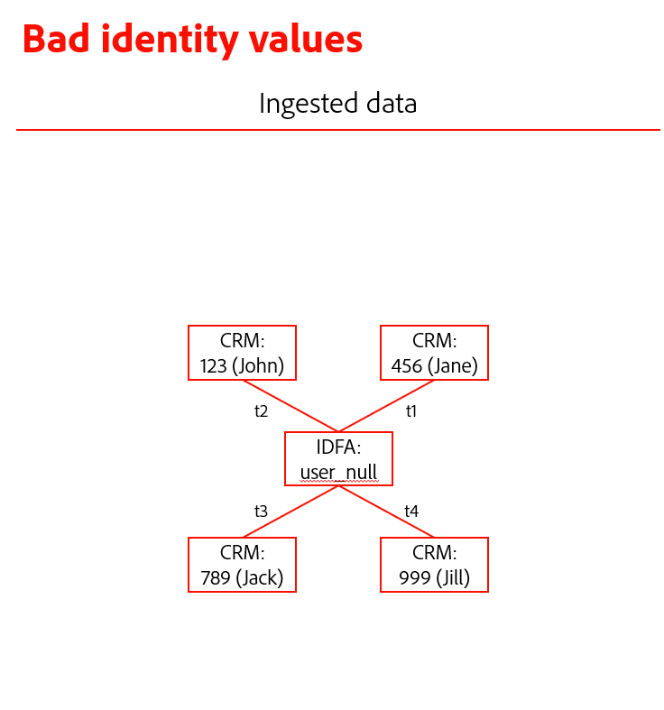

# ID グラフのリンクルールの設定例

>[!IMPORTANT]
>
>ID グラフのリンクルールは、現在Alpha中です。 機能とドキュメントは変更される場合があります。

このドキュメントでは、ID グラフのリンクルールを設定する際に考慮すべきシナリオの例を説明します。

## 共有デバイス

1 台のデバイスで複数のログインが発生する場合があります。

| 共有デバイス | 説明 |
| --- | --- |
| ファミリーコンピューターとタブレット | 夫と妻は、それぞれの銀行口座にログインします。 |
| 公開キオスク | 空港の旅行者は、ロイヤリティ ID を使用してログインし、バッグや搭乗券を印刷します。 |
| コールセンター | コールセンターの担当者は、お客様の代わりに 1 台のデバイスにログインし、カスタマーサポートに問い合わせて問題を解決します。 |

このような場合、グラフの観点から見ると、制限が有効になっていない場合、1 つの ECID が複数の CRM ID にリンクされます。

ID グラフのリンクルールを使用すると、次のことができます。

* ログインに使用する ID を一意の識別子として設定します。 例えば、グラフを制限して、CRM ID 名前空間を持つ 1 つの ID のみを保存できるようにし、その CRM ID を共有デバイスの一意の ID として定義できます。
   * これにより、ECID によって CRM ID が結合されないようにすることができます。

## 無効なメール/電話のシナリオ

また、登録時に電話番号や電子メールアドレスに偽の値を指定するユーザーもいます。 このような場合、制限が有効になっていないと、電話/電子メール関連の ID は、複数の異なる CRM ID にリンクされます。

ID グラフのリンクルールを使用すると、次のことができます。

* CRM ID、電話番号、または電子メールアドレスを一意の識別子として設定し、1 人のユーザーを 1 つの CRM ID、電話番号、またはアカウントに関連付けられた電子メールアドレスのみに制限します。

## ID 値に誤りがあるか無効です

名前空間に関係なく、一意でなく、誤った ID 値がシステムに取り込まれる場合があります。 以下に例を示します。

* ID 値が「user_null」の IDFA 名前空間。
   * IDFA ID 値には 36 文字（32 文字の英数字と 4 つのハイフン）を使用する必要があります。
* ID 値が「未指定」の電話番号名前空間。
   * 電話番号にアルファベット文字を含めることはできません。

これらの ID により、次のグラフで、複数の CRM ID が「不正な」ID と結合される場合があります。

ID グラフリンクルールを使用すると、CRM ID を一意の ID として設定し、このタイプのデータによる不要なプロファイルの折りたたみを防ぐことができます。

## 次の手順

ID グラフのリンクルールの詳細については、次のドキュメントを参照してください。

* [ID グラフリンクルールの概要](./overview.md)
* [ID サービスとリアルタイム顧客プロファイル](identity-and-profile.md)
* [ID リンクロジック](./identity-linking-logic.md)