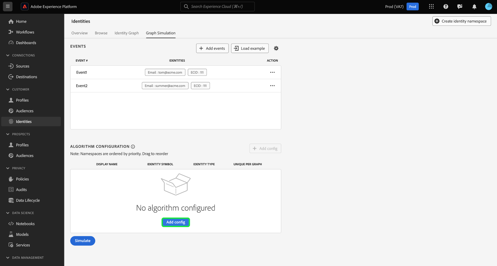
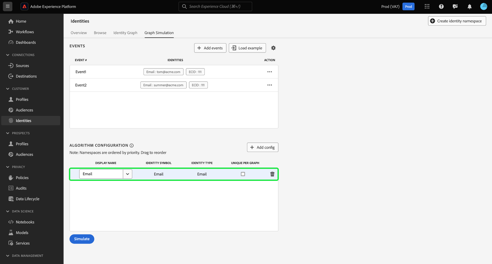

# [!DNL Graph Simulation] UI ガイド

[!DNL Graph Simulation] は、ID サービス UI のツールで、特定の ID の組み合わせでの ID グラフの動作と、 [id 最適化アルゴリズム](./identity-optimization-algorithm.md).

の使用方法については、このドキュメントを参照してください。 [!DNL Graph Simulation] id グラフの動作と、グラフアルゴリズムがどのように機能するかをより深く理解する。

## を知る [!DNL Graph Simulation] インターフェイス {#interface}

にアクセスできます。 [!DNL Graph Simulation] Adobe Experience Platform UI で上書きできます。 を選択 **[!UICONTROL ID]** 左側のナビゲーションからを選択し、 **[!UICONTROL グラフシミュレーション]** 上部ヘッダーから。

この [!DNL Graph Simulation] インターフェイスは、次の 3 つのセクションに分けることができます。

>[!BEGINTABS]

>[!TAB イベント]

イベント：を使用します **[!UICONTROL イベント]** グラフをシミュレートする ID を追加するパネル。 完全修飾 ID には、ID 名前空間とそれに対応する ID 値が必要です。 グラフをシミュレートするには、少なくとも 2 つの ID を追加する必要があります。 以下を選択することもできます。 **[!UICONTROL 読み込みの例]** 事前設定済みのイベントとアルゴリズム設定を入力します。

>[!TAB アルゴリズム設定]

アルゴリズム設定：を使用します **[!UICONTROL アルゴリズム設定]** パネルを使用して、名前空間の最適化アルゴリズムを追加および設定できます。 名前空間をドラッグ&amp;ドロップして、それぞれの優先度ランキングを変更できます。 以下を選択することもできます。 **[!UICONTROL グラフごとのユニーク数]** 名前空間が一意かどうかを判断します。

>[!TAB シミュレーショングラフビューア]

シミュレート・グラフ・ビューア：シミュレート・グラフ・ビューアには、追加したイベントと構成したアルゴリズムに基づいて結果グラフが表示されます。 2 つの ID 間の直線は、リンクが確立されていることを意味します。 点線は、リンクが削除されたことを示します。

>[!ENDTABS]

## イベントを追加 {#add-events}

開始するには、を選択します **[!UICONTROL イベントを追加]**.

ポップアップウィンドウが以下を対象に表示されます [!UICONTROL イベント #1]. ここから、ID 名前空間と ID 値の組み合わせを入力します。 ドロップダウンメニューを使用して、ID 名前空間を選択できます。 または、名前空間の最初の数文字を入力したあと、ドロップダウンメニューに表示されるオプションを選択することもできます。 名前空間を選択したら、名前空間に対応する ID 値を指定します。

>[!TIP]
>
>の間に入力する ID 値 [!DNL Graph Simulation] 演習は、実際の ID 値である必要はなく、単純なプレースホルダーにすることができます。

最初の ID が完成したら、追加アイコン（**`+`**）を選択して、2 つ目の ID を追加します。

次に、同じ手順を繰り返し、2 つ目の ID を追加します。 ID グラフを生成するには、2 つの完全修飾 ID が必要です。 以下の例では、ECID が名前空間として追加され、の値が指定されます。 `111`. 完了したら「**[!UICONTROL 保存]**」を選択します。

この [!UICONTROL イベント] インターフェイスが更新され、最初のイベントが表示されます。この場合は、次のようになります。 `{Email: tom@acme.com, ECID: 111}`.

次に、同じ手順を繰り返して、2 番目のイベントを追加します。 イベント #2 の場合は、 `{Email: summer@acme.com}` を最初の ID として設定してから、同じを追加します `{ECID: 111}` 2 つ目の ID として設定することで、次の 2 つ目のイベントを作成します。 `{Email: summer@acme.com}, {ECID: 111}`. 完了したら、次のイベントを 2 つ作成します `{Email: tom@acme.com, ECID: 111}` と 1 つ `{Email: summer@acme.com}, {ECID: 111}`.

### 例を読み込む {#load-example}

を選択 **[!UICONTROL 読み込みの例]** 事前に設定されたアルゴリズムとイベント設定を使用してサンプルグラフを設定するには：

ポップアップウィンドウが開き、次の中から選択できる使用可能なグラフシナリオが表示されます。

| グラフ例 | 説明 | 例 |
| --- | --- | --- |
| 共有デバイス | 共有デバイスとは、2 人の異なるユーザーが同じ単一のデバイスにログインするシナリオを指します。 | インターネットブラウジングや e コマースを目的として、夫婦でiPadをシェアする。 |
| 無効な (一意でない) 電話 | 無効または一意でない電話とは、2 人の異なるユーザーが同じ電話番号を使用してアカウントを作成するシナリオを指します。 | 母親と娘は、共有されている自宅の電話番号を使用して、e コマースアカウントに新規登録します。 |
| 「無効」な ID 値 | 「無効な」 ID 値は、誤った実装が原因で ID サービスが一意でない IDFA を生成するシナリオを指します。 | WebSDK がエラーでを送信する `user_null` コードの実装に関する問題が原因でのすべてのイベントの値。 |

読み込むオプションを選択 [!DNL Graph Simulation] 事前設定済みのイベントとアルゴリズムを使用する。 事前に読み込まれたグラフシナリオの例に対して、さらに設定を加えることもできます。

終了したら、 **[!UICONTROL シミュレート]**.

### テキストバージョンを使用 {#use-text-version}

テキストモードを使用してイベントを設定することもできます。 テキストモードを使用するには、設定アイコンを選択してから、 **[!UICONTROL テキスト （詳細ユーザー）]**.

テキストモードを使用して、ID を手動で入力できます。 コロン（`:`）を選択して、入力した名前空間に対応する ID 値を識別し、コンマ（`,`）を使用して ID を分離します。 異なるイベントを区別するには、イベントごとに新しい行を使用します。

### イベントを編集 {#edit-event}

イベントを編集するには、省略記号（`...`）を選択し、次のいずれかを選択します **[!UICONTROL 編集]**.

### イベントを削除 {#delete-event}

イベントを削除するには、省略記号（`...`）を選択し、次のいずれかを選択します **[!UICONTROL 削除]**.

## アルゴリズムの設定 {#configure-algorithm}

>[!IMPORTANT]
>
>設定するアルゴリズムは、イベントに入力された名前空間を ID サービスがどのように処理するかを指定します。 に組み込んだ設定 [!DNL Graph Simulation UI] は ID 設定には保存されません。

イベントを追加したら、グラフのシミュレーションに使用するアルゴリズムを設定できます。 開始するには、を選択します **[!UICONTROL 設定を追加]**.

空の設定行が表示されます。 まず、イベントに使用したのと同じ名前空間を入力します。 この場合は、電子メールを入力して開始します。 名前空間を入力すると、の列が [!UICONTROL ID シンボル] および [!UICONTROL ID タイプ] 自動入力。

次に、同じ手順を繰り返し、2 つ目の名前空間（この場合は ECID）を追加します。 すべての名前空間を入力したら、その優先度と一意性の設定を開始できます。

* **名前空間の優先度**：名前空間の優先度によって、特定の ID グラフ内の他の名前空間と比較した、相対的な重要度が決まります。 例えば、ID グラフに 4 つの異なる名前空間（CRM ID、ECID、メール、Apple IDFA）がある場合、優先度を設定して、4 つの名前空間の重要な順序を判断できます。
* **一意の名前空間**：名前空間が一意として指定されている場合、ID サービスは、特定の一意の名前空間を持つ 1 つの ID のみが存在できるという注意事項を伴ったグラフを生成します。 例えば、メール名前空間を一意の名前空間として指定した場合、グラフはメールで 1 つの ID のみを持つことができます。 メール名前空間に複数の ID がある場合は、最も古いリンクが削除されます。

名前空間の優先度を設定するには、名前空間の行を選択して目的の優先度の順序にドラッグします。一番上の行は高い優先度を表し、一番下の行は低い優先度を表します。 名前空間を一意として指定するには、 **[!UICONTROL グラフごとのユニーク数]** チェックボックス。

終了したら、 **[!UICONTROL シミュレート]**.

## シミュレーショングラフを表示

この [!UICONTROL シミュレーショングラフ] セクションには、追加したイベントと設定したアルゴリズムに基づいて生成された ID グラフが表示されます。

| グラフアイコン | 説明 |
| --- | --- |
| 実線 | 実線は、2 つの ID 間の確立されたリンクを表します。 |
| 点線 | 点線は、2 つの ID 間で削除されたリンクを表します。 |
| ライン上の数値 | 行の数字は、その特定のリンクが生成された時点のタイムスタンプを表します。 最も小さい数値（1）は、最も早く確立されたリンクを表します。 |

次のグラフの例では、間に点線が存在します `{Email: tom@acme.com}` および `{ECID: 111}` 次の理由によります。

* 電子メールは、アルゴリズム設定手順で一意として指定されました。 したがって、グラフに存在できるのは、メール名前空間を持つ 1 つの ID のみです。
* 間のリンク `{Email: tom@acme.com}` および `{ECID: 111}` は最初に確立された ID でした（イベント #1）。 これは最も古いリンクなので、削除されます。

## 次の手順

このドキュメントでは、 [!DNL Graph Simulation] 特定のルールセットと設定を使用して ID データがどのように扱われるかを理解しやすくなります。 詳しくは、次のドキュメントを参照してください。

* [ID グラフリンクルール](overview.md)
* [ID 最適化アルゴリズム](identity-optimization-algorithm.md)
* [名前空間の優先度](namespace-priority.md)