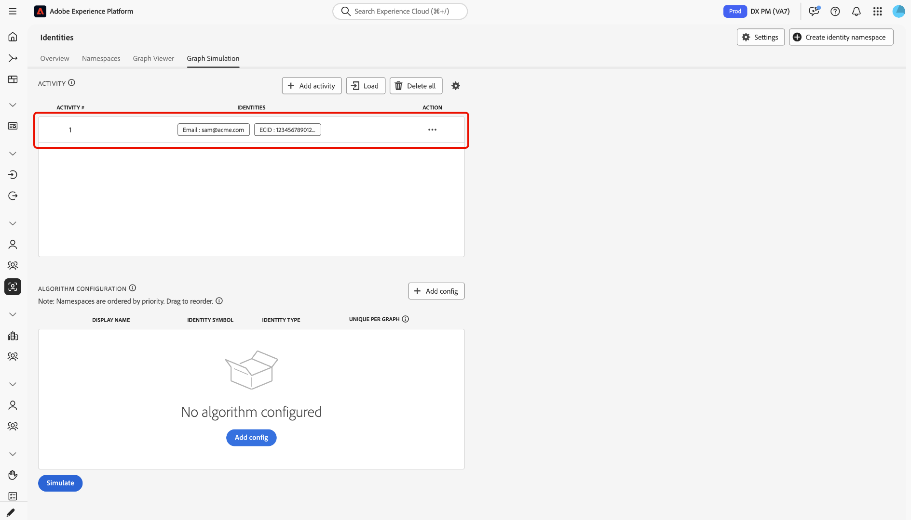
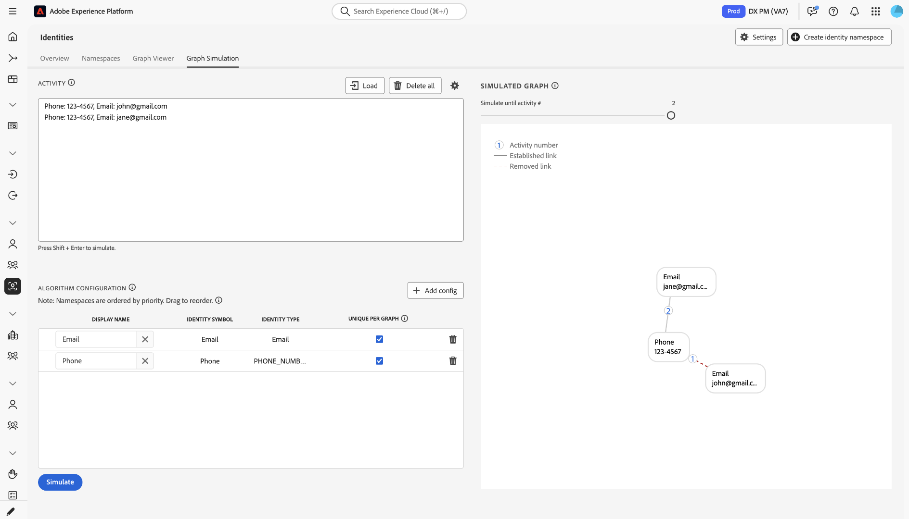

# [!DNL Graph Simulation] UI ガイド {#graph-simulation}

>[!CONTEXTUALHELP]
>id="platform_identities_graphsimulation"
>title="グラフシミュレーション"
>abstract="グラフをシミュレートして、ID サービスが ID をリンクする方法や ID 最適化アルゴリズムの仕組みを理解します。"

[!DNL Graph Simulation]は、ID サービス UIのツールです。このツールを使用して、提供するIDと[ID最適化アルゴリズム &#x200B;](./identity-optimization-algorithm.md)の設定方法に基づいて、ID グラフがどのように動作するかをシミュレートできます。

実稼動データに[!DNL Identity Graph Linking Rules]を適用する前に、グラフの動作を安全にテストするために使用します。 イベントの例を定義し、名前空間の優先順位や「グラフごとに一意」の設定など、ID最適化アルゴリズムを設定することで、IDが1つのグラフに結合されるか、分離されるかを確認し、必要に応じて設定を調整できます。 この機能を使用すると、次のことができます。

* グラフの折りたたみを防止（複数のユーザーがデバイスや電話番号を共有する場合など）
* 名前空間の優先順位を調整する（例えば、メールまたはCRM_IDを優先させるかどうか）
* 低品質または再利用されたIDが、環境でのステッチにどのように影響するかを評価します。

また、設定の変更をリハーサルし、ダウンストリームアプリケーションに表示されるIDの問題をデバッグすることもできます。 例えば、オーディエンスのサイズや結合プロファイルが間違っている場合は、[!DNL Graph Simulation]で関連イベントを再構築して、現在のルールがどのようにグラフを形成しているかを確認し、より安全な代替案を試すことができます。

組み込みのシナリオ例は、IDの行動とグラフ折りたたみのリスクを関係者に説明し、データ品質とID ガバナンスの賛同をサポートするのに役立ちます。

## [!DNL Graph Simulation] インターフェイスについて

[!DNL Graph Simulation]にアクセスするには、Adobe Experience Platform ユーザーインターフェイスのIdentity Service ワークスペースに移動し、**[!UICONTROL Graph Simulation]**&#x200B;を選択します。

ID グラフを作成およびプレビューするためのアクティビティ、アルゴリズム設定およびシミュレートされたグラフ領域を表示する

インターフェイスは、次の3つの主要セクションで構成されています。

>[!BEGINTABS]

>[!TAB アクティビティ]

**[!UICONTROL Activity]** パネルを使用してIDを追加し、グラフをシミュレートします。 各IDには、名前空間と値が必要です。 シミュレーションを実行するには、少なくとも2つのIDを追加する必要があります。 **[!UICONTROL Load]**&#x200B;を選択して、事前設定済みのイベントとアルゴリズム設定を読み込んだり、既存のグラフを開いたりすることもできます。

。

>[!TAB  アルゴリズム設定]

**[!UICONTROL Algorithm configuration]** パネルを使用して、名前空間の最適化アルゴリズムを追加および設定します。 名前空間行をドラッグ&amp;ドロップして、優先順位を変更します。 **[!UICONTROL Unique Per Graph]**&#x200B;を選択して、グラフ内で名前空間が一意である必要があるかどうかをマークすることもできます。

>[!TAB  シミュレートされたグラフ ]

**[!UICONTROL Simulated graph]** ディスプレイを使用して、アクティビティとアルゴリズム設定から生成されたグラフを確認します。 2つのID間の実線は、リンクが保持されることを意味します。点線はそのリンクを削除したことを意味します。

>[!ENDTABS]

## [!DNL Graph Simulation] ワークフロー

### アクティビティを追加

ID グラフのシミュレーションを開始するには、**[!UICONTROL Add Activity]**&#x200B;を選択します。

アクティビティを追加がハイライト表示された

[!UICONTROL Activity #1]のポップアップウィンドウが表示されたら、ID名前空間を選択し、その値を入力します。 ドロップダウンから名前空間を選択するか、数文字を入力してリストをフィルタリングできます。 名前空間を選択したら、一致するID値を入力します。

>[!TIP]
>
>[!DNL Graph Simulation]を使用する際に、実際のID値を使用する必要はありません。

[!UICONTROL Activity] インターフェイスが更新され、最初のアクティビティが表示されます。

もう一度&#x200B;**[!UICONTROL Add Activity]**&#x200B;を選択し、2番目のアクティビティを完了します。 グラフを生成するには、少なくとも2つの完全修飾ID （名前空間+値）が必要です。

### アルゴリズムの設定

>[!IMPORTANT]
>
>設定するアルゴリズムは、Identity Serviceがアクティビティ内の名前空間を処理する方法を制御します。 [!DNL Graph Simulation UI]で設定したものは、ID サービス ID設定に保存されません。

アクティビティを設定したら、シミュレーション用のアルゴリズムを設定します。 **[!UICONTROL Add config]** を選択します。

アルゴリズムが考慮する各名前空間を追加します。 ドロップダウンを使用して検索するか、最初の数文字を入力してリストを絞り込みます。

* **名前空間の優先度**:ID グラフ内の各名前空間の重要度の順序を制御します。 例えば、グラフでCRMID、ECID、電子メール、Apple IDFAを使用している場合、IDをリンクする際に最初に考慮すべき優先度を反映するように設定できます。 リストの最上位の名前空間が最優先されます。
* **一意の名前空間**：名前空間が一意としてマークされている場合、ID サービスは、その名前空間を持つ1つのIDのみがグラフに表示されるようにします。 例えば、「電子メール」が一意に設定されている場合、各グラフには1つの電子メール IDのみが含まれます。 同じ電子メールを持つ複数のIDが存在する場合、一意性を維持するために、最も古い接続が削除されます。

名前空間行を優先順にドラッグします。一番上の行が最優先度で、一番下の行が最優先度です。 グラフ内で名前空間を一意として扱うには、その&#x200B;**[!UICONTROL Unique Per Graph]** チェックボックスを選択します。

準備ができたら、**[!UICONTROL Simulate]**&#x200B;を選択します。

### シミュレートされたグラフを表示

[!UICONTROL Simulated Graph] セクションには、アクティビティとアルゴリズム設定から生成されたグラフが表示されます。

| グラフアイコン | 説明 |
| --- | --- |
| 実線 | 実線は、2つのID間の確立されたリンクを表します。 |
| 点線 | 点線は、2つのID間の削除されたリンクを表します。 |
| 行番号 | ライン上の数字は、そのリンクが他のリンクに対して形成されたときを示します。 最も小さい数字（1）が最も古いリンクです。 |

## その他の機能

また、アクティビティの編集や削除、テキストモードでのアクティビティの入力、サンプルシナリオの読み込み、ID サービスからの既存のグラフの取り込みも可能です。

### アクティビティを編集 {#edit-activity}

アクティビティを編集するには、特定のアクティビティの横にある省略記号（`...`）を選択し、**[!UICONTROL Edit]**&#x200B;を選択します。

### アクティビティを削除 {#delete-activity}

アクティビティを削除するには、特定のアクティビティの横にある省略記号（`...`）を選択し、**[!UICONTROL Delete]**&#x200B;を選択します。

### テキストモードを使用 {#use-text-mode}

テキストモードを使用して、アクティビティを設定できます。 テキストモードを使用するには、設定アイコンを選択し、**[!UICONTROL Text (Advanced users)]**&#x200B;を選択します。

テキストモードで、各IDを`namespace:value`と入力します。 同じイベント内の複数のIDをコンマ （`,`）で区切ります。 各イベントに対して新しい行を開始します。

### 例を読み込む {#load-example}

**[!UICONTROL Load example]**&#x200B;を選択して、事前設定されたアクティビティとアルゴリズム設定を含む既製のグラフを読み込みます。

ダイアログには、開くことができるシナリオが一覧表示されます。

| グラフの例 | 説明 | 例 |
| --- | --- | --- |
| 共有デバイス | 2人の異なるユーザーが同じデバイスにログインします。 | IPadを利用して、閲覧とe コマースで生計を立てている夫婦。 |
| 無効な (一意でない) 電話 | 2人のユーザーが同じ電話番号で登録します。 | 母親と娘が共有ホームの電話番号を使ってe コマースアカウントにサインアップします。 |
| 「無効」な ID 値 | 実装エラーは、重複したIDまたはプレースホルダーIDを送信します（例えば、多くのユーザーに同じIDFAを送信します）。 | Web SDKは、コードの欠陥が原因で、すべてのアクティビティに`user_null`値を送信します。 |

一致するアクティビティとアルゴリズム設定を含む[!DNL Graph Simulation]を読み込むシナリオを選択します。 他のシミュレーションと同様に、結果を編集できます。

### 既存のグラフを読み込む {#load-existing-graph}

[!DNL Graph Simulation]を使用して、既存のグラフを読み込み、そのアクティビティ、アルゴリズム設定、グラフを表示できます。

**[!UICONTROL Load]**&#x200B;を選択し、**[!UICONTROL Existing graph]**&#x200B;を選択します。

ダイアログで、検査するグラフに属する名前空間とID値を入力します。

読み込みが成功すると、そのIDを含むグラフが[!DNL Graph Simulation]に表示されます。

>[!TIP]
>
>最初の[ID設定](./identity-settings-ui.md)画面で設定を行うと、**既存のグラフを読み込み** オプションを使用して、それらの設定に基づいてグラフをシミュレートできます。 シミュレーションでは、定義した設定を使用します。

## 次の手順

実稼動設定を変更する前に、[!DNL Graph Simulation]を使用して、ID サービスが異なるルールの下のIDをどのようにリンクしているかを確認できます。 詳しくは、次のドキュメントを参照してください。

* [[!DNL Identity Graph Linking Rules] の概要](./overview.md)
* [ID 最適化アルゴリズム](./identity-optimization-algorithm.md)
* [実装ガイド](./implementation-guide.md)
* [トラブルシューティングとFAQ](./troubleshooting.md)
* [グラフ設定の例](./example-configurations.md)
* [名前空間の優先度](./namespace-priority.md)
* [ID設定UI](./identity-settings-ui.md)
