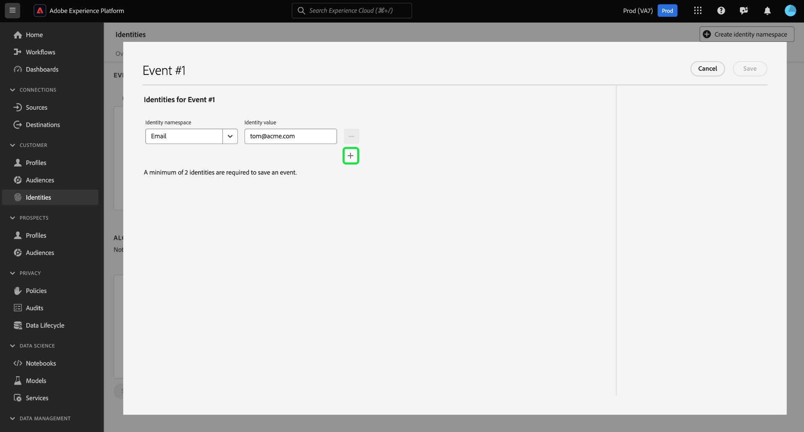

# [!DNL Graph Simulation] UI ガイド

>[!AVAILABILITY]
>
>ID グラフリンクルールは現在、限定提供（LA）です。 開発用サンドボックスでこの機能にアクセスする方法については、Adobeアカウントチームにお問い合わせください。

[!DNL Graph Simulation] は、ID サービス UI のツールで、特定の ID の組み合わせでの ID グラフの動作と、[ID 最適化アルゴリズム ](./identity-optimization-algorithm.md) の設定方法をシミュレートするために使用できます。

ID グラフの動作をより深く理解するために [!DNL Graph Simulation] を使用する方法、およびグラフアルゴリズムがどのように機能するかについて詳しくは、このドキュメントを参照してください。

## [!DNL Graph Simulation] インターフェイスの概要 {#interface}

Adobe Experience Platform UI で [!DNL Graph Simulation] にアクセスできます。 左側のナビゲーションから **[!UICONTROL ID]** を選択し、上部のヘッダーから **[!UICONTROL グラフシミュレーション]** を選択します。

[!DNL Graph Simulation] インターフェイスは、次の 3 つのセクションに分けることができます。

>[!BEGINTABS]

>[!TAB イベント]

イベント：**[!UICONTROL イベント]** パネルを使用して ID を追加し、グラフをシミュレートします。 完全修飾 ID には、ID 名前空間とそれに対応する ID 値が必要です。 グラフをシミュレートするには、少なくとも 2 つの ID を追加する必要があります。 **[!UICONTROL 例を読み込み]** を選択して、事前設定済みのイベントとアルゴリズム設定を入力することもできます。

>[!TAB  アルゴリズム設定 ]

アルゴリズム設定：**[!UICONTROL アルゴリズム設定]** パネルを使用して、名前空間の最適化アルゴリズムを追加および設定します。 名前空間をドラッグ&amp;ドロップして、それぞれの優先度ランキングを変更できます。 **[!UICONTROL グラフごとに一意]** を選択して、名前空間が一意かどうかを判断することもできます。

>[!TAB  シミュレーショングラフビューア ]

シミュレート・グラフ・ビューア：シミュレート・グラフ・ビューアには、追加したイベントと構成したアルゴリズムに基づいて結果グラフが表示されます。 2 つの ID 間の直線は、リンクが確立されていることを意味します。 点線は、リンクが削除されたことを示します。

>[!ENDTABS]

## イベントを追加 {#add-events}

>[!CONTEXTUALHELP]
>id="platform_identities_graphsimulation"
>title="イベントを追加"
>abstract="グラフをシミュレートして、ID サービスが ID をリンクする方法と、ID 最適化アルゴリズムが機能する仕組みを理解します。"
>additional-url="https://experienceleague.adobe.com/docs/experience-platform/data-governance/labels/overview.html?lang=ja#understanding-data-usage-labels" text="データ使用ラベルの概要"

開始するには、「**[!UICONTROL イベントを追加]**」を選択します。

ポップアップウィンドウが [!UICONTROL  イベント #1] に表示されます。 ここから、ID 名前空間と ID 値の組み合わせを入力します。 ドロップダウンメニューを使用して、ID 名前空間を選択できます。 または、名前空間の最初の数文字を入力したあと、ドロップダウンメニューに表示されるオプションを選択することもできます。 名前空間を選択したら、名前空間に対応する ID 値を指定します。

>[!TIP]
>
>[!DNL Graph Simulation] の演習で入力する ID 値は、実際の ID 値である必要はなく、単純なプレースホルダーにすることができます。

最初の ID が完成したら、追加アイコン（**`+`**）を選択して 2 番目の ID を追加します。

次に、同じ手順を繰り返し、2 つ目の ID を追加します。 ID グラフを生成するには、2 つの完全修飾 ID が必要です。 次の例では、ECID が名前空間として追加され、値 `111` が指定されます。 完了したら「**[!UICONTROL 保存]**」を選択します。

[!UICONTROL  イベント ] インターフェイスが更新され、最初のイベントが表示されます。この場合のインターフェイスは `{Email: tom@acme.com, ECID: 111}` です。

次に、同じ手順を繰り返して、2 番目のイベントを追加します。 イベント #2 の場合、最初の ID として `{Email: summer@acme.com}` を追加してから、2 番目の ID と同じ `{ECID: 111}` を追加します。これにより、`{Email: summer@acme.com}, {ECID: 111}` という 2 番目のイベントが作成されます。 完了したら、`{Email: tom@acme.com, ECID: 111}` 用と `{Email: summer@acme.com}, {ECID: 111}` 用の 2 つのイベントが必要です。

### 例を読み込む {#load-example}

「**[!UICONTROL 例を読み込み]**」を選択して、事前設定されたアルゴリズムとイベント設定を含むサンプルグラフを設定します。

ポップアップウィンドウが開き、次の中から選択できる使用可能なグラフシナリオが表示されます。

| グラフ例 | 説明 | 例 |
| --- | --- | --- |
| 共有デバイス | 共有デバイスとは、2 人の異なるユーザーが同じ単一のデバイスにログインするシナリオを指します。 | インターネットブラウジングや e コマースを目的として、夫婦でiPadをシェアする。 |
| 無効な (一意でない) 電話 | 無効または一意でない電話とは、2 人の異なるユーザーが同じ電話番号を使用してアカウントを作成するシナリオを指します。 | 母親と娘は、共有されている自宅の電話番号を使用して、e コマースアカウントに新規登録します。 |
| 「無効」な ID 値 | 「無効な」 ID 値は、誤った実装が原因で ID サービスが一意でない IDFA を生成するシナリオを指します。 | WebSDK は、コードの実装の問題に起因する各イベントの `user_null` 値を誤って送信します。 |

任意のオプションを選択して、事前設定済みのイベントおよびアルゴリズムで [!DNL Graph Simulation] を読み込みます。 事前に読み込まれたグラフシナリオの例に対して、さらに設定を加えることもできます。

終了したら、「**[!UICONTROL シミュレート]**」を選択します。

### テキストバージョンを使用 {#use-text-version}

テキストモードを使用してイベントを設定することもできます。 テキストモードを使用するには、「設定」アイコンを選択し、「**[!UICONTROL テキスト （詳細ユーザー）]**」を選択します。

テキストモードを使用して、ID を手動で入力できます。 入力した名前空間に対応する ID 値をコロン（`:`）で区切り、ID をコンマ（`,`）で区切ります。 異なるイベントを区別するには、イベントごとに新しい行を使用します。

### イベントを編集 {#edit-event}

イベントを編集するには、特定のイベントの横にある省略記号（`...`）を選択し、**[!UICONTROL 編集]** を選択します。

### イベントを削除 {#delete-event}

イベントを削除するには、特定のイベントの横にある省略記号（`...`）を選択し、「**[!UICONTROL 削除]**」を選択します。

## アルゴリズムの設定 {#configure-algorithm}

>[!CONTEXTUALHELP]
>id="platform_identities_algorithmconfiguration"
>title="アルゴリズム設定"
>abstract="取り込んだ ID に合わせて、一意の名前空間と名前空間の優先度を設定します。"

>[!CONTEXTUALHELP]
>id="platform_identities_namespacepriority"
>title="アルゴリズム設定"
>abstract="名前空間の優先度によって、ID グラフからリンクを削除する方法が決まります。"

>[!IMPORTANT]
>
>設定するアルゴリズムは、イベントに入力された名前空間を ID サービスがどのように処理するかを指定します。 [!DNL Graph Simulation UI] に組み込んだ設定は、ID 設定には保存されません。

イベントを追加したら、グラフのシミュレーションに使用するアルゴリズムを設定できます。 開始するには、「**[!UICONTROL 設定を追加]**」を選択します。

空の設定行が表示されます。 まず、イベントに使用したのと同じ名前空間を入力します。 この場合は、電子メールを入力して開始します。 名前空間を入力すると、[!UICONTROL ID シンボル ] および [!UICONTROL ID タイプ ] の列が自動入力されます。

次に、同じ手順を繰り返し、2 つ目の名前空間（この場合は ECID）を追加します。 すべての名前空間を入力したら、その優先度と一意性の設定を開始できます。

* **名前空間の優先度**：名前空間の優先度は、特定の ID グラフ内の他の名前空間と比較した、相対的な重要度を決定します。 例えば、ID グラフに 4 つの異なる名前空間（CRMID、ECID、メール、Apple IDFA）がある場合、優先度を設定して、4 つの名前空間の重要な順序を決定できます。
* **一意の名前空間**：名前空間が一意として指定されている場合、ID サービスは、特定の一意の名前空間を持つ 1 つの ID のみが存在できるという注意事項を伴ったグラフを生成します。 例えば、メール名前空間を一意の名前空間として指定した場合、グラフはメールで 1 つの ID のみを持つことができます。 メール名前空間に複数の ID がある場合は、最も古いリンクが削除されます。

名前空間の優先度を設定するには、名前空間の行を選択して目的の優先度の順序にドラッグします。一番上の行は高い優先度を表し、一番下の行は低い優先度を表します。 名前空間を一意として指定するには、「**[!UICONTROL グラフごとに一意]**」チェックボックスを選択します。

終了したら、「**[!UICONTROL シミュレート]**」を選択します。

## シミュレーショングラフを表示

「[!UICONTROL  シミュレーショングラフ ]」セクションには、追加したイベントと設定したアルゴリズムに基づいて生成された ID グラフが表示されます。

| グラフアイコン | 説明 |
| --- | --- |
| 実線 | 実線は、2 つの ID 間の確立されたリンクを表します。 |
| 点線 | 点線は、2 つの ID 間で削除されたリンクを表します。 |
| ライン上の数値 | 行の数字は、その特定のリンクが生成された時点のタイムスタンプを表します。 最も小さい数値（1）は、最も早く確立されたリンクを表します。 |

次のグラフの例では、次の理由により、`{Email: tom@acme.com}` と `{ECID: 111}` の間に点線が存在します。

* 電子メールは、アルゴリズム設定手順で一意として指定されました。 したがって、グラフに存在できるのは、メール名前空間を持つ 1 つの ID のみです。
* `{Email: tom@acme.com}` と `{ECID: 111}` の間のリンクは、最初に確立された ID でした（イベント #1）。 これは最も古いリンクなので、削除されます。

## 次の手順

このドキュメントでは、[!DNL Graph Simulation] ツールを使用して、特定のルールセットと設定に基づいて ID データがどのように扱われるかを理解する方法を確認しました。 詳しくは、次のドキュメントを参照してください。

* [ID グラフリンクルールの概要](./overview.md)
* [ID 最適化アルゴリズム](./identity-optimization-algorithm.md)
* [実装ガイド](./implementation-guide.md)
* [トラブルシューティングと FAQ](./troubleshooting.md)
* [グラフ設定の例](./example-configurations.md)
* [名前空間の優先度](./namespace-priority.md)
* [ID 設定 UI](./identity-settings-ui.md)