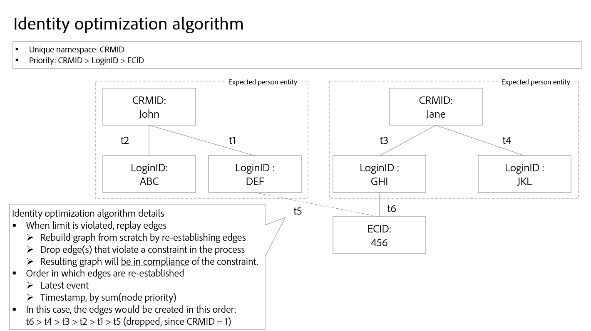

# ID 最適化アルゴリズム {#identity-optimization-algorithm}

>[!CONTEXTUALHELP]
>id="platform_identities_uniquenamespace"
>title="一意の名前空間"
>abstract="1 つのグラフに、一意の名前空間を使用した 2 つの ID を含めることはできません。グラフがこの制限を超えようとした場合、最新のリンクが保持され、最も古いリンクが削除されます。"

IDサービス最適化アルゴリズムは、IDサービスサービス上のグラフ アルゴリズムであり、ID グラフが 1 人の人物を表していることを確認し、Real-時間 Customer プロフィール での ID の不要なマージを防ぐのに役立ちます。

## 入力パラメーター {#input-parameters}

一意の名前空間と名前空間優先度については、この節をお読みください。 これら 2 つの概念は、IDサービス最適化アルゴリズムに必要な入力パラメーターとして機能します。

### 一意の名前空間 {#unique-namespace}

一意の名前空間により、グラフが折りたたまれた場合に削除されるリンクが決定されます。

1 つのマージされたプロファイルとそれに対応する ID グラフは、1 つの個人 (個人エンティティ) を表す必要があります。 通常、1 つの個人は CRMID または ログイン ID で表されます。 2 人の個人 (CRMID) が 1 つのプロファイルまたはグラフにマージされないことが予想されます。

ID 最適化アルゴリズムを使用して、ID サービスの人物エンティティを表す名前空間を指定する必要があります。 例えば、1 つの CRMID および 1 つのメールアドレスに関連付けられるユーザーアカウントが CRM データベースで定義されている場合、このサンドボックスの ID 設定は次のようになります。

* CRMID 名前空間=一意
* E メール名前空間 = 固有

一意であると宣言した名前空間は、特定の ID グラフ内で上限が 1 になるように自動的に構成されます。 例えば、CRMID 名前空間を固有として宣言する場合、ID グラフは CRMID 名前空間を含む 1 つの ID しか持つことができません。 名前空間を一意として宣言しない場合、グラフにはその名前空間を持つ複数の ID を含めることができます。

>[!NOTE]
>
>* 現時点では、世帯エンティティの表示 (「世帯グラフ」) はサポートされていません。
>
>* 個人識別子であり、ID グラフを生成するためにサンドボックスで使用される すべてを選択 名前空間は、一意の名前空間としてマークする必要があります。 そうしないと、望ましくないリンク結果が表示される場合があります。

### 名前空間の優先度 {#namespace-priority}

名前空間の優先度は、ID 最適化アルゴリズムがリンクを削除する方法を決定します。

ID サービスの名前空間には、重要な暗黙の相対順序があります。 ピラミッドのような構造のグラフを考えてみましょう。 上のレイヤに 1 つのノード、中央のレイヤに 2 つのノード、下のレイヤに 4 つのノードがあります。 名前空間の優先度は、人物エンティティが正確に表されるようにするために、この相対順序を反映する必要があります。

名前空間の優先度とその完全な機能および使用方法について詳しくは、[&#x200B; 名前空間優先度ガイド &#x200B;](./namespace-priority.md) を参照してください。

{zoomable="yes"}

## プロセス {#process}

新しい ID を取り込むと、ID サービスは新しい ID とそれに対応する名前空間が一意の名前空間設定に従っているかどうかを確認します。 設定に従うと、取り込みは続行され、新しい ID がグラフにリンクされます。 ただし、設定に従わない場合、ID 最適化アルゴリズムは次のようになります。

* 名前空間の優先度を考慮しながら、最新のイベントを取り込みます。
* 適切なグラフレイヤーから 2 つの人物エンティティを結合するリンクを削除します。

## ID 最適化アルゴリズムの詳細

一意の名前空間制約に違反すると、IDサービス最適化アルゴリズムはリンクを「再生」し、グラフを最初から再構築します。

* リンクは、次の順序で並べ替えられます。
   * 最新のイベント
   * 名前空間優先度の合計によるタイムスタンプ (小さい合計 = 上位)。
* グラフは、上記の順序に基づいて再確立されます。 リンクを追加することが制限制約に違反している場合（例えば、グラフに一意の名前空間を持つ複数の ID が含まれている場合）、リンクは削除されます。
* 結果のグラフは、設定した一意の名前空間制約に準拠します。

{zoomable="yes"}

## ID 最適化アルゴリズムのシナリオの例

次のセクションでは、同じタイムスタンプを持つデータの共有デバイスや取得などのシナリオで、IDサービス最適化アルゴリズムがどのように動作するかについて説明します。

### 共有デバイス

共有デバイスとは、複数の個人が使用する 1 つのデバイスを指します。 たとえば、共有デバイスは、パートナーや家族と共有するラップトップやタブレット、ライブラリ コンピューター、公共のキオスクなどです。

>[!BEGINTABS]

>[!TAB 例 1]

| 名前空間 | 一意の名前空間 |
| --- | --- |
| CRMID | ○ |
| メール | ○ |
| ECID | × |

この例では、CRMID とメールの両方を一意の名前空間として指定します。 一意の名前空間設定により、`timestamp=0` 時に CRM レコードデータセットが取り込まれ、2 つの異なるグラフが作成されます。 各グラフには、CRMID とメール名前空間が含まれます。

* `timestamp=1`:Jane はノートパソコンを使用して e コマースの web サイトにログインします。 Jane は彼女の CRMID とメールで表され、彼女が使用するラップトップ上の web ブラウザーは ECID で表されます。
* `timestamp=2`: John は同じノートパソコンを使用して e コマースの web サイトにログインします。 John は CRMID と電子メールで表されますが、使用したWeb ブラウザーは既に ECID で表されています。 同じECIDが2つの異なるグラフにリンクされているため、IDサービスサービスはこのデバイス(ラップトップ)が共有デバイスであることを知ることができます。
* ただし、グラフごとに最大 1 つの CRMID 名前空間と 1 つの電子メール 名前空間を設定する独自の名前空間構成により、最適化アルゴリズムIDサービスグラフを 2 つに分割します。
   * 最後に、John は最後に認証されたユーザーであるため、ラップトップを表す ECID は、Jane のグラフではなく John のグラフにリンクされたままになります。

{zoomable="yes"}

>[!TAB 例 2]

| 名前空間 | 一意の名前空間 |
| --- | --- |
| CRMID | ○ |
| ECID | × |

この例では、CRMID 名前空間は一意の名前空間として指定されています。

* `timestamp=1`:Jane はノートパソコンを使用して e コマースの web サイトにログインします。 彼女はCRMIDで表され、ラップトップのWeb ブラウザーはECIDで表されます。
* `timestamp=2`: John は同じノートパソコンを使用して e コマースの web サイトにログインします。 ユーザーは CRMID で表され、使用する web ブラウザーは同じ ECID で表されます。
   * このイベントは、2 つの独立した CRMID を同じ ECID にリンクします。これは、設定された上限である 1 つの CRMID を超えています。
   * その結果、最適化アルゴリズムIDサービス古いリンク (この場合は `timestamp=1` でリンクされた Jane の CRMID) が削除されます。
   * ただし、Jane&#39;s CRMID は IDサービス サービス のグラフとしては存在しなくなりますが、Real-時間 Customer プロフィール のプロファイルグラフとしては引き続き保持されます。 これは、ID グラフには少なくとも 2 つのリンクされた ID が含まれている必要があり、リンクを削除した結果、Jane の CRMID にはリンクする別の ID がなくなるためです。

{zoomable="yes"}

>[!ENDTABS]

### 不正なメール

ユーザーが自分のメールや電話番号に間違った値を入力する場合があります。

| 名前空間 | 一意の名前空間 |
| --- | --- |
| CRMID | ○ |
| メール | ○ |
| ECID | × |

この例では、CRMID およびメール名前空間は一意として指定されます。 ジェーンとジョンが不正なメール値（test@test.comなど）を使用して e コマース web サイトにサインアップしたシナリオを考えてみましょう。

* `timestamp=1`:Jane はiPhoneの Safari を使用して e コマース web サイトにログインし、CRMID （ログイン情報）と ECID （ブラウザー）を設定します。
* `timestamp=2`:John は、iPhoneでGoogle Chromeを使用して e コマース web サイトにログインし、CRMID （ログイン情報）と ECID （ブラウザー）を設定します。
* `timestamp=3`: データエンジニアが Jane の CRM レコードを取り込むと、彼女の CRMID が不正なメールにリンクされます。
* `timestamp=4`: データエンジニアが John の CRM レコードを取り込むと、John の CRMID が不良メールにリンクされます。
   * これは、2つのCRMID名前空間を持つ単一のグラフを作成するため、一意の名前空間構成に違反します。
   * その結果、IDサービス最適化アルゴリズムは古いリンク (この場合は CRMID 名前空間 を使用した Jane の ID と テスト@テスト を使用した ID の間のリンク) を削除します。

ID 最適化アルゴリズムを使用すると、偽の電子メールや電話番号などの不正な ID 値が、複数の異なる ID グラフに伝わることはありません。

{zoomable="yes"}

## 匿名イベントの関連付け

ECID には未認証（匿名）イベントが格納されるのに対して、CRMID には認証済みイベントが格納されます。 共有デバイスの場合、ECID （未認証イベントのベアラー）が **最後に認証されたユーザー** に関連付けられます。

匿名イベントの関連付けの仕組みをより深く理解するには、次の図を参照してください。

* ケビンとノラはタブレットを共有している。
   * `timestamp=1`:Kevin は自分のアカウントを使用して e コマースの web サイトにログインすることで、CRMID （ログイン情報）と ECID （ブラウザー）を確立します。 ログイン時に、Kevin は最後の認証済みユーザーと見なされます。
   * `timestamp=2`:Nora は自分のアカウントを使用して e コマース web サイトにログインし、それにより自分の CRMID （ログイン情報）と同じ ECID を確立します。 ログイン時に、Nora が最後の認証済みユーザーと見なされるようになりました。
   * `timestamp=3`:Kevin はタブレットを使用して e コマースの web サイトを閲覧しますが、自分のアカウントでログインすることはありません。 Kevin のブラウジングアクティビティは ECID に保存され、最後に認証されたユーザーであることから、Nora と関連付けられます。 この時点で、Nora が匿名イベントを所有しています。
      * Kevin が再度ログインするまで、Nora のマージされたプロファイルは、ECID に対して保存されているすべての未認証イベントに関連付けられます (ECID がプライマリ ID であるイベントを含む)。
   * `timestamp=4`:Kevin が 2 回目のログインをおこないます。 この時点で、彼は再び最後の認証されたユーザーになり、認証されていないイベントも所有します。
      * `timestamp=1`以前の彼の最初のログインの前。
      * ケビンの1回目と2回目のログインの間に匿名でブラウジングしている間に彼またはノラが行った活動。

{zoomable="yes"}

## 次の手順

[!DNL Identity Graph Linking Rules] について詳しくは、次のドキュメントを参照してください。

* [[!DNL Identity Graph Linking Rules] の概要](./overview.md)
* [実装ガイド](./implementation-guide.md)
* [グラフ設定の例](./example-configurations.md)
* [トラブルシューティングと FAQ](./troubleshooting.md)
* [名前空間の優先度](./namespace-priority.md)
* [グラフシミュレーションUI](./graph-simulation.md)
* [IDサービス設定UI](./identity-settings-ui.md)