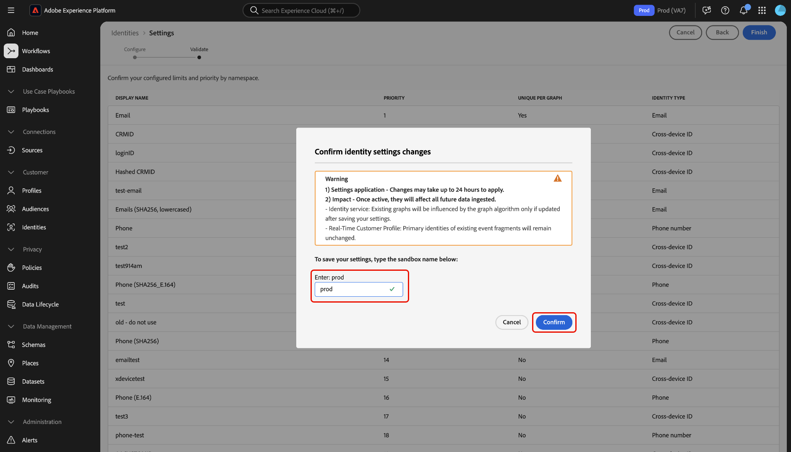

# ID 設定 UI

>[!IMPORTANT]
>
>[!DNL Identity Graph Linking Rules] が一般公開されました。 ID 設定を有効にした後、折りたたまれたグラフを折りたたみ解除（「固定」）する必要がある既存のサンドボックスがある場合は、Adobe アカウントチームまたはAdobe サポートにお問い合わせください。

ID 設定は、Adobe Experience Platform ID サービス UI の機能で、一意の名前空間を指定し、名前空間の優先度を設定するために使用できます。

ID サービス UI ワークスペースでの [!DNL Graph Simulation] インターフェイスの使用について詳しくは、次のビデオをご覧ください。

>[!VIDEO](https://video.tv.adobe.com/v/3458488/?captions=jpn&learn=on&enablevpops)

UI で ID 設定を指定する方法については、このガイドを参照してください。

## 前提条件

ID 設定の使用を開始する前に、次のドキュメントをお読みください。

* [[!DNL Identity Graph Linking Rules]](./overview.md)
* [ID 最適化アルゴリズム](./identity-optimization-algorithm.md)
* [実装ガイド](./implementation-guide.md)
* [グラフ設定の例](./example-configurations.md)
* [名前空間の優先度](./namespace-priority.md)
* [グラフシミュレーション](./graph-simulation.md)

### 権限の設定 {#set-permissions}

次に、アカウントに次の権限がプロビジョニングされていることを確認する必要があります。

* **[!UICONTROL ID 設定の表示]**：この権限を適用して、ID 名前空間の参照ページで一意の名前空間と名前空間の優先度を表示できるようにします。
* **[!UICONTROL ID 設定の編集]**:ID 設定を編集および保存できるようにするには、この権限を適用します。

これらの権限がない場合は、管理者にお問い合わせください。 詳しくは、[&#x200B; 権限ガイド &#x200B;](../../access-control/abac/ui/permissions.md) を参照してください。

## ID 設定の指定

ID 設定にアクセスするには、Adobe Experience Platform UI の ID サービスワークスペースに移動し、「**[!UICONTROL 設定]**」を選択します。

ID 設定ページは、[!UICONTROL &#x200B; ユーザー名前空間 &#x200B;] および [!UICONTROL &#x200B; デバイスまたは cookie の名前空間 &#x200B;] の 2 つのセクションに分かれています。 人物の名前空間は、1 人の個人の識別子です。 クロスデバイス ID、メールアドレスおよび電話番号から選択できます。 デバイスまたは cookie の名前空間は、デバイスおよび web ブラウザーの識別子であり、ユーザーの名前空間よりも優先することはできません。 また、デバイスまたは cookie の名前空間を一意の名前空間として指定することはできません。

### 名前空間の優先度の設定

名前空間の優先度を設定するには、ID 設定メニューで名前空間を選択し、その名前空間を好みの順序にドラッグ&amp;ドロップします。 リストの名前空間を上位に配置して優先度を高め、逆にリストの名前空間を下位に配置して優先度を低くします。 優先度が最も高い名前空間も、一意の名前空間として指定する必要があります。

### 一意の名前空間の指定

一意の名前空間を指定するには、その名前空間に対応する [!UICONTROL &#x200B; グラフごとに一意 &#x200B;] チェックボックスを選択します。 ID 設定の設定に対して、**最大 3 つの一意の名前空間** を選択できます。

一意の名前空間が確立されると、グラフは、一意の名前空間を含む複数の ID を持つことができなくなります。 例えば、CRMID を一意の名前空間として指定した場合、グラフは、CRMID 名前空間を持つ 1 つの ID のみを持つことができます。 詳しくは、[ID 最適化アルゴリズムの概要 &#x200B;](./identity-optimization-algorithm.md#unique-namespace) を参照してください。

設定が完了したら、「**[!UICONTROL 次へ]**」を選択して続行します。

ここから、最後の手順に進む前に、次の点を確認する必要があります。

1. 選択された一意の名前空間。
2. 既知の各プロファイルで、優先順位が最も高い一意の名前空間を持つ ID の存在。
3. 名前空間の優先順位。

### 設定を確認 {#confirm-your-settings}

>[!IMPORTANT]
>
>* 最後の手順は、既存のグラフがグラフアルゴリズム **設定を保存した後にグラフが更新された場合のみ** の影響を受けること、および名前空間の優先度が変更された後もリアルタイム顧客プロファイル上のイベントフラグメントのプライマリ ID が更新されないことを示す別の確認メッセージです。
>
>* 新しい設定または更新された設定が有効になるまでに最大 **24 時間** かかります。 確認するには、サンドボックス名を入力し、「**[!UICONTROL 確認]**」を選択します。
>
>* ID 設定を保存するまで、データは変更されません。

## 次の手順

[!DNL Identity Graph Linking Rules] について詳しくは、次のドキュメントを参照してください。

* [[!DNL Identity Graph Linking Rules] の概要](./overview.md)
* [ID 最適化アルゴリズム](./identity-optimization-algorithm.md)
* [実装ガイド](./implementation-guide.md)
* [グラフ設定の例](./example-configurations.md)
* [トラブルシューティングと FAQ](./troubleshooting.md)
* [名前空間の優先度](./namespace-priority.md)
* [グラフシミュレーション UI](./graph-simulation.md)