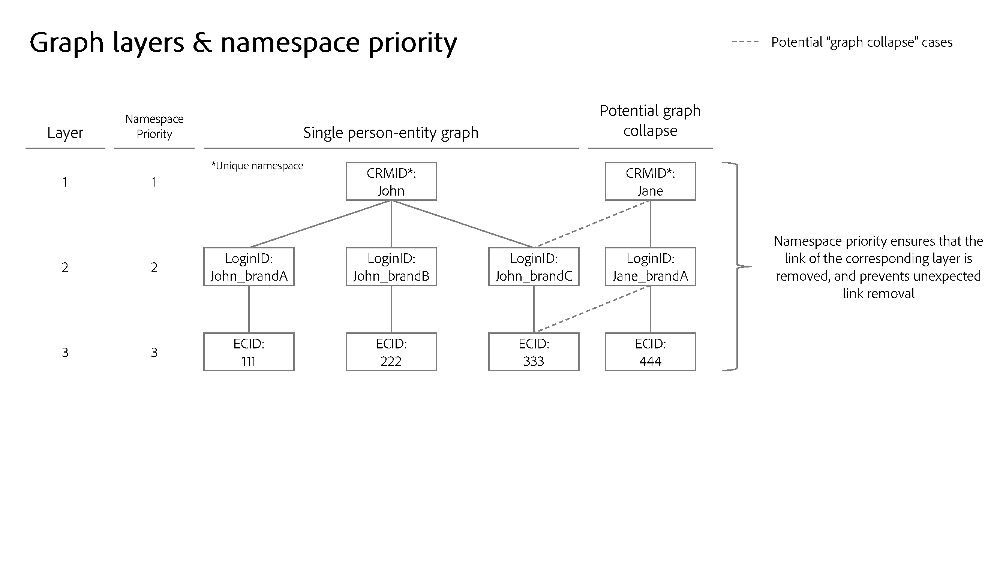
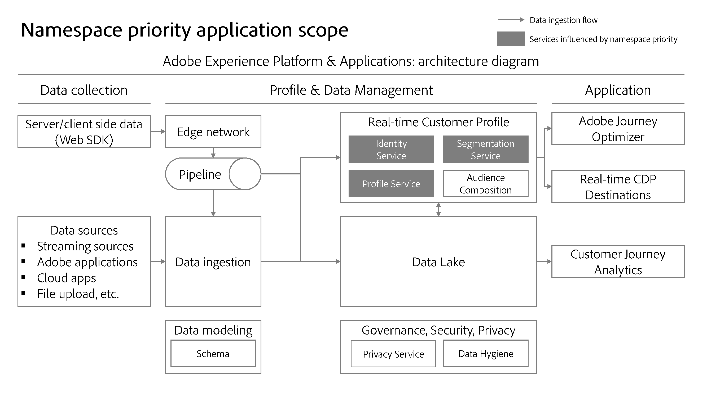
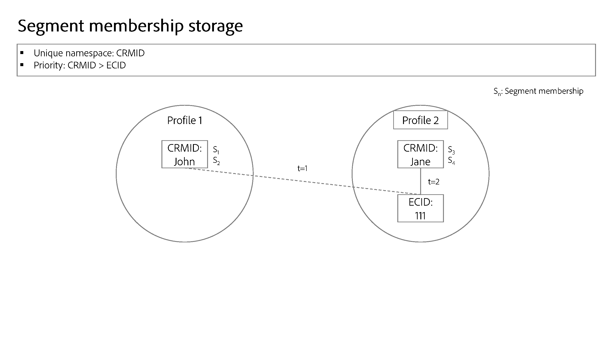

# 名前空間の優先度 {#namespace-priority}

>[!CONTEXTUALHELP]
>id="platform_identities_namespacepriority"
>title="名前空間の優先度"
>abstract="名前空間の優先度によって、ID グラフからリンクを削除する方法が決定します。"

顧客実装はそれぞれ異なり、特定の組織の目標に合わせてカスタマイズされるため、特定の名前空間の重要性は顧客によって異なります。 実際の例には、次のようなものがあります。

* 会社では、各メールアドレスを1人の個人エンティティを表すものと見なす場合があります。そのため、[ID設定](./identity-settings-ui.md)を使用して、メール名前空間を一意として設定します。 ただし、別の企業では、単一の個人のエンティティを複数のメールアドレスを持つように表現し、メール名前空間を一意ではないように設定する場合があります。 これらの企業は、複数のメールアドレスにリンクされた単一の個人IDを設定できるように、CRMID名前空間などの別のID名前空間を一意として使用する必要があります。
* 「ログイン ID」名前空間を使用してオンライン動作を収集する場合があります。 このログイン IDは、CRMIDと1:1関係を持つ可能性があります。CRM システムの属性が保存され、最も重要な名前空間と見なされる可能性があります。 この場合、CRMID名前空間が人物のより正確な表現であると判断し、ログイン ID名前空間が2番目に重要であると判断します。

プロファイルと関連するID グラフの形成および分割の方法に影響を与えるため、名前空間の重要性を反映したIdentity Serviceの設定を行う必要があります。

## 優先順位の決定

名前空間の優先順位の決定は、次の要素に基づいています。

### ID グラフ構造

組織のグラフ構造がレイヤー化されている場合は、グラフが折りたたまれた場合に正しいリンクが削除されるように、名前空間の優先順位がこれを反映する必要があります。

>[!TIP]
>
>* 「グラフの折りたたみ」とは、複数の異なるプロファイルが誤って単一のID グラフに結合されるシナリオを指します。
>
>* 階層型グラフとは、複数レベルのリンクを持つID グラフのことです。 3つのレイヤーを持つグラフの例については、以下の画像を参照してください。

{zoomable="yes"}

### 名前空間の意味

IDは実世界のオブジェクトを表します。 ID グラフに表示されるオブジェクトは3つあります。 重要な順に、それらは次のとおりです。

* 人物（クロスデバイス、電子メール、電話番号）
* ハードウェアデバイス
* Web ブラウザー（Cookie）

人物名前空間は、Web ブラウザーと比較して比較的不変であるハードウェアデバイス（IDFA、GAIDなど）と比較して比較的不変です。 基本的に、お客様（お客様）は、複数のハードウェアデバイス（スマートフォン、ラップトップ、タブレットなど）を持ち、複数のブラウザー（Google Chrome、Safari、FireFoxなど）を使用できる1つのエンティティになります。

このトピックにアプローチするもう1つの方法は、カーディナリティを通してです。 特定の個人エンティティの場合、いくつのIDが作成されますか？ ほとんどの場合、人は1つのCRMID、少数のハードウェアデバイス識別子（IDFA/GAIDのリセットは頻繁に行われるべきではありません）、さらに多くのCookieを持つことになります（個人は複数のデバイスを閲覧したり、シークレットモードを使用したり、任意の時点でCookieをリセットしたりすると考えられます）。 一般に、**基数が低い場合は、優先度が高い名前空間を示します**。

## 名前空間の優先度設定の検証

名前空間の優先順位付けについて理解できたら、UIのグラフシミュレーションツールを使用して、様々なグラフ折りたたみシナリオをテストし、優先度設定が期待されるグラフ結果を返していることを確認できます。 詳しくは、[ グラフシミュレーションツールの使用に関するガイド ](./graph-simulation.md)を参照してください。

## 名前空間の優先度の設定

名前空間の優先度は、[ID設定UI](./identity-settings-ui.md)を使用して設定できます。 ID設定インターフェイスでは、名前空間をドラッグ&amp;ドロップして、その相対的な重要度を決定できます。

>[!IMPORTANT]
>
>ユーザーの名前空間よりもデバイス/cookie名前空間を優先することはできません。 この制限により、設定ミスが発生しないようにします。

## 名前空間の優先度の使用

現在、名前空間の優先順位は、リアルタイム顧客プロファイルのシステム動作に影響します。 次の図は、この概念を示しています。 詳しくは、[Adobe Experience Platformおよびアプリケーションアーキテクチャ図](https://experienceleague.adobe.com/en/docs/blueprints-learn/architecture/architecture-overview/platform-applications)に関するガイドを参照してください。

{zoomable="yes"}

## Identity Service:ID最適化アルゴリズム

比較的複雑なグラフ構造の場合、グラフの折りたたみシナリオが発生したときに正しいリンクが削除されるように、名前空間の優先度が重要な役割を果たします。 詳しくは、[ID最適化アルゴリズムの概要](../identity-graph-linking-rules/identity-optimization-algorithm.md)を参照してください。

## リアルタイム顧客プロファイル：エクスペリエンスイベントの主要なID決定

* 特定のサンドボックスのID設定を設定すると、エクスペリエンスイベントのプライマリ IDは、設定で最も高い名前空間優先度によって決定されます。
   * それは、体験イベントが動的なものだからです。 ID マップには3つ以上のIDが含まれている場合があり、名前空間の優先順位によって、最も重要な名前空間がエクスペリエンスイベントに関連付けられます。
* その結果、次の設定&#x200B;**はReal-Time Customer Profile**&#x200B;で使用されなくなります。
   * Web SDK、モバイル SDK、またはEdge Network APIを使用して`primary=true`でIDを送信する際のプライマリ ID設定（`identityMap`）（ID名前空間とID値は引き続きプロファイルで使用されます）。 **注**: データレイク ストレージやAdobe TargetなどのReal-Time Customer Profile以外のサービスでは、引き続きプライマリ ID設定（`primary=true`）が使用されます。
   * XDM Experience Event Class スキーマでプライマリ IDとしてマークされたフィールド。
   * Adobe Analytics ソースコネクタ（ECIDまたはAAID）のデフォルトのプライマリ ID設定。
* 一方、**名前空間の優先度では、プロファイルレコード**&#x200B;のプライマリ IDは決定されません。
   * プロファイルレコードの場合は、引き続きプライマリ IDを含むスキーマのID フィールドを定義する必要があります。 詳しくは、[UIでのID フィールドの定義](/help/xdm/ui/fields/identity.md)に関するガイドを参照してください。

>[!TIP]
>
>* 名前空間の優先度は&#x200B;**名前空間**&#x200B;のプロパティです。 名前空間に割り当てられた数値で、その相対的な重要度を示します。
>
>* プライマリ IDは、プロファイルフラグメントが格納されるIDです。 プロファイルフラグメントは、特定のユーザーに関する情報（CRM レコードなど）またはイベント（web サイト参照など）を格納するデータのレコードです。

### シナリオの例

この節では、優先度設定がデータにどのような影響を与えるかを示します。

特定のサンドボックスに対して次の設定が設定されているとします。

| 名前空間 | 名前空間の実際のアプリケーション | 優先度 |
| --- | --- | --- |
| CRMID | ユーザー | 1 |
| IDFA | Apple ハードウェアデバイス（iPhone、IPadなど） | 2 |
| GAID | Google ハードウェアデバイス（Google Pixel、Pixelbookなど） | 3 |
| ECID | Web ブラウザー（Firefox、Safari、Google Chromeなど） | 4 |
| AAID | Web ブラウザー | 5 |

{style="table-layout:auto"}

上記の設定を考慮すると、ユーザーのアクションとプライマリ IDの決定は次のように解決されます。

| ユーザーアクション（エクスペリエンスイベント） | 認証状態 | データソース | イベント内の名前空間 | プライマリ IDの名前空間 |
| --- | --- | --- | --- | --- |
| クレジットカードのオファーページを表示 | 未認証（匿名） | Web SDK | `{ECID}` | ECID |
| ヘルプページを表示 | 認証されていません | Mobile SDK | `{ECID, IDFA}` | IDFA |
| 当座預金口座残高の表示 | Authenticated | Web SDK | `{CRMID, ECID}` | CRMID |
| 住宅ローンの申し込み | Authenticated | Analytics ソースコネクタ | `{CRMID, ECID, AAID}` | CRMID |
| 1,000 ドルを当座預金口座から普通預金口座に振り込む | Authenticated | Mobile SDK | `{CRMID, GAID, ECID}` | CRMID |

{style="table-layout:auto"}

## セグメント化サービス：セグメントメンバーシップのメタデータストレージ

{zoomable="yes"}

特定の結合プロファイルの場合、セグメントメンバーシップは、名前空間の優先度が最も高いIDに対して保存されます。

例えば、次の2つのプロファイルがあるとします。

* プロファイル 1はJohnを表します。
   * JohnのプロファイルはS1 （セグメントメンバーシップ 1）に適格です。 たとえば、S1では、男性と識別された顧客のセグメントを指すことができます。
   * ジョンのプロファイルはS2 （セグメントメンバーシップ 2）にも適格です。 ロイヤルティステータスが「ゴールド」の顧客セグメントを指す場合もあります。
* プロファイル 2はJaneを表します。
   * JaneのプロファイルはS3 （セグメントメンバーシップ 3）に適格です。 これは、女性として識別される顧客のセグメントを指す場合があります。
   * JaneのプロファイルもS4 （セグメントメンバーシップ 4）に適格です。 ロイヤルティステータスがプラチナの顧客セグメントを指す場合もあります。

JohnとJaneがデバイスを共有している場合、ECID （web ブラウザー）は、ある人物から別の人物に転送されます。 ただし、これは、JohnとJaneに対して保存されたセグメントメンバーシップ情報には影響しません。

セグメントのクオリフィケーション基準が、ECIDに対して保存された匿名イベントのみに基づいている場合、Janeはそのセグメントのクオリフィケーションを行います。

## 他のExperience Platform サービスへの影響 {#implications}

この節では、名前空間の優先順位が他のExperience Platform サービスにどのような影響を与えるかを概説します。

### 詳細なデータライフサイクル管理

データハイジーンレコードの削除要求は、特定のIDに対して次の方法で機能します。

* リアルタイム顧客プロファイル：指定されたIDをプライマリ IDとして持つプロファイルフラグメントを削除します。 **プロファイルのプライマリ IDは、名前空間の優先順位に基づいて決定されるようになりました。**
* データレイク：指定されたIDをプライマリ IDとして持つレコードをすべて削除します。 リアルタイム顧客プロファイルとは異なり、データレイクのプライマリ IDは、WebSDK （`primary=true`）で指定されたプライマリ IDまたはプライマリ IDとしてマークされたフィールドに基づきます

詳しくは、[高度なライフサイクル管理の概要](/help/hygiene/home.md)を参照してください。

### 計算属性

ID設定が有効になっている場合、計算属性は名前空間優先度を使用して計算属性値を保存します。 特定のイベントの場合、名前空間の優先順位が最も高いIDには、計算属性の値が書き込まれます。 詳しくは、[計算属性UI ガイド ](/help/profile/computed-attributes/ui.md)を参照してください。

### データレイク

データレイクへのデータ取り込みは、[Web SDK](/help/tags/extensions/client/web-sdk/data-element-types.md#identity-map)およびスキーマで設定されたプライマリ IDを引き続き尊重します。

データレイクは、名前空間の優先順位に基づいてプライマリ IDを決定しません。 例えば、Adobe Customer Journey Analyticsは、名前空間の優先順位が有効になっている場合（データセットを新しい接続に追加するなど）でも、ID マップの値を引き続き使用します。これは、Customer Journey Analyticsがデータレイクからデータを消費するためです。

### Experience Data Model （XDM）スキーマ

XDM個人プロファイルなど、XDM エクスペリエンスイベントではないスキーマは、IDとしてマークした[ フィールドを引き続き尊重します](/help/xdm/ui/fields/identity.md)。

XDM スキーマについて詳しくは、[ スキーマの概要](/help/xdm/home.md)を参照してください。

### インテリジェントサービス

データを選択する場合は、名前空間を指定する必要があります。名前空間は、スコアを計算するイベントと、計算されたスコアを保存するイベントを決定するために使用されます。 ユーザーを表す名前空間を選択することをお勧めします。

* WebSDkを使用してweb行動データを収集する場合は、ID マップ内でCRMID名前空間を選択することをお勧めします。
* Analytics ソースコネクタを使用してweb動作データを収集する場合は、ID記述子（CRMID）を選択する必要があります。

この設定では、認証済みイベントのみを使用してスコアを計算します。

詳しくは、[Attribution AI](/help/intelligent-services/attribution-ai/overview.md)および[Customer AI](/help/intelligent-services/customer-ai/overview.md)のドキュメントを参照してください。

### パートナー作成の配信先

共有デバイスに関連付けられたプロファイルの更新されたオーディエンス失格結果は、ダウンストリームの宛先に送信されない可能性があります。 これは、次のような特定のまれなケースで発生する可能性があります。

* オーディエンスの選定は、匿名のアクティビティにもとづいておこなわれます。
* 複数のプロファイルにまたがるログインが短期間で実行されます。

パートナーが作成した宛先について詳しくは、[宛先の概要](/help/destinations/home.md#adobe-built-and-partner-built-destinations)を参照してください。

### Privacy Service

指定されたIDに対して[Privacy Service削除リクエスト ](../privacy.md)は次の方法で機能します。

* リアルタイム顧客プロファイル：指定されたID値をプライマリ IDとして持つプロファイルフラグメントを削除します。 **プロファイルのプライマリ IDは、名前空間の優先順位に基づいて決定されるようになりました。**
* データレイク：指定したIDをプライマリ IDまたはセカンダリ IDとして持つレコードをすべて削除します。

詳しくは、[ プライバシーサービスの概要](/help/privacy-service/home.md)を参照してください。

### EdgeのセグメンテーションとEdge Networkアプリケーション

[!DNL Identity Graph Linking Rules]のコンテキストでは、Edge セグメンテーションとEdge Network アプリケーションに関して留意すべき主な行動上の変更が2つあります。

1. `identityMap`には、一意としてマークされたユーザー名前空間が含まれている必要があります。 ID （ID記述子）としてマークされたフィールドはサポートされていません。
2. エンドユーザーが認証中にブラウジングしているときは、ユーザー名前空間に`primary = true`設定が必要です。

#### エッジセグメント化

特定のイベントでは、XDM フィールド `identityMap`として送信された[IDが無視され、セグメントメンバーシップのメタデータストレージに使用されないため、人物エンティティを表すすべての名前空間が](/help/xdm/ui/fields/identity.md)に含まれていることを確認してください。

* **イベントアプリケーション**：この動作は、Edge Networkに直接送信されたイベント（WebSDKやモバイルSDKなど）にのみ適用されます。 HTTP API ソース、その他のストリーミングソース、バッチソースなど、[Experience Platform ハブ ](/help/landing/edge-and-hub-comparison.md)から取り込まれたイベントは、この制限の対象ではありません。
* **Edgeのセグメント化の特異性**：この動作はエッジのセグメント化に固有です。 バッチセグメンテーションとストリーミングセグメンテーションは、ハブで評価される個別のサービスであり、同じプロセスに従うものではありません。 詳しくは、[ エッジセグメント化ガイド ](/help/segmentation/methods/edge-segmentation.md)を参照してください。
* 詳しくは、[Adobe Experience Platformとアプリケーションのアーキテクチャ図](https://experienceleague.adobe.com/en/docs/blueprints-learn/architecture/architecture-overview/platform-applications#detailed-architecture-diagram)および[Edge Networkとハブの比較](/help/landing/edge-and-hub-comparison.md) ページを参照してください。

#### Edge Network製品

Edge Network上のアプリケーションがEdge プロファイルに遅滞なくアクセスできるようにするには、イベントにCRMIDに`primary=true`が含まれていることを確認してください。 これにより、ID グラフの更新をハブから待つことなく、すぐに利用できるようになります。

* Adobe Target、Offer Decisioning、カスタム Personalizationの宛先など、Edge Network上のアプリケーションは、Edge プロファイルからプロファイルにアクセスするために、引き続きイベントのプライマリ IDに依存します。
* Edge Networkの動作について詳しくは、[Experience Platform Web SDKとEdge Network アーキテクチャ図](https://experienceleague.adobe.com/en/docs/blueprints-learn/architecture/architecture-overview/deployment/websdk#experience-platform-webmobile-sdk-or-edge-network-server-api-deployment)を参照してください。
* Web SDKでプライマリ IDを設定する方法について詳しくは、[Data element types](/help/tags/extensions/client/web-sdk/data-element-types.md)および[Data Collection](/help/collection/identity/overview.md)のIDに関するドキュメントを参照してください。
* エクスペリエンスイベントにECIDが含まれていることを確認します。 ECIDが見つからない場合は、`primary=true`を含むイベントペイロードに追加され、予期しない結果が生じる可能性があります。
