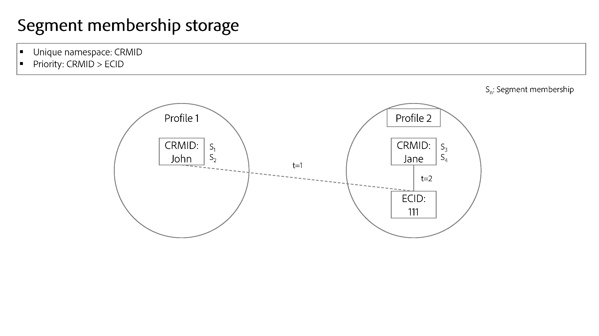

# 名前空間の優先度

>[!AVAILABILITY]
>
>ID グラフリンクルールは現在、限定提供（LA）です。 開発用サンドボックスでこの機能にアクセスする方法については、Adobeアカウントチームにお問い合わせください。

顧客の実装はすべて、特定の組織の目標を満たすようにカスタマイズされて一意です。そのため、特定の名前空間の重要性は、顧客によって異なります。 実際の例を次に示します。

* 一方で、電子メール名前空間を人物エンティティを表すものと見なし、人物ごとに一意にすることもできます。 一方、別の顧客は、メール名前空間を信頼性の低い識別子と見なすことがあるため、1 つの CRMID をメール名前空間で複数の ID に関連付けることができる可能性があります。
* 「ログイン ID」名前空間を使用して、オンライン動作を収集できます。 このログイン ID は CRMID と 1 対 1 の関係を持つ可能性があり、CRM システムから属性を保存し、最も重要な名前空間と見なされることがあります。 この場合、CRMID 名前空間は人物をより正確に表すものであり、ログイン ID 名前空間は 2 番目に重要なものであると判断します。

名前空間の重要性を反映した設定を ID サービスで行う必要があります。これは、プロファイルの形成およびセグメント化の方法に影響を与えるからです。

## 優先度の決定

名前空間の優先度の決定は、次の要因に基づいて行います。

### ID グラフ構造

組織のグラフ構造がレイヤー化されている場合は、グラフが折りたたまれた場合に正しいリンクが削除されるように、名前空間の優先度にこれを反映する必要があります。

>[!TIP]
>
>* 「グラフの折りたたみ」とは、複数の異なるプロファイルが誤って 1 つの ID グラフに結合されるシナリオを指します。
>
>* レイヤー化されたグラフとは、複数レベルのリンクを持つ ID グラフを指します。 3 つのレイヤーを持つグラフの例については、以下の画像を参照してください。

### 名前空間の意味論的意味

ID は、実際のオブジェクトを表します。 ID グラフには 3 つのオブジェクトが表示されます。 次に、重要度の高い順に示します。

* 人物（クロスデバイス、メール、電話番号）
* ハードウェア デバイス
* Web ブラウザー（Cookie）

人物名前空間は、ハードウェアデバイス（IDFA、GAID など）に比べて比較的不変で、web ブラウザーに比べて比較的不変です。 基本的に、ユーザーは常に 1 人のエンティティであり、複数のハードウェアデバイス（スマートフォン、ノートパソコン、タブレットなど）を持ち、複数のブラウザー（Google Chrome、Safari、FireFox など）を使用できます。

このトピックにアプローチするもう 1 つの方法は、カーディナリティを使用することです。 特定のユーザーエンティティに対して、いくつの ID が作成されますか？ ほとんどの場合、ユーザーは 1 つの CRMID、いくつかのハードウェアデバイス識別子（IDFA/GAID のリセットは頻繁には発生しません）、さらにはさらに Cookie （個人が複数のデバイスを閲覧したり、匿名モードを使用したり、いつでも Cookie をリセットしたりする可能性があります）を持ちます。 一般に、**カーディナリティが低い方が、値が高い名前空間を示します**。

## 名前空間の優先度設定の検証

名前空間にどのように優先順位を付けるかを把握したら、グラフシミュレーション ツールを使用して、様々なグラフ折りたたみシナリオをテストし、優先設定が期待どおりのグラフ結果を返していることを確認します。 詳しくは、[ グラフシミュレーションツール ](./graph-simulation.md) の使用に関するガイドを参照してください。

## 名前空間の優先度の設定

名前空間の優先度は、[!UICONTROL ID 設定 ] を使用して設定できます。 [!UICONTROL ID 設定 ] インターフェイスでは、名前空間をドラッグ&amp;ドロップして、相対的な重要度を決定できます。

>[!IMPORTANT]
>
>デバイス/cookie 名前空間をユーザー名前空間よりも優先することはできません。 この制限により、設定ミスが発生しないことが保証されます。

## 名前空間の優先度の使用

現在、名前空間の優先度は、リアルタイム顧客プロファイルのシステム動作に影響を与えています。 次の図は、この概念を示しています。 詳細については、[Adobe Experience Platformおよびアプリケーション アーキテクチャ図 ](https://experienceleague.adobe.com/en/docs/blueprints-learn/architecture/architecture-overview/platform-applications) に関するガイドを参照してください。

### ID サービス：ID 最適化アルゴリズム

比較的複雑なグラフ構造の場合、グラフの折りたたみシナリオが発生したときに正しいリンクが削除されるようにするために、名前空間の優先度は重要な役割を果たします。 詳しくは、[ID 最適化アルゴリズムの概要 ](../identity-graph-linking-rules/identity-optimization-algorithm.md) を参照してください。

### リアルタイム顧客プロファイル：エクスペリエンスイベントのプライマリ ID 決定

* エクスペリエンスイベントの場合、特定のサンドボックスに対して ID 設定を設定すると、今後、名前空間の最も高い優先度によってプライマリ ID が決定されます。
   * これは、エクスペリエンスイベントが本質的に動的であるためです。 ID マップには 3 つ以上の ID を含めることができ、名前空間の優先度により、最も重要な名前空間がエクスペリエンスイベントに関連付けられます。
* その結果、次の設定 **リアルタイム顧客プロファイルでは使用されなくなります**。
   * WebSDK のデータ要素タイプ（identityMap では `primary=true` に変換されます）の「プライマリ」チェックボックス。 **メモ**:ID 名前空間および ID 値は、引き続きプロファイルで使用されます。 さらに、「プライマリ」チェックボックスの設定も行う必要があります。これは、リアルタイム顧客プロファイル以外のサービスでは、引き続きこの設定を参照するためです。
   * XDM エクスペリエンスイベントクラススキーマでプライマリ ID としてマークされたすべてのフィールド。
   * Adobe Analytics ソースコネクタのデフォルトのプライマリ ID 設定（ECID または AAID）。
* 一方、**名前空間の優先度は、プロファイルレコードのプライマリ ID を決定しません**。
   * プロファイルレコードの場合、Experience PlatformUI のスキーマ ワークスペースを使用して、プライマリ ID などの ID フィールドを定義できます。 詳しくは、[UI での ID フィールドの定義 ](../../xdm/ui/fields/identity.md) に関するガイドを参照してください。

>[!TIP]
>
>* 名前空間の優先度は **名前空間のプロパティ** です。 これは、名前空間の相対的な重要度を示すために名前空間に割り当てられた数値です。
>
>* プライマリ ID は、プロファイルフラグメントが保存される ID です。 プロファイルフラグメントは、特定のユーザーに関する情報を格納するデータのレコードです。属性（通常は CRM レコードを介して取り込まれる）またはイベント （通常はエクスペリエンスイベントまたはオンラインデータから取り込まれる）です。

### サンプルシナリオ

この節では、優先度設定がデータに与える影響の例を示します。

特定のサンドボックスに対して、次の設定が確立されているとします。

| 名前空間 | 名前空間の実際のアプリケーション | 優先度 |
| --- | --- | --- |
| CRMID | ユーザー | 1 |
| IDFA | Apple ハードウェアデバイス（iPhone、IPadなど） | 2 |
| GAID | Google ハードウェアデバイス（Google Pixel、Pixelbook など） | 3 |
| ECID | Web ブラウザー（Firefox、Safari、Google Chromeなど） | 4 |
| AAID | Web ブラウザー | 5 |

{style="table-layout:auto"}

上記の設定に基づいて、ユーザーのアクションとプライマリ ID の決定は、次のように解決されます。

| ユーザーアクション（エクスペリエンスイベント） | 認証状態 | データソース | ID マップ | プライマリ ID （プロファイルフラグメントのプライマリキー） |
| --- | --- | --- | --- | --- |
| クレジット カード オファーページの表示 | 未認証（匿名） | Web SDK | {ECID} | ECID |
| ヘルプページを表示 | 未認証 | Mobile SDK | {ECID, IDFA} | IDFA |
| 当座預金口座残高の表示 | Authenticated | Web SDK | {CRMID, ECID} | CRMID |
| 住宅ローンにサインアップ | Authenticated | Analytics ソースコネクタ | {CRMID, ECID, AAID} | CRMID |
| 小切手から貯蓄に$1,000 を振り替える | Authenticated | Mobile SDK | {CRMID, GAID, ECID} | CRMID |

{style="table-layout:auto"}

### セグメント化サービス：セグメントメンバーシップのメタデータストレージ

特定の結合プロファイルについて、セグメントメンバーシップは、優先度が最も高い名前空間の ID に対して保存されます。

例えば、次の 2 つのプロファイルがあるとします。

* 最初のプロファイルは John を表します。
* 2 つ目のプロファイルは Jane を表します。

John と Jane がデバイスを共有する場合、ECID （web ブラウザー）はあるユーザーから別のユーザーに転送されます。 ただし、このことは、John と Jane に対して保存されたセグメントメンバーシップ情報には影響しません。

セグメントの選定条件が ECID に対して保存された匿名イベントのみに基づいている場合、Jane はそのセグメントに適格となります

## その他のExperience Platformサービスへの影響 {#implications}

この節では、名前空間の優先度が他のExperience Platformサービスに与える影響について説明します。

### 高度なデータ・ライフサイクル管理

データハイジーンレコードの削除リクエストは、特定の ID に対して次のような方法で機能します。

* リアルタイム顧客プロファイル：指定された ID をプライマリ ID とするプロファイルフラグメントを削除します。 **プロファイルのプライマリ ID は、名前空間の優先度に基づいて決定されるようになりました。**
* データレイク：指定された ID をプライマリ ID とするレコードを削除します。

詳しくは、[ 高度なライフサイクル管理の概要 ](../../hygiene/home.md) を参照してください。

### 計算属性

計算済み属性では、名前空間の優先度を使用して値が計算されません。 計算属性を使用する場合は、CRMID が WebSDK のプライマリ ID として指定されていることを確認する必要があります。 この制限は 2024 年 8 月に解決される予定です。

詳しくは、[ 計算属性 UI ガイド ](../../profile/computed-attributes/ui.md) を参照してください。

### データレイク

データレイクへのデータ取り込みは、引き続き [Web SDK](../../tags/extensions/client/web-sdk/data-element-types.md#identity-map) およびスキーマで設定されたプライマリ ID 設定に従います。

データレイクは、名前空間の優先度に基づいてプライマリ ID を決定しません。 例えば、名前空間の優先度が有効になった後でも（新しい接続にデータセットを追加するなど）、Adobe Customer Journey Analyticsは ID マップ内で値を引き続き使用します。これは、Customer Journey Analyticsがデータレイクのデータを使用するからです。

### エクスペリエンスデータモデル（XDM）スキーマ

XDM 個人プロファイルなど、XDM エクスペリエンスイベントではないスキーマは、引き続き、[ID としてマークするフィールド ](../../xdm/ui/fields/identity.md) に従います。

XDM スキーマについて詳しくは、[ スキーマの概要 ](../../xdm/home.md) を参照してください。

### インテリジェントサービス

データを選択する際に、名前空間を指定する必要があります。この名前空間は、スコアを計算するイベントと、計算されたスコアを保存するイベントを決定するために使用されます。 人物を表す名前空間を選択することをお勧めします。

* WebSDk を使用して web 動作データを収集する場合は、ID マップ内で CRMID 名前空間を選択することをお勧めします。
* Analytics ソースコネクタを使用して web 動作データを収集する場合は、ID 記述子（CRMID）を選択する必要があります。

この設定の結果、スコアは認証済みイベントを使用してのみ計算されます。

詳しくは、[Attribution AI](../../intelligent-services/attribution-ai/overview.md) および [ 顧客 AI](../../intelligent-services/customer-ai/overview.md) に関するドキュメントを参照してください。

### Privacy Service

[Privacy Service削除リクエスト ](../privacy.md) は、特定の ID に対して次のように機能します。

* リアルタイム顧客プロファイル：指定された ID 値をプライマリ ID として持つ、プロファイルフラグメントを削除します。 **プロファイルのプライマリ ID は、名前空間の優先度に基づいて決定されるようになりました。**
* データレイク：指定した ID をプライマリまたはセカンダリ ID として持つレコードを削除します。

詳しくは、[Privacy Service の概要 ](../../privacy-service/home.md) を参照してください。

### Adobe Target

有効化できるのは、Adobe Targetへのバッチセグメント化とストリーミングセグメント化のみです。