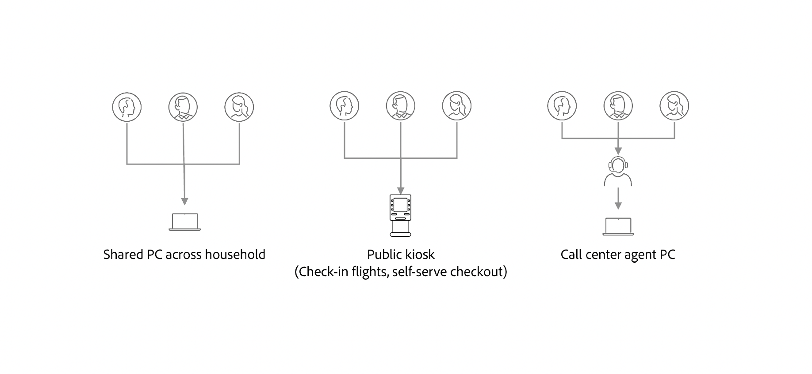
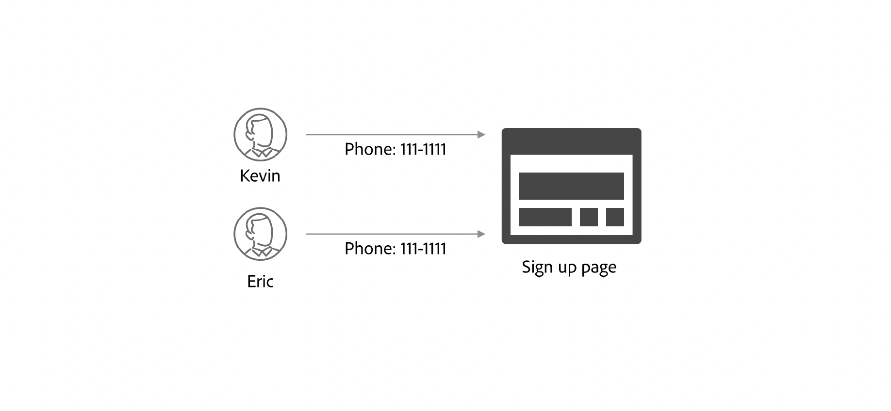
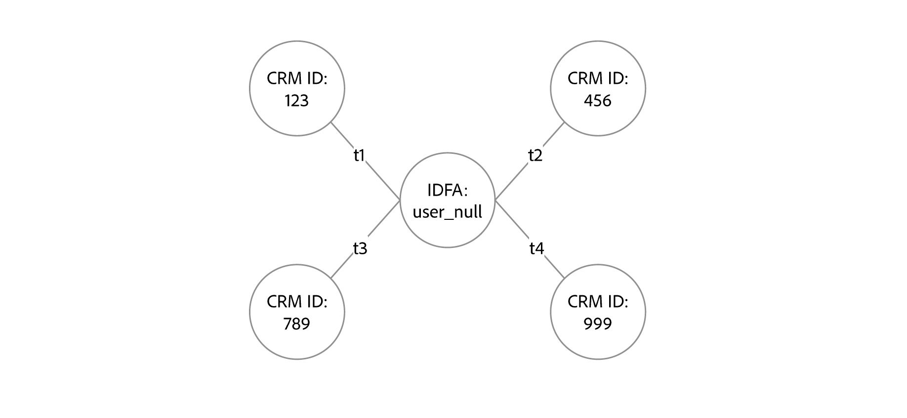

# [!DNL Identity Graph Linking Rules] の概要 {#identity-graph-linking-rules-overview}

>[!CONTEXTUALHELP]
>id="platform_identities_linkingrules_overview"
>title="ID グラフのリンクルール"
>abstract="これらの不要な結合を防ぐために、ID グラフのリンクルールから提供される設定を使用して、ユーザーの正確なパーソナライゼーションを行うことができます。"

>[!IMPORTANT]
>
>[!DNL Identity Graph Linking Rules]が一般公開されました。 ID設定を有効にした後、折りたたまれたグラフを折りたたまない（「修正」）必要がある既存のサンドボックスがある場合は、Adobe アカウントチームまたはAdobe サポートにお問い合わせください。

Adobe Experience Platform Identity ServiceとReal-Time Customer Profileを利用すれば、データが完全に取り込まれ、統合されたあらゆるプロファイルは、CRMIDなどの個人IDを通じて1人の個人を表していると容易に仮定できます。 ただし、特定のデータが複数の異なるプロファイルを単一のプロファイルに統合しようとする可能性があるシナリオ（「グラフの折りたたみ」）があります。 このような不要な結合を防ぐには、[!DNL Identity Graph Linking Rules]を通じて提供される設定を使用し、ユーザーに対して正確なパーソナライゼーションを行うことができます。

## 基本を学ぶ

[!DNL Identity Graph Linking Rules]を理解するには、次のドキュメントが不可欠です。

* [ID 最適化アルゴリズム](./identity-optimization-algorithm.md)
* [実装ガイド](./implementation-guide.md)
* [グラフ設定の例](./example-configurations.md)
* [トラブルシューティングとFAQ](./troubleshooting.md)
* [名前空間の優先度](./namespace-priority.md)
* [グラフシミュレーション UI](./graph-simulation.md)
* [ID設定UI](./identity-settings-ui.md)

## ビデオライブラリ

次のビデオでは、ID グラフリンクルールの基本的な側面について説明します。

<!-- 
CARDS
{target = _blank}
* https://experienceleague.adobe.com/ja/docs/platform-learn/tutorials/identities/graph-linking-rules/overview
* https://experienceleague.adobe.com/ja/docs/platform-learn/tutorials/identities/graph-linking-rules/graph-simulation 

    {description = Learn how to use the graph simulator to test out identity graph linking rules.}

* https://experienceleague.adobe.com/ja/docs/platform-learn/tutorials/identities/graph-linking-rules/identity-settings
    {description = Learn how to enable and configure identity graph linking rules to build accurate customer profiles}
-->
<!-- START CARDS HTML - DO NOT MODIFY BY HAND -->

    

        

            

                <figure class="image x-is-16by9">
                    
                </figure>
            

            

                

                    

                        <a href="https://experienceleague.adobe.com/ja/docs/platform-learn/tutorials/identities/graph-linking-rules/overview" target="_blank" rel="referrer" title="ID グラフのリンクルールの概要">ID グラフのリンクルールの概要</a>
                    

                    
ID グラフのリンクルールを使用して、データアーキテクトが正確な顧客プロファイルを維持し、グラフの折りたたみを防ぐのに役立てる方法の概要について説明します。

                

                <a href="https://experienceleague.adobe.com/ja/docs/platform-learn/tutorials/identities/graph-linking-rules/overview" target="_blank" rel="referrer" class="spectrum-Button spectrum-Button--outline spectrum-Button--primary spectrum-Button--sizeM" style="align-self: flex-start; margin-top: 1rem;">
                    所要時間
                </a>
            

        

    

    

        

            

                <figure class="image x-is-16by9">
                    
                </figure>
            

            

                

                    

                        <a href="https://experienceleague.adobe.com/ja/docs/platform-learn/tutorials/identities/graph-linking-rules/graph-simulation" target="_blank" rel="referrer" title="ID グラフのリンクルール – グラフシミュレーション">ID グラフのリンクルール - グラフシミュレーション</a>
                    

                    
グラフシミュレーターを使用してID グラフのリンクルールをテストする方法を説明します。

                

                <a href="https://experienceleague.adobe.com/ja/docs/platform-learn/tutorials/identities/graph-linking-rules/graph-simulation" target="_blank" rel="referrer" class="spectrum-Button spectrum-Button--outline spectrum-Button--primary spectrum-Button--sizeM" style="align-self: flex-start; margin-top: 1rem;">
                    所要時間
                </a>
            

        

    

    

        

            

                <figure class="image x-is-16by9">
                    
                </figure>
            

            

                

                    

                        <a href="https://experienceleague.adobe.com/ja/docs/platform-learn/tutorials/identities/graph-linking-rules/identity-settings" target="_blank" rel="referrer" title="ID グラフのリンクルール - ID設定">ID グラフのリンクルール - ID 設定</a>
                    

                    
正確な顧客プロファイルを構築するためにID グラフのリンクルールを有効にして設定する方法について説明します

                

                <a href="https://experienceleague.adobe.com/ja/docs/platform-learn/tutorials/identities/graph-linking-rules/identity-settings" target="_blank" rel="referrer" class="spectrum-Button spectrum-Button--outline spectrum-Button--primary spectrum-Button--sizeM" style="align-self: flex-start; margin-top: 1rem;">
                    所要時間
                </a>
            

        

    

<!-- END CARDS HTML - DO NOT MODIFY BY HAND -->

## グラフ折りたたみシナリオ {#graph-collapse-scenarios}

>[!CONTEXTUALHELP]
>id="platform_identities_graphcollapsescenarios"
>title="グラフ折りたたみシナリオ"
>abstract="グラフが「折りたたむ」ことや、複数のユーザーエンティティを表すことがある理由は複数あります。"

この節では、[!DNL Identity Graph Linking Rules]を設定する際に考慮する可能性のあるシナリオの例について説明します。

### 共有デバイス

1つのデバイスで複数のログインが発生する場合があります。

| 共有デバイス | 説明 |
| --- | --- |
| ファミリーコンピューターとタブレット | 夫と妻はそれぞれの銀行口座にログインします。 |
| パブリックキオスク | 空港でロイヤルティ IDを使用してログインしている旅行者が、手荷物のチェックインや搭乗券の印刷を行う。 |
| コールセンター | コールセンターの担当者は、カスタマーサポートに電話をかけるお客様の代わりに1つのデバイスにログインして、問題を解決します。 |

{zoomable="yes"}

この場合、グラフの観点から見ると、制限が有効になっていない場合、単一のECIDが複数のCRMIDにリンクされます。

[!DNL Identity Graph Linking Rules] では、以下のことが可能です。

* ログインに使用するIDを一意のIDとして設定します。 例えば、CRMID名前空間を持つ1つのIDのみを格納するようにグラフを制限し、そのCRMIDを共有デバイスの一意の識別子として定義できます。
   * これにより、CRMIDがECIDによって結合されないようにすることができます。

### 無効な電子メール/電話シナリオ

また、登録時に偽の値を電話番号やメールアドレスとして提供するユーザーの例もあります。 このような場合、制限が有効になっていない場合、電話/メール関連のIDは複数の異なるCRMIDにリンクされます。

{zoomable="yes"}

[!DNL Identity Graph Linking Rules] では、以下のことが可能です。

* CRMID、電話番号、またはメールアドレスのいずれかを一意のIDとして設定し、アカウントに関連付けられている1人のCRMID、電話番号、またはメールアドレスに1人を制限します。

### 誤ったID値または不正なID値

名前空間に関係なく、一意でない誤ったID値がシステムに取り込まれる場合があります。 以下に例を示します。

* ID値が「user_null」のIDFA名前空間。
   * IDFA ID値は36文字（英数字32文字、ハイフン 4文字）にする必要があります。
* ID値が「未指定」の電話番号の名前空間。
   * 電話番号にはアルファベットを使用しないでください。

これらのIDにより、次のグラフが作成される可能性があります。このグラフでは、複数のCRMIDが「不正」 IDと結合されます。

{zoomable="yes"}

[!DNL Identity Graph Linking Rules]を使用すると、CRMIDを一意の識別子として設定して、この種類のデータによる不要なプロファイルの折りたたみを防ぐことができます。

## [!DNL Identity Graph Linking Rules] {#identity-graph-linking-rules}

[!DNL Identity Graph Linking Rules] を使用すると、次のことが可能です。

* 一意の名前空間を設定して、各ユーザーに対して単一のID グラフ/結合プロファイルを作成します。これにより、2つの異なる個人IDが1つのID グラフに結合されるのを防ぐことができます。
* オンラインで認証されたイベントを、優先順位を設定することで個人に関連付けます

### 用語 {#terminology}

| 用語 | 説明 |
| --- | --- |
| 一意の名前空間 | 一意の名前空間とは、ID グラフのコンテキスト内で個別に設定されたID名前空間です。 UIを使用して、名前空間を一意に設定できます。 名前空間を一意として定義すると、グラフはその名前空間を含む1つのIDのみを持つことができます。 |
| 名前空間の優先度 | 名前空間の優先度は、名前空間の相対的な重要度を相互に比較することを指します。 名前空間の優先度は、UIで設定可能です。 特定のID グラフで名前空間をランク付けできます。 有効にすると、ID最適化アルゴリズムの入力やエクスペリエンスイベントフラグメントのプライマリ IDの決定など、様々なシナリオで名前の優先度が使用されます。 |
| ID 最適化アルゴリズム | ID最適化アルゴリズムは、一意の名前空間と名前空間の優先順位を設定して作成されたガイドラインが、特定のID グラフに適用されるようにします。 |

### 一意の名前空間 {#unique-namespace}

ID設定UI ワークスペースを使用して、名前空間を一意に設定できます。 これにより、特定のグラフには、その一意の名前空間を含む1つのIDしか含まれていない可能性があることをID最適化アルゴリズムに通知します。 これにより、同じグラフ内の2つの異なる人物IDの結合を防ぐことができます。

次のシナリオについて検討してください。

* Martin氏はタブレットを使用してGoogle Chrome ブラウザーを開き、acme.comにログインして新しいバスケットボールシューズを探します。
   * このシナリオでは、バックグラウンドで次のIDがログに記録されます。
      * ブラウザーの使用を表すECID名前空間と値
      * 認証済みユーザー（ユーザー名とパスワードの組み合わせでサインインしたMartin氏）を表すCRMID名前空間と値。
* 息子のピーターは同じタブレットを使用し、Google Chromeを使ってacme.comにアクセスし、自分のアカウントでサインインしてサッカー用品を探します。
   * このシナリオでは、バックグラウンドで次のIDがログに記録されます。
      * ブラウザーを表す同じECID名前空間と値。
      * 認証済みユーザーを表す新しいCRMID名前空間と値。

CRMIDが一意の名前空間として設定されている場合、ID最適化アルゴリズムは、CRMIDを結合するのではなく、2つの個別のID グラフに分割します。

一意の名前空間を設定しないと、同じCRMID名前空間を持つ2つのIDなどの不要なグラフの結合が発生する可能性がありますが、ID値が異なります（このようなシナリオは、同じグラフ内の2つの異なる人物エンティティを表すことが多いです）。

特定のID グラフに取り込まれるID データに制限を適用するために、ID最適化アルゴリズムに通知するように一意の名前空間を設定する必要があります。

### 名前空間の優先度 {#namespace-priority}

名前空間の優先度は、名前空間の相対的な重要度を相互に比較することを指します。 名前空間の優先度はUIで設定可能で、特定のID グラフで名前空間をランク付けできます。

名前空間の優先順位が使用される方法の1つは、リアルタイム顧客プロファイルのエクスペリエンスイベントフラグメント（ユーザー行動）のプライマリ IDを決定することです。 優先度設定が設定されている場合、Web SDKのプライマリ ID設定は、どのプロファイルフラグメントが保存されているかを判断するために使用されなくなります。

一意の名前空間と名前空間の優先順位は、どちらもID設定UI ワークスペースで設定可能です。 ただし、設定の影響は異なります。

| | ID サービス | リアルタイム顧客プロファイル |
| --- | --- | --- |
| 一意の名前空間 | Identity Serviceでは、ID最適化アルゴリズムは、特定のID グラフに取り込まれるID データを決定するための一意の名前空間を指します。 | 一意の名前空間は、Real-Time Customer Profileには影響しません。 |
| 名前空間の優先度 | Identity Serviceでは、複数のレイヤーを持つグラフの場合、名前空間の優先順位によって適切なリンクが削除されます。 | エクスペリエンスイベントがプロファイルに取り込まれると、最優先の名前空間がプロファイルフラグメントのプライマリ IDになります。 |

* グラフあたり50 IDの制限に達しても、名前空間の優先順位はグラフの動作に影響しません。
* **名前空間の優先度は、その相対的な重要性を示す名前空間に割り当てられた数値**&#x200B;です。 これは名前空間のプロパティです。
* **プライマリ IDは、プロファイルフラグメントが**&#x200B;に対して保存されるIDです。 プロファイルフラグメントは、特定のユーザーに関する情報（通常はCRM レコードを介して取り込まれる）またはイベント（通常はエクスペリエンスイベントまたはオンラインデータから取り込まれる）を保存するデータのレコードです。
* 名前空間の優先順位によって、エクスペリエンスイベントフラグメントのプライマリ IDが決まります。
   * プロファイルレコードの場合は、Experience Platform UIのスキーマワークスペースを使用して、プライマリ IDを含むID フィールドを定義できます。 詳しくは、[UIでのID フィールドの定義](../../xdm/ui/fields/identity.md)に関するガイドを参照してください。
* エクスペリエンスイベントがidentityMapで名前空間の優先順位が最も高い2つ以上のIDを持つ場合、「不正なデータ」と見なされるため、取り込みから拒否されます。 例えば、identityMapに`{ECID: 111, CRMID: John, CRMID: Jane}`が含まれている場合、イベントが同時に`CRMID: John`と`CRMID: Jane`の両方に関連付けられていることを意味するため、イベント全体が不正なデータとして拒否されます。

詳しくは、[名前空間の優先度](./namespace-priority.md)に関するガイドを参照してください。

## 次の手順

[!DNL Identity Graph Linking Rules]について詳しくは、次のドキュメントを参照してください。

* [ID 最適化アルゴリズム](./identity-optimization-algorithm.md)
* [実装ガイド](./implementation-guide.md)
* [グラフ設定の例](./example-configurations.md)
* [トラブルシューティングとFAQ](./troubleshooting.md)
* [名前空間の優先度](./namespace-priority.md)
* [グラフシミュレーション UI](./graph-simulation.md)
* [ID設定UI](./identity-settings-ui.md)