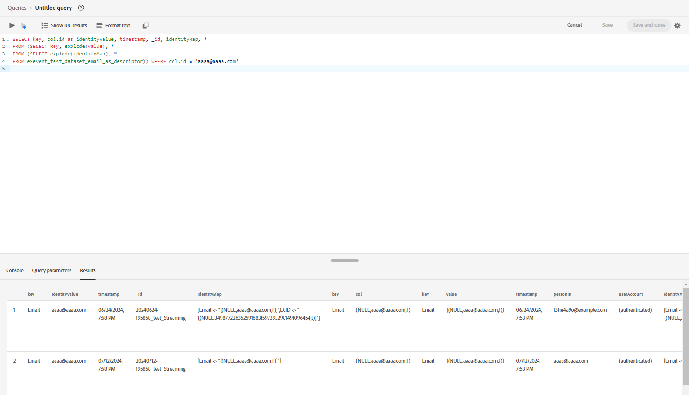

# [!DNL Identity Graph Linking Rules] のトラブルシューティングガイド

[!DNL Identity Graph Linking Rules] のテストと検証を行うと、データの取り込みとグラフの動作に関連した問題が発生する場合があります。 [!DNL Identity Graph Linking Rules] を使用する際に発生する可能性のある、一般的な問題のトラブルシューティング方法については、このドキュメントを参照してください。

## データ取り込みフローの概要 {#data-ingestion-flow-overview}

次の図は、データがAdobe Experience Platformとアプリケーションに送られる仕組みを簡単に表したものです。 このページの内容をより深く理解するために、この図を参考にしてください。

{zoomable="yes"}

次の要因に注意することが重要です。

* ストリーミングデータの場合、リアルタイム顧客プロファイル、ID サービスおよびデータレイクは、データの送信時にデータの処理を開始します。 ただし、データの処理が完了するまでの待ち時間は、サービスによって異なります。 通常、データレイクは、プロファイルと ID に比べて、処理に時間がかかります。
   * 数時間経ってもデータセットに対するクエリの実行時にデータが表示されない場合は、データがExperience Platformに取り込まれていない可能性があります。
* バッチデータの場合、すべてのデータは最初にデータレイクに送られ、次に、データセットがプロファイルと ID で有効になっている場合、データはプロファイルと ID に伝播されます。
* 取り込みに関連する問題については、正確なデバッグとトラブルシューティングを行うために、問題をサービスレベルで分離することが重要です。 考慮すべき潜在的な問題タイプは次の 3 つです。

| 取り込み問題タイプ | データはデータレイクで取り込まれますか？ | データはプロファイルに取り込まれますか？ | データは ID サービスに取り込まれますか？ |
| --- | --- | --- | --- |
| 一般的な取り込みの問題 | × | × | × |
| グラフの問題 | ○ | ○ | × |
| プロファイルフラグメントの問題 | ○ | × | ○ |

## データ取り込みの問題 {#data-ingestion-issues}

>[!NOTE]
>
>* この節では、データがデータレイクに正常に取り込まれたこと、およびデータがまずExperience Platformに取り込まれるのを妨げる構文やその他のエラーがないことを前提としています。
>
>* これらの例では、ECID を cookie 名前空間として、CRMID をユーザー名前空間として使用しています。

### ID が ID サービスに取り込まれない{#my-identities-are-not-getting-ingested-into-identity-service}

これが発生する理由には、次のように様々な理由があります（ただし、これらに限定されません）。

* [ データセットはプロファイルに対して有効になっていません ](../../catalog/datasets/enable-for-profile.md)。
* イベントには ID が 1 つしかないので、レコードはスキップされます。
* [ID サービスで検証エラーが発生しました ](../guardrails.md#identity-value-validation)。
   * 例えば、ECID が最大長の 38 文字を超えている場合があります。
* デフォルトでは、[AAID の取り込みはブロックされます ](../guardrails.md#identity-namespace-ingestion)。
* [ システムガードレール ](../guardrails.md#understanding-the-deletion-logic-when-an-identity-graph-at-capacity-is-updated) が原因で、ID が削除されます。

受信イベントには同じ一意の名前空間を持つが、ID 値が異なる 2 つ以上の ID があるので、[!DNL Identity Graph Linking Rules] のコンテキスト内では、レコードが ID サービスから拒否される場合があります。 このシナリオは通常、実装エラーが原因で発生します。

次の 2 つの前提があるイベントについて考えてみます。

1. フィールド名 CRMID は、名前空間 CRMID で ID としてマークされます。
2. 名前空間 CRMID は、一意の名前空間として定義されます。

次のイベントは、取り込みが失敗したことを示すエラーメッセージを返します。

<!-- because the ingestion of this erroneous event would have resulted in graph collapse. In the following event, two entities (Alice and Bob) are both associated with the same namespace (CRMID). -->

```json
{ 
  "_id": "random_string", 
  "eventType": "web browsing event", 
  "identityMap": { 
    "ECID": [ 
      { 
        "id": "11111111111111111111111111111111111111", 
        "primary": false 
      } 
    ], 
    "CRMID": [ 
      { 
        "id": "Alice", 
        "primary": true 
      } 
    ] 
  }, 
  "CRMID": "Bob", 
  "timestamp": "2024-08-17T15:22:51+00:00", 
  "web": { 
    "webPageDetails": { 
      "URL": "https://www.adobe.com/acrobat.html", 
      "name": "Adobe Acrobat" 
    } 
  } 
} 
```

**トラブルシューティング手順**

このエラーを解決するには、まず次の情報を収集する必要があります。

* ID グラフに取り込まれると想定される ID 値（`identity_value`）。
* イベントが送信されたデータセット（`dataset_name`）。

次に、[Adobe Experience Platform クエリサービスを使用して ](../../query-service/home.md) 次のクエリを実行します。

>[!TIP]
>
>`dataset_name` と `identity_value` を、収集した情報に置き換えます。

```sql
  SELECT key, col.id as identityValue, timestamp, _id, identityMap, * 
  FROM (SELECT key, explode(value), * 
  FROM (SELECT explode(identityMap), * 
  FROM dataset_name)) WHERE col.id = 'identity_value' 
```

クエリを実行した後、グラフを生成するために必要なイベントレコードを見つけ、同じ行で ID 値が異なることを検証します。 例として、次の画像を表示します。



>[!NOTE]
>
>2 つの ID が完全に同じで、イベントがストリーミング経由で取り込まれる場合、ID とプロファイルの両方で ID の重複が排除されます。

### 認証後の ExperienceEvents は、間違った認証済みプロファイルに関連付けられています

名前空間の優先度は、イベントフラグメントがプライマリ ID を決定する方法において重要な役割を果たします。

* 特定のサンドボックスに対して [ID 設定 ](./identity-settings-ui.md) を設定および保存すると、プロファイルは [ 名前空間優先度 ](namespace-priority.md#real-time-customer-profile-primary-identity-determination-for-experience-events) を使用してプライマリ ID を決定します。 identityMap の場合、プロファイルは `primary=true` フラグを使用しなくなります。
* プロファイルはこのフラグを参照しなくなりますが、Experience Platform上の他のサービスは引き続き `primary=true` フラグを使用する場合があります。

[ 認証済みユーザーイベント ](implementation-guide.md#ingest-your-data) をユーザー名前空間に結び付けるには、すべての認証済みイベントにユーザー名前空間（CRMID）が含まれている必要があります。 つまり、ユーザーがログインした後も、認証済みのすべてのイベントにユーザーの名前空間が引き続き存在する必要があります。

プロファイルビューアでプロファイル `primary=true` 検索する際に、「イベント」フラグが引き続き表示される場合があります。 ただし、これは無視され、プロファイルでは使用されません。

AAID はデフォルトでブロックされます。 したがって、[Adobe Analytics ソースコネクタ ](../../sources/tutorials/ui/create/adobe-applications/analytics.md) を使用している場合は、未認証のイベントが ECID のプライマリ ID を持つように、ECID の優先順位が ECID よりも高くなるように設定する必要があります。

**トラブルシューティング手順**

1. 認証済みイベントにユーザーと cookie の名前空間の両方が含まれていることを検証するには、[ID サービスに取り込まれないデータに関するエラーのトラブルシューティング ](#my-identities-are-not-getting-ingested-into-identity-service) に関する節で説明されている手順を読んでください。
2. 認証済みのイベントにユーザー名前空間のプライマリ ID （CRMID など）があることを検証するには、ステッチなし結合ポリシー（プライベートグラフを使用しない結合ポリシー）を使用して、プロファイルビューアでユーザー名前空間を検索します。 この検索では、ユーザー名前空間に関連付けられたイベントのみが返されます。

### エクスペリエンスイベントフラグメントがプロファイルに取り込まれない {#my-experience-event-fragments-are-not-getting-ingested-into-profile}

エクスペリエンスイベントフラグメントがプロファイルに取り込まれない理由には、次のように様々な理由があります（ただし、これに限定されません）。

* [ データセットはプロファイルに対して有効になっていません ](../../catalog/datasets/enable-for-profile.md)。
* [ プロファイルで検証エラーが発生した可能性があります ](../../xdm/classes/experienceevent.md)。
   * 例えば、エクスペリエンスイベントには、`_id` と `timestamp` の両方を含める必要があります。
   * さらに、`_id` はイベント（レコード）ごとに一意である必要があります。

名前空間の優先度のコンテキストでは、プロファイルは、名前空間の優先度が最も高い 2 つ以上の ID を含むイベントを拒否します。 例えば、GAID が一意の名前空間としてマークされておらず、GAID 名前空間と異なる ID 値の両方を持つ 2 つの ID が入った場合、プロファイルは、イベントを保存しません。

**トラブルシューティング手順**

データがデータレイクに送信されたが、プロファイルには送信されておらず、これが 1 つのイベントで名前空間の優先順位が最も高い 2 つ以上の ID が送信されたことが原因であると考えられる場合は、次のクエリを実行して、同じ名前空間に対して送信された 2 つの異なる ID 値があることを検証できます。

>[!TIP]
>
>次のクエリでは、以下を行う必要があります。
>
>* `_testimsorg.identification.core.email` を、ID を送信するパスに置き換えます。
>* 優先順位が最も高い名前空間で `Email` を置き換えます。 これは、取り込まれていない名前空間と同じです。
>* `dataset_name` をクエリするデータセットに置き換えます。

```sql
  SELECT identityMap, key, col.id as identityValue, _testimsorg.identification.core.email, _id, timestamp 
  FROM (SELECT key, explode(value), * 
  FROM (SELECT explode(identityMap), * 
  FROM dataset_name)) WHERE col.id != _testimsorg.identification.core.email and key = 'Email' 
```

このクエリでは、次のことを前提としています。

* ある ID は identityMap から送信され、別の ID は ID 記述子から送信されます。 **メモ**：エクスペリエンスデータモデル（XDM）スキーマでは、ID 記述子は、ID としてマークされたフィールドです。
* CRMID は identityMap を介して送信されます。 CRMID がフィールドとして送信された場合は、WHERE 句から `key='Email'` を削除します。

>[!NOTE]
>
>**WebSDK 実装および ECID 複製について**:ECID フィールドが identityMap ではなく ID （ID 記述子）としてマークされている場合、identityMap で 2 つ目の ECID が生成されます。 この重複により、1 つのイベントに 2 つの ECID が存在することが原因で、リアルタイム顧客プロファイルが匿名イベントを保存できなくなる可能性があります。

## グラフの動作に関連する問題 {#graph-behavior-related-issues}

この節では、ID グラフの動作に関して発生する可能性のある一般的な問題について説明します。

### 認証されていない ExperienceEvents が、間違った認証済みプロファイルに添付されます

ID 最適化アルゴリズムは、[ 最近確立されたリンク ](./identity-optimization-algorithm.md#identity-optimization-algorithm-details) を優先し、最も古いリンクを削除します。 したがって、この機能を有効にすると、あるユーザーから別のユーザーに ECID を再割り当て（再リンク）できるようになります。 ID が時間の経過と共にどのようにリンクされるかの履歴を理解するには、次の手順に従います。

**トラブルシューティング手順**

>[!NOTE]
>
>以下の手順は、以下の前提に基づいて情報を取得します。
>
>* 単一のデータセットが使用されています（複数のデータセットはクエリされません）。
>
>* [Advanced Data Lifecycle Management](../../hygiene/home.md)、[Privacy Service](../../privacy-service/home.md)、または削除を実行するその他のサービスによる削除が原因で、データは Data Lake から削除されません。

まず、次の情報を収集する必要があります。

1. 送信された cookie 名前空間（ECID など）とユーザー名前空間（CRMID など）の ID 記号（namespaceCode）。
1.1. Web SDK実装の場合、通常、identityMap に含まれる名前空間になります。
1.2. Analytics ソースコネクタ実装の場合、これらは identityMap に含まれる Cookie 識別子です。 人物識別子は、ID としてマークされたeVar フィールドです。
2. イベントが送信されたデータセット （dataset_name）。
3. 検索する cookie 名前空間の ID 値（identity_value）。

ID 記号（namespaceCode）は大文字と小文字が区別されます。 identityMap で特定のデータセットのすべての ID 記号を取得するには、次のクエリを実行します。

```sql
SELECT distinct explode(*)FROM (SELECT map_keys(identityMap) FROM dataset_name)
```

cookie 識別子の ID 値が不明な場合、複数のユーザー識別子にリンクされた cookie ID を検索するには、次のクエリを実行する必要があります。 このクエリでは、ECID を cookie 名前空間、CRMID を人物名前空間と想定しています。

>[!BEGINTABS]

>[!TAB Web SDKの実装 ]

```sql
  SELECT identityMap['ECID'][0]['id'], count(distinct identityMap['CRMID'][0]['id']) as crmidCount FROM dataset_name GROUP BY identityMap['ECID'][0]['id'] ORDER BY crmidCount desc 
```

>[!TAB Analytics ソースコネクタの実装 ]

```sql
  SELECT identityMap['ECID'][0]['id'], count(distinct personID) as crmidCount FROM dataset_name group by identityMap['ECID'][0]['id'] ORDER BY crmidCount desc 
```

**メモ：personID** 記述子のパスを参照します。 この情報は、スキーマの下にあります。

>[!ENDTABS]

複数のユーザー ID にリンクされている cookie 値が識別されたら、結果から 1 つを取得し、次のクエリで使用して、その cookie 値が別のユーザー ID にリンクされたタイミングを時系列で確認します。

>[!BEGINTABS]

>[!TAB Web SDKの実装 ]

```sql
  SELECT identityMap['CRMID'][0]['id'] as personEntity, * 
  FROM dataset_name 
  WHERE identitymap['ECID'][0].id ='identity_value' 
  ORDER BY timestamp desc 
```

>[!TAB Analytics ソースコネクタの実装 ]

```sql
SELECT _experience.analytics.customDimensions.eVars.eVar10 as personEntity, * 
FROM dataset_name 
WHERE identitymap['ECID'][0].id ='identity_value' 
ORDER BY timestamp desc 
```

**注意**：この例では、`eVar10` が ID としてマークされていることを前提としています。 設定の場合、組織の実装に基づいてeVarを変更する必要があります。

>[!ENDTABS]

### ID 最適化アルゴリズムが期待どおりに「動作」しません

**トラブルシューティング手順**

詳しくは、[ID 最適化アルゴリズム ](./identity-optimization-algorithm.md) のドキュメントと、サポートされるグラフ構造のタイプを参照してください。

* サポートされるグラフ構造の例については、[ グラフ設定ガイド ](./example-configurations.md) を参照してください。
* また、サポートされていないグラフ構造の例については、[ 実装ガイド ](./implementation-guide.md#appendix) を参照してください。 発生する可能性があるシナリオは次の 2 つです。
   * すべてのプロファイルに単一の名前空間はありません。
   * [ 「ダングリング ID」 ](./implementation-guide.md#dangling-loginid-scenario) シナリオが発生します。 このシナリオでは、ID サービスは、ダングリング ID がグラフ内の人物エンティティのいずれかに関連付けられているかどうかを判断できません。

また、UI の [ グラフシミュレーションツール ](./graph-simulation.md) を使用して、イベントをシミュレートし、独自の名前空間や名前空間の優先度設定を設定することもできます。 これにより、ID 最適化アルゴリズムの動作のベースラインを理解するのに役立ちます。

シミュレーション結果がグラフの動作の期待と一致する場合は、[ID 設定 ](./identity-settings-ui.md) がシミュレーションで設定した設定と一致するかどうかを確認できます。

### ID 設定を指定した後も、サンドボックスに折りたたまれたグラフが表示されます

ID グラフは、設定された一意の名前空間と名前空間の優先度 _設定が保存された後_ に従います。 新しい設定を保存する _前_ に存在する「折りたたまれた」グラフは、折りたたまれたグラフが更新されるように新しいデータが取り込まれるまで、影響を受けません。 リアルタイム顧客プロファイルのイベントフラグメントのプライマリ ID は、名前空間の優先度が変更された後も更新されません。

**トラブルシューティング手順**

[ID グラフビューア ](../features/identity-graph-viewer.md) を使用すると、グラフが設定の前または後に取り込まれたかどうかを確認できます。 [!UICONTROL  リンクプロパティ ] の下で最終更新されたタイムスタンプを調べて、ID サービスがグラフを取り込んだタイミングを確認します。 タイムスタンプが設定前の場合は、機能を有効にする前に「折りたたまれた」グラフが作成されたことを示します。


### サンドボックス内に「折りたたまれた」グラフが何本存在するかを知りたい

ID ダッシュボードを使用すると、ID の数やグラフなど、ID グラフの状態に関するインサイトを得ることができます。 折りたたまれたグラフの数については、指標「複数の名前空間を持つグラフの数」を参照してください。これらは、同じ名前空間を持つ複数の ID を含むグラフです。 サンドボックスにデータがなく、名前空間（CRMID など）を一意になるように設定した場合、2 つ以上の CRMID を持つグラフがゼロになることが想定されます。 次の例では、2 つ以上のメールアドレスを含んだ 2 つのグラフがあります。


以下のクエリを実行すると、データレイクの [ プロファイルスナップショット書き出しデータセット ](../../dashboards/query.md) で詳細な分類を確認できます。

>[!NOTE]
>
>* `dataset_name` をデータセットの実際の名前に置き換えます。
>
>* カウントは完全には一致しない場合があります。 ID ダッシュボードは ID グラフ数に基づいており、次のクエリは 2 つ以上の ID を含むプロファイル数に基づいています。 データは独立して処理され、サービスによって更新されます。

```sql
  SELECT key, identityCountInGraph, count(identityCountInGraph) as graphCount 
  FROM (SELECT key, cardinality(value) as identityCountInGraph 
  FROM (SELECT explode(identityMap) 
  FROM dataset_name 
  WHERE cardinality(identityMap) > 1)) /* by definition, graphs have 2 or more identities */ 
  WHERE key not in ('ecid', 'aaid', 'idfa', 'gaid') /* filter out common device/cookie namespaces */ 
  GROUP BY 1, 2 
  ORDER BY 1, 2 asc 
```

プロファイルスナップショット書き出しデータセットで次のクエリを使用して、「折りたたまれた」グラフからサンプル ID を取得できます。

```sql
  SELECT identityMap 
  FROM dataset_name 
  WHERE cardinality(identityMap['CRMID'])>1 /* any graphs with 2+ CRMID. Change CRMID namespace if needed */ 
```

>[!TIP]
>
>上記の 2 つのクエリは、サンドボックスが共有デバイスの暫定的なアプローチに対して有効になっていない場合、予期される結果を生成し、[!DNL Identity Graph Linking Rules] とは異なる動作をします。

## よくある質問 {#faq}

この節では、[!DNL Identity Graph Linking Rules] に関するよくある質問に対する回答のリストの概要を説明します。

## ID 最適化アルゴリズム {#identity-optimization-algorithm}

[ID 最適化アルゴリズム ](./identity-optimization-algorithm.md) に関するよくある質問への回答については、この節を参照してください。

### ビジネスユニット（B2C CRMID、B2B CRMID）ごとに CRMID がありますが、すべてのプロファイルに一意の名前空間があるわけではありません。 B2C CRMID と B2B CRMID を一意としてマークし、ID 設定を有効にすると、どうなりますか？

このシナリオはサポートされていません。 そのため、ユーザーが B2C CRMID を使用してログインし、別のユーザーが B2B CRMID を使用してログインすると、グラフが折りたたまれる場合があります。 詳しくは、実装ページの [1 人の名前空間要件 ](./implementation-guide.md#single-person-namespace-requirement) に関する節を参照してください。

### ID 最適化アルゴリズムは、折りたたまれた既存のグラフを「修正」しますか？

既存の折りたたまれたグラフは、新しい設定を保存した後にこれらのグラフが更新された場合にのみ、グラフアルゴリズムの影響（「固定」）を受けます。

### 2 人のユーザーが同じデバイスを使用してログインおよびログアウトした場合、イベントはどうなりますか。 すべてのイベントは、最後に認証されたユーザーに転送されますか？

* 匿名イベント（リアルタイム顧客プロファイルのプライマリ ID が ECID のイベント）は、最後に認証されたユーザーに転送されます。 これは、ECID が（ID サービスで）最後に認証されたユーザーの CRMID にリンクされるからです。
* すべての認証済みイベント（CRMID をプライマリ ID として定義したイベント）は、その人物に残ります。

詳しくは、[ エクスペリエンスイベントのプライマリ ID の決定 ](../identity-graph-linking-rules/namespace-priority.md#real-time-customer-profile-primary-identity-determination-for-experience-events) に関するガイドを参照してください。

### ECID を人から人に転送すると、Adobe Journey Optimizerのジャーニーはどのような影響を受けますか？

最後に認証されたユーザーの CRMID が ECID （共有デバイス）にリンクされます。 ECID は、ユーザーの行動に基づいて、あるユーザーから別のユーザーに再割り当てすることができます。 影響はジャーニーの構築方法によって異なるので、顧客は開発サンドボックス環境でジャーニーをテストして、動作を検証することが重要です。

要点は以下の通りです。

* プロファイルがジャーニーにエントリした後、ECID を再割り当てしても、プロファイルがジャーニーの途中で離脱することはありません。
   * ジャーニーの終了は、グラフの変更によってトリガーされません。
* プロファイルが ECID に関連付けられていない場合、オーディエンスの選定を使用する条件がある場合、ジャーニーパスが変更される可能性があります。
   * ECID を削除すると、プロファイルに関連付けられたイベントが変更され、オーディエンスの選定が変更される可能性があります。
* ジャーニーの再エントリは、ジャーニープロパティによって異なります。
   * ジャーニーの再エントリを無効にすると、プロファイルがジャーニーから離脱した場合、同じプロファイルは 91 日間（グローバルジャーニータイムアウトに基づいて）再エントリしなくなります。
* ジャーニーが ECID 名前空間で開始する場合は、エントリするプロファイルとアクションを受け取るプロファイル（例： メール、オファー）は、ジャーニーのデザインによって異なる場合があります。
   * 例えば、アクション間に待機条件があり、待機期間中に ECID 転送が行われた場合は、別のプロファイルがターゲットになる可能性があります。
   * この機能を使用すると、ECID は常に 1 つのプロファイルに関連付けられなくなりました。
   * ユーザー名前空間（CRMID）を使用してジャーニーを開始することをお勧めします。

>[!TIP]
>
>一意でない名前空間が別のジャーニーに再割り当てされる可能性があるので、ユーザーは一意の名前空間を持つプロファイルを検索する必要があります。
>
>* ECID、一意でないメール/電話の名前空間は、人物間で移動する可能性があります。
>* ジャーニーに待機条件があり、これらの一意でない名前空間を使用してジャーニー上のプロファイルを検索する場合、ジャーニーメッセージが誤ったユーザーに送信される可能性があります。

## 名前空間の優先度

このセクションでは、[ 名前空間の優先度 ](./namespace-priority.md) に関するよくある質問に対する回答を示しています。

### ID 設定を有効にしました。 設定を有効にした後にカスタム名前空間を追加するとどうなりますか？

名前空間には、ユーザー名前空間とデバイス/cookie 名前空間の 2 つの「バケット」があります。 新しく作成したカスタム名前空間は、各「バケット」で最も優先度が低くなるので、この新しいカスタム名前空間が既存のデータ取り込みに影響を与えることはありません。

### リアルタイム顧客プロファイルが identityMap で「プライマリ」フラグを使用しなくなった場合、この値を送信する必要がありますか？

はい、identityMap の「プライマリ」フラグは他のサービスで使用されます。 詳しくは、のガイド [ 他のExperience Platform サービスにおける名前空間の優先度の影響 ](../identity-graph-linking-rules/namespace-priority.md#implications-on-other-experience-platform-services) を参照してください。

### 名前空間の優先度は、リアルタイム顧客プロファイルのプロファイルレコードデータセットに適用されますか。

いいえ。名前空間の優先度は、XDM ExperienceEvent クラスを使用するエクスペリエンスイベントデータセットにのみ適用されます。

### この機能は、グラフあたり 50 個の ID からなる ID グラフガードレールと並行してどのように機能しますか？ 名前空間の優先度は、このシステム定義のガードレールに影響を与えますか？

最初に ID 最適化アルゴリズムが適用されて、人物エンティティ表現が確実に行われます。 その後、グラフが [ID グラフガードレール ](../guardrails.md) （グラフあたり 50 個の ID）を超えようとした場合、このロジックが適用されます。 名前空間の優先度は、50 ID/グラフガードレールの削除ロジックには影響しません。

## テスト

[!DNL Identity Graph Linking Rules] の機能のテストとデバッグに関するよくある質問への回答については、この節を参照してください。

### 開発用サンドボックス環境では、どのようなシナリオをテストするとよいですか？

一般に、開発用サンドボックスでのテストは、実稼動用サンドボックスで実行する予定のユースケースを模倣する必要があります。 包括的なテストを実施する際に検証する必要がある主な領域については、次の表を参照してください。

| テストケース | テスト手順 | 期待される成果 |
| --- | --- | --- |
| 正確な人物エンティティ表現 | <ul><li>匿名ブラウジングを模倣</li><li>同じデバイスを使用してログインする 2 人の人物（John、Jane）を模倣する</li></ul> | <ul><li>John と Jane の両方を、属性と認証済みイベントに関連付ける必要があります。</li><li>最後に認証されたユーザーは、匿名のブラウジングイベントに関連付ける必要があります。</li></ul> |
| セグメント化 | 4 つのセグメント定義を作成します（**メモ**：セグメント定義の各ペアは、バッチと他のストリーミングを使用して 1 つを評価する必要があります）。 <ul><li>セグメント定義 A: John の認証済みのイベントや属性に基づくセグメントの選定。</li><li>セグメント定義 B: Jane の認証済みのイベントや属性に基づくセグメントの選定。</li></ul> | 共有デバイスのシナリオに関係なく、John と Jane は常にそれぞれのセグメントに適合する必要があります。 |
| オーディエンスの選定/Adobe Journey Optimizerでの単一ジャーニー | <ul><li>オーディエンスの選定アクティビティ（上記で作成したストリーミングセグメント化など）から始めてジャーニーを作成します。</li><li>単一イベントから始まるジャーニーを作成します。 この単一イベントは、認証済みイベントにする必要があります。</li><li>これらのジャーニーを作成する場合、再エントリを無効にする必要があります。</li></ul> | <ul><li>共有デバイスのシナリオに関係なく、John と Jane は、エントリする各ジャーニーをトリガーにする必要があります。</li><li>John と Jane は、ECID が送り返された際に、ジャーニーに再エントリしないでください。</li></ul> |

{style="table-layout:auto"}

### この機能が期待どおりに動作していることを検証するにはどうすればよいですか？

[ グラフシミュレーションツール ](./graph-simulation.md) を使用して、フィーチャーが個々のグラフレベルで動作していることを検証します。

サンドボックスレベルで機能を検証するには、ID ダッシュボードの [!UICONTROL  複数の名前空間を使用したグラフ数 ] の節を参照してください。