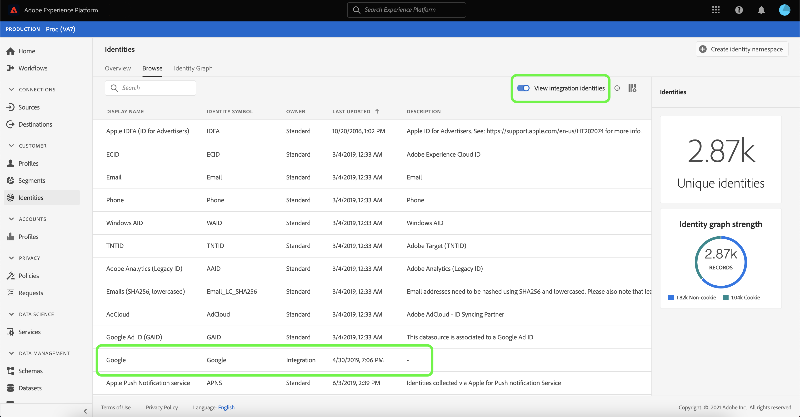

# ID 名前空間の概要

ID 名前空間は、 [[!DNL Identity Service]](./home.md) id が関連するコンテキストのインジケーターとして機能する 例えば、「name@email.com」の値を電子メールアドレスとして、または「443522」を数値 CRM ID として区別します。

## はじめに

ID 名前空間を使用するには、関連する様々な Adobe Experience Platform サービスについて理解している必要があります。名前空間の使用を開始する前に、次のサービスのドキュメントを確認してください。

- [[!DNL Real-Time Customer Profile]](../profile/home.md):複数のソースからの集計データに基づいて、統合された顧客プロファイルをリアルタイムで提供します。
- [[!DNL Identity Service]](./home.md):デバイスやシステム間で ID を結び付けることで、個々の顧客とその行動をより良く把握できます。
- [[!DNL Privacy Service]](../privacy-service/home.md):ID 名前空間は、EU 一般データ保護規則 (GDPR) などの法的プライバシー規制への準拠リクエストで使用されます。 各プライバシーリクエストは、影響を受ける消費者のデータを識別するために、名前空間に対しておこなわれます。

## ID 名前空間について

完全修飾 ID には、ID 値と名前空間が含まれます。プロファイルフラグメント間でレコードデータを一致させる場合、 [!DNL Real-Time Customer Profile] プロファイルデータの結合。id 値と名前空間の両方が一致する必要があります。

例えば、2 つのプロファイルフラグメントに異なるプライマリ ID が含まれていても、それらが「Email」名前空間で同じ値を共有している場合は、 [!DNL Platform] は、これらのフラグメントが実際には同じ個人であることを確認し、個人の ID グラフでデータを統合できます。

### ID タイプ {#identity-types}

>[!CONTEXTUALHELP]
>id="platform_identity_create_namespace"
>title="ID タイプを指定"
>abstract="ID タイプは、データを ID グラフに保存するかどうかを制御します。 人以外の識別子は保存されず、その他の ID タイプはすべて保存されます。"
>text="Learn more in documentation"

データは、複数の異なる ID タイプで識別できます。ID タイプは、ID 名前空間の作成時に指定されます。この ID タイプによって、データを ID グラフに保持するかどうか、およびそのデータの処理方法の手順が決まります。を除くすべての ID タイプ **人以外の識別子** 同じ動作に従って、名前空間とそれに対応する ID 値を id グラフクラスターにステッチします。 を使用する際に、データは結合されません **人以外の識別子**.

内では、次の ID タイプを使用できます [!DNL Platform]:

| ID タイプ | 説明 |
| --- | --- |
| cookie ID | cookie ID は Web ブラウザーを識別します。 この ID は拡張に不可欠で、ID グラフの大部分を占めます。ただし、cookie は、その性質上急速に劣化し、時間の経過と共にその価値が失われます。 |
| クロスデバイス ID | クロスデバイス ID は個人を識別し、通常は他の ID を結び付けます。 例えば、ログイン ID、CRM ID、ロイヤルティ ID などがあります。 これは～を示すものだ [!DNL Identity Service] を使用して、値を慎重に処理します。 |
| デバイス ID | デバイス ID は、IDFA(iPhoneとiPad)、GAID(Android)、RIDA(Roku) などのハードウェアデバイスを識別し、家庭内の複数のユーザーが共有できます。 |
| メールアドレス | 電子メールアドレスは多くの場合、1 人の人物に関連付けられているので、様々なチャネルをまたいでその人物を識別するために使用できます。 このタイプの ID には、個人を特定できる情報（PII）が含まれています。これは～を示すものだ [!DNL Identity Service] を使用して、値を慎重に処理します。 |
| 人以外の識別子 | 人以外の ID は、名前空間を必要とするが、人物クラスターに接続されていない ID の保存に使用されます。 例えば、製品 SKU、製品、組織、店舗に関連するデータなどです。 |
| 電話番号 | 電話番号は多くの場合、1 人の人物に関連付けられているので、様々なチャネルをまたいでその人物を識別するために使用できます。 このタイプの ID には PII が含まれます。これは～を示している [!DNL Identity Service] を使用して、値を慎重に処理します。 |

### 標準名前空間 {#standard}

 Experience Platform には、すべての組織で使用できる ID 名前空間が複数用意されています。これらは標準名前空間と呼ばれ、 [!DNL Identity Service] API または Platform UI を使用する。

次の標準名前空間は、 Platform 内のすべての組織で使用できます。

| 表示名 | 説明 |
| ------------ | ----------- |
| AdCloud | AdCloud を表すAdobe。 |
| Adobe Analytics（レガシー ID） | Adobe Analyticsを表す名前空間。 次のドキュメントを参照してください： [Adobe Analytics名前空間](https://experienceleague.adobe.com/docs/analytics/admin/data-governance/gdpr-namespaces.html?lang=en#namespaces) を参照してください。 |
| Apple IDFA （広告主の ID） | 広告主のApple ID を表す名前空間。 次のドキュメントを参照してください： [興味ベースの広告](https://support.apple.com/ja-jp/HT202074) を参照してください。 |
| Apple Push Notification service | Appleプッシュ通知サービスを使用して収集された ID を表す名前空間。 次のドキュメントを参照してください： [Apple Push Notification service](https://developer.apple.com/library/archive/documentation/NetworkingInternet/Conceptual/RemoteNotificationsPG/APNSOverview.html#//apple_ref/doc/uid/TP40008194-CH8-SW1) を参照してください。 |
| CORE | Adobe Audience Managerを表す名前空間。 この名前空間は、従来の名前でも参照できます。「Adobe AudienceManager」 次のドキュメントを参照してください： [Audience ManagerID](https://experienceleague.adobe.com/docs/audience-manager/user-guide/overview/data-privacy/data-privacy-reference/data-privacy-ids.html?lang=en#aam-ids) を参照してください。 |
| ECID | ECID を表す名前空間。 この名前空間は、次のエイリアスからも参照できます。&quot;Adobe Marketing Cloud ID&quot;、&quot;Adobe Experience Cloud ID&quot;、&quot;Adobe Experience Platform ID&quot;。 次のドキュメントを参照してください： [ECID](./ecid.md) を参照してください。 |
| メール | 電子メールアドレスを表す名前空間。 このタイプの名前空間は、多くの場合、1 人のユーザーに関連付けられているので、様々なチャネルをまたいでそのユーザーを識別するために使用できます。 |
| 電子メール（SHA256、小文字） | 事前にハッシュ化された電子メールアドレス用の名前空間。 この名前空間で指定された値は、SHA256 でハッシュする前に小文字に変換されます。 E メールアドレスを正規化する前に、先頭と末尾のスペースをトリミングする必要があります。 この設定を遡って変更することはできません。 次のドキュメントを参照してください： [SHA256 ハッシュサポート](https://experienceleague.adobe.com/docs/id-service/using/reference/hashing-support.html?lang=en#hashing-support) を参照してください。 |
| Firebase Cloud Messaging | プッシュ通知用にGoogle Firebase Cloud Messaging を使用して収集された ID を表す名前空間。 次のドキュメントを参照してください： [Google Firebase Cloud Messaging](https://firebase.google.com/docs/cloud-messaging) を参照してください。 |
| Google Ad ID (GAID) | Google Advertising ID を表す名前空間。 次のドキュメントを参照してください： [Google Advertising ID](https://support.google.com/googleplay/android-developer/answer/6048248?hl=en) を参照してください。 |
| Google Click ID | Google Click ID を表す名前空間。 次のドキュメントを参照してください： [Google Ads でのクリック追跡](https://developers.google.com/adwords/api/docs/guides/click-tracking) を参照してください。 |
| Phone | 電話番号を表す名前空間。 このタイプの名前空間は、多くの場合、1 人のユーザーに関連付けられているので、様々なチャネルをまたいでそのユーザーを識別するために使用できます。 |
| 電話 (E.164) | E.164 形式でハッシュ化する必要がある生の電話番号を表す名前空間。 E.164 形式には、プラス記号 (`+`)、国際電話番号、市外局番、電話番号。 例：`(+)(country code)(area code)(phone number)`。 |
| 電話 (SHA256) | SHA256 を使用してハッシュ化する必要がある電話番号を表す名前空間。 記号、文字、および先頭のゼロを削除する必要があります。 また、国呼び出しコードをプレフィックスとして追加する必要があります。 |
| 電話 (SHA256_E.164) | SHA256 形式と E.164 形式の両方を使用してハッシュ化する必要がある生の電話番号を表す名前空間です。 |
| TNTID | Adobe Targetを表す名前空間。 次のドキュメントを参照してください： [ターゲット](https://experienceleague.adobe.com/docs/target/using/target-home.html?lang=ja) 詳細情報を参照してください。 |
| Windows AID | Windows 広告 ID を表す名前空間。 次のドキュメントを参照してください： [Windows 広告 ID](https://docs.microsoft.com/en-us/uwp/api/windows.system.userprofile.advertisingmanager.advertisingid?view=winrt-19041) を参照してください。 |

### ID 名前空間の表示

UI で ID 名前空間を表示するには、「 **[!UICONTROL ID]** 左側のナビゲーションで「 」を選択し、 **[!UICONTROL 参照]**.

ID 名前空間のリストがページのメインインターフェイスに表示され、名前、ID 記号、最終更新日、および標準名前空間かカスタム名前空間かに関する情報が表示されます。 右側のレールには、 [!UICONTROL ID グラフの強さ].

また、Platform は、統合のための名前空間も提供します。 これらの名前空間は、他のシステムとの接続に使用され、ID のステッチには使用されないので、デフォルトでは非表示になっています。 統合名前空間を表示するには、「 **[!UICONTROL 統合 ID の表示]**.

リストから ID 名前空間を選択して、特定の名前空間に関する情報を表示します。 ID 名前空間を選択すると、右側のパネルの表示が更新され、取り込んだ ID の数や、失敗しスキップされたレコード数など、選択した ID 名前空間に関するメタデータが表示されます。

## カスタム名前空間の管理 {#manage-namespaces}

組織のデータや使用事例によっては、カスタム名前空間が必要な場合があります。カスタム名前空間は、 [[!DNL Identity Service]](./api/create-custom-namespace.md) API または UI を使用します。

UI を使用してカスタム名前空間を作成するには、 **[!UICONTROL ID]** ワークスペース、選択 **[!UICONTROL 参照]**&#x200B;を選択し、 **[!UICONTROL ID 名前空間を作成]**.

この **[!UICONTROL ID 名前空間を作成]** ダイアログボックスが表示されます。 一意の **[!UICONTROL 表示名]** および **[!UICONTROL ID シンボル]** 次に、作成する id タイプを選択します。 オプションで説明を追加して、名前空間に関する詳細情報を追加することもできます。 を除くすべての ID タイプ **人以外の識別子** では、同じステッチ動作に従います。 次を選択した場合、 **人以外の識別子** 名前空間を作成する際に id タイプとして、ステッチはおこなわれません。 各 ID タイプに関する詳細は、 [id タイプ](#identity-types).

完了したら、「**[!UICONTROL 作成]**」をクリックします。

>[!IMPORTANT]
>
>定義した名前空間は組織内で非公開で、正常に作成するには一意の ID 記号が必要です。

標準名前空間と同様に、 **[!UICONTROL 参照]** タブをクリックして、詳細を表示します。 ただし、カスタム名前空間では、詳細領域から表示名と説明を編集することもできます。

>[!NOTE]
>
>作成した名前空間は削除できず、ID 記号とタイプは変更できません。

## ID データの名前空間

ID の名前空間をどのように指定するかは、ID データの提供方法によって異なります。ID データの提供方法について詳しくは、「 overview」の [ID データの提供](./home.md#supplying-identity-data-to-identity-service)に関する節を参照してください。[!DNL Identity Service]

## 次の手順

これで、ID 名前空間の主要概念を理解したので、 [ID グラフビューア](./ui/identity-graph-viewer.md).
