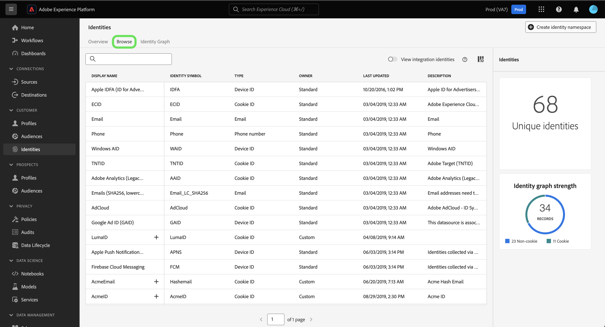

# ID 名前空間の概要

次のドキュメントを読んで、Adobe Experience Platform ID サービスの ID 名前空間でできることの詳細を学びます。

## はじめに

ID 名前空間では、様々なAdobe Experience Platformサービスに関する理解が必要です。 名前空間の使用を開始する前に、次のサービスのドキュメントを確認してください。

* [[!DNL Real-Time Customer Profile]](../profile/home.md)：複数のソースからの集計データに基づいて、統合された顧客プロファイルをリアルタイムで提供します。
* [[!DNL Identity Service]](./home.md)：デバイスやシステム間で ID を結び付けることで、個々の顧客とその行動をより良く把握します。
* [[!DNL Privacy Service]](../privacy-service/home.md):ID 名前空間は、EU 一般データ保護規則 (GDPR) などの法的プライバシー規制への準拠リクエストで使用されます。 各プライバシーリクエストは、影響を受ける消費者のデータを識別するために、名前空間に対しておこなわれます。

## ID 名前空間について

完全修飾 ID には、次の 2 つのコンポーネントが含まれます。 **ID 値** および **ID 名前空間**. 例えば、ID の値が `scott@acme.com`の場合、名前空間は電子メールアドレスと区別して、この値のコンテキストを提供します。 同様に、名前空間で `555-123-456` 電話番号として、および `3126ABC` を CRM ID として追加しました。 基本的には、 **名前空間は、特定の ID にコンテキストを提供します**. プロファイルフラグメント間でレコードデータを一致させる場合、 [!DNL Real-Time Customer Profile] プロファイルデータの結合。id 値と名前空間の両方が一致する必要があります。

例えば、2 つのプロファイルフラグメントに異なるプライマリ ID が含まれていても、それらが「E メール」名前空間で同じ値を共有している場合、Experience Platformは、これらのフラグメントが実際には同じ個人であることを確認し、個人の ID グラフでデータを統合できます。

### 名前空間のコンポーネント

名前空間は、次のコンポーネントで構成されます。

* **表示名**：特定の名前空間のわかりやすい名前。
* **ID シンボル**：名前空間を表すために ID サービスで内部的に使用されるコード。
* **ID タイプ**：特定の名前空間の分類。
* **説明**: （オプション）特定の名前空間に関して指定できる補足情報です。

### ID タイプ {#identity-type}

>[!CONTEXTUALHELP]
>id="platform_identity_create_namespace"
>title="ID タイプの指定"
>abstract="ID タイプは、データを ID グラフに保存するかどうかを制御します。ID グラフは、個人以外の ID とパートナー ID の ID タイプに対しては生成されません。"
>text="Learn more in documentation"

ID 名前空間の 1 つの要素は、 **ID タイプ**. ID タイプによって、次の要素が決まります。

* ID グラフを生成するかどうか：
   * ID グラフは、個人以外の ID とパートナー ID の ID タイプに対しては生成されません。
   * ID グラフは、その他すべての ID タイプに対して生成されます。
* システムの制限に達した場合に ID グラフから削除される ID。 詳しくは、 [ID データのガードレール](guardrails.md).

Experience Platform内では、次の ID タイプを使用できます。

| ID タイプ | 説明 |
| --- | --- |
| cookie ID | cookie ID は Web ブラウザーを識別します。 この ID は拡張に不可欠で、ID グラフの大部分を占めます。ただし、cookie は、その性質上急速に劣化し、時間の経過と共にその価値が失われます。 |
| クロスデバイス ID | クロスデバイス ID は個人を識別し、通常は他の ID を結び付けます。 例えば、ログイン ID、CRM ID、ロイヤルティ ID などがあります。 これは～を示すものだ [!DNL Identity Service] を使用して、値を慎重に処理します。 |
| デバイス ID | デバイス ID は、IDFA(iPhoneとiPad)、GAID(Android)、RIDA(Roku) などのハードウェアデバイスを識別し、家庭内の複数のユーザーが共有できます。 |
| メールアドレス | 電子メールアドレスは多くの場合、1 人の人物に関連付けられているので、様々なチャネルをまたいでその人物を識別するために使用できます。 このタイプの ID には、個人を特定できる情報（PII）が含まれています。これは～を示すものだ [!DNL Identity Service] を使用して、値を慎重に処理します。 |
| 人物以外の識別子 | 人以外の ID は、名前空間を必要とするが、人物クラスターに接続されていない ID の保存に使用されます。 例えば、製品 SKU、製品、組織、店舗に関連するデータなどです。 |
| パートナー ID | <ul><li>パートナー ID は、人物を表すためにデータパートナーが使用する識別子です。パートナー ID は、多くの場合、偽名であり、個人の真の ID を明らかにしないようにします。また、確率論的にも使用できます。 Real-time Customer Data Platformでは、パートナー ID は主に、ID グラフリンクの作成ではなく、拡張されたオーディエンスのアクティベーションとデータエンリッチメントに使用されます。</li><li>パートナー ID タイプとして指定された ID 名前空間を含む ID を取り込むと、ID グラフは生成されません。</li><li>パートナー ID の ID タイプを使用してパートナーデータを取り込まないと、ID サービスのシステムグラフの制限に達したり、不要なプロファイルの結合に至ったりする可能性があります。</li><ul> |
| 電話番号 | 電話番号は多くの場合、1 人の人物に関連付けられているので、様々なチャネルをまたいでその人物を識別するために使用できます。 このタイプの ID には PII が含まれます。これは～を示している [!DNL Identity Service] を使用して、値を慎重に処理します。 |

{style="table-layout:auto"}

### 標準名前空間 {#standard}

 Experience Platform には、すべての組織で使用できる ID 名前空間が複数用意されています。これらは標準名前空間と呼ばれ、 [!DNL Identity Service] API または Platform UI を使用する。

次の標準名前空間は、 Platform 内のすべての組織で使用できます。

| 表示名 | 説明 |
| ------------ | ----------- |
| AdCloud | AdobeAdCloud を表す名前空間。 |
| Adobe Analytics（レガシー ID） | Adobe Analyticsを表す名前空間。 次のドキュメントを参照してください： [Adobe Analytics名前空間](https://experienceleague.adobe.com/docs/analytics/admin/data-governance/gdpr-namespaces.html?lang=en#namespaces) を参照してください。 |
| Apple IDFA（広告主の ID） | 広告主の Apple ID を表す名前空間。詳しくは、[興味／関心に基づく広告](https://support.apple.com/ja-jp/HT202074)に関するドキュメントを参照してください。 |
| Apple Push Notification service | Appleプッシュ通知サービスを使用して収集された ID を表す名前空間。 次のドキュメントを参照してください： [Apple Push Notification service](https://developer.apple.com/library/archive/documentation/NetworkingInternet/Conceptual/RemoteNotificationsPG/APNSOverview.html#//apple_ref/doc/uid/TP40008194-CH8-SW1) を参照してください。 |
| CORE | Adobe Audience Managerを表す名前空間。 この名前空間は、従来の名前 (「Adobe AudienceManager」) でも参照できます。 次のドキュメントを参照してください： [Audience ManagerID](https://experienceleague.adobe.com/docs/audience-manager/user-guide/overview/data-privacy/data-privacy-reference/data-privacy-ids.html?lang=en#aam-ids) を参照してください。 |
| ECID | ECID を表す名前空間。 この名前空間は、「Adobe Marketing Cloud ID」、「Adobe Experience Cloud ID」、「Adobe Experience Platform ID」という別名で呼ばれることもあります。次のドキュメントを参照してください： [ECID](./ecid.md) を参照してください。 |
| メール | 電子メールアドレスを表す名前空間。 このタイプの名前空間は、多くの場合、1 人のユーザーに関連付けられているので、様々なチャネルをまたいでそのユーザーを識別するために使用できます。 |
| メール（SHA256、小文字） | 事前にハッシュされたメールアドレスの名前空間。この名前空間で指定された値は、小文字に変換されてから SHA256 でハッシュ化されます。メールアドレスを正規化する前に、先頭と末尾のスペースを削除する必要があります。 この設定を過去にさかのぼって変更することはできません。次のドキュメントを参照してください： [SHA256 ハッシュサポート](https://experienceleague.adobe.com/docs/id-service/using/reference/hashing-support.html?lang=ja#hashing-support) を参照してください。 |
| Firebase Cloud Messaging | プッシュ通知用にGoogle Firebase Cloud Messaging を使用して収集された ID を表す名前空間。 次のドキュメントを参照してください： [Google Firebase Cloud Messaging](https://firebase.google.com/docs/cloud-messaging) を参照してください。 |
| Google Ad ID (GAID) | Google 広告 ID を表す名前空間。詳しくは、[Google 広告 ID](https://support.google.com/googleplay/android-developer/answer/6048248?hl=ja) に関する次のドキュメントを参照してください。 |
| Google Click ID | Google Click ID を表す名前空間。 次のドキュメントを参照してください： [Google Ads でのクリック追跡](https://developers.google.com/adwords/api/docs/guides/click-tracking) を参照してください。 |
| Phone | 電話番号を表す名前空間。 このタイプの名前空間は、多くの場合、1 人のユーザーに関連付けられているので、様々なチャネルをまたいでそのユーザーを識別するために使用できます。 |
| 電話 (E.164) | E.164 形式でハッシュ化する必要がある生の電話番号を表す名前空間。 E.164 形式には、プラス記号 (`+`)、国際電話番号、市外局番、電話番号。 例：`(+)(country code)(area code)(phone number)`。 |
| 電話 (SHA256) | SHA256 を使用してハッシュ化する必要がある電話番号を表す名前空間。 記号、文字、および先頭のゼロを削除する必要があります。 また、国呼び出しコードをプレフィックスとして追加する必要があります。 |
| 電話（SHA256_E.164） | SHA256 形式と E.164 形式の両方を使用してハッシュする必要がある生の電話番号を表す名前空間。 |
| TNTID | Adobe Targetを表す名前空間。 次のドキュメントを参照してください： [Target](https://experienceleague.adobe.com/docs/target/using/target-home.html?lang=ja) を参照してください。 |
| Windows AID | Windows 広告 ID を表す名前空間。 次のドキュメントを参照してください： [Windows 広告 ID](https://docs.microsoft.com/en-us/uwp/api/windows.system.userprofile.advertisingmanager.advertisingid?view=winrt-19041) を参照してください。 |

### ID 名前空間の表示 {#view-identity-namespaces}

>[!CONTEXTUALHELP]
>id="platform_identity_view_integration_identities"
>title="統合 ID の表示"
>abstract="統合 ID は、他のシステムと連携するために使用される名前空間で、ID の解決や ID のつなぎ合わせには使用されません。  これらの ID は、デフォルトでは非表示です。統合された名前空間を表示するには、切替スイッチを使用します。"

UI で ID 名前空間を表示するには、「 **[!UICONTROL ID]** 左側のナビゲーションで「 」を選択し、 **[!UICONTROL 参照]**.

組織内の名前空間のディレクトリが表示され、名前、ID 記号、最終更新日、対応する ID タイプおよび説明に関する情報が表示されます。

## カスタム名前空間の作成 {#create-namespaces}

組織のデータや使用事例によっては、カスタム名前空間が必要な場合があります。カスタム名前空間は、 [[!DNL Identity Service]](./api/create-custom-namespace.md) API または UI を使用します。

カスタム名前空間を作成するには、「 **[!UICONTROL ID 名前空間を作成]**.

The [!UICONTROL ID 名前空間を作成] ウィンドウが表示されます。 まず、作成するカスタム名前空間の表示名と ID 記号を指定する必要があります。 オプションで、作成するカスタム名前空間に詳細なコンテキストを追加する説明を指定することもできます。

次に、カスタム名前空間に割り当てる ID タイプを選択します。 完了したら、「**[!UICONTROL 作成]**」をクリックします。

>[!IMPORTANT]
>
>* 定義した名前空間は組織内で非公開で、正常に作成するには一意の ID 記号が必要です。
>
>* 作成した名前空間は削除できず、ID 記号とタイプは変更できません。
>
>* 重複した名前空間はサポートされていません。 新しい名前空間を作成する際に、既存の表示名と ID 記号を使用することはできません。

## ID データの名前空間

ID の名前空間をどのように指定するかは、ID データの提供方法によって異なります。ID データの提供方法について詳しくは、「 overview」の [ID データの提供](./home.md#supplying-identity-data-to-identity-service)に関する節を参照してください。[!DNL Identity Service]

## 次の手順

これで、ID 名前空間の主要概念を理解したので、 [ID グラフビューア](./ui/identity-graph-viewer.md).
