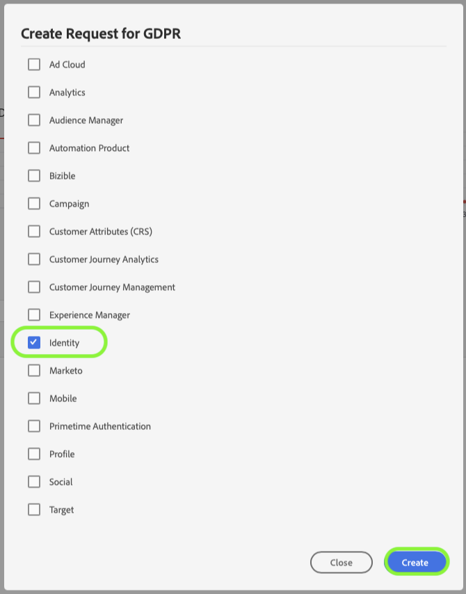

# [!DNL Identity Service] でのプライバシーリクエストの処理

Adobe Experience Platform [!DNL Privacy Service] は、EU 一般データ保護規則（GDPR）や [!DNL California Consumer Privacy Act]（CCPA）などのプライバシー規制に従って、個人データへのアクセス、販売のオプトアウト、または削除を求める顧客のリクエストを処理します。

このドキュメントでは、Adobe Experience Platform における [!DNL Identity Service] のプライバシーリクエスト処理に関する基本的な概念について説明します。

>[!NOTE]
>
>このガイドでは、Experience Platform の ID データストアに対してプライバシーリクエストを行う方法についてのみ説明します。また、Platform データレイクに対してプライバシーリクエストをおこなう予定の場合、または [!DNL Real-Time Customer Profile]( [データレイクでのプライバシーリクエストの処理](../catalog/privacy.md) そして [プロファイルのプライバシーリクエストの処理](../profile/privacy.md) を追加しました。
>
>他の Adobe Experience Cloud アプリケーションにプライバシーリクエストを送信する手順については、[Privacy Service のドキュメント](../privacy-service/experience-cloud-apps.md)を参照してください。

## はじめに

このガイドを読む前に、次の [!DNL Experience Platform] サービスに関する十分な理解を得ることをお勧めします。

* [[!DNL Privacy Service]](../privacy-service/home.md) ：Adobe Experience Cloud アプリケーションをまたいで、自身の個人データのアクセス、販売のオプトアウト、または削除に対する顧客リクエストを管理します。
* [[!DNL Identity Service]](../identity-service/home.md)：デバイスやシステムをまたいで ID を結び付けることで、顧客体験データの断片化によって発生する根本的な課題を解決します。
* [[!DNL Real-Time Customer Profile]](home.md)：複数のソースからの集計データに基づいて、統合されたリアルタイムの顧客プロファイルを提供します。

## ID 名前空間について {#namespaces}

Adobe Experience Platform [!DNL Identity Service] は、システムやデバイスをまたいで顧客 ID データを結び付けます。[!DNL Identity Service] は **ID 名前空間**&#x200B;を使用して、ID の値を元のシステムと関連付け、それらの値を識別するコンテキストを提供します。名前空間は、電子メールアドレス（「電子メール」）などの一般的な概念を表すことがあります。また、ID を特定のアプリケーション（Adobe Advertising Cloud ID（「AdCloud」）や Adobe Target ID（「TNTID」）など）に関連付けることができます。

ID サービスは、グローバルに定義された（標準）ID およびユーザー定義の（カスタム）ID 名前空間を保持します。標準の名前空間はすべての組織（「電子メール」や「ECID」など）で使用できますが、組織は、特定のニーズに合わせてカスタム名前空間を作成することもできます。

[!DNL Experience Platform] の ID 名前空間について詳しくは、 [ID 名前空間の概要](../identity-service/namespaces.md)を参照してください。

## リクエストの送信 {#submit}

以下のセクションでは、[!DNL Privacy Service] の API または UI を使用して [!DNL Identity Service] に対しプライバシーリクエストを行う方法について概説しています。これらのセクションを読む前に、リクエストペイロードでユーザーデータを適切にフォーマットする方法など、プライバシージョブの送信方法に関する詳細な手順を確認するために、[Privacy Service API](../privacy-service/api/getting-started.md) または [Privacy Service UI](../privacy-service/ui/overview.md) のドキュメントを参照することを強くお勧めします。

### API の使用

API でジョブリクエストを作成する際は、`userIDs` 内で指定するいずれの ID に対しても固有の `namespace` および `type` を使用する必要があります。[!DNL Identity Service] によって認識される有効な [ID 名前空間](#namespaces) を `namespace` 値に指定する必要があり、`type` には、`standard` または `unregistered` のいずれかを（標準名前空間とカスタム名前空間のそれぞれに応じて）指定する必要があります。

さらに、リクエストペイロードの `include` 配列には、リクエスト対象である別のデータストアの製品値を含める必要があります。[!DNL Identity] に対してリクエストをする場合は、配列に `Identity` 値を含める必要があります。

次のリクエストは、1 件の顧客データについて、GDPR に適合した新しいプライバシージョブを [!DNL Identity] ストアに作成します。顧客の `userIDs` 配列に 2 つの ID 値が指定されています。1 つは標準の `Email` ID 名前空間、もう 1 つは `ECID` 名前空間を使用しています。また、[!DNL Identity]（`Identity`）の製品値が `include` 配列に含まれています。

>[!TIP]
>
>API を使用してカスタム名前空間を削除する場合は、表示名の代わりに ID 記号を名前空間として指定する必要があります。

```shell
curl -X POST \
  https://platform.adobe.io/data/core/privacy/jobs \
  -H 'Authorization: Bearer <key>' \
  -H 'Content-Type: application/json' \
  -H 'x-api-key: acp_privacy_ui_gdpr' \
  -H 'x-gw-ims-org-id: sample@AdobeOrg' \
  -d '{
    "companyContexts": [
      {
        "namespace": "imsOrgID",
        "value": "sample@AdobeOrg"
      }
    ],
    "users": [
      {
        "key": "bob",
        "action": ["delete"],
        "userIDs": [
          {
            "namespace": "email",
            "value": "bob@adobe.com",
            "type": "standard"
          },
          {
            "namespace": "ECID",
            "type": "standard",
            "value":  "123451234512345123451234512345",
            "isDeletedClientSide": false
          }
        ]
      }
    ],
    "include": ["Identity"],
    "regulation": "gdpr"
}'
```

### UI の使用

>[!TIP]
>
>UI を使用してカスタム名前空間を削除する場合は、表示名ではなく ID 記号を名前空間として指定する必要があります。さらに、非実稼動サンドボックス用 UI では、カスタム名前空間を削除できません。

UI でジョブリクエストを作成する場合は、[!DNL Identity Service] に保存されたデータのジョブを処理するために、必ず&#x200B;**[!UICONTROL 製品]**&#x200B;の下にある **[!UICONTROL ID]** を選択します。



## リクエスト処理の削除

[!DNL Experience Platform] が [!DNL Privacy Service] から削除リクエストを受信すると、[!DNL Platform] は、[!DNL Privacy Service] に対し、リクエストを受信し、影響を受けるデータが削除用にマークされている旨の確認を送信します。各 ID の削除は、指定した名前空間または ID の値に基づいて行われます。 さらに、指定した組織に関連付けられているすべてのサンドボックスに対して削除が行われます。

リアルタイム顧客プロファイル (`ProfileService`) とデータレイク (`aepDataLake`) を ID サービス (`identity`) の場合、id に関連する様々なデータセットが、次のように異なるタイミングでシステムから削除されます。

| 含まれる製品 | エフェクト |
| --- | --- |
| `identity` のみ | 指定された ID は、削除リクエストを受け取ったことを示す確認メッセージが Platform から送信されるとすぐに削除されます。 その ID グラフから構築されたプロファイルは、引き続き残りますが、ID 関連付けが削除されたので、新しいデータが取り込まれるたびに更新されません。 プロファイルに関連付けられたデータも、データレイクに残ります。 |
| `identity` および `ProfileService` | 指定された ID は、削除リクエストを受け取ったことを示す確認メッセージが Platform から送信されるとすぐに削除されます。 プロファイルに関連付けられたデータは、データレイクに残ります。 |
| `identity` および `aepDataLake` | 指定された ID は、削除リクエストを受け取ったことを示す確認メッセージが Platform から送信されるとすぐに削除されます。 その ID グラフから構築されたプロファイルは、引き続き残りますが、ID 関連付けが削除されたので、新しいデータが取り込まれるたびに更新されません。<br><br>データレイク製品が要求を受信し、現在処理中であることを応答すると、プロファイルに関連付けられたデータはソフト削除されるので、誰もがアクセスできません [!DNL Platform] サービス。 ジョブが完了すると、データはデータレイクから完全に削除されます。 |
| `identity`, `ProfileService`, および `aepDataLake` | 指定された ID は、削除リクエストを受け取ったことを示す確認メッセージが Platform から送信されるとすぐに削除されます。<br><br>データレイク製品が要求を受信し、現在処理中であることを応答すると、プロファイルに関連付けられたデータはソフト削除されるので、誰もがアクセスできません [!DNL Platform] サービス。 ジョブが完了すると、データはデータレイクから完全に削除されます。 |

詳しくは、 [[!DNL Privacy Service] ドキュメント](../privacy-service/home.md#monitor) を参照してください。

## 次の手順

このドキュメントでは、[!DNL Identity Service] におけるプライバシーリクエストの処理に関する重要な概念について説明します。他の [!DNL Experience Cloud] アプリケーションにおけるプライバシーリクエストの処理について詳しくは、[[!DNL Privacy Service] and [!DNL Experience Cloud]  アプリケーション](../privacy-service/experience-cloud-apps.md)のドキュメントを参照してください。
