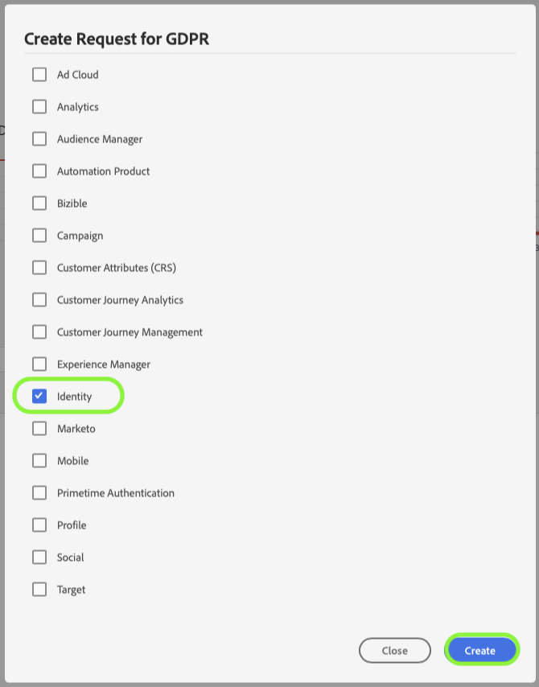

# [!DNL Identity Service] でのプライバシーリクエストの処理

Adobe Experience Platform [!DNL Privacy Service] は、EU 一般データ保護規則（GDPR）や [!DNL California Consumer Privacy Act]（CCPA）などのプライバシー規制に従って、個人データへのアクセス、販売のオプトアウト、または削除を求める顧客のリクエストを処理します。

このドキュメントでは、Adobe Experience Platform における [!DNL Identity Service] のプライバシーリクエスト処理に関する基本的な概念について説明します。

>[!NOTE]
>
>このガイドでは、Experience Platform の ID データストアに対してプライバシーリクエストを行う方法についてのみ説明します。Experience Platform データレイクまたは[!DNL Real-Time Customer Profile]に対してもプライバシーリクエストを行う予定がある場合は、このチュートリアルに加えて、[ データレイクでのプライバシーリクエスト処理](../catalog/privacy.md)に関するガイドおよび[ プロファイル ](../profile/privacy.md)のプライバシーリクエスト処理に関するガイドを参照してください。
>
>他の Adobe Experience Cloud アプリケーションにプライバシーリクエストを送信する手順については、[Privacy Service のドキュメント](../privacy-service/experience-cloud-apps.md)を参照してください。

## はじめに

このガイドを読む前に、次の [!DNL Experience Platform] サービスに関する十分な理解を得ることをお勧めします。

* [[!DNL Privacy Service]](../privacy-service/home.md) ：Adobe Experience Cloud アプリケーションをまたいで、自身の個人データのアクセス、販売のオプトアウト、または削除に対する顧客リクエストを管理します。
* [[!DNL Identity Service]](../identity-service/home.md)：デバイスやシステムをまたいで ID を結び付けることで、顧客体験データの断片化によって発生する根本的な課題を解決します。
* [[!DNL Real-Time Customer Profile]](home.md)：複数のソースからの集計データに基づいて、統合されたリアルタイムの顧客プロファイルを提供します。

## ID 名前空間について {#namespaces}

Adobe Experience Platform [!DNL Identity Service] は、システムやデバイスをまたいで顧客 ID データを結び付けます。[!DNL Identity Service] は **ID 名前空間**&#x200B;を使用して、ID の値を元のシステムと関連付け、それらの値を識別するコンテキストを提供します。名前空間は、電子メールアドレス（「電子メール」）などの一般的な概念を表したり、IDをAdobe Advertising IDやAdobe Target IDなどの特定のアプリケーションに関連付けたりできます。

ID サービスは、グローバルに定義された（標準）ID およびユーザー定義の（カスタム）ID 名前空間を保持します。標準の名前空間はすべての組織（「電子メール」や「ECID」など）で使用できますが、組織は、特定のニーズに合わせてカスタム名前空間を作成することもできます。

[!DNL Experience Platform] の ID 名前空間について詳しくは、 [ID 名前空間の概要](../identity-service/features/namespaces.md)を参照してください。

## リクエストの送信 {#submit}

以下のセクションでは、[!DNL Privacy Service] の API または UI を使用して [!DNL Identity Service] に対しプライバシーリクエストを行う方法について概説しています。これらのセクションを読む前に、リクエストペイロードでユーザーデータを適切にフォーマットする方法など、プライバシージョブの送信方法に関する詳細な手順を確認するために、[Privacy Service API](../privacy-service/api/getting-started.md) または [Privacy Service UI](../privacy-service/ui/overview.md) のドキュメントを参照することを強くお勧めします。

### API の使用

APIでジョブリクエストを作成する場合、ユーザーID内で指定されたIDは、特定の名前空間とタイプを使用する必要があります。 ID サービスで認識される有効なID名前空間を、名前空間値に指定する必要があります。 標準の名前空間には`standard`を使用し、カスタム名前空間には`custom`を使用します。

さらに、リクエストペイロードの `include` 配列には、リクエスト対象である別のデータストアの製品値を含める必要があります。[!DNL Identity] に対してリクエストをする場合は、配列に `Identity` 値を含める必要があります。

次のリクエストは、1 件の顧客データについて、GDPR に適合した新しいプライバシージョブを [!DNL Identity] ストアに作成します。顧客の `userIDs` 配列に 2 つの ID 値が指定されています。1 つは標準の `Email` ID 名前空間、もう 1 つは `ECID` 名前空間を使用しています。また、[!DNL Identity]（`Identity`）の製品値が `include` 配列に含まれています。

>[!TIP]
>
>GDPR削除を使用してIDを削除する場合は、表示名ではなく名前空間としてID記号を指定する必要があります。

```shell
curl -X POST \
  https://platform.adobe.io/data/core/privacy/jobs \
  -H 'Authorization: Bearer <key>' \
  -H 'Content-Type: application/json' \
  -H 'x-api-key: acp_privacy_ui_gdpr' \
  -H 'x-gw-ims-org-id: sample@AdobeOrg' \
  -d '{
    "companyContexts": [
      {
        "namespace": "imsOrgID",
        "value": "sample@AdobeOrg"
      }
    ],
    "users": [
      {
        "key": "bob",
        "action": ["delete"],
        "userIDs": [
          {
            "namespace": "email",
            "value": "bob@adobe.com",
            "type": "standard"
          },
          {
            "namespace": "ECID",
            "type": "standard",
            "value":  "123451234512345123451234512345",
            "isDeletedClientSide": false
          }
        ]
      }
    ],
    "include": ["Identity"],
    "regulation": "gdpr"
}'
```

### UI の使用

>[!TIP]
>
>GDPR削除を使用してIDを削除する場合は、表示名ではなく名前空間としてID記号を指定する必要があります。

UIでジョブリクエストを作成する際は、**[!UICONTROL Identity]**&#x200B;に保存されているデータのジョブを処理するために、**[!UICONTROL Products]**&#x200B;の下の[!DNL Identity Service]を必ず選択してください。



## リクエスト処理の削除

[!DNL Experience Platform] が [!DNL Privacy Service] から削除リクエストを受信すると、[!DNL Experience Platform] は、[!DNL Privacy Service] に対し、リクエストを受信し、影響を受けるデータが削除用にマークされている旨の確認を送信します。各 ID の削除は、指定した名前空間または ID の値に基づいて行われます。 さらに、削除は、特定の組織に関連付けられたすべてのサンドボックスに対して行われます。

Real-Time Customer Profile （`ProfileService`）とデータレイク （`aepDataLake`）をID サービスのプライバシーリクエスト （`identity`）の製品として含めるかどうかに応じて、IDに関連する異なるデータセットがシステムから削除される可能性があります。

| 含まれている製品 | 効果 |
| --- | --- |
| `identity`のみ | 指定されたIDは、Experience Platformが削除リクエストを受信したことを確認するメッセージを送信するとすぐに削除されます。 そのID グラフから構築されたプロファイルは残りますが、IDの関連付けが削除されたので、新しいデータが取り込まれても更新されません。 プロファイルに関連付けられたデータもデータレイクに残ります。 |
| `identity` および `ProfileService` | 指定されたIDは、Experience Platformが削除リクエストを受信したことを確認するメッセージを送信するとすぐに削除されます。 プロファイルに関連付けられたデータはデータレイクに残ります。 |
| `identity` および `aepDataLake` | 指定されたIDは、Experience Platformが削除リクエストを受信したことを確認するメッセージを送信するとすぐに削除されます。 そのID グラフから構築されたプロファイルは残りますが、IDの関連付けが削除されたので、新しいデータが取り込まれても更新されません。<br><br> データレイク製品がリクエストを受信し、現在処理中であると応答した場合、プロファイルに関連付けられたデータはソフト削除されるため、[!DNL Experience Platform] サービスからはアクセスできません。 ジョブが完了すると、データはデータレイクから完全に削除されます。 |
| `identity`、`ProfileService`、`aepDataLake` | 指定されたIDは、Experience Platformが削除リクエストを受信したことを確認するメッセージを送信するとすぐに削除されます。<br><br> データレイク製品がリクエストを受信し、現在処理中であると応答した場合、プロファイルに関連付けられたデータはソフト削除されるため、[!DNL Experience Platform] サービスからはアクセスできません。 ジョブが完了すると、データはデータレイクから完全に削除されます。 |

ジョブのステータスのトラッキングについて詳しくは、[[!DNL Privacy Service]  ドキュメント ](../privacy-service/home.md#monitor)を参照してください。

## 次の手順

このドキュメントでは、[!DNL Identity Service] におけるプライバシーリクエストの処理に関する重要な概念について説明します。他の[!DNL Experience Cloud] アプリケーションのプライバシー要求の処理について詳しくは、[[!DNL Privacy Service] および [!DNL Experience Cloud]  アプリケーション ](../privacy-service/experience-cloud-apps.md)のドキュメントを参照してください。
