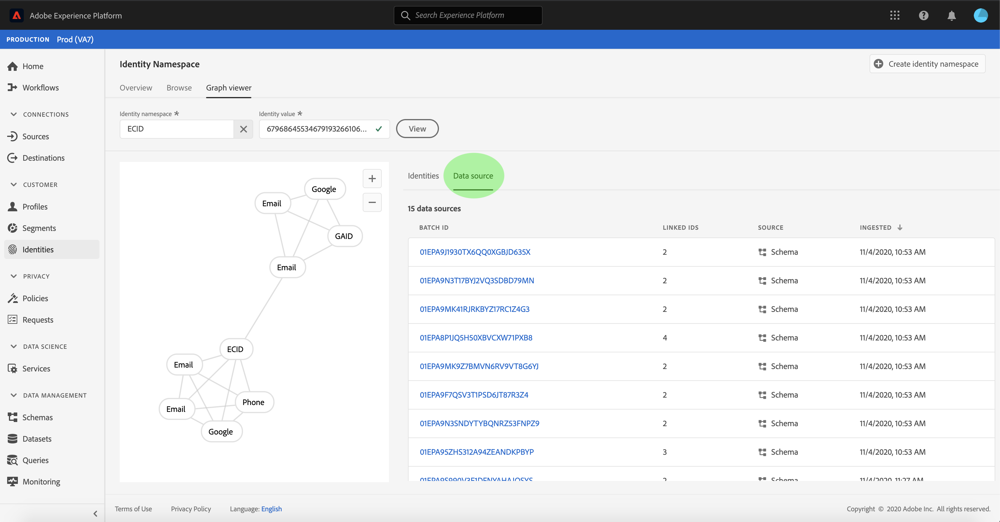

# IDグラフビューアの概要

アイデンティティグラフは、特定の顧客の異なるアイデンティティ間の関係を示すマップです。異なるチャネル間での顧客のブランドとの相互作用を視覚的に示します。 すべての顧客IDグラフは、顧客のアクティビティに応じて、ほぼリアルタイムでAdobe Experience Platform・アイデンティティ・サービスによって管理および更新されます。

プラットフォームユーザーインターフェイスのIDグラフビューアを使用すると、顧客IDが繋ぎ合わされているのを視覚化し、より深く理解できます。 ビューアを使用すると、グラフの様々な部分をドラッグ&amp;操作でき、複雑な同一性の関係を調べたり、デバッグをより効率的に行ったり、情報の利用方法に関する透明性を高めることができます。

## チュートリアルビデオ

次のビデオは、IDグラフビューアを理解していることを目的としています。

>[!VIDEO](https://video.tv.adobe.com/v/331030/?quality=12&learn=on)

## はじめに

IDグラフビューアを使用するには、関連する様々なAdobe Experience Platformのサービスについて理解する必要があります。 IDグラフビューアの操作を開始する前に、次のサービスのドキュメントを確認してください。

- [[!DNL Identity Service]](../home.md):デバイスとシステム間でIDをブリッジ化することで、個々の顧客とその行動をより良く表示できます。

### 用語

- **ID（ノード）:ID** またはノードは、エンティティに固有のデータ（通常は個人）です。IDは、名前空間とIDの値で構成されます。
- **リンク（エッジ）:** リンクまたはエッジは、ID間の接続を表します。
- **グラフ（クラスター）：グラフ** またはクラスターは、個人を表すIDとリンクのグループです。

## IDグラフビューアにアクセスする

IDグラフビューアをUIで使用するには、左側のナビゲーションで「**[!UICONTROL ID]**」を選択し、「**[!UICONTROL IDグラフ]**」タブを選択します。 **[!UICONTROL ID名前空間]**&#x200B;画面で、**[!UICONTROL ID名前空間]**&#x200B;を選択アイコンをクリックし、使用する名前空間を検索します。

「**[!UICONTROL ID名前空間を選択]**」パネルが表示されます。 この画面には、名前空間の&#x200B;**[!UICONTROL 表示名]**、**[!UICONTROL ID記号]**、**[!UICONTROL 所有者]**、**[!UICONTROL 最終更新日]**、**[!UICONTROL 説明]**&#x200B;に関する情報など、組織が利用できる名前空間のリストが含まれます。 有効なID値が接続されている限り、指定された任意の名前空間を使用できます。

使用する名前空間を選択し、「****」をクリックして次に進みます。

名前空間を選択したら、「**[!UICONTROL ID値]**」テキストボックスに特定の顧客に対応する値を入力し、「**[!UICONTROL 表示]**」を選択します。

### データセットからIDグラフビューアにアクセスする

また、データセットインターフェイスを使用してIDグラフビューアにアクセスすることもできます。 データセット[!UICONTROL 参照]ページで、対話操作するデータセットを選択し、**[!UICONTROL プレビューデータセット]**&#x200B;を選択します

プレビューーウィンドウで指紋アイコンを選択し、IDグラフビューアで表されるIDを確認します。

>[!TIP]
>
>指紋アイコンは、データセットに複数のIDが存在する場合にのみ表示されます。

IDグラフビューアが表示されます。 画面の左側には、選択した名前空間にリンクされているすべてのIDと入力したID値が表示されるIDグラフが表示されます。 各IDノードは、名前空間と対応するID値で構成されます。 任意のIDを選択したままにして、グラフをドラッグ&amp;操作できます。 IDの上にマウスポインターを置いて、ID値に関する情報を表示することもできます。 グラフの出力は、画面の中央に表示されるリストとしても表示されます。

>[!IMPORTANT]
>
>IDグラフを生成するには、2つ以上のリンクされたIDと、有効な名前空間とIDのペアが必要です。 グラフビューアで表示できるIDの最大数は150です。 詳しくは、下の[付録](#appendix)を参照してください。

**[!UICONTROL ID]**&#x200B;テーブルで強調表示された行を更新し、右側のレールに表示される情報を更新するIDを選択します。IDには、**[!UICONTROL 値]**、**[!UICONTROL バッチID]**&#x200B;および&#x200B;**[!UICONTROL 最終更新]**&#x200B;日が含まれます。

グラフ内でフィルターを適用し、**[!UICONTROL ID]**&#x200B;テーブルの上部にある並べ替えオプションを使用して、特定の名前空間を分離できます。 ドロップダウンメニューで、ハイライトする名前空間を選択します。

グラフビューアに戻り、選択した名前空間がハイライト表示されます。 また、フィルターオプションは、選択した名前空間の情報のみを返すように&#x200B;**[!UICONTROL ID]**&#x200B;テーブルを更新します。

グラフビューアボックスの右上には、倍率に関するオプションが表示されます。 **(+)**&#x200B;アイコンを選択してグラフにズームインするか、**(-)**&#x200B;アイコンを選択してズームアウトします。

バッチの詳細を表示するには、ヘッダーから&#x200B;**[!UICONTROL データソース]**&#x200B;を選択します。 **[!UICONTROL データソース]**&#x200B;テーブルには、グラフに関連付けられた&#x200B;**[!UICONTROL バッチID]**&#x200B;のリストと、**[!UICONTROL リンクされたID]**、ソーススキーマ、取り込み日が表示されます。

アイデンティティ・グラフ内の任意のリンクを選択して、そのリンクに貢献したすべてのソース・バッチを表示できます。

または、1つのバッチを選択して、このバッチが寄与したすべてのリンクを表示することもできます。

IDグラフは、IDグラフビューアからもアクセスできます。

## 付録

次の節では、IDグラフビューアの操作に関する追加情報を示します。

### エラーメッセージについて

IDグラフビューアにアクセスするとエラーが発生する場合があります。 IDグラフビューアを操作する場合の前提条件と制限のリストを次に示します。

- 選択した名前空間にID値が存在する必要があります。
- IDグラフビューアを生成するには、少なくとも2つのIDがリンクされている必要があります。 ID値は1つだけで、IDはリンクされていない可能性があります。この場合、値は[!DNL Profile]ビューアにのみ存在します。
- IDグラフビューアは、IDの上限を150個にする必要があります。

## 次の手順

このドキュメントを読むことで、Platform UIで顧客のIDグラフを表示する方法を学びました。 プラットフォームのIDの詳細については、[IDサービスの概要](../home.md)を参照してください。

## Changelog

| Date | アクション |
| ---- | ------ |
| 2021-01 | <ul><li>取り込んだデータと実稼働以外のサンドボックスのストリーミングのサポートを追加しました。</li><li>マイナーな問題を修正しました。</li></ul> |
| 2021-02 | <ul><li>IDグラフビューアは、データセットプレビューを通じてアクセスできます。</li><li>マイナーな問題を修正しました。</li><li>IDグラフビューアは「一般」に設定されています。</li></ul> |
