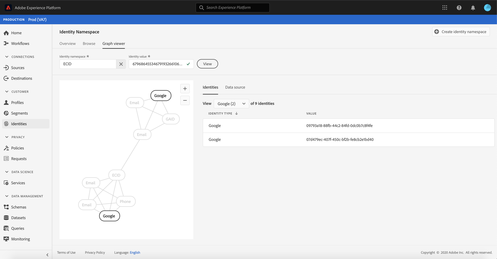

# ID グラフビューアの概要

ID グラフは、特定の顧客の異なる ID 間の関係のマップで、顧客が様々なチャネルを通じてブランドとどのようにやり取りするかを視覚的に示します。 すべての顧客 ID グラフは、顧客のアクティビティに応じて、Adobe Experience Platform ID サービスによってほぼリアルタイムで一括管理および更新されます。

Platform ユーザーインターフェイスの ID グラフビューアを使用すると、顧客 ID が結び付けられる方法とその方法を視覚化し、より深く理解できます。 このビューアを使用すると、グラフの様々な部分をドラッグおよび操作でき、ID 間の複雑な関係を調べたり、デバッグをより効率的に実行したり、情報の利用方法に関する透明性を高めたりできます。

## チュートリアルビデオ

次のビデオは、ID グラフビューアに関する理解を深めるためのものです。

>[!VIDEO](https://video.tv.adobe.com/v/331030/?quality=12&learn=on)

## はじめに

ID グラフビューアを使用するには、関連する様々なAdobe Experience Platformサービスについて理解している必要があります。 ID グラフビューアの操作を開始する前に、次のサービスのドキュメントを確認してください。

- [[!DNL Identity Service]](../home.md):デバイスやシステム間で ID を結び付けることで、個々の顧客とその行動をより良く把握できます。

### 用語

- **ID （ノード）:** ID またはノードは、エンティティ（通常は個人）に固有のデータです。 ID は、名前空間と ID 値で構成されます。
- **リンク（エッジ）:** リンクまたはエッジは、ID 間の接続を表します。
- **グラフ（クラスター）:** グラフまたはクラスターは、個人を表す ID とリンクのグループです。

## ID グラフビューアへのアクセス {#access-identity-graph-viewer}

UI で ID グラフビューアを使用するには、「 」を選択します。 **[!UICONTROL ID]** 左側のナビゲーションで、 **[!UICONTROL ID グラフ]** タブをクリックします。 次の **[!UICONTROL ID 名前空間]** 画面で、 **[!UICONTROL ID 名前空間を選択]** アイコンを使用して、使用する名前空間を検索します。

この **[!UICONTROL ID 名前空間を選択]** パネルが表示されます。 この画面には、組織で使用可能な名前空間のリストが含まれています。名前空間の **[!UICONTROL 表示名]**, **[!UICONTROL ID シンボル]**, **[!UICONTROL 所有者]**, **[!UICONTROL 最終更新日]** 日付、および **[!UICONTROL 説明]**. 有効な ID 値が接続されている限り、提供された任意の名前空間を使用できます。

使用する名前空間を選択し、「 **[!UICONTROL 選択]** をクリックして続行します。

名前空間を選択したら、特定の顧客に対応する値を **[!UICONTROL ID 値]** テキストボックスを選択し、 **[!UICONTROL 表示]**.

### データセットから ID グラフビューアにアクセスする

データセットインターフェイスを使用して、 ID グラフビューアにアクセスすることもできます。 データセットから [!UICONTROL 参照] ページで、操作するデータセットを選択し、「 」を選択します **[!UICONTROL データセットをプレビュー]**

プレビューウィンドウでフィンガープリントアイコンを選択し、ID グラフビューアで表される ID を確認します。

>[!TIP]
>
>データセットに 2 つ以上の ID がある場合にのみ、フィンガープリントアイコンが表示されます。

ID グラフビューアが表示されます。 画面の左側には、選択した名前空間にリンクされているすべての ID と、入力した ID 値が表示される ID グラフが表示されます。 各 ID ノードは、名前空間と、それに対応する ID 値で構成されます。 任意の ID を選択したままにして、グラフをドラッグし、操作できます。 または、ID の上にマウスポインターを置くと、その ID 値に関する情報が表示されます。 また、グラフ出力は、画面の中央にテーブルリストとして表示されます。

>[!IMPORTANT]
>
>ID グラフは、生成するために少なくとも 2 つのリンクされた ID と、有効な名前空間と ID のペアが必要です。 グラフビューアに表示できる ID の最大数は 150 です。 詳しくは、 [付録](#appendix) 詳しくは、以下の節を参照してください。

ID を選択して、 **[!UICONTROL ID]** 表と、ID の **[!UICONTROL 値]**, **[!UICONTROL バッチ ID]**、および **[!UICONTROL 最終更新日]** 日付。

グラフでフィルタリングし、 **[!UICONTROL ID]** 表。 ドロップダウンメニューから、ハイライト表示する名前空間を選択します。

選択した名前空間をハイライト表示して、グラフビューアが返します。 フィルターオプションを使用すると、 **[!UICONTROL ID]** テーブルを使用して、選択した名前空間の情報のみを返します。

グラフビューアボックスの右上には、拡大のオプションがあります。 を選択します。 **(+)** アイコンを使用してグラフにズームインするか、 **(-)** アイコンをクリックしてズームアウトします。

バッチに関する詳細を表示するには、 **[!UICONTROL データソース]** をヘッダーから削除します。 この **[!UICONTROL データソース]** テーブルには、 **[!UICONTROL バッチ ID]** グラフとその関連 **[!UICONTROL リンクされた ID]**、ソーススキーマ、取り込み日。

ID グラフ内の任意のリンクを選択して、リンクに貢献したすべてのソースバッチを表示できます。

または、1 つのバッチを選択して、このバッチが貢献したすべてのリンクを表示することもできます。

ID の大きなクラスターを持つ ID グラフも、ID グラフビューアからアクセスできます。

## 付録

次の節では、ID グラフビューアの操作に関する追加情報を示します。

### エラーメッセージについて

ID グラフビューアにアクセスする際にエラーが発生する場合があります。 次に、ID グラフビューアを使用する際に注意すべき前提条件と制限事項の一覧を示します。

- 選択した名前空間に ID 値が存在する必要があります。
- ID グラフビューアで生成するには、少なくとも 2 つのリンクされた ID が必要です。 ID 値が 1 つだけで、リンクされた ID がない可能性があり、この場合、値は [!DNL Profile] 閲覧者
- ID グラフビューアは、最大 150 個の ID を超えることはできません。

## 次の手順

このドキュメントでは、Platform UI で顧客の ID グラフを参照する方法を学びました。 Platform の ID について詳しくは、 [ID サービスの概要](../home.md)

## 変更ログ

| 日付 | アクション |
| ---- | ------ |
| 2021-01 | <ul><li>取り込まれたデータのストリーミングと実稼動以外のサンドボックスのサポートが追加されました。</li><li>マイナーな問題を修正しました。</li></ul> |
| 2021-02 | <ul><li>ID グラフビューアは、データセットのプレビューを通じてアクセスできます。</li><li>マイナーな問題を修正しました。</li><li>ID グラフビューアは一般に利用可能になりました。</li></ul> |
