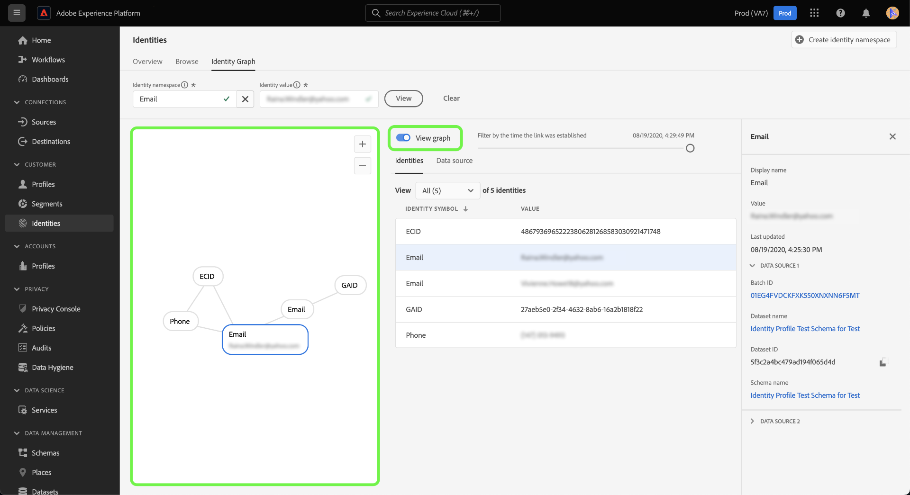
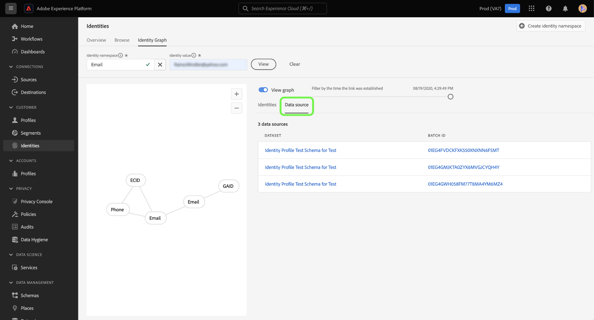
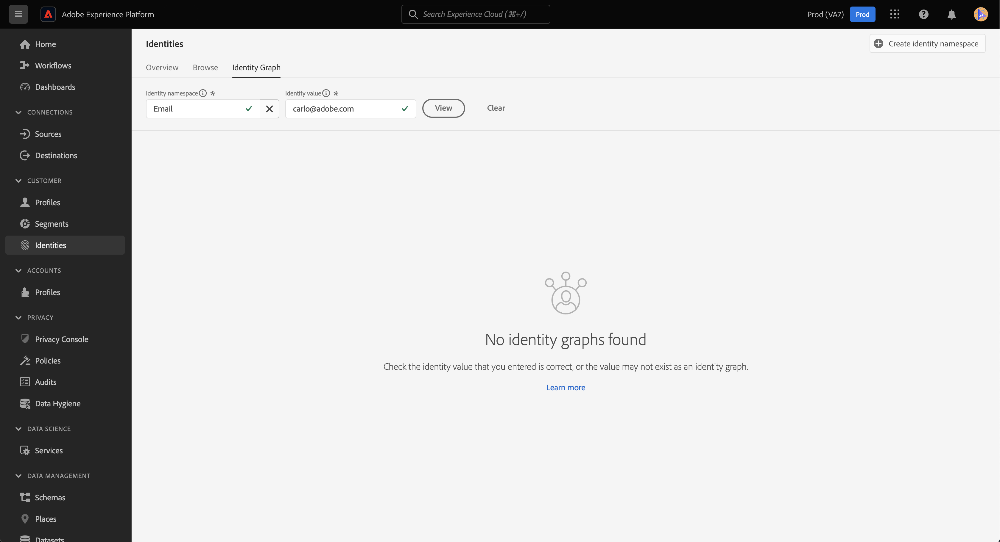

# ID グラフビューア

ID グラフは、特定の顧客の異なる ID 間の関係のマップで、顧客が様々なチャネルを通じてブランドとどのようにやり取りするかを視覚的に示します。 すべての顧客 ID グラフは、顧客のアクティビティに応じて、Adobe Experience Platform ID サービスによってほぼリアルタイムで一括管理および更新されます。

Platform ユーザーインターフェイスの ID グラフビューアを使用すると、顧客 ID が結び付けられる方法とその方法を視覚化し、より深く理解できます。 このビューアを使用すると、グラフの様々な部分をドラッグおよび操作でき、ID 間の複雑な関係を調べたり、デバッグをより効率的に実行したり、情報の利用方法に関する透明性を高めたりできます。

次のドキュメントでは、Platform UI で ID グラフビューアにアクセスして使用する手順を示します。

## チュートリアルビデオ

次のビデオは、ID グラフビューアに関する理解を深めるためのものです。

>[!VIDEO](https://video.tv.adobe.com/v/331030/?quality=12&learn=on)

## はじめに

ID グラフビューアを使用するには、関連する様々なAdobe Experience Platformサービスについて理解している必要があります。 ID グラフビューアの操作を開始する前に、次のサービスのドキュメントを確認してください。

- [[!DNL Identity Service]](../home.md):デバイスやシステム間で ID を結び付けることで、個々の顧客とその行動をより良く把握できます。
- [リアルタイム顧客プロファイル](../../profile/home.md):ID グラフは、リアルタイム顧客プロファイルで顧客の属性と行動を包括的かつ単数ビューで作成するために利用されます。

### 用語

- **ID （ノード）:** ID またはノードは、エンティティ（通常は個人）に固有のデータです。 ID は、ID 名前空間と ID 値で構成されます。 例えば、完全修飾 ID を、の ID 名前空間で構成できます。 **電子メール**（の id 値と組み合わせ） **ロビン@email.com**.
- **リンク（エッジ）:** リンクまたはエッジは、ID 間の接続を表します。 ID リンクには、最初の確立および最後の更新のタイムスタンプなどのプロパティが含まれます。 最初に確立されたタイムスタンプは、新しい ID が既存の ID にリンクされる日時を定義します。 最後に更新されたタイムスタンプは、既存の ID リンクが最後に更新された日時を定義します。
- **グラフ（クラスター）:** グラフまたはクラスターは、個人を表す ID とリンクのグループです。

## ID グラフビューアへのアクセス {#access-identity-graph-viewer}

Platform UI で、「 **[!UICONTROL ID]** 左側のナビゲーションで「 」を選択し、 **[!UICONTROL ID グラフ]** を選択します。

ID グラフを表示するには、ID 名前空間と対応する値を指定し、「 」を選択します **[!UICONTROL 表示]**.

>[!TIP]
>
>テーブルアイコンを選択  を参照して、組織で使用可能なすべての id 名前空間のリストを含むパネルを表示します。 有効な ID 値が接続されている限り、任意の ID 名前空間を使用できます。 詳しくは、 [id 名前空間ガイド](../namespaces.md).

## ID グラフビューアインターフェイスについて

ID グラフビューアインターフェイスは、ID データを操作し、より深く理解するために使用できる複数の要素で構成されています。

ID グラフには、入力した ID 名前空間と値の組み合わせにリンクされているすべての ID が表示されます。 各ノードは、ID 名前空間と対応する値で構成されます。 任意のノードを選択、押したままドラッグして、グラフを操作できます。 または、ノードの上にマウスポインターを置くと、対応する ID 値に関する情報が表示されます。 選択 **[!UICONTROL グラフを表示]** をクリックして、グラフの表示と非表示を切り替えます。

>[!IMPORTANT]
>
>ID グラフでは、少なくとも 2 つのリンクされた ID を生成し、有効な ID 名前空間と値の組み合わせが必要です。 グラフビューアに表示できる ID の最大数は 150 です。 詳しくは、 [付録](#appendix) 詳しくは、以下の節を参照してください。

グラフ内のリンクを選択して、そのリンクに貢献するデータセットとバッチ ID を確認します。 リンクを選択すると、右側のパネルが更新され、データソースの詳細に関する詳細情報や、最初に確立されたタイムスタンプや最後に更新されたタイムスタンプなどのプロパティが表示されます。

この [!UICONTROL ID] この表は、id データの様々な表示を示し、id 名前空間と id 値の組み合わせを表形式で示しています。 グラフ内のノードを選択すると、 [!UICONTROL ID] 表。

ドロップダウンメニューを使用して、グラフデータを並べ替え、特定の ID 名前空間に関する情報をハイライトします。 例えば、「 **[!UICONTROL 電子メール]** メニューから、e メール id 名前空間に固有のデータを表示します。

右側のレールには、最後に更新されたタイムスタンプを含む、選択した ID に関する情報が表示されます。 また、右側のレールには、選択した ID に対応するデータソースに関する情報（バッチ ID、データセット名、データセット ID、スキーマ名など）が表示されます。

次の表に、右側のパネルに表示されるデータソースプロパティの追加情報を示します。

| データソース | 説明 |
| --- | --- | 
| バッチ ID | バッチデータに対応する自動生成の識別子。 |
| データセット ID | データセットに対応する自動生成識別子。 |
| データセット名 | バッチデータを含むデータセットの名前。 |
| スキーマ名 | スキーマの名前。 スキーマは、データの構造と形式を表し、検証する一連のルールを提供します。 |

また、 *[!UICONTROL データソース]* id に影響を与えるデータソースのリストを確認する場合。 選択 [!UICONTROL データソース] ：データセットとバッチ ID の表形式表示。

スライダーを使用して、ID が最初に確立された時刻別にグラフデータをフィルタリングします。 デフォルトでは、ID グラフビューアには、グラフ内でリンクされているすべての ID が表示されます。 スライダーを押したままドラッグして、新しい ID がグラフにリンクされた最後のタイムスタンプまでの時間を調整します。 次の例では、グラフに、で最新の ID リンク (GAID) が確立されたことが示されています。 **[!UICONTROL 08/19/2020, 4:29:午後 29 時]**.

スライダーを調整して、次の場所で別の ID リンク（E メール）が確立されたことを確認します。 **[!UICONTROL 08/19/2020, 4:25:午後 30 時]**.

スライダを調整して、グラフの最も古い反復を確認することもできます。 次の例では、ID グラフビューアに、グラフが最初に作成された日付が表示されます **[!UICONTROL 08/19/2020, 4:11:午後 49 時]**（最初のリンクが ECID、電子メールおよび電話）。

## 付録

次の節では、ID グラフビューアの操作に関する追加情報を示します。

### エラーメッセージについて

ID グラフビューアにアクセスする際にエラーが発生する場合があります。 次に、ID グラフビューアを使用する際に注意すべき前提条件と制限事項の一覧を示します。

- 選択した名前空間に ID 値が存在する必要があります。
- ID グラフビューアで生成するには、少なくとも 2 つのリンクされた ID が必要です。 ID 値が 1 つだけで、リンクされた ID がない可能性があり、この場合、値は [!DNL Profile] 閲覧者
- ID グラフビューアは、最大 150 個の ID を超えることはできません。

### データセットから ID グラフビューアにアクセスする

データセットインターフェイスを使用して、 ID グラフビューアにアクセスすることもできます。 データセットから [!UICONTROL 参照] ページで、操作するデータセットを選択し、「 」を選択します **[!UICONTROL データセットをプレビュー]**

プレビューウィンドウでフィンガープリントアイコンを選択し、ID グラフビューアで表される ID を確認します。

>[!TIP]
>
>データセットに 2 つ以上の ID がある場合にのみ、フィンガープリントアイコンが表示されます。

## 次の手順

このドキュメントでは、Platform UI で顧客の ID グラフを参照する方法を学びました。 Platform の ID について詳しくは、 [ID サービスの概要](../home.md)

## 変更ログ

| 日付 | アクション |
| ---- | ------ |
| 2021-01 | <ul><li>取り込まれたデータのストリーミングと実稼動以外のサンドボックスのサポートが追加されました。</li><li>マイナーな問題を修正しました。</li></ul> |
| 2021-02 | <ul><li>ID グラフビューアは、データセットのプレビューを通じてアクセスできます。</li><li>マイナーな問題を修正しました。</li><li>ID グラフビューアは一般に利用可能になりました。</li></ul> |
| 2023-01 | <ul><li>UI の更新。</li></ul> |
