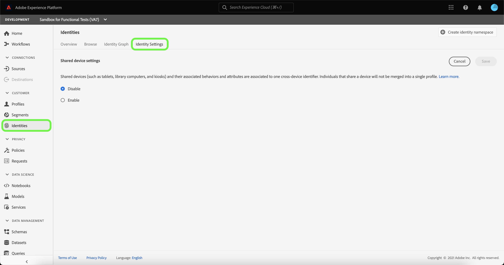

# 共有デバイス検出の概要（ベータ版）

>[!IMPORTANT]
>
>[!DNL Shared Device Detection] 機能はベータ版です。 機能とドキュメントは変更される場合があります。

Adobe Experience Platform [!DNL Identity Service]を使用すると、デバイスやシステム間で ID を橋渡しすることで、顧客とその行動をわかりやすく表示できます。これによって、インパクトのある個人的なデジタル体験をリアルタイムで提供できます。

[!DNL Shared Device Detection] は、複数の個人が使用するデバイスを指します。共有デバイスの例としては、タブレット、ライブラリコンピューター、キオスクなどがあります。 [!DNL Shared Device Detection] を通じて、同じデバイスの異なるユーザーが単一の ID に結合されるのを防ぎ、より正確な表現を可能にします。

[!DNL Shared Device Detection] では、以下のことが可能です。

* 同じデバイスの異なるユーザーに対して別々の ID グラフを作成する
* 同じデバイスを使用して異なる個人からのデータが混在するのを防ぐ。
* 顧客に関するより簡潔で正確なビューを生成する。

>[!TIP]
>
>[!DNL Identity Service] にデータが流れ始めると、設定を変更しなくなるので、データセットの [!DNL Profile] を有効にする前に [!DNL Shared Device Detection] の設定を完了する必要があります。

## はじめに

[!DNL Shared Device Detection] を使用するには、関連する様々な Platform サービスに関する理解が必要です。 [!DNL Shared Device Detection] の使用を開始する前に、次のサービスのドキュメントを確認してください。

* [[!DNL Identity Service]](../home.md):デバイスやシステム間で ID を結び付けることで、個々の顧客とその行動をより良く把握できます。
   * [ID グラフビューア](./identity-graph-viewer.md):ID グラフビューアを視覚化して操作し、顧客 ID を結び付ける方法と方法をより深く理解します。
   * [ID 名前空間](../namespaces.md):完全修飾 ID のコンポーネント、および ID 名前空間で ID のコンテキストとタイプを区別する方法を確認します。

### 用語

次の表に、[!DNL Shared Device Detection] の理解に必要な用語の一覧を示します。

| キーワード | 定義 |
| --- | --- |
| 共有デバイス | 共有デバイスとは、複数の個人が使用する任意のデバイスです。 共有デバイスの例としては、タブレット、ライブラリコンピューター、キオスクなどがあります。 |
| [!DNL Shared Device Detection] | [!DNL Shared Device Detection] は、同じデバイスの異なるユーザーからのデータを互いに分離できる設定を指します。 |
| [!UICONTROL 共有 ID 名前空間] | [!UICONTROL  共有 ID 名前空間 ] は、複数の異なるユーザーが共有する単一のデバイスを表すために使用されます。 |
| [!UICONTROL ユーザー ID 名前空間] | [!UICONTROL  ユーザー ID 名前空間 ] は、共有デバイスの認証済みまたはログイン済みのユーザーを表すために使用されます。 |

## 共有デバイス UI

Platform UI で、左側のナビゲーションから「 **[!UICONTROL ID]** 」を選択し、「 **[!UICONTROL ID 設定]** 」を選択します。

[[!UICONTROL  共有デバイスの設定 ]] ページが表示され、データの共有デバイス設定を構成するためのインターフェイスが表示されます。 共有デバイスの設定は、デフォルトで無効になっています。

共有デバイスの設定を有効にすると、同じデバイスの異なるユーザーのデータを別々に分離できます。 この設定を使用すると、同じデバイスのユーザー ID が組み合わされない ID グラフを、より簡潔で正確に表現できます。

**[!UICONTROL 「]** を有効にする」を選択して、共有デバイスの設定の変更を開始します。

「[!UICONTROL  共有 ID 名前空間 ]」および「[!UICONTROL  ユーザー ID 名前空間 ]」の設定オプションが表示され、使用する ID 名前空間を変更できます。

[!UICONTROL 共有 ID 名前空] 間は、複数の異なるユーザーが使用する単一のデバイスを表します。すべての Platform ユーザーは Web ブラウザー識別子として **[!UICONTROL ECID]** を使用するので、この名前空間は常に **[!UICONTROL ECID]** に設定されます。

[!UICONTROL  ユーザー ID 名前空間 ] を使用すると、同じデバイスの異なるユーザーを識別し、データが同じ ID グラフに組み合わされるのを防ぐことができます。

「**[!UICONTROL ユーザー ID 名前空間]**」検索バーを選択し、ID 名前空間を入力するか、ドロップダウンメニューから ID 名前空間を選択します。

>[!TIP]
>
>[!UICONTROL  ユーザー ID 名前空間 ] は、エンドユーザーのログイン ID に対応する ID 名前空間にマッピングする必要があります。 オプションには、顧客 ID、電子メール、ハッシュ化された電子メールが含まれます。

[!UICONTROL  共有デバイスの設定 ] を設定したら、**[!UICONTROL 「保存」]** を選択します。

選択を確認するメッセージが表示されるポップアップウィンドウが表示されます。 **[!UICONTROL はい]** を選択して、設定を完了します。

