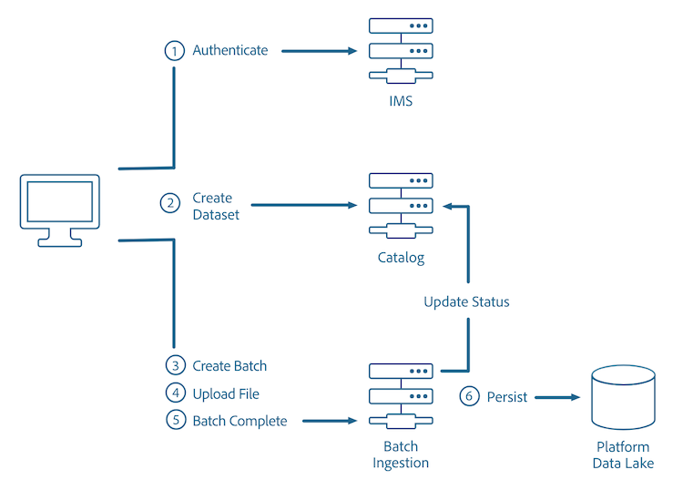

# バッチ取得APIの概要

Adobe Experience Platform Batch Ingestion APIを使用すると、データをExperience Platformにバッチファイルとして取り込むことができます。 取り込むデータは、フラットファイル（Parquet ファイルなど）からのプロファイルデータ、または[!DNL Experience Data Model] （XDM） レジストリの既知のスキーマに準拠するデータです。

これらのAPI呼び出しに関する追加情報は、[&#x200B; バッチ取り込みAPI リファレンス &#x200B;](https://developer.adobe.com/experience-platform-apis/references/batch-ingestion/)を参照してください。

次の図に、バッチ取り込みプロセスの概要を示します。



## はじめに

このガイドで使用されているAPI エンドポイントは、[&#x200B; バッチ取り込みAPI](https://developer.adobe.com/experience-platform-apis/references/batch-ingestion/)の一部です。 先に進む前に、[はじめる前に](getting-started.md)を参照し、関連ドキュメントへのリンク、このドキュメントのサンプル API 呼び出しを読み取るためのガイドおよび任意の Experience Platform API を正常に呼び出すために必要なヘッダーに関する重要な情報を確認してください。

### [!DNL Data Ingestion] 前提条件

- アップロードするデータは、Parquet 形式または JSON 形式である必要があります。
- [[!DNL Catalog services]](../../catalog/home.md)で作成されたデータセット。
- Parquet ファイルの内容は、アップロードするデータセットのスキーマのサブセットと一致する必要があります。
- 認証後に固有のアクセストークンを取得する必要があります。

### バッチ取り込みのベストプラクティス

- 推奨されるバッチサイズは 256 MB～100 GB です。
- 各バッチには、最大 1,500 個のファイルを含めることができます。

### バッチ取り込みの制約

バッチデータ取得には、いくつかの制約があります。

- バッチあたりの最大ファイル数：1500
- 最大バッチサイズ：100GB
- 1 行あたりのプロパティまたはフィールドの最大数：10000
- ユーザーあたりの1分あたりのデータレイクの最大バッチ数：2000

>[!NOTE]
>
>512 MB を超えるファイルをアップロードする場合は、ファイルを小さなチャンクに分割する必要があります。大きなファイルをアップロードする手順については、このドキュメント [の「](#large-file-upload---create-file)大きなファイルのアップロード」セクションを参照してください。

### タイプ

データを取り込む際には、[!DNL Experience Data Model] （XDM）スキーマの仕組みを理解することが重要です。 XDM のフィールドタイプを様々な形式にマップする方法について詳しくは、『[スキーマレジストリ開発者ガイド](../../xdm/api/getting-started.md)』を参照してください。

データの取り込みには柔軟性があります。タイプがターゲットスキーマの内容と一致しない場合、データは表現されたターゲットタイプに変換されます。 できない場合は、バッチが `TypeCompatibilityException` で失敗します。

例えば、JSONもCSVも`date`または`date-time`型を持っていません。 その結果、これらの値は[ISO 8601形式の文字列](https://www.iso.org/iso-8601-date-and-time-format.html) （「2018-07-10T15:05:59.000-08:00」）またはUnix Time形式のミリ秒（1531263959000）で表され、取り込み時にターゲット XDM タイプに変換されます。

次の表に、データの取得時にサポートされる変換を示します。

| 受信（行）とターゲット（列） | 文字列 | Byte | Short | 整数 | Long | Double | 日付 | Date-Time | Object | Map |
|:---:|:---:|:---:|:---:|:---:|:---:|:---:|:---:|:---:|:---:|:---:|
| 文字列 | X | X | X | X | X | X | X | X |   |   |
| Byte | X | X | X | X | X | X |   |   |   |   |
| Short | X | X | X | X | X | X |   |   |   |   |
| 整数 | X | X | X | X | X | X |   |   |   |   |
| Long | X | X | X | X | X | X | X | X |   |   |
| Double | X | X | X | X | X | X |   |   |   |   |
| 日付 |   |   |   |   |   |   | X |   |   |   |
| Date-Time |   |   |   |   |   |   |   | X |   |   |
| Object |   |   |   |   |   |   |   |   | X | X |
| Map |   |   |   |   |   |   |   |   | X | X |

>[!NOTE]
>
>ブーリアンと配列は他の型に変換できません。

## API の使用

[!DNL Data Ingestion] APIを使用すると、データをバッチ（単一のユニットとして取り込む1つ以上のファイルで構成されるデータのユニット）として、[!DNL Experience Platform]に3つの基本的な手順で取り込むことができます。

1. 新しいバッチを作成します。
2. データの XDM スキーマと一致する、指定したデータセットにファイルをアップロードします。
3. バッチの終了を示します。

## バッチの作成

データをデータセットに追加するには、データをバッチにリンクする必要があります。その後、バッチは、指定したデータセットにアップロードされます。

```http
POST /batches
```

**リクエスト**

```shell
curl -X POST "https://platform.adobe.io/data/foundation/import/batches" \
  -H "Content-Type: application/json" \
  -H "x-gw-ims-org-id: {ORG_ID}" \
  -H "x-sandbox-name: {SANDBOX_NAME}" \
  -H "Authorization: Bearer {ACCESS_TOKEN}" \
  -H "x-api-key: {API_KEY}"
  -d '{ 
          "datasetId": "{DATASET_ID}" 
      }'
```

| プロパティ | 説明 |
| -------- | ----------- |
| `datasetId` | ファイルのアップロード先のデータセットの ID。 |

**レポンス**

```JSON
{
    "id": "{BATCH_ID}",
    "imsOrg": "{ORG_ID}",
    "updated": 0,
    "status": "loading",
    "created": 0,
    "relatedObjects": [
        {
            "type": "dataSet",
            "id": "{DATASET_ID}"
        }
    ],
    "version": "1.0.0",
    "tags": {},
    "createdUser": "{USER_ID}",
    "updatedUser": "{USER_ID}"
}
```

| プロパティ | 説明 |
| -------- | ----------- |
| `id` | 作成されたバッチの ID（後続のリクエストで使用します）。 |
| `relatedObjects.id` | ファイルのアップロード先のデータセットの ID。 |

## ファイルのアップロード

アップロード用の新しいバッチが正常に作成されたら、ファイルを特定のデータセットにアップロードできます。

Small File Upload APIを使用してファイルをアップロードできます。 ただし、ファイルが大きすぎて、ゲートウェイの制限（拡張タイムアウト、ボディサイズの要求、その他の制約など）を超えた場合は、Large File Upload APIに切り替えることができます。 このAPIは、ファイルをチャンクにアップロードし、Large File Upload Complete API呼び出しを使用してデータを結合します。

>[!NOTE]
>
>バッチ取り込みは、プロファイルストアのデータを段階的に更新するために使用できます。 詳細については、[&#x200B; バッチ取り込み開発者ガイド &#x200B;](#patch-a-batch)の[&#x200B; バッチの更新](api-overview.md)に関する節を参照してください。

>[!INFO]
>
>以下の例では、[Apache Parquet](https://parquet.apache.org/docs/) ファイル形式を使用しています。 JSON ファイル形式の使用例については、[バッチ取り込み開発者ガイド](api-overview.md)を参照してください。

### サイズの小さなファイルのアップロード

バッチを作成したら、データを既存のデータセットにアップロードできます。アップロードするファイルは、参照されている XDM スキーマに一致している必要があります。

```http
PUT /batches/{BATCH_ID}/datasets/{DATASET_ID}/files/{FILE_NAME}
```

| プロパティ | 説明 |
| -------- | ----------- |
| `{BATCH_ID}` | バッチの ID。 |
| `{DATASET_ID}` | ファイルをアップロードするデータセットの ID。 |
| `{FILE_NAME}` | データセットに表示される際のファイルの名前。 |

**リクエスト**

```SHELL
curl -X PUT "https://platform.adobe.io/data/foundation/import/batches/{BATCH_ID}/datasets/{DATASET_ID}/files/{FILE_NAME}.parquet" \
  -H "content-type: application/octet-stream" \
  -H "x-gw-ims-org-id: {ORG_ID}" \
  -H "x-sandbox-name: {SANDBOX_NAME}" \
  -H "Authorization: Bearer {ACCESS_TOKEN}" \
  -H "x-api-key: {API_KEY}" \
  --data-binary "@{FILE_PATH_AND_NAME}.parquet"
```

| プロパティ | 説明 |
| -------- | ----------- |
| `{FILE_PATH_AND_NAME}` | データセットにアップロードするファイルのパスとファイル名。 |

**応答**

```JSON
#Status 200 OK, with empty response body
```

### サイズの大きなファイルのアップロード - ファイルの作成

サイズの大きなファイルをアップロードするには、ファイルを小さなチャンクに分割し、一度に 1 つずつアップロードする必要があります。

```http
POST /batches/{BATCH_ID}/datasets/{DATASET_ID}/files/{FILE_NAME}?action=initialize
```

| プロパティ | 説明 |
| -------- | ----------- |
| `{BATCH_ID}` | バッチの ID。 |
| `{DATASET_ID}` | ファイルを取り込むデータセットの ID。 |
| `{FILE_NAME}` | データセットに表示される際のファイルの名前。 |

**リクエスト**

```SHELL
curl -X POST "https://platform.adobe.io/data/foundation/import/batches/{BATCH_ID}/datasets/{DATASET_ID}/files/part1=a/part2=b/{FILE_NAME}.parquet?action=initialize" \
  -H "x-gw-ims-org-id: {ORG_ID}" \
  -H "x-sandbox-name: {SANDBOX_NAME}" \
  -H "Authorization: Bearer {ACCESS_TOKEN}" \
  -H "x-api-key: {API_KEY}"
```

**レスポンス**

```JSON
#Status 201 CREATED, with empty response body
```

### サイズの大きなファイルのアップロード - 後続チャンクのアップロード

ファイルを作成したら、ファイルの各セクションに対して 1 回ずつ、PATCH リクエストを繰り返しおこなうことで、以降のすべてのチャンクをアップロードできます。

```http
PATCH /batches/{BATCH_ID}/datasets/{DATASET_ID}/files/{FILE_NAME}
```

| プロパティ | 説明 |
| -------- | ----------- |
| `{BATCH_ID}` | バッチの ID。 |
| `{DATASET_ID}` | ファイルのアップロード先のデータセットの ID。 |
| `{FILE_NAME}` | データセットに表示される際のファイルの名前。 |

**リクエスト**

```SHELL
curl -X PATCH "https://platform.adobe.io/data/foundation/import/batches/{BATCH_ID}/datasets/{DATASET_ID}/files/part1=a/part2=b/{FILE_NAME}.parquet" \
  -H "content-type: application/octet-stream" \
  -H "x-gw-ims-org-id: {ORG_ID}" \
  -H "x-sandbox-name: {SANDBOX_NAME}" \
  -H "Authorization: Bearer {ACCESS_TOKEN}" \
  -H "x-api-key: {API_KEY}" \
  -H "Content-Range: bytes {CONTENT_RANGE}" \
  --data-binary "@{FILE_PATH_AND_NAME}.parquet"
```

| プロパティ | 説明 |
| -------- | ----------- |
| `{FILE_PATH_AND_NAME}` | データセットにアップロードするファイルのパスとファイル名。 |

**レスポンス**

```JSON
#Status 200 OK, with empty response
```

## バッチ完了を示す

すべてのファイルをバッチにアップロードしたら、バッチの完了を示すことができます。これにより、完成したファイルの[!DNL Catalog] DataSetFile エントリが作成され、上記で生成されたバッチに関連付けられます。 これにより、[!DNL Catalog] のバッチが成功とマークされ、ダウンストリームフローがトリガーされて使用可能なデータを取り込みます。

**リクエスト**

```http
POST /batches/{BATCH_ID}?action=COMPLETE
```

| プロパティ | 説明 |
| -------- | ----------- |
| `{BATCH_ID}` | データセットにアップロードするバッチの ID。 |

```SHELL
curl -X POST "https://platform.adobe.io/data/foundation/import/batches/{BATCH_ID}?action=COMPLETE" \
-H "x-gw-ims-org-id: {ORG_ID}" \
-H "x-sandbox-name: {SANDBOX_NAME}" \
-H "Authorization: Bearer {ACCESS_TOKEN}" \
-H "x-api-key: {API_KEY}"
```

**レスポンス**

```JSON
#Status 200 OK, with empty response
```

## バッチステータスの確認

バッチにファイルがアップロードされるのを待つ間、バッチのステータスを確認して進行状況を確認できます。

**API 形式**

```http
GET /batch/{BATCH_ID}
```

| プロパティ | 説明 |
| -------- | ----------- |
| `{BATCH_ID}` | 確認するバッチの ID。 |

**リクエスト**

```shell
curl GET "https://platform.adobe.io/data/foundation/catalog/batch/{BATCH_ID}" \
  -H "Authorization: Bearer {ACCESS_TOKEN}" \
  -H "x-gw-ims-org-id: {ORG_ID}" \
  -H "x-sandbox-name: {SANDBOX_NAME}" \
  -H "x-api-key: {API_KEY}"
```

**レスポンス**

```JSON
{
    "{BATCH_ID}": {
        "imsOrg": "{ORG_ID}",
        "created": 1494349962314,
        "createdClient": "MCDPCatalogService",
        "createdUser": "{USER_ID}",
        "updatedUser": "{USER_ID}",
        "updated": 1494349963467,
        "externalId": "{EXTERNAL_ID}",
        "status": "success",
        "errors": [
            {
                "code": "err-1494349963436"
            }
        ],
        "version": "1.0.3",
        "availableDates": {
            "startDate": 1337,
            "endDate": 4000
        },
        "relatedObjects": [
            {
                "type": "batch",
                "id": "foo_batch"
            },
            {
                "type": "connection",
                "id": "foo_connection"
            },
            {
                "type": "connector",
                "id": "foo_connector"
            },
            {
                "type": "dataSet",
                "id": "foo_dataSet"
            },
            {
                "type": "dataSetView",
                "id": "foo_dataSetView"
            },
            {
                "type": "dataSetFile",
                "id": "foo_dataSetFile"
            },
            {
                "type": "expressionBlock",
                "id": "foo_expressionBlock"
            },
            {
                "type": "service",
                "id": "foo_service"
            },
            {
                "type": "serviceDefinition",
                "id": "foo_serviceDefinition"
            }
        ],
        "metrics": {
            "foo": 1337
        },
        "tags": {
            "foo_bar": [
                "stuff"
            ],
            "bar_foo": [
                "woo",
                "baz"
            ],
            "foo/bar/foo-bar": [
                "weehaw",
                "wee:haw"
            ]
        },
        "inputFormat": {
            "format": "parquet",
            "delimiter": ".",
            "quote": "`",
            "escape": "\\",
            "nullMarker": "",
            "header": "true",
            "charset": "UTF-8"
        }
    }
}
```

| プロパティ | 説明 |
| -------- | ----------- |
| `{USER_ID}` | バッチを作成または更新したユーザーの ID。 |

`"status"` フィールドに、リクエストしたバッチの現在のステータスが示されます。バッチの状態は次のいずれかです。

## バッチ取り込みのステータス

| ステータス | 説明 |
| ------ | ----------- |
| Abandoned | バッチは、予想期間内に完了しませんでした。 |
| Aborted | 指定したバッチに対して、中止操作が&#x200B;**明示的に**（Batch Ingest API を介して）呼び出されました。バッチが「ロード済み」状態になると、中止できません。 |
| アクティブ | バッチは正常に昇格しており、ダウンストリームで使用することができます。このステータスは、「成功」と同じ意味で使用できます。 |
| Deleted | バッチのデータは完全に削除されました。 |
| 失敗 | 設定またはデータ、あるいはその両方が不正なために発生した、失敗の状態。失敗したバッチのデータは、表示&#x200B;**されません**。このステータスは、「失敗」と同じ意味で使用できます。 |
| 非アクティブ | バッチは正常に昇格しましたが、元に戻されたか、有効期限が切れています。バッチは、ダウンストリームで使用できません。 |
| Loaded | バッチのデータのアップロードが完了し、バッチ昇格の準備ができています。 |
| Loading | このバッチのデータはアップロード中です。現在、バッチ昇格の準備はできて&#x200B;**いません**。 |
| Retrying | このバッチのデータは処理中です。ただし、システムエラーまたは一時的なエラーが原因でバッチが失敗しました。その結果、このバッチは再試行中です。 |
| Staged | バッチの昇進プロセスのステージング段階が完了し、取り込みジョブが実行されました。 |
| Staging | バッチのデータは処理中です。 |
| Stalled | バッチのデータは処理中です。ただし、バッチの昇進は、数回再試行した後に停止されました。 |
