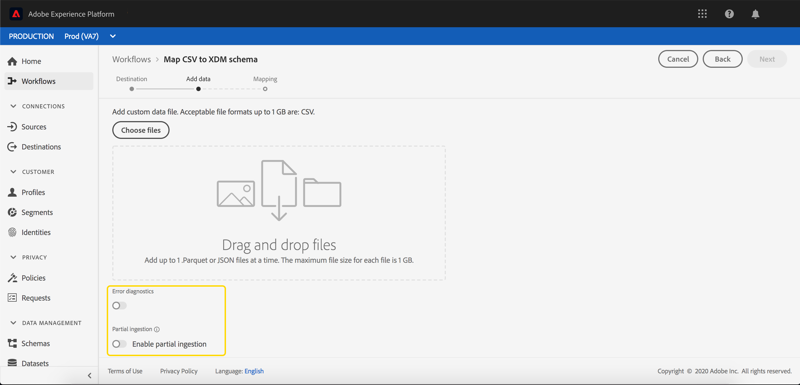
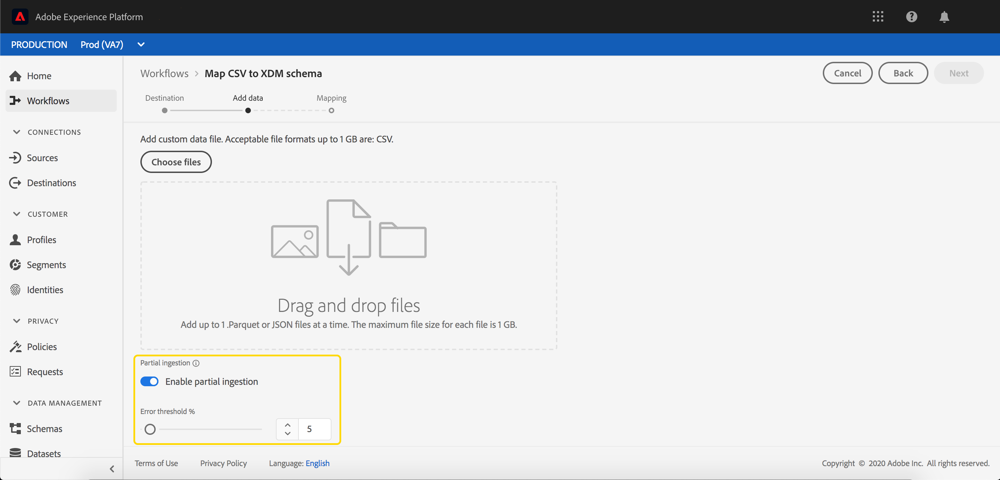

# 部分バッチ取得

部分バッチ取得は、エラーを含むデータを特定のしきい値まで取得する機能です。この機能を使用すると、正しいデータをすべて Adobe Experience Platform に正しく取得し、間違ったデータはその理由の詳細とともにすべて別々にバッチ処理されます。

このドキュメントでは、部分バッチ取得を管理するためのチュートリアルを提供します。

## はじめに

このチュートリアルでは、部分バッチ取得に関わる様々な Adobe Experience Platform サービスに関する十分な知識が必要です。このチュートリアルを開始する前に、次のサービスのドキュメントを確認してください。

- [バッチインジェスト](./overview.md):CSVやParketなどのデータファイルからデータを [!DNL Platform] 取り込んで保存する方法。
- [[!DNL Experience Data Model (XDM)]](../../xdm/home.md)：顧客体験データを編成する際に [!DNL Platform] に使用される標準化されたフレームワーク。

以下の節では、[!DNL Platform] APIを正しく呼び出すために知っておく必要のある追加情報を紹介します。

### API 呼び出し例の読み取り

ここでは、リクエストの形式を説明するために API 呼び出しの例を示します。これには、パス、必須ヘッダー、適切に書式設定されたリクエストペイロードが含まれます。また、API レスポンスで返されるサンプル JSON も示されています。サンプル API 呼び出しのドキュメントで使用されている規則については、[!DNL Experience Platform] トラブルシューテングガイドの[サンプル API 呼び出しの読み方](../../landing/troubleshooting.md#how-do-i-format-an-api-request)に関する節を参照してください。

### 必須ヘッダーの値の収集

[!DNL Platform] API を呼び出すには、まず[認証チュートリアル](https://www.adobe.com/go/platform-api-authentication-en)を完了する必要があります。次に示すように、すべての [!DNL Experience Platform] API 呼び出しに必要な各ヘッダーの値は認証チュートリアルで説明されています。

- Authorization: Bearer `{ACCESS_TOKEN}`
- x-api-key: `{API_KEY}`
- x-gw-ims-org-id: `{IMS_ORG}`

[!DNL Experience Platform]内のすべてのリソースは、特定の仮想サンドボックスに分離されています。 [!DNL Platform] APIへのすべてのリクエストには、操作が行われるサンドボックスの名前を指定するヘッダーが必要です。

- x-sandbox-name: `{SANDBOX_NAME}`

>[!NOTE]
>
>[!DNL Platform]のサンドボックスについて詳しくは、[サンドボックスの概要ドキュメント](../../sandboxes/home.md)を参照してください。

## API {#enable-api}でバッチの部分的な取り込みを有効にする

>[!NOTE]
>
>この節では、APIを使用した部分的なバッチ取り込みに対してバッチを有効にする方法を説明します。 UIの使用方法については、UI](#enable-ui)の手順で、[バッチを有効にして部分的なバッチ取り込みを行う方法を読んでください。

部分的な取り込みが有効な新しいバッチを作成できます。

新しいバッチを作成するには、『[バッチインジェスト開発者ガイド](./api-overview.md)』の手順に従います。 **[!UICONTROL バッチ作成]**&#x200B;の手順に達したら、次のフィールドをリクエスト本文に追加します。

```json
{
    "enableErrorDiagnostics": true,
    "partialIngestionPercentage": 5
}
```

| プロパティ | 説明 |
| -------- | ----------- |
| `enableErrorDiagnostics` | [!DNL Platform]がバッチに関する詳細なエラーメッセージを生成できるようにするフラグ。 |
| `partialIngestionPercentage` | バッチ全体が失敗する前の許容エラー率。したがって、この例では、バッチが失敗する前に、最大5%のエラーが発生する可能性があります。 |


## UI {#enable-ui}でバッチ取り込みの部分を有効にする

>[!NOTE]
>
>この節では、UIを使用した部分的なバッチ取り込みに対してバッチを有効にする方法について説明します。 APIを使用してバッチの部分的な取り込みを既に有効にしている場合は、次のセクションに進むことができます。

[!DNL Platform] UIから部分的な取り込みを可能にするには、ソース接続から新しいバッチを作成するか、既存のデータセットに新しいバッチを作成するか、「[!UICONTROL CSVをXDMフローにマップ]」を使用して新しいバッチを作成します。

### 新しいソース接続を作成{#new-source}

新しいソース接続を作成するには、[ソースの概要](../../sources/home.md)に記載されている手順に従ってください。 **[!UICONTROL データフローの詳細]**&#x200B;手順に到達したら、**[!UICONTROL 部分的な取り込み]**&#x200B;と&#x200B;**[!UICONTROL エラー診断]**&#x200B;の各フィールドに注意してください。


「**[!UICONTROL 部分取得]**」切り替えを使用すると、部分バッチ取得の使用を有効または無効にできます。

**[!UICONTROL エラー診断]**&#x200B;の切り替えは、**[!UICONTROL 部分的な取り込み]**&#x200B;の切り替えがオフの場合にのみ表示されます。 この機能を使用すると、[!DNL Platform]が取り込んだバッチに関する詳細なエラーメッセージを生成できます。 **[!UICONTROL 部分的な取り込み]**&#x200B;の切り替えがオンになっている場合、拡張されたエラー診断が自動的に適用されます。


**[!UICONTROL エラーしきい値]**&#x200B;を使用すると、バッチ全体が失敗する前に許容可能なエラーの割合を設定できます。デフォルトでは、この値は 5% に設定されています。

### 既存のデータセットを使用する {#existing-dataset}

既存のデータセットを使用するには、開始がデータセットを選択します。 右側のサイドバーに、データセットに関する情報が表示されます。


「**[!UICONTROL 部分取得]**」切り替えを使用すると、部分バッチ取得の使用を有効または無効にできます。

**[!UICONTROL エラー診断]**&#x200B;の切り替えは、**[!UICONTROL 部分的な取り込み]**&#x200B;の切り替えがオフの場合にのみ表示されます。 この機能を使用すると、[!DNL Platform]が取り込んだバッチに関する詳細なエラーメッセージを生成できます。 **[!UICONTROL 部分的な取り込み]**&#x200B;の切り替えがオンになっている場合、拡張されたエラー診断が自動的に適用されます。


**[!UICONTROL エラーしきい値]**&#x200B;を使用すると、バッチ全体が失敗する前に許容可能なエラーの割合を設定できます。デフォルトでは、この値は 5% に設定されています。

これで、**追加data**&#x200B;ボタンを使用してデータをアップロードでき、部分的な取り込みを使用して取り込むことができます。

### 「[!UICONTROL Map CSV to XDMスキーマ]」のフロー{#map-flow}を使用

「[!UICONTROL CSVをXDMスキーマにマップ]」のフローを使用するには、[CSVファイルのマップチュートリアル](../tutorials/map-a-csv-file.md)の手順に従います。 **[!UICONTROL 追加データ]**&#x200B;の手順に到達したら、**[!UICONTROL 部分的な取り込み]**&#x200B;と&#x200B;**[!UICONTROL エラー診断]**&#x200B;の各フィールドに注意してください。



「**[!UICONTROL 部分取得]**」切り替えを使用すると、部分バッチ取得の使用を有効または無効にできます。

**[!UICONTROL エラー診断]**&#x200B;の切り替えは、**[!UICONTROL 部分的な取り込み]**&#x200B;の切り替えがオフの場合にのみ表示されます。 この機能を使用すると、[!DNL Platform]が取り込んだバッチに関する詳細なエラーメッセージを生成できます。 **[!UICONTROL 部分的な取り込み]**&#x200B;の切り替えがオンになっている場合、拡張されたエラー診断が自動的に適用されます。



**[!UICONTROL エラーの]** しきい値を使用すると、バッチ全体が失敗する前に、許容可能なエラーの割合を設定できます。デフォルトでは、この値は 5% に設定されています。

## 次の手順 {#next-steps}

このチュートリアルでは、部分バッチ取得を有効にするデータセットの作成または変更方法について説明しました。バッチ取得について詳しくは、『[バッチ取得開発者ガイド](./api-overview.md)』を参照してください。

部分的なインジェストエラーの監視については、[バッチインジェストエラー診断ガイド](../quality/error-diagnostics.md)を参照してください。
