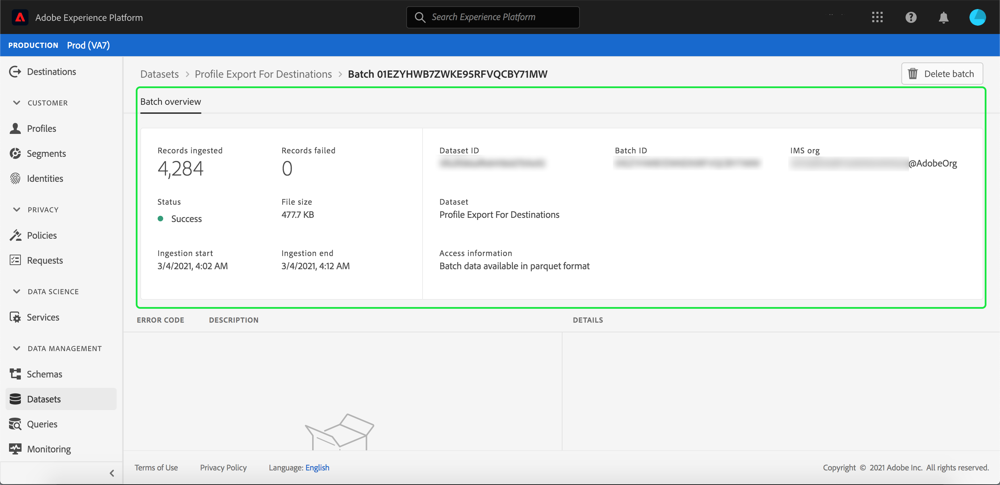

# データ取得の監視

データ取得を使用すると、Adobe Experience Platform でデータを取得できます。バッチインジェストを使用すると、様々なファイルタイプ（CSVなど）を使用してデータを挿入できます。また、ストリーミングエンドポイントをリアルタイムで使用して[!DNL Platform]にデータを取り込むことができます。

このユーザガイドでは、Adobe Experience Platformユーザーインターフェイス内でデータを監視する手順を説明します。 このガイドでは、Adobe ID を持っていて、Adobe Experience Platform にアクセスできる必要があります。

## ストリーミングエンドツーエンドデータの取得の監視

[Experience PlatformUI](https://platform.adobe.com)で、左側のナビゲーションメニューの「**[!UICONTROL 監視]**」を選択し、続いて「**[!UICONTROL ストリーミングエンドツーエンド]**」を選択します。

「**[!UICONTROL ストリーミングエンドツーエンド]**」の監視ページが表示されます。このワークスペースは、[!DNL Platform]が受信したストリームイベントの割合を示すグラフ、[[!DNL Real-time Customer Profile]](../../profile/home.md)が正常に処理したストリームイベントの割合と、入力データの詳細リストを示すグラフを提供します。

デフォルトで、上のグラフには、過去7日間の摂取率が表示されます。 この日付範囲は、強調表示されたボタンを選択して、様々な期間を表示するように調整できます。

下のグラフは、過去7日間で[!DNL Profile]によってストリームイベントが正常に処理された割合を示しています。 この日付範囲は、強調表示されたボタンを選択して、様々な期間を表示するように調整できます。

>[!NOTE]
>
>このグラフにデータを表示するには、[!DNL Profile]に対して&#x200B;**明示的に**&#x200B;有効にする必要があります。 [!DNL Profile]のストリーミングデータを有効にする方法については、[datasetsユーザーガイド](../../catalog/datasets/user-guide.md#enable-a-dataset-for-real-time-customer-profile)を参照してください。

グラフの下には、上に示した日付範囲に対応するすべてのストリーミング取り込みレコードがリストされています。 リストの各バッチには、ID、データセット名、最終アップデート日時、バッチ内のレコード数、エラー数（エラーがある場合）が表示されます。任意のレコードを選択すると、そのレコードに関する詳細情報を確認できます。

### ストリーミングレコードの表示

正常にストリーミングされたレコードの詳細には、取得されたレコードの数、ファイルサイズ、取得の開始時刻および終了時刻などの情報が表示されます。

失敗したストリーミングレコードの詳細には、成功したレコードと同じ情報が表示されます。

また、失敗したレコードは、バッチの処理中に発生したエラーの詳細を提供します。 以下の例では、データの変換または検証時に解析エラーが発生していました。

## バッチエンドツーエンドデータの取得の監視

[[!DNL Experience Platform UI]](https://platform.adobe.com)で、左側のナビゲーションメニューの「**[!UICONTROL 監視]**」を選択します。

「**[!UICONTROL バッチエンドツーエンド]**」の監視ページが開き、以前に取得したバッチのリストが表示されます。任意のバッチを選択して、そのレコードに関する詳細情報を表示できます。

### バッチの表示

成功したバッチの詳細には、取得されたレコードの数、ファイルサイズ、取得の開始時刻および終了時刻などの情報が表示されます。

失敗したバッチの詳細には、成功したバッチと同じ情報に加えて、失敗したレコードの数が表示されます。

また、失敗したバッチは、バッチの処理中に発生したエラーの詳細を提供します。 以下の例では、ユーザーのIDの最大数が含まれているので、取り込んだバッチにエラーが発生しました。

