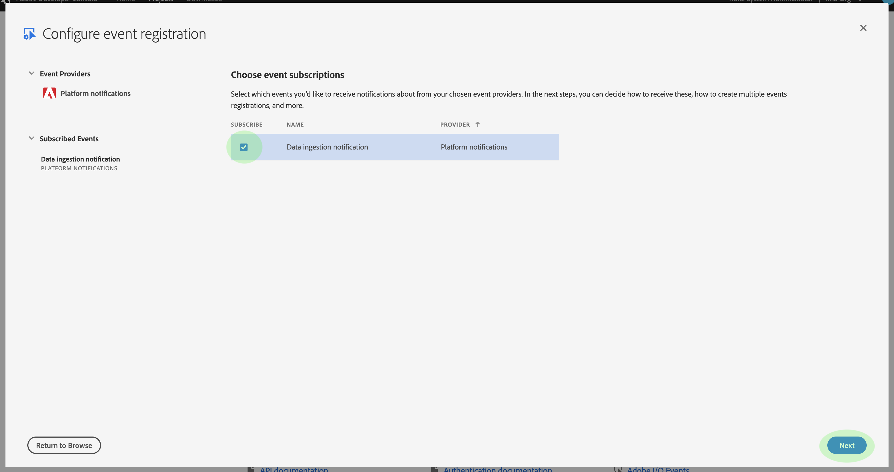

# データ取得通知

Adobe Experience Platform でデータを取得するプロセスは、複数の手順で構成されます。Once you identify data files that need to be ingested into [!DNL Platform], the ingestion process begins and each step occurs consecutively until the data is either successfully ingested or fails. 取得処理は、[Adobe データ取得 API](https://www.adobe.io/apis/experienceplatform/home/api-reference.html#!acpdr/swagger-specs/ingest-api.yaml) を使用するか、Experience Platform のユーザーインターフェイスを使用して開始することができます。[!DNL Experience Platform]

Data loaded into [!DNL Platform] must go through multiple steps in order to reach its destination, the [!DNL Data Lake] or the [!DNL Real-time Customer Profile] data store. 各手順では、データの処理やデータの検証が行われ、データが次の手順に渡される前にデータが保存されます。取得されるデータの量によっては、この処理に時間がかかる場合があり、検証、セマンティクスまたは処理エラーが原因でプロセスが失敗する可能性が常にあります。失敗した場合は、データの問題を修正し、修正したデータファイルを使用して取得プロセス全体を再開する必要があります。

To assist in monitoring the ingestion process, [!DNL Experience Platform] makes it possible to subscribe to a set of events that are published by each step of the process, notifying you to the status of the ingested data and any possible failures.

## 使用可能なステータス通知イベント

サブスクライブできる使用可能なデータ取得ステータス通知のリストを以下に示しています。

>[!NOTE]
>
> すべてのデータ取得通知に対して 1 つのイベントトピックのみが提供されます。異なるステータスを区別するために、イベントコードを使用できます。

| プラットフォームサービス | ステータス | イベントの説明 | イベントコード |
| ---------------- | ------ | ----------------- | ---------- |
| データランディング | 成功 | 取得 - バッチが成功しました | ing_load_success |
| データランディング | 失敗 | 取得 - バッチが失敗しました | ing_load_failure |
| リアルタイム顧客プロファイル | 成功 | プロファイルサービス - データの読み込みバッチが成功しました | ps_load_success |
| リアルタイム顧客プロファイル | 失敗 | プロファイルサービス - データの読み込みバッチが失敗しました | ps_load_failure |
| ID グラフ | 成功 | ID グラフ - データの読み込みバッチが成功しました | ig_load_success |
| ID グラフ | 失敗 | ID グラフ - データの読み込みバッチが失敗しました | ig_load_failure |

## 通知ペイロードスキーマ

The data ingestion notification event schema is an [!DNL Experience Data Model] (XDM) schema containing fields and values that provide details regarding the status of the data being ingested. Please visit the public XDM [!DNL GitHub] repo in order to view the latest [notification payload schema](https://github.com/adobe/xdm/blob/master/schemas/common/notifications/ingestion.schema.json).

## データ取り込みステータス通知のサブスクライブ

[Adobe I/O Events](https://www.adobe.io/apis/experienceplatform/events.html) を使用すると、Web フックで複数の通知タイプにサブスクライブできます。以下の節では、Adobeデベロッパーコンソールを使用してデータ取り込みイベントの [!DNL Platform] 通知をサブスクライブする手順を説明します。

### Adobeデベロッパーコンソールでの新しいプロジェクトの作成

Go to [Adobe Developer Console](https://www.adobe.com/go/devs_console_ui) and sign in with your Adobe ID. 次に、Adobeデベロッパーコンソールのドキュメントで、空のプロジェクトの [作成に関するチュートリアルに説明されている手順に従います](https://www.adobe.io/apis/experienceplatform/console/docs.html#!AdobeDocs/adobeio-console/master/projects-empty.md) 。

### プロジェクトへの追加イベント [!DNL Experience Platform]

新しいプロジェクトを作成したら、そのプロジェクトの概要画面に移動します。 From here, click **[!UICONTROL Add event]**.

The _[!UICONTROL Add events]_dialog appears. 「**[!UICONTROL  Experience Platform ]**」をクリックして利用可能なオプションのリストをフィルターし、「**[!UICONTROL &#x200B;次へ&#x200B;]**」をクリックする前に**[!UICONTROL  Platform通知&#x200B;]**をクリックします。

次の画面には、登録するイベントタイプのリストが表示されます。 「 **[!UICONTROL データ取り込み通知]**」を選択し、「 **[!UICONTROL 次へ]**」をクリックします。

次の画面では、JSON Web Token(JWT)の作成を求めるプロンプトが表示されます。 自動的にキーペアを生成するか、端末で生成した独自の公開鍵をアップロードするかを選択できます。

このチュートリアルでは、最初のオプションに従います。 「キーペアを **[!UICONTROL 生成」のオプションボックスをクリックし]**、右下隅の「キーペアを **[!UICONTROL 生成]** 」ボタンをクリックします。

キーペアが生成されると、ブラウザーによって自動的にダウンロードされます。 このファイルは開発者コンソールで保持されないので、自分で保存する必要があります。

次の画面では、新しく生成されたキーペアの詳細を確認できます。 「**[!UICONTROL 次へ]**」をクリックして次に進みます。

次の画面で、イベント登録の名前と説明を入力します。 ベストプラクティスは、同じプロジェクト内の他のユーザーとこのイベントの登録を区別できるように、一意で、簡単に識別できる名前を作成することです。

同じ画面の下で、イベントの受信方法をオプションで設定できます。 **[!UICONTROL Webhook]** では、イベントを受け取るカスタムWebフックアドレスを指定できますが、 **[!UICONTROL Runtime action]** では [Adobe I/O Runtimeを使用して同じことを行えます](https://www.adobe.io/apis/experienceplatform/runtime/docs.html)。

このチュートリアルでは、このオプションの設定手順は省略します。 完了したら、「設定済みのイベントを **[!UICONTROL 保存]** 」をクリックしてイベントの登録を完了します。

新しく作成されたイベント登録の詳細ページが表示され、受信したイベントを確認し、デバッグトレースを実行して設定を編集できます。

## 次の手順

プロジェクトに [!DNL Platform] 通知を登録すると、プロジェクトダッシュボードから受信したイベントを表示できます。 イベントのトレース方法の詳細については、「[Adobe I/O Events のトレース](https://www.adobe.io/apis/experienceplatform/events/docs.html#!adobedocs/adobeio-events/master/support/tracing.md)」に関するガイドを参照してください。
