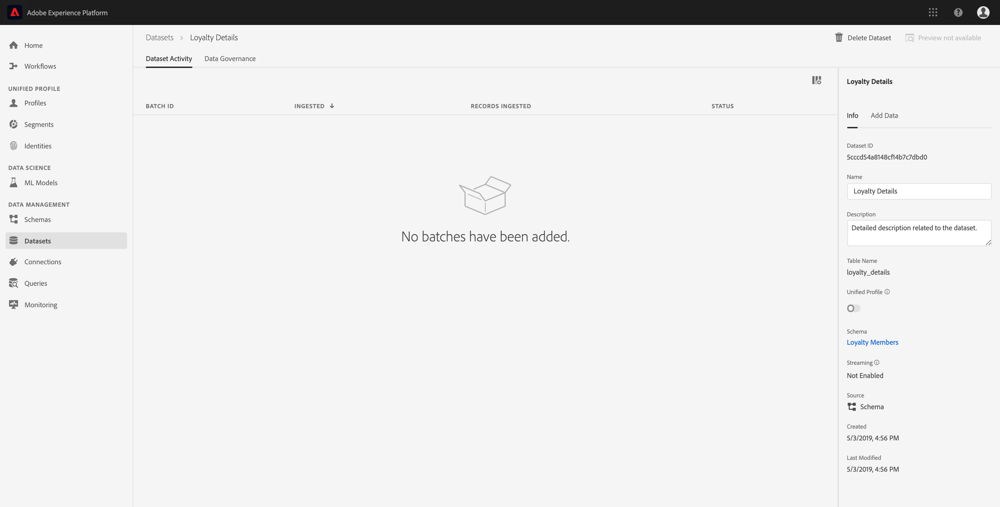

# Adobe Experience Platform へのデータの取得

Adobe Experience Platform allows you to easily import data into [!DNL Platform] as batch files. Examples of data to be ingested may include profile data from a flat file in a CRM system (such as a parquet file) or data that conforms to a known [!DNL Experience Data Model] (XDM) schema in the Schema Registry.

## はじめに

In order to complete this tutorial, you must have access to [!DNL Experience Platform]. If you do not have access to an IMS Organization in [!DNL Experience Platform], please speak to your system administrator before proceeding.

データ取得 API を使用してデータを取得する場合は、まず『[バッチ取得開発者ガイド](../batch-ingestion/api-overview.md)』をお読みください。

## データセットワークスペース

The Datasets workspace within [!DNL Experience Platform] allows you to view and manage all of the datasets that your IMS organization has made, as well as create new ones.

左側のナビゲーションで「**[!UICONTROL データセット]**」をクリックして、「データセット」ワークスペースを表示します。「データセット」ワークスペースには、_[!UICONTROL 名前]_、_[!UICONTROL 作成日時]_、_[!UICONTROL ソース]_、_[!UICONTROL スキーマ]_、_[!UICONTROL 最終バッチステータス]_&#x200B;を示す列、および&#x200B;_[!UICONTROL 最終更新日時]_&#x200B;を含むデータセットのリストが含まれています。

>[!NOTE]
>
>Click on the filter icon next to the Search bar to use filtering capabilities to view only those datasets enabled for [!DNL Profile].

## データセットの作成

データセットを作成するには、「データセット」ワークスペースの右上隅にある「**[!UICONTROL データセットを作成]**」をクリックします。

On the **[!UICONTROL Create Dataset]** screen, select whether you would like to &quot;[!UICONTROL Create Dataset from Schema]&quot; or &quot;[!UICONTROL Create Dataset from CSV File]&quot;.

このチュートリアルでは、スキーマを使用してデータセットを作成します。続行するには、「**[!UICONTROL スキーマからデータセットを作成]**」をクリックします。

## データセットスキーマの選択

**[!UICONTROL スキーマを選択]**&#x200B;画面で、使用するスキーマの横にあるラジオボタンをクリックしてスキーマを選択します。このチュートリアルでは、データセットは Loyalty Members スキーマを使用して作成します。検索バーを使用してスキーマをフィルターすると、探している正確なスキーマを見つけられます。

使用するスキーマの横のラジオボタンを選択したら、「**[!UICONTROL 次へ]**」をクリックします。

## データセットの設定

**[!UICONTROL データセットの設定]**&#x200B;画面で、データセットの&#x200B;**[!UICONTROL 名前]**&#x200B;を指定し、データセットの&#x200B;**[!UICONTROL 説明]**&#x200B;も入力できます。

**データセット名に関する注意事項：**

- 後でライブラリ内で簡単に見つけられるように、データセット名は短く、わかりやすい名前にする必要があります。
- データセット名は一意である必要があります。つまり、今後再利用されないように十分な固有の名前を付ける必要があります。
- ベストプラクティスは、説明フィールドを使用して、データセットに関する追加情報を提供することです。これは、今後、他のユーザーがデータセットを区別する際に役立つ可能性があるためです。

データセットに名前と説明が付いたら、「**[!UICONTROL 完了]**」をクリックします。

## データセットアクティビティ

空のデータセットが作成され、データセットワークスペースの「**[!UICONTROL データセットアクティビティ]**」タブに戻りました。ワークスペースの左上隅にデータセットの名前と、「バッチが追加されていません」という通知が表示されます。このデータセットにバッチをまだ追加していないので、これは期待通りです。

「データセット」ワークスペースの右側に「**[!UICONTROL 情報]**」タブがあり、新しいデータセットに関した「_[!UICONTROL データセット ID]_」、「_[!UICONTROL 名前]_」、「_[!UICONTROL 説明]_」、「_[!UICONTROL テーブル名]_」、「_[!UICONTROL スキーマ]_」、「_[!UICONTROL ストリーミング]_」「_[!UICONTROL ソース]_」などの情報が含まれます。また、「情報」タブには、データセットの&#x200B;_[!UICONTROL 作成日]_&#x200B;と&#x200B;_[!UICONTROL 最終変更日]_&#x200B;に関する情報も含まれます。

Also in the Info tab is a  _[!UICONTROL Profile]_ toggle that is used for enabling your dataset for use with [!DNL Real-time Customer Profile]. Use of this toggle, and [!DNL Real-time Customer Profile], will be explained in more detail in the section that follows.

## データセットの有効化 [!DNL Real-time Customer Profile]

Datasets are used for ingesting data into [!DNL Experience Platform], and that data is ultimately used to identify individuals and stitch together information coming from multiple sources. 情報を繋ぎ合わせたものを「」と呼び [!DNL Real-Time Customer Profile]ます In order for [!DNL Platform] to know which information should be included in the [!DNL Real-Time Profile], datasets can be marked for inclusion using the **[!UICONTROL Profile]** toggle.

デフォルトでは、この切り替えはオフになっています。If you choose to toggle on [!DNL Profile], all data ingested into the dataset will be used to help identify an individual and stitch together their [!DNL Real-Time Profile].

To learn more about [!DNL Real-time Customer Profile] and working with identities, please review the [Identity Service](../../identity-service/home.md) documentation.

To enable the dataset for [!DNL Real-time Customer Profile], click the **[!UICONTROL Profile]** toggle in the **[!UICONTROL Info]** tab.

A dialog will appear asking you to confirm that you want to enable the dataset for [!DNL Real-time Customer Profile].

「**[!UICONTROL 有効]**」をクリックすると、切り替えが青に変わり、オンになっていることを示します。

## データセットへのデータの追加

データは様々な方法でデータセットに追加できます。You could choose to use [!DNL Data Ingestion] APIs or an ETL partner such as [!DNL Unifi] or [!DNL Informatica]. このチュートリアルでは、UI 内の「**[!UICONTROL データの追加]**」タブを使用してデータセットにデータを追加します。

データセットへのデータの追加を開始するには、「**[!UICONTROL データの追加]**」タブをクリックします 。ファイルをドラッグ&amp;ドロップしたり、追加するファイルをコンピューターで参照したりできるようになりました。

>[!NOTE]
>
> Platform では、データ取得用に 2 種類のファイル（parquet、JSON）がサポートされています。一度に 5 個までのファイルを追加でき、各ファイルの最大ファイルサイズは 10GB です。

## ファイルのアップロード

Once you drag and drop (or browse and select) a parquet or JSON file that you wish to upload, [!DNL Platform] will immediately begin to process the file and an **[!UICONTROL Uploading]** dialog will appear on the **[!UICONTROL Add Data]** tab showing the progress of your file upload.

## データセット指標

ファイルのアップロードが完了すると、「**[!UICONTROL データセットのアクティビティ]** 」タブに「バッチが追加されていません」と表示されることはなくなります。Instead, the *[!UICONTROL Dataset Activity]* tab now shows dataset metrics. バッチがまだ読み込まれていないので、すべての指標はこの段階で「0」と表示されます。

タブの下部には、「[データセットへのデータ追加](#add-data-to-dataset)」処理で取得されたデータの&#x200B;_[!UICONTROL バッチ ID]_ を示す追加リストが表示されます。また、_[!UICONTROL 取得]_&#x200B;された日付、取得された&#x200B;_[!UICONTROL レコード数]_、現在のバッチ&#x200B;_[!UICONTROL 状態]_&#x200B;など、バッチに関する情報も含まれます 。

## バッチの詳細

**[!UICONTROL バッチの概要]**&#x200B;でバッチに関する追加の詳細を表示するには「_[!UICONTROL バッチ ID]_」をクリックします。バッチの読み込みが完了すると、バッチに関する情報が更新され、_[!UICONTROL 取得されたレコード数]_&#x200B;と&#x200B;_[!UICONTROL ファイルサイズ]_&#x200B;が表示されます。「 _[!UICONTROL ステータス]_」も「成功」または「失敗」に変更されます。バッチが失敗した場合は、取得中に「_[!UICONTROL エラーコード]_」セクションに、エラーに関する詳細が含まれます。

バッチ取得に関する詳細とよくある質問については、『[バッチ取得のトラブルシューティングガイド](../batch-ingestion/troubleshooting.md)』を参照してください。

**[!UICONTROL データセットアクティビティ]**&#x200B;画面に戻るには 、階層リンクでデータセットの名前（_[!UICONTROL Loyalty Details]_）をクリックします。

## データセットのプレビュー

データセットの準備が整うと、「**[!UICONTROL データセットアクティビティ]**」タブの上部に「**[!UICONTROL データセットのプレビュー]**」オプションが表示されます。

「**[!UICONTROL プレビューデータセット]**」をクリックすると、データセット内のサンプルデータを示すダイアログが開きます。データセットがスキーマを使用して作成された場合は、データセットスキーマの詳細がプレビューの左側に表示されます。矢印を使用してスキーマを展開し、構造を確認できます。データセット内の各列見出しは、プレビューセット内の 1 つのフィールドを表します。

## 次の手順 およびその他のリソース

Now that you have created a dataset and successfully ingested data into [!DNL Experience Platform], you can repeat these steps to create a new dataset or ingest more data into the existing dataset.

バッチ取り込みの詳細については、 [バッチ取り込みの概要を読み](../batch-ingestion/overview.md) 、次のビデオを参照して学習を補ってください。

>[!WARNING]
>
>次のビデオに示す [!DNL Platform] UIは古いです。 最新のUIのスクリーンショットと機能については、上記のドキュメントを参照してください。

>[!VIDEO](https://video.tv.adobe.com/v/27269?quality=12&learn=on)
