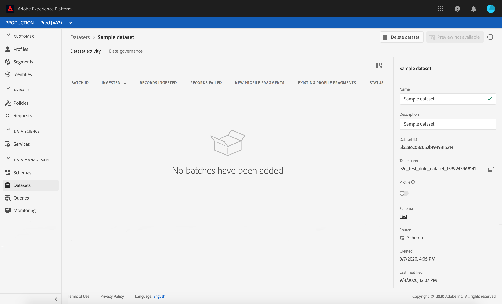

# Adobe Experience Platform へのデータの取得

Adobe Experience Platformでは、データをバッチファイルとして[!DNL Platform]に簡単にインポートできます。 取り込むデータの例としては、CRMシステムのフラットファイル（Parketファイルなど）のプロファイルデータ、またはスキーマレジストリの既知の[!DNL Experience Data Model](XDM)スキーマに適合するデータが挙げられる。

## はじめに

このチュートリアルを完了するには、[!DNL Experience Platform]にアクセスできる必要があります。 [!DNL Experience Platform]のIMS組織にアクセスできない場合は、先に進む前に、システム管理者にお問い合わせください。

データ取得 API を使用してデータを取得する場合は、まず『[バッチ取得開発者ガイド](../batch-ingestion/api-overview.md)』をお読みください。

## データセットワークスペース

[!DNL Experience Platform]内のDatasetsワークスペースを使用すると、IMS組織が作成したすべてのデータセットの表示と管理を行うことができ、また、新しいデータセットを作成することもできます。

左側のナビゲーションで「**[!UICONTROL データセット]**」をクリックして、「データセット」ワークスペースを表示します。データセットワークスペースには、名前、作成日時、ソース、スキーマ、最終バッチステータスを示す列や、データセットが最後に更新された日時など、データセットのリストが含まれます。

>[!NOTE]
>
>検索バーの横にあるフィルターアイコンをクリックして、フィルター機能を使用し、[!DNL Profile]に対して有効になっているデータセットのみを表示します。

## データセットの作成

データセットを作成するには、「データセット」ワークスペースの右上隅にある「**[!UICONTROL データセットを作成]**」をクリックします。

**[!UICONTROL データセットを作成]**&#x200B;画面で、「[!UICONTROL スキーマからデータセットを作成]」を選択するか、「[!UICONTROL CSVファイルからデータセットを作成]」を選択します。

このチュートリアルでは、スキーマを使用してデータセットを作成します。続行するには、「**[!UICONTROL スキーマからデータセットを作成]**」をクリックします。

## データセットスキーマの選択

**[!UICONTROL スキーマを選択]**&#x200B;画面で、使用するスキーマの横にあるラジオボタンをクリックしてスキーマを選択します。このチュートリアルでは、データセットは Loyalty Members スキーマを使用して作成します。検索バーを使用してスキーマをフィルターすると、探している正確なスキーマを見つけられます。

使用するスキーマの横のラジオボタンを選択したら、「**[!UICONTROL 次へ]**」をクリックします。

## データセットの設定

**[!UICONTROL データセットを設定]**&#x200B;画面で、データセットに名前を付け、データセットの説明も入力する必要があります。

**データセット名に関する注意事項：**

- 後でライブラリ内で簡単に見つけられるように、データセット名は短く、わかりやすい名前にする必要があります。
- データセット名は一意である必要があります。つまり、今後再利用されないように十分な固有の名前を付ける必要があります。
- ベストプラクティスは、説明フィールドを使用して、データセットに関する追加情報を提供することです。これは、今後、他のユーザーがデータセットを区別する際に役立つ可能性があるためです。

データセットに名前と説明が付いたら、「**[!UICONTROL 完了]**」をクリックします。

## データセットアクティビティ

空のデータセットが作成され、データセットワークスペースの「**[!UICONTROL データセットアクティビティ]**」タブに戻りました。ワークスペースの左上隅にデータセットの名前と、「バッチが追加されていません」という通知が表示されます。このデータセットにバッチをまだ追加していないので、これは期待通りです。

データセットワークスペースの右側には、「**[!UICONTROL 情報]**」タブが表示され、データセットID、名前、説明、テーブル名、スキーマ、ストリーミング、ソースなど、新しいデータセットに関連する情報が示されます。 「情報」タブには、データセットの作成日時と最終変更日に関する情報も表示されます。

また、「情報」タブには、**[!UICONTROL プロファイル]**&#x200B;の切り替えがあり、[!DNL Real-time Customer Profile]でデータセットを有効にするのに使用します。 この切り替えと[!DNL Real-time Customer Profile]の使い方については、後述の節で詳しく説明します。

## [!DNL Real-time Customer Profile]のデータセットを有効にする

データセットは、データを[!DNL Experience Platform]に取り込むために使用され、最終的には、データは、個人を識別し、複数のソースから得られる情報を組み合わせるために使用されます。 組み合わされた情報を[!DNL Real-Time Customer Profile]と呼びます。 [!DNL Platform]が[!DNL Real-Time Profile]に含める情報を知るために、**[!UICONTROL プロファイル]**&#x200B;トグルを使用して、データセットを含めるようにマークできます。

デフォルトでは、この切り替えはオフになっています。[!DNL Profile]をオンに切り替えると、データセットに取り込まれたすべてのデータが、個人を識別し、[!DNL Real-Time Profile]をつなぎ合わせるのに使用されます。

[!DNL Real-time Customer Profile]とIDの使い方の詳細については、[IDサービス](../../identity-service/home.md)のドキュメントを参照してください。

[!DNL Real-time Customer Profile]のデータセットを有効にするには、「**[!UICONTROL 情報]**」タブの&#x200B;**[!UICONTROL プロファイル]**&#x200B;をクリックします。

[!DNL Real-time Customer Profile]のデータセットを有効にするかどうかを確認するダイアログが表示されます。

「**[!UICONTROL 有効]**」をクリックすると、切り替えが青に変わり、オンになっていることを示します。

## データセットへのデータの追加

データは様々な方法でデータセットに追加できます。[!DNL Data Ingestion] APIまたは[!DNL Unifi]や[!DNL Informatica]などのETLパートナーを使用するよう選択できます。 このチュートリアルでは、UI 内の「**[!UICONTROL データの追加]**」タブを使用してデータセットにデータを追加します。

データセットへのデータの追加を開始するには、「**[!UICONTROL データの追加]**」タブをクリックします 。ファイルをドラッグ&amp;ドロップしたり、追加するファイルをコンピューターで参照したりできるようになりました。

>[!NOTE]
>
>プラットフォームでは、データ取り込みに2種類のファイル（ParketまたはJSON）がサポートされています。 一度に 5 個までのファイルを追加でき、各ファイルの最大ファイルサイズは 10GB です。

## ファイルのアップロード

アップロードするParketまたはJSONファイルをドラッグ&amp;ドロップ（または参照&amp;選択）すると、[!DNL Platform]はすぐにファイルの処理を開始し、**[!UICONTROL 追加「データ]**」タブに&#x200B;**[!UICONTROL アップロード]**&#x200B;ダイアログが表示され、ファイルのアップロードの進行状況が示されます。

## データセット指標

ファイルのアップロードが完了すると、「**[!UICONTROL データセットのアクティビティ]** 」タブに「バッチが追加されていません」と表示されることはなくなります。代わりに、「**[!UICONTROL データセットアクティビティ]**」タブにデータセット指標が表示されるようになりました。 バッチがまだ読み込まれていないので、すべての指標はこの段階で「0」と表示されます。

タブの下部には、「[データセットへのデータ追加](#add-data-to-dataset)」処理で取得されたデータの&#x200B;**[!UICONTROL バッチ ID]** を示す追加リストが表示されます。また、取り込んだ日付、取り込んだ記録数、現在のバッチ状態など、バッチに関する情報も含まれます。

## バッチの詳細

**[!UICONTROL バッチの概要]**&#x200B;でバッチに関する追加の詳細を表示するには「**[!UICONTROL バッチ ID]**」をクリックします。バッチの読み込みが完了すると、バッチに関する情報が更新され、取り込まれたレコード数とファイルサイズが表示されます。 ステータスも「成功」または「失敗」に変わります。 バッチが失敗した場合は、取得中に「**[!UICONTROL エラーコード]**」セクションに、エラーに関する詳細が含まれます。

バッチ取得に関する詳細とよくある質問については、『[バッチ取得のトラブルシューティングガイド](../batch-ingestion/troubleshooting.md)』を参照してください。

**[!UICONTROL データセットアクティビティ]**&#x200B;画面に戻るには 、階層リンクでデータセットの名前（**[!UICONTROL Loyalty Details]**）をクリックします。

## データセットのプレビュー

データセットの準備が整うと、「**[!UICONTROL データセットアクティビティ]**」タブの上部に「**[!UICONTROL データセットのプレビュー]**」オプションが表示されます。

「**[!UICONTROL プレビューデータセット]**」をクリックすると、データセット内のサンプルデータを示すダイアログが開きます。データセットがスキーマを使用して作成された場合は、データセットスキーマの詳細がプレビューの左側に表示されます。矢印を使用してスキーマを展開し、構造を確認できます。データセット内の各列見出しは、プレビューセット内の 1 つのフィールドを表します。

## 次の手順 およびその他のリソース

データセットを作成し、データを[!DNL Experience Platform]に正しく取り込んだので、これらの手順を繰り返して新しいデータセットを作成するか、既存のデータセットにデータを取り込みます。

バッチインジェストの詳細については、[バッチインジェストの概要](../batch-ingestion/overview.md)を参照し、以下のビデオを見て学習内容を補ってください。

>[!WARNING]
>
>次のビデオに示す[!DNL Platform] UIは古いです。 最新のUIのスクリーンショットと機能については、上記のドキュメントを参照してください。

>[!VIDEO](https://video.tv.adobe.com/v/27269?quality=12&learn=on)
