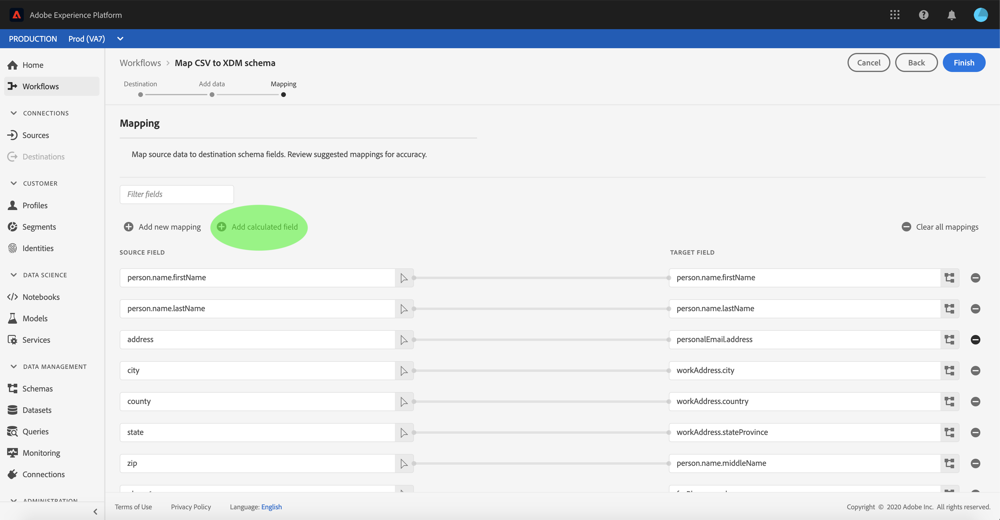

# XDM スキーマへの CSV ファイルのマッピング

CSV データを [!DNL Adobe Experience Platform] に取り込むには、データを [!DNL Experience Data Model](XDM) スキーマにマッピングする必要があります。 このチュートリアルでは、[!DNL Platform] ユーザーインターフェイスを使用して CSV ファイルを XDM スキーマにマッピングする方法について説明します。

また、このチュートリアルの付録では、[マッピング関数](#mapping-functions)の使用に関する詳細情報を提供します。

## はじめに

このチュートリアルでは、[!DNL Platform] の次のコンポーネントに関する十分な知識が必要です。

- [[!DNL Experience Data Model (XDM System)]](../../xdm/home.md)：顧客体験データを編成する際に [!DNL Platform] に使用される標準化されたフレームワーク。
- [[!DNL Batch ingestion]](../batch-ingestion/overview.md):ユーザー指定のデ [!DNL Platform] ータファイルからデータを取り込む方法。

また、このチュートリアルでは、CSV データの取り込み先のデータセットを既に作成している必要があります。UI でデータセットを作成する手順については、[データ取得のチュートリアル](./ingest-batch-data.md)を参照してください。

## 宛先の選択

[[!DNL Adobe Experience Platform]](https://platform.adobe.com) にログインし、左側のナビゲーションバーから「**[!UICONTROL ワークフロー]**」を選択して、「**[!UICONTROL ワークフロー]**」ワークスペースにアクセスします。

**[!UICONTROL ワークフロー]** 画面の「**[!UICONTROL データ取得]**」セクションで「**[!UICONTROL CSV を XDM スキーマにマッピング]**」を選択し、「**[!UICONTROL Launch]**」を選択します。

「**[!UICONTROL XDM スキーマに CSV をマッピング]**」ワークフローが表示され、「**[!UICONTROL 宛先]**」手順を開始します。 取り込む受信データのデータセットを選択します。 既存のデータセットを使用するか、新しく作成できます。

**既存のデータセットを使用する**

CSV データを既存のデータセットに取り込むには、「**[!UICONTROL 既存のデータセットを使用]**」を選択します。 既存のデータセットを取得するには、検索関数を使用するか、パネルで既存のデータセットのリストをスクロールします。

CSV データを新しいデータセットに取り込むには、「**[!UICONTROL 新しいデータセットを作成]**」を選択し、指定したフィールドにデータセットの名前と説明を入力します。 検索関数を使用するか、提供されるスキーマのリストをスクロールして、スキーマを選択します。 「**[!UICONTROL 次へ]**」を選択して次に進みます。

## データの追加

「**[!UICONTROL データ追加]**」手順が表示されます。CSV ファイルを指定されたスペースにドラッグ&amp;ドロップするか、「**[!UICONTROL ファイルを選択]**」を選択して CSV ファイルを手動で入力します。

ファイルがアップロードされると、「**[!UICONTROL サンプルデータ]**」セクションが表示され、最初の 10 行のデータが表示されます。 データが期待どおりにアップロードされたことを確認したら、「**[!UICONTROL 次へ]**」を選択します。

## XDM スキーマフィールドへの CSV フィールドのマッピング

「**[!UICONTROL マッピング]**」手順が表示されます。CSV ファイルの列は「**[!UICONTROL ソースフィールド]**」の下にリストされ、対応する XDM スキーマフィールドが「**[!UICONTROL ターゲットフィールド]**」の下にリストされます。

[!DNL Platform] は、選択したターゲットスキーマまたはデータセットに基づいて、自動マッピングされたフィールドに対してインテリジェントなレコメンデーションを自動的に提供します。マッピングルールは、使用例に合わせて手動で調整できます。

すべての自動生成マッピング値を受け入れるには、「[!UICONTROL  すべてのターゲットフィールドを受け入れる ]」というラベルのチェックボックスをオンにします。

ソーススキーマに複数のレコメンデーションが使用できる場合があります。 この場合、マッピングカードには最も目立つレコメンデーションが表示され、その後に使用可能なレコメンデーションの数を示す青い円が表示されます。 電球アイコンを選択すると、追加の推奨事項のリストが表示されます。 代わりに、マッピング先のレコメンデーションの横にあるチェックボックスを選択して、代替レコメンデーションの 1 つを選択できます。

または、ソーススキーマを手動でターゲットスキーマにマッピングすることもできます。 マッピングするソーススキーマの上にマウスポインターを置き、プラスアイコンを選択します。

「**[!UICONTROL ソースをターゲットフィールドにマッピング]**」ポップオーバーが表示されます。 ここから、マッピングするフィールドを選択し、「**[!UICONTROL 保存]**」を選択して新しいマッピングを追加できます。

マッピングの 1 つを削除する場合は、そのマッピングの上にマウスポインターを置いて、マイナスアイコンを選択します。

### 計算フィールドの追加 {#add-calculated-field}

計算フィールドでは、入力スキーマの属性に基づいて値を作成できます。 これらの値をターゲットスキーマの属性に割り当て、名前と説明を指定して参照を容易にできます。

「**[!UICONTROL 計算済みフィールドを追加]**」ボタンを選択して次に進みます。

**[!UICONTROL 計算フィールドの作成]** パネルが表示されます。 左側のダイアログボックスには、計算フィールドでサポートされるフィールド、関数、演算子が含まれています。タブの 1 つを選択して、式エディターに関数、フィールドまたは演算子を追加します。

| タブ | 説明 |
| --------- | ----------- |
| フィールド | 「フィールド」タブには、ソーススキーマで使用できるフィールドと属性が表示されます。 |
| 関数 | 「関数」タブには、データの変換に使用できる関数が一覧表示されます。計算フィールド内で使用できる関数の詳細については、 [データ準備（マッパー）関数の使用](../../data-prep/functions.md) に関するガイドを参照してください。 |
| 演算子 | 「演算子」タブには、データの変換に使用できる演算子が一覧表示されます。 |

中央にある式エディターを使用して、フィールド、関数、演算子を手動で追加できます。 式の作成を開始するには、エディターを選択します。

「**[!UICONTROL 保存]**」を選択して次に進みます。

マッピング画面が再表示され、新しく作成したソースフィールドが表示されます。 対応するターゲットフィールドを適用し、「**[!UICONTROL 完了]**」を選択してマッピングを完了します。

## データ取得の監視

CSV ファイルがマッピングされ、作成されたら、CSV ファイルを通じて取り込まれるデータを監視できます。 データ取り込みの監視について詳しくは、[ データ取り込みの監視 ](../../ingestion/quality/monitor-data-ingestion.md) に関するチュートリアルを参照してください。

## 次の手順

このチュートリアルに従うと、フラットな CSV ファイルを XDM スキーマにマッピングし、[!DNL Platform] に取り込むことができます。 このデータは、[!DNL Real-time Customer Profile] などのダウンストリームの [!DNL Platform] サービスで使用できるようになりました。 詳しくは、[[!DNL Real-time Customer Profile]](../../profile/home.md) の概要を参照してください。
