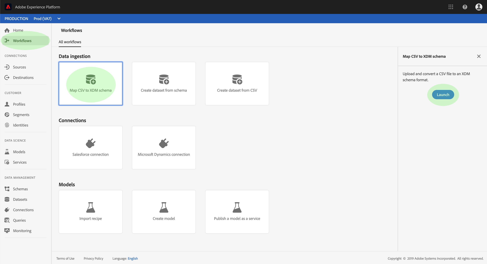

# CSVファイルのXDMへのマッピングスキーマ

CSVデータをAdobe Experience Platformに取り込むには、データをエクスペリエンスデータモデル(XDM)スキーマにマップする必要があります。 このチュートリアルでは、Experience Platformユーザーインターフェイスを使用してCSVファイルをXDMスキーマにマップする方法について説明します。

さらに、このチュートリアルの付録では、マッピング関数の使用に関する詳細情報を [提供します](#mapping-functions)。

## はじめに

このチュートリアルでは、Adobe Experience Platformの次のコンポーネントについて、十分な理解を得る必要があります。

- [エクスペリエンスデータモデル(XDM System)](../../xdm/home.md):エクスペリエンスプラットフォームが顧客エクスペリエンスデータを整理するための標準化されたフレームワーク。
- [バッチインジェスト](../batch-ingestion/overview.md):プラットフォームがユーザー指定のデータファイルからデータを取り込む方法。

また、このチュートリアルでは、CSVデータを取り込むデータセットを既に作成している必要があります。 UIでデータセットを作成する手順については、データ取り込みのチュートリアル [を参照してください](./ingest-batch-data.md)。

## 追加データ

Experience Platform UIで、左側のナビゲーションの **ワークフロー** をクリックし、「 **CSVをXDMスキーマにマップ」をクリックします**。 表示される右側のパネルで、「起動」をクリックし **ます**。

「 _CSVをXDMにマップ」スキーマ_ ・ワークフローが、データ手順で表示 _追加されます_ 。

CSVファイルを指定されたスペースにドラッグ&amp;ドロップするか、「参照」をクリックし **て** 、ファイルを直接選択します。 ファイ _ルがアップロードされると_ 、「サンプルデータ」セクションが表示され、最初の10行のデータが表示されます。 データが期待どおりにアップロードされたことを確認したら、「次へ」をクリッ **クします**。

## 宛先の選択

The _Destination_ step appears. 提供されたリストから、CSVデータの取り込み先のデータセットを選択し、「次へ」をクリック **します**。

## CSVフィールドのXDMスキーマフィールドへのマップ

The _Mapping_ step appears. CSVファイルの列は「 _Source Field_」の下に表示され、対応するXDMスキーマフィールドが「 _ターゲットフィールド_」の下に表示されます。 未選択のターゲットフィールドは赤で囲まれます。

CSV列をXDMフィールドにマップするには、列の対応するスキーマフィールドの横にあるターゲットアイコンをクリックします。

[ _スキーマの選択_ ]ウィンドウが開きます。 ここで、XDMスキーマの構造を探し、CSV列のマッピング先のフィールドを探します。 XDMフィールドをクリックして選択し、「 **Select」をクリックします**。

「マッピ _ング_ 」画面が再び表示され、選択したXDMフィールドが「マッピングフィールド」の下に表 _示されます_。

特定のCSV列をマッピングしない場合は、「ターゲット」フィールドの横にある削除アイコンをクリッ **クして** 、マッピングを削除できます。 新しいマッピングを追加する場合は、 **** 追加リストの下部にある新しいマッピングをクリックします。

フィールドをマッピングする際には、入力ソースフィールドに基づいて値を計算する関数を含めることもできます。 詳しくは、付 [録の「マッピング関数](#mapping-functions) 」の節を参照してください。

上記の手順を繰り返して、CSV列のXDMフィールドへのマッピングを続行します。 完了したら、「次へ」をクリッ **クします**。

## データの取り込み

インジェ _スト_ (Ingest)ステップが表示され、ソースファイルとインジェストデータセットの詳細を確認できるターゲットが表示されます。 「取り込み **** 」をクリックして、CSVデータを開始取り込みます。 CSVファイルのサイズによっては、この処理に数分かかる場合があります。 取り込みが完了すると画面が更新され、成功または失敗を示します。 Click **Finish** to complete the workflow.

## 次の手順

このチュートリアルに従うと、フラットなCSVファイルをXDMスキーマにマッピングし、Platformに取り込むことができます。 このデータは、リアルタイム顧客データなど、ダウンストリームプラットフォームサービスで使用できるようになりました。プロファイル 詳しくは、リ [アルタイム顧客プロファイルの概要](../../profile/home.md) （英語）を参照してください。

## 付録

次の節では、CSV列をXDMフィールドにマッピングするための追加情報を示します。

### マッピング関数

特定のマッピング関数を使用して、ソースフィールドに入力した内容に基づいて値を計算し、計算できます。 関数を使用するには、「 _Source Field_ 」の下に適切な構文と入力を入力します。

例えば、市区町村と国 **** CSVフィールドを連結 **し、市区町村** XDMフィールドに割り当てるには、ソースフィールドを次のように設定します ****`concat(city, ", ", county)`。

次の表に、サンプルリストとその結果の出力を含む、サポートされているすべてのマッピング式を示します。

| 関数 | 説明 | サンプル式 | サンプル出力 |
| -------- | ----------- | ----------------- | ------------- |
| concat | 指定した文字列を連結します。 | concat(&quot;Hi, &quot;, &quot;there&quot;, &quot;!&quot;) | `"Hi, there!"` |
| 爆発する | 正規表現に基づいて文字列を分割し、部分の配列を返します。 | explode(&quot;Hi, there!&quot;, &quot; &quot;) | `["Hi,", "there"]` |
| instr | サブ文字列の位置/インデックスを返します。 | instr(&quot;adobe.com&quot;, &quot;com&quot;) | 6 |
| replacestr | 元の文字列に検索文字列が存在する場合は、その文字列を置き換えます。 | replacestr(&quot;This is a string re test&quot;, &quot;re&quot;, &quot;replace&quot;) | &quot;これは文字列置換テストです&quot; |
| substr | 指定した長さのサブ文字列を返します。 | substr(&quot;This is a substring test&quot;, 7, 8) | &quot; a subst&quot; |
| lower / lcase | 文字列を小文字に変換します。 | lower(&quot;HeLLo&quot;) lcase(&quot;HeLLo&quot;) | &quot;hello&quot; |
| upper ucase | 文字列を大文字に変換します。 | upper(&quot;HeLLo&quot;) ucase(&quot;HeLLo&quot;) | &quot;HELLO&quot; |
| 分割 | 区切り文字の入力文字列を分割します。 | split(&quot;Hello world&quot;, &quot; &quot;) | `["Hello", "world"]` |
| 結合 | 区切り文字を使用してリストのオブジェクトを結合します。 | `join(" ", ["Hello", "world"]`) | &quot;Hello world&quot; |
| 合体 | 渡されたリストの最初のnull以外のオブジェクトを返します。 | coalesce(null, null, null, &quot;first&quot;, null, &quot;second&quot;) | &quot;first&quot; |
| デコード | キーと、配列としてフラット化されたキーと値のペアのリストを指定すると、キーが見つかった場合は値を返し、配列に存在する場合はデフォルト値を返します。 | decode(&quot;k2&quot;, &quot;k1&quot;, &quot;v1&quot;, &quot;k2&quot;, &quot;v2&quot;, &quot;default&quot;) | &quot;v2&quot; |
| if | 渡されたブール値式を評価し、結果に基づいて指定された値を返します。 | iif(&quot;s&quot;.equalsIgnoreCase(&quot;S&quot;), &quot;True&quot;, &quot;False&quot;) | &quot;True&quot; |
| min | 渡された引数の最小値を返します。 自然な順序を使用します。 | min(3, 1, 4) | 1 |
| max | 渡された引数の最大値を返します。 自然な順序を使用します。 | max(3, 1, 4) | 4 |
| first | 最初の引数を取得します。 | first(&quot;1&quot;, &quot;2&quot;, &quot;3&quot;) | &quot;1&quot; |
| last | 最後に渡された引数を取得します。 | last(&quot;1&quot;, &quot;2&quot;, &quot;3&quot;) | &quot;3&quot; |
| uuid / guid | 擬似ランダムIDを生成します。 | uuid() guid() | {UNIQUE_ID} |
| now | 現在の時間を取得します。 | now() | `2019-10-23T10:10:24.556-07:00[America/Los_Angeles]` |
| timestamp | 現在のUnix時間を取得します。 | timestamp() | 1571850624571 |
| 形式 | 指定した形式に従って入力日を形式設定します。 | format({DATE}, &quot;yyyy-MM-dd HH:mm:ss&quot;) | &quot;2019-10-23 11:24:35&quot; |
| dformat | 指定した形式に従ってタイムスタンプを日付文字列に変換します。 | dformat(1571829875, &quot;dd-MMM-yyyy hh:mm&quot;) | &quot;2019年10月23日11:24&quot; |
| date | 日付文字列をZonedDateTimeオブジェクト（ISO 8601形式）に変換します。 | date（&quot;2019年10月23日11:24&quot;） | &quot;2019-10-23T11:24:00+00:00&quot; |
| date_part | 日付の一部を取得します。 次のコンポーネント値がサポートされています。&quot;year&quot;yyyy&quot;&quot;yy&quot;&quot;quarter&quot;   &quot;q&quot; month&quot;&quot;mm&quot;month&quot;&quot;mm&quot;&quot;month&quot;&quot;mm&quot;&quot;month&quot;&quot;m&quot;&quot; day&quot;&quot;yone&quot;&quot;  day&quot;day&quot;day&quot;&quot;&quot;day&quot;&quot;&quot;dd&quot;&quot;&quot;dw&quot;&quot;&quot;&quot;ow&quot;ow&quot;ow&quot;ow&quot;                                      &quot;&quot;w&quot;ow&quot;&quot;ow&quot;ow&quot;w&quot;w&quot;ow&quot;&quot;24&quot; &quot;hh12&quot; &quot;hh12&quot; &quot;h12&quot; &quot;h12&quot; &quot;h12&quot; &quot;h2&quot; &quot;h2&quot; &quot;h2&quot; &quot;h12&quot; &quot;h2&quot; &quot;h2&quot; &quot;h2&quot; &quot;h2&quot; &quot;h12&quot; &quot;h2&quot; &quot;h2&quot; &quot;h2&quot; &quot;h2&quot; &quot;h2&quot; | date_part(date(&quot;2019-10-17 11:55:12&quot;), &quot;MM&quot;) | 10 |
| set_date_part | 指定した日付のコンポーネントを置き換えます。 次のコンポーネントを使用できます。&quot;year&quot;yyyy&quot;   &quot;&#39;&#39;&#39;&#39;&#39;&#39;&#39;month&#39;&#39;&#39;mm&#39;&#39;&#39;&#39;&#39;&#39;&#39;&#39;&#39;&#39;&#39;&#39;&#39;&#39;&#39;&#39;&#39;day&#39;&#39;&#39;&#39;&#39;&#39;&#39;&#39;&#39;&#39;&#39;                     &#39;&#39;m&#39;&#39;m&#39;&#39;&#39;&#39;mi&#39;&#39;&#39;mi&#39;&#39;&#39;&#39;mi&#39;&#39;&#39;&#39;&#39;&#39;m&#39;&#39;&#39;m&#39;&#39;&#39;m&#39;&#39;&#39;&#39;&#39;&#39;&#39;&#39;&#39;&#39;&#39;&#39;&#39;&#39;&#39;&#39;&#39;&#39;&#39;&#39;&#39;&#39;&#39;&#39;&#39;m&#39;&#39;&#39;&#39;&#39;m&#39;&#39;&#39;&#39;&#39;&#39;&#39;&#39;&#39;&#39;&#39;&#39;&#39;&#39;&#39;&#39;&#39;&#39;&#39;&#39;&#39;&#39;&#39;&#39;&#39;&#39;&#39;&#39;&#39;&#39;&#39;&#39;&#39;&#39;m&#39;&#39;&#39;&#39;&#39;&#39;&#39;&#39;&#39;&#39;&#39;&#39;&#39;&#39;&#39;&#39;&#39;&#39;&#39;&#39;&#39;&#39;&#39;&#39;&#39;&#39;&#39;&#39;&#39;&#39;&#39;&#39;&#39;&#39;&#39;&#39;&#39;&#39;&#39;&#39;&#39;&#39;&#39;&#39;&#39;&#39;&#39;&#39;&#39;&#39;&#39;&#39;&#39;&#39;&#39;&#39;&#39;&#39;&#39;&#39;&#39;&#39;&#39;&#39;&#39;&#39;&#39;&#39;&#39;&#39;&#39;&#39;&#39;&#39;&#39;&#39;&#39;&#39;&#39;&#39;&#39;&#39;&#39;&#39;&#39;&#39; | set_date_part(&quot;m&quot;, 4, date(&quot;2016-11-09T11:44:44.797&quot;) | &quot;2016-04-09T11:44:44.797&quot; |
| make_date_time / make_timestamp | 部品から日付を作成します。 | make_date_time(2019, 10, 17, 11, 55, 12, 999, &quot;America/Los_Angeles&quot;) | `2019-10-17T11:55:12.0&#x200B;00000999-07:00[America/Los_Angeles]` |
| current_timestamp | 現在のタイムスタンプを返します。 | current_timestamp() | 1571850624571 |
| current_date | 時間コンポーネントなしで現在の日付を返します。 | current_date() | &quot;2019年11月18日&quot; |