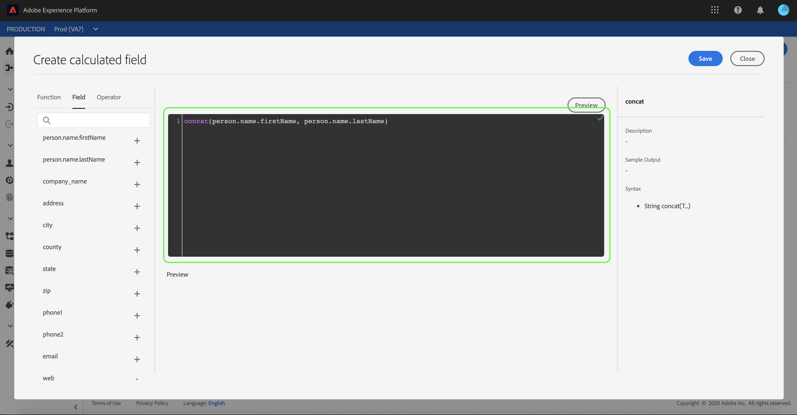

# XDM スキーマへの CSV ファイルのマッピング

In order to ingest CSV data into [!DNL Adobe Experience Platform], the data must be mapped to an [!DNL Experience Data Model] (XDM) schema. This tutorial covers how to map a CSV file to an XDM schema using the [!DNL Platform] user interface.

また、このチュートリアルの付録では、[マッピング関数](#mapping-functions)の使用に関する詳細情報を提供します。

## はじめに

This tutorial requires a working understanding of the following components of [!DNL Platform]:

- [!DNL Experience Data Model (XDM System)](../../xdm/home.md): 顧客体験データを [!DNL Platform] 整理するための標準化されたフレームワーク。
- [!DNL Batch ingestion](../batch-ingestion/overview.md): ユーザーが指定したデータファイルからデータを [!DNL Platform] 取り込む方法。

また、このチュートリアルでは、CSV データの取り込み先のデータセットを既に作成している必要があります。UI でデータセットを作成する手順については、[データ取得のチュートリアル](./ingest-batch-data.md)を参照してください。

## 宛先の選択

にログインし [!DNL Adobe Experience Platform](https://platform.adobe.com) 、左のナビゲーションバーから **[!UICONTROL ワークフローを選択して]** ワークフロー ** ワークスペースにアクセスします。

**[!UICONTROL ワークフロー]** 画面の「 **[!UICONTROL Data ingestion]** 」セクションで「 **[!UICONTROL CSVをXDMスキーマにマップ」を選択し、「]** Launch **** Launch」を選択します。

The *[!UICONTROL Map CSV to XDM schema]* workflow appears, starting on the *[!UICONTROL Destination]* step. 取り込む受信データのデータセットを選択します。 既存のデータセットを使用することも、新しいデータセットを作成することもできます。

**既存のデータセットを使用する**

CSVデータを既存のデータセットに取り込むには、「既存のデータセット **[!UICONTROL を使用]**」を選択します。 検索関数を使用して既存のデータセットを取得するか、パネル内の既存のデータセットのリストをスクロールして取得できます。

CSVデータを新しいデータセットに取り込むには、「新しいデータセットを **[!UICONTROL 作成]** 」を選択し、表示されるフィールドにデータセットの名前と説明を入力します。 検索機能を使用するか、提供されるスキーマのリストをスクロールして、スキーマを選択します。 「 **[!UICONTROL 次へ]** 」を選択して次に進みます。

## データの追加

「*[!UICONTROL データ追加]*」手順が表示されます。CSVファイルを用意されているスペースにドラッグ&amp;ドロップするか、「ファイルを **[!UICONTROL 選択]** 」を選択してCSVファイルを手動で入力します。

The *[!UICONTROL Sample data]* section appears once the file is uploaded, showing the first ten rows of data. Once you have confirmed that the data has uploaded as expected, select **[!UICONTROL Next]**.

## XDM スキーマフィールドへの CSV フィールドのマッピング

「*[!UICONTROL マッピング]*」手順が表示されます。CSV ファイルの列は「*[!UICONTROL ソースフィールド]*」の下にリストされ、対応する XDM スキーマフィールドが「*[!UICONTROL ターゲットフィールド]*」の下にリストされます。未選択のターゲットフィールドは赤で囲まれます。フィルターフィールドオプションを使用して、使用可能なソースフィールドのリストを絞り込むことができます。

CSV列をXDMフィールドにマップするには、列の対応するターゲットフィールドの横にあるスキーマアイコンを選択します。

*[!UICONTROL スキーマフィールドの選択]*&#x200B;ウィンドウが表示されます。ここで、XDM スキーマの構造をナビゲートし、CSV 列のマッピング先のフィールドを探します。XDM フィールドをクリックして選択してから、「**[!UICONTROL 選択]**」をクリックします。

「*[!UICONTROL マッピング]*」画面が再び表示され、選択した XDM フィールドが「*[!UICONTROL ターゲットフィールド]*」の下に表示されます。

特定の CSV 列をマッピングしない場合は、ターゲットフィールドの横にある&#x200B;**削除アイコン**&#x200B;をクリックして、マッピングを削除できます。「すべてのマッピングを **[!UICONTROL クリア」ボタンを選択して、すべてのマッピングを削除することもできます]**。

If you want to add a new mapping, select **[!UICONTROL Add new mapping]** at the top of the *[!UICONTROL Source Field]* list.

フィールドをマッピングする際に、入力ソースフィールドに基づいて値を計算する関数を含めることもできます。詳しくは、付録の「[マッピング関数](#mapping-functions)」の節を参照してください。

### 追加計算フィールド

計算済みフィールドでは、入力スキーマーの属性に基づいて値を作成できます。 これらの値をターゲットスキーマの属性に割り当て、名前と説明を指定して、参照しやすくすることができます。

先に進むには、 **[!UICONTROL 追加]** 計算フィールドボタンを選択します。

計算済みフィールド **[!UICONTROL を作成]** パネルが表示されます。 左側のダイアログボックスには、計算フィールドでサポートされるフィールド、関数、演算子が含まれています。 いずれかのタブを選択して、式エディタに関数、フィールドまたは演算子を追加する開始を行います。

| タブ | 説明 |
| --------- | ----------- |
| フィールド | 「フィールド」タブのリストフィールドと属性は、ソーススキーマで使用できます。 |
| 関数 | 「関数」タブには、データの変換に使用できる関数がリストされます。 |
| 演算子 | 「operators」タブには、データの変換に使用できる演算子がリストされます。 |

中央の式エディターを使用して、手動でフィールド、関数および演算子を追加できます。 式の作成を開始するエディタを選択します。

「 **[!UICONTROL 保存]** 」を選択して続行します。

マッピング画面が再び開き、新しく作成したソースフィールドが表示されます。 対応するターゲットフィールドを適用し、「 **[!UICONTROL 完了]** 」を選択してマッピングを完了します。

## データフローの監視

CSVファイルをマッピングして作成したら、ファイルを介して取り込まれるデータを監視できます。 データフローの監視の詳細については、「ストリーミングデータフローの [監視に関するチュートリアル](../../ingestion/quality/monitor-data-flows.md)」を参照してください。

## 次の手順

By following this tutorial, you have successfully mapped a flat CSV file to an XDM schema and ingested it into [!DNL Platform]. このデータは、などのダウンストリーム [!DNL Platform] サービスで使用できるようになり [!DNL Real-time Customer Profile]ました。 詳しくは、概要を参照し [!DNL Real-time Customer Profile](../../profile/home.md) てください。

## 付録

次の節では、CSV 列を XDM フィールドにマッピングするための追加情報を提供します。

### マッピング関数

特定のマッピング関数を使用して、ソースフィールドに入力した内容に基づいて値を計算できます。関数を使用するには、「*[!UICONTROL ソースフィールド]*」の下に適切な構文で関数を入力します。

例えば、**市区町村**&#x200B;と&#x200B;**国**&#x200B;の CSV フィールドを連結し、**市区町村** XDM フィールドに割り当てるには、ソースフィールドを「`concat(city, ", ", county)`」と設定します。

次の表に、サポートされているすべてのマッピング関数、サンプル式、およびその結果の出力を示します。

| 関数 | 説明 | サンプル式 | サンプル出力 |
| -------- | ----------- | ----------------- | ------------- |
| concat | 指定された文字列を連結します。 | concat(&quot;Hi, &quot;, &quot;there&quot;, &quot;!&quot;) | `"Hi, there!"` |
| explode | 正規表現に基づいて文字列を分割し、部分の配列を返します。 | explode(&quot;Hi, there!&quot;, &quot; &quot;) | `["Hi,", "there"]` |
| instr | サブ文字列の場所/インデックスを返します。 | instr(&quot;adobe.com&quot;, &quot;com&quot;) | 6 |
| replacestr | 元の文字列に検索文字列が存在する場合は、その文字列を置き換えます。 | replacestr(&quot;This is a string re test&quot;, &quot;re&quot;, &quot;replace&quot;) | &quot;This is a string replace test&quot; |
| substr | 指定された長さのサブ文字列を返します。 | substr(&quot;This is a substring test&quot;, 7, 8) | &quot;サブセット&quot; |
| lower / lcase | 文字列を小文字に変換します。 | lower(&quot;HeLLo&quot;) lcase(&quot;HeLLo&quot;) | &quot;hello&quot; |
| upper / ucase | 文字列を大文字に変換します。 | upper(&quot;HeLLo&quot;) ucase(&quot;HeLLo&quot;) | &quot;HELLO&quot; |
| split | 区切り記号で入力文字列を分割します。 | split(&quot;Hello world&quot;, &quot; &quot;) | `["Hello", "world"]` |
| join | 区切り記号を使用してオブジェクトのリストを結合します。 | `join(" ", ["Hello", "world"]`) | &quot;Hello world&quot; |
| coalesce | 指定されたリスト内の最初の null 以外のオブジェクトを返します。 | coalesce(null, null, null, &quot;first&quot;, null, &quot;second&quot;) | &quot;first&quot; |
| decode | キーと、キーと値のペアのリストが配列としてフラット化されている場合、この関数は、キーが見つかった場合は値を返し、デフォルト値が配列に存在する場合はデフォルト値を返します。 | decode(&quot;k2&quot;, &quot;k1&quot;, &quot;v1&quot;, &quot;k2&quot;, &quot;v2&quot;, &quot;default&quot;) | &quot;v2&quot; |
| iif | 指定されたブール式を評価し、結果に基づいて指定された値を返します。 | iif(&quot;s&quot;.equalsIgnoreCase(&quot;S&quot;), &quot;True&quot;, &quot;False&quot;) | &quot;True&quot; |
| min | 指定された引数の最小値を返します。自然な順序を使用します。 | min(3, 1, 4) | 1 |
| max | 指定された引数の最大値を返します。自然な順序を使用します。 | max(3, 1, 4) | 4 |
| first | 最初の指定された引数を取得します。 | first(&quot;1&quot;, &quot;2&quot;, &quot;3&quot;) | &quot;1&quot; |
| last | 最後の指定された引数を取得します。 | last(&quot;1&quot;, &quot;2&quot;, &quot;3&quot;) | &quot;3&quot; |
| uuid / guid | 擬似ランダム ID を生成します。 | uuid() guid() | {UNIQUE_ID} |
| now | 現在の時刻を取得します。 | now() | `2019-10-23T10:10:24.556-07:00[America/Los_Angeles]` |
| timestamp | 現在の Unix 時間を取得します。 | timestamp() | 1571850624571 |
| format | 指定された形式に従って入力日をフォーマットします。 | format({DATE}, &quot;yyyy-MM-dd HH:mm:ss&quot;) | &quot;2019-10-23 11:24:35&quot; |
| dformat | 指定された形式に従ってタイムスタンプを日付文字列に変換します。 | dformat(1571829875, &quot;dd-MMM-yyyy hh:mm&quot;) | &quot;23-Oct-2019 11:24&quot; |
| date | 日付文字列を ZonedDateTime オブジェクト（ISO 8601 形式）に変換します。 | date(&quot;23-Oct-2019 11:24&quot;) | &quot;2019-10-23T11:24:00+00:00&quot; |
| date_part | 日付の一部を取得します。次のコンポーネント値がサポートされています。  &quot;year&quot; &quot;yyyy&quot; &quot;yy&quot;  &quot;quarter&quot; &quot;qq&quot; &quot;q&quot;  &quot;month&quot; &quot;mm&quot; &quot;m&quot;  &quot;dayofyear&quot; &quot;dy&quot; &quot;y&quot;  &quot;day&quot; &quot;dd&quot; &quot;d&quot;  &quot;week&quot; &quot;ww&quot; &quot;w&quot;  &quot;weekday&quot; &quot;dw&quot; &quot;w&quot;  &quot;hour&quot; &quot;hh&quot; &quot;hh24&quot; &quot;hh12&quot;  &quot;minute&quot; &quot;mi&quot; &quot;n&quot;  &quot;second&quot; &quot;ss&quot; &quot;s&quot;  &quot;millisecond&quot; &quot;ms&quot; | date_part(date(&quot;2019-10-17 11:55:12&quot;), &quot;MM&quot;) | 10 |
| set_date_part | 指定された日付のコンポーネントを置き換えます。次のコンポーネントが受け入れられます。  &quot;year&quot; &quot;yyyy&quot; &quot;yy&quot;  &quot;month&quot; &quot;mm&quot; &quot;m&quot;  &quot;day&quot; &quot;dd&quot; &quot;d&quot;  &quot;hour&quot; &quot;hh&quot;  &quot;minute&quot; &quot;mi&quot; &quot;n&quot;  &quot;second&quot; &quot;ss&quot; &quot;s&quot; | set_date_part(&quot;m&quot;, 4, date(&quot;2016-11-09T11:44:44.797&quot;) | &quot;2016-04-09T11:44:44.797&quot; |
| make_date_time / make_timestamp | 部分から日付を作成します。 | make_date_time(2019, 10, 17, 11, 55, 12, 999, &quot;America/Los_Angeles&quot;) | `2019-10-17T11:55:12.0&#x200B;00000999-07:00[America/Los_Angeles]` |
| current_timestamp | 現在のタイムスタンプを返します。 | current_timestamp() | 1571850624571 |
| current_date | 時間のコンポーネントなしで現在の日付を返します。 | current_date() | &quot;18-Nov-2019&quot; |