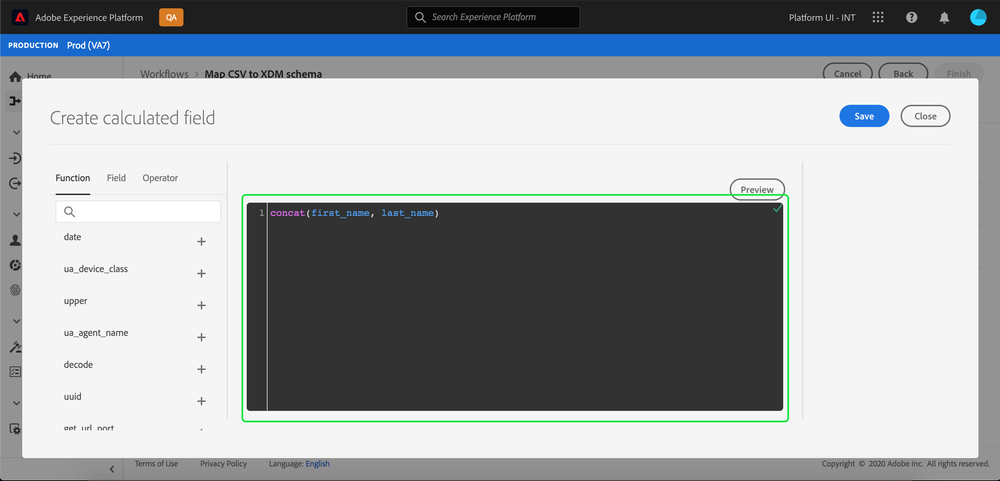

# 既存の XDM スキーマへの CSV ファイルのマッピング

>[!NOTE]
>
>このドキュメントでは、CSV ファイルを既存の XDM スキーマにマッピングする方法について説明します。 AI で生成されたスキーマのレコメンデーションツール（現在ベータ版）の使用方法について詳しくは、 [機械学習の推奨事項を使用した CSV ファイルのマッピング](./recommendations.md).

CSV データをに取り込むため [!DNL Adobe Experience Platform]の場合、データは [!DNL Experience Data Model] (XDM) スキーマ。 このチュートリアルでは、 [!DNL Platform] ユーザーインターフェイス。

## はじめに

このチュートリアルでは、次のコンポーネントに関する十分な知識が必要です。 [!DNL Platform]:

- [[!DNL Experience Data Model (XDM System)]](../../../xdm/home.md)：[!DNL Platform] がカスタマーエクスペリエンスのデータの整理に使用する、標準化されたフレームワーク。
- [バッチ取得](../../batch-ingestion/overview.md)[!DNL Platform]： がユーザー指定のデータファイルからデータを取り込む方法。
- [Adobe Experience Platform Data Prep](../../batch-ingestion/overview.md):取り込んだデータを XDM スキーマに準拠するようにマッピングおよび変換できる一連の機能です。 に関するドキュメント [データ準備関数](../../../data-prep/functions.md) は、スキーママッピングに特に関連します。

また、このチュートリアルでは、CSV データの取り込み先のデータセットを既に作成している必要があります。UI でデータセットを作成する手順については、[データ取得のチュートリアル](../ingest-batch-data.md)を参照してください。

## 宛先の選択

にログインします。 [[!DNL Adobe Experience Platform]](https://platform.adobe.com) 次に、 **[!UICONTROL ワークフロー]** 左側のナビゲーションバーから **[!UICONTROL ワークフロー]** ワークスペース。

次の **[!UICONTROL ワークフロー]** 画面、選択 **[!UICONTROL CSV を XDM スキーマにマッピング]** の下に **[!UICONTROL データ取り込み]** 「 」セクションで「 **[!UICONTROL 起動]**.

この **[!UICONTROL CSV を XDM スキーマにマッピング]** ワークフローが表示され、 **[!UICONTROL 宛先]** 手順 取り込むインバウンドデータのデータセットを選択します。 既存のデータセットを使用するか、新しく作成することができます。

**既存のデータセットを使用する**

CSV データを既存のデータセットに取り込むには、「 」を選択します。 **[!UICONTROL 既存のデータセットを使用]**. 検索関数を使用して、またはパネル内の既存のデータセットのリストをスクロールして、既存のデータセットを取得できます。

CSV データを新しいデータセットに取り込むには、「 」を選択します。 **[!UICONTROL 新しいデータセットを作成]** をクリックし、提供されたフィールドにデータセットの名前と説明を入力します。 検索関数を使用するか、提供されるスキーマのリストをスクロールして、スキーマを選択します。 「**[!UICONTROL 次へ]**」を選択して次に進みます。

## データの追加

「**[!UICONTROL データ追加]**」手順が表示されます。CSV ファイルを指定されたスペースにドラッグ&amp;ドロップするか、「 」を選択します **[!UICONTROL ファイルを選択]** をクリックして、CSV ファイルを手動で入力します。

この **[!UICONTROL サンプルデータ]** 「 」セクションが表示され、ファイルがアップロードされると、最初の 10 行のデータが表示されます。 データが期待どおりにアップロードされたことを確認したら、「 」を選択します。 **[!UICONTROL 次へ]**.

## XDM スキーマフィールドへの CSV フィールドのマッピング

「**[!UICONTROL マッピング]**」手順が表示されます。CSV ファイルの列は「**[!UICONTROL ソースフィールド]**」の下にリストされ、対応する XDM スキーマフィールドが「**[!UICONTROL ターゲットフィールド]**」の下にリストされます。

[!DNL Platform] は、選択したターゲットスキーマまたはデータセットに基づいて、自動マッピングされたフィールドに対してインテリジェントなレコメンデーションを自動的に提供します。 マッピングルールは、使用例に合わせて手動で調整できます。

すべての自動生成マッピング値を受け入れるには、「[!UICONTROL すべてのターゲットフィールドを承認]&quot;.

ソーススキーマに複数のレコメンデーションが使用できる場合があります。 これが発生すると、マッピングカードには最も目立つレコメンデーションが表示され、その後に青い円が続いて、使用可能なレコメンデーションの数が表示されます。 電球アイコンを選択すると、追加のレコメンデーションのリストが表示されます。代わりに、マッピング先のレコメンデーションの横にあるチェックボックスをオンにして、代替レコメンデーションの 1 つを選択できます。

または、ソーススキーマを手動でターゲットスキーマにマッピングすることもできます。 マッピングするソーススキーマの上にマウスポインターを置き、プラスアイコンを選択します。

この **[!UICONTROL ソースをターゲットフィールドにマッピング]** ポップオーバーが表示されます。 ここから、マッピングするフィールドを選択し、 **[!UICONTROL 保存]** 新しいマッピングを追加します。

マッピングの 1 つを削除する場合は、そのマッピングの上にマウスポインターを置いて、マイナスアイコンを選択します。

### 計算フィールドを追加 {#add-calculated-field}

計算フィールドでは、入力スキーマの属性に基づいて値を作成できます。 これらの値をターゲットスキーマの属性に割り当て、名前と説明を指定して参照を容易にできます。

を選択します。 **[!UICONTROL 計算フィールドを追加]** ボタンをクリックして続行します。

**[!UICONTROL 計算フィールドの作成]** パネルが表示されます。 左側のダイアログボックスには、計算フィールドでサポートされるフィールド、関数、演算子が含まれています。タブの 1 つを選択して、式エディターに関数、フィールドまたは演算子を追加します。

| タブ | 説明 |
| --------- | ----------- |
| フィールド | 「フィールド」タブには、ソーススキーマで使用できるフィールドと属性が表示されます。 |
| 関数 | 「関数」タブには、データの変換に使用できる関数が一覧表示されます。計算フィールド内で使用できる関数の詳細については、 [データ準備（マッパー）関数の使用](../../../data-prep/functions.md) に関するガイドを参照してください。 |
| 演算子 | 「演算子」タブには、データの変換に使用できる演算子が一覧表示されます。 |

中央にある式エディターを使用して、フィールド、関数、演算子を手動で追加できます。 式の作成を開始するには、エディターを選択します。

「**[!UICONTROL 保存]**」を選択して次に進みます。

マッピング画面が再表示され、新しく作成したソースフィールドが表示されます。 対応するターゲットフィールドを適用し、「**[!UICONTROL 完了]**」を選択してマッピングを完了します。

## データ取得の監視

CSV ファイルがマッピングされ、作成されたら、CSV ファイルを通じて取り込まれるデータを監視できます。 データ取得の監視について詳しくは、 [データ取得の監視](../../../ingestion/quality/monitor-data-ingestion.md).

## 次の手順

このチュートリアルに従うと、フラットな CSV ファイルを XDM スキーマにマッピングし、に取り込むことができます。 [!DNL Platform]. このデータは、ダウンストリームで使用できるようになりました [!DNL Platform] 次のようなサービス： [!DNL Real-time Customer Profile]. の概要を参照してください。 [[!DNL Real-time Customer Profile]](../../../profile/home.md) を参照してください。
