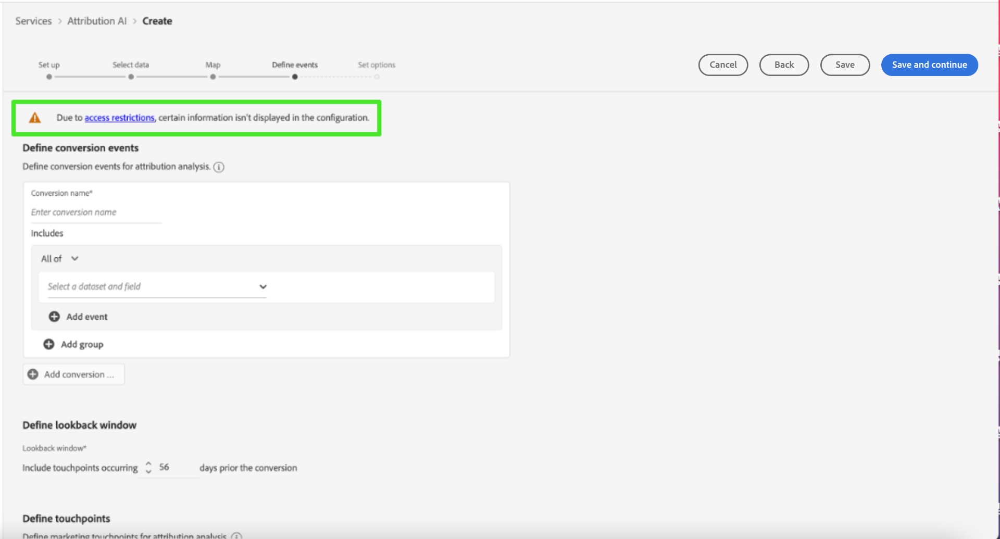

# アクセス制御

アトリビューション AI のアクセス制御は、[Adobe Admin Console](https://adminconsole.adobe.com/) の Adobe Experience Platform を通じて提供されます。この機能は、Admin Console の製品プロファイルを利用して、ユーザーを権限およびサンドボックスにリンクします。

アクセス制御について詳しくは、[アクセス制御の概要](../../../access-control/home.md)を参照してください。

## 属性ベースのアクセス制御

>[!IMPORTANT]
>
>属性ベースのアクセス制御は、現在、限定リリースでのみ利用できます。

[属性ベースのアクセス制御](../../../access-control/abac/overview.md)は、管理者が属性に基づいて特定のオブジェクトや機能へのアクセスを制御できるようにする Adobe Experience Platform の機能です。属性は、スキーマフィールドやセグメントに追加されるラベルなど、オブジェクトに追加されるメタデータであることがあります。 管理者は、ユーザーアクセス権限を管理する属性を含めた、アクセスポリシーを定義します。

この機能を使用すると、エクスペリエンスデータモデル（XDM）スキーマフィールドに、組織またはデータの使用範囲を定義するラベルを付けることができます。同時に、管理者は、ユーザーと役割の管理インターフェイスを使用して、XDM スキーマフィールドに関するアクセスポリシーを定義し、ユーザーまたはユーザーのグループ（内部、外部、またはサードパーティのユーザー）に与えるアクセスをうまく管理できます。また、属性ベースのアクセス制御により、管理者は特定のセグメントへのアクセスを管理できます。

属性ベースのアクセス制御により、管理者は、すべてのプラットフォームワークフローとリソースにわたって、機密性の高い個人データ（SPD）と個人を特定できる情報（PII）の両方へのユーザーのアクセスを制御できます。管理者は、特定のフィールドと、それらのフィールドに対応するデータにのみアクセスできるユーザーの役割を定義できます。

属性ベースのアクセス制御により、一部のフィールドと機能はアクセスが制限され、特定のアトリビューション AI サービスモデルでは使用できない場合があります。例としては、「ID」、「スコア定義」、「クローン」などがあります。

アトリビューション AI ワークスペースの&#x200B;**インサイトページ**&#x200B;の上部で、サイドバーに表示される詳細へのアクセスが制限されています。

**[!UICONTROL モデルワークフローを作成]**&#x200B;ページでスキーマが制限されたデータセットを選択すると、データセット名の横に警告サインが表示され、[!UICONTROL 制限された情報は除外されています]というメッセージが表示されます。

**[!UICONTROL モデルを作成ワークフロー]**&#x200B;ページでスキーマが制限されたデータセットをプレビューすると、警告が表示され、[!UICONTROL アクセス制限により、特定の情報がデータセットプレビューに表示されません]と通知されます。

情報が制限されたモデルを作成し、**[!UICONTROL 目標を定義]**&#x200B;手順に進むと、[!UICONTROL アクセス制限により、特定の情報が設定に表示されません]という警告が上部に表示されます。

## 次の手順

このガイドを読むことで、[!DNL Experience Platform] のアクセス制御の主な原則を学びました。[!DNL Admin Console] を使用して製品プロファイルを作成して [!DNL Platform] の権限を割り当てる方法に関する詳細な手順について、引き続き『[アクセス制御ユーザーガイド](../overview.md)』をご覧ください。
