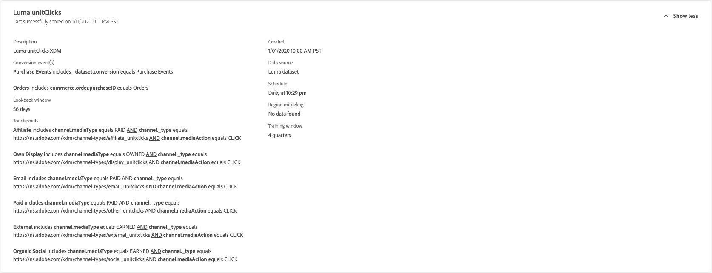

# アトリビューションAIでのインサイトの検出

アトリビューションAIサービスインスタンスは、マーケティングのパフォーマンスと投資利益率に関するマーケティング決定の作成および測定に役立つインサイトを提供します。 サービスインスタンスを選択すると、ビジュアライゼーションとフィルターが提供され、顧客の遍歴の各段階でのすべての顧客インタラクションの影響を理解するのに役立ちます。

このドキュメントは、Adobe Intelligent Servicesユーザーインターフェイスのサービスインスタンスインサイトを操作するためのガイドとして機能します。

## はじめに

アトリビューションAIのインサイトを利用するには、実行が成功したステータスを利用できるサービスインスタンスが必要です。 新しいサービスインスタンスを作成するには、『 [アトリビューションAIユーザーインターフェイスガイド](./user-guide.md)』を参照してください。 最近サービスインスタンスを作成したが、まだトレーニングとスコアリングを受けている場合は、24時間待ってから実行を終了してください。

## サービスインスタンスインサイトの概要

In the Adobe Experience Platform UI, click **Services** in the left navigation. サー *ビス* ・ブラウザが表示され、使用可能なAdobe Intelligent Servicesが表示されます。 In the container for Attribution AI, click **Open**.

Attribution AIサービスページが表示されます。 このページには、Attribution AIのサービスインスタンスがリストされ、インスタンス名、コンバージョンイベント、インスタンスが実行される頻度、最後の更新のステータスなど、それらのインスタンスに関する情報が表示されます。 開始するサービスインスタンス名をクリックします。

>[!NOTE] スコアリングの実行が成功したサービスインスタンスのみを選択できます。

次に、そのサービスインスタンスのインサイトページが表示されます。このページには、ビジュアライゼーションと、データを操作するための多数のフィルターが用意されています。 ビジュアライゼーションとフィルターについては、このガイド全体で詳しく説明しています。

### サービスインスタンスの詳細

サービスインスタンスの追加の詳細を表示するには、右上の **** 「さらに表示」をクリックします。

詳細なリストが表示されます。 リストに表示されたプロパティの詳細については、『 [アトリビューションAIユーザーガイド](./user-guide.md)』を参照してください。

### インスタンスの編集

インスタンスを編集するには、右上のナビゲーションで *編集* (Edit)をクリックします。

編集ダイアログボックスが表示され、インスタンスの説明とスコアリング頻度を編集できます。 変更を確認してダイアログを閉じるには、右下隅の *「編集* 」をクリックします。

### その他のアクション

「 *その他のアクション* 」ボタンは、右上のナビゲーションで「 *編集*」の横にあります。 「 **その他のアクション** 」をクリックすると、ドロップダウンが開き、以下の操作のいずれかを選択できます。

- **削除**: インスタンスを削除します。
- **概要データのダウンロード**: サマリデータを含むCSVファイルをダウンロードします。
- **アクセススコア**: 「 *アクセススコア* 」をクリックすると、アトリビューションAIチュートリアルの [アクセススコアにリダイレクトされます](./download-scores.md)。
- **表示実行履歴**: サービスインスタンスに関連付けられたすべてのスコアリング実行のリストを含むポッパーが表示されます。

## データのフィルタリング

アトリビューションAIインサイトを使用すると、データをフィルターし、選択したフィルターに基づいてUIのビジュアルを自動的に更新できます。

>[!NOTE] デフォルトでは、「属性モデル *」フィルターを除くすべてのフィルターが「すべて」に設定されます。ただし、「* 属性モデル」フィルターは「増分的で影響を受ける属性付きの変換」に設定されます。

### コンバージョンイベント

アトリビューションAIで新しいインスタンスを作成する場合、必須フィールドの1つは「コンバージョンイベント」です。 コンバージョンイベントとは、eコマース注文、店頭購入、Webサイト訪問などのマーケティングアクティビティの影響を識別するビジネス目標です。

インスタンス内から[ *コンバージョンイベント* ]ドロップダウンを使用すると、インスタンスに対して定義されたイベントを選択して、データをフィルタリングできます。 特定のイベントを選択すると、UIビジュアライゼーションが変更され、それらのイベントに属するコンバージョンのみが表示されます。

### アトリビューションモデル

「 *アトリビューションモデル* 」をクリックすると、使用可能な様々なアトリビューションモデルのすべてを含むドロップダウンが開きます。 複数のモデルを選択して、結果を比較できます。 様々なアトリビューションモデルとその機能について詳しくは、 [アトリビューションAI](./overview.md) 概要を参照してください。概要には、各モデルに関する情報が記載されています。

### 製品

[ *製品* ]フィルタを使用すると、インスタンスの作成時に最初に取り込まれた製品を選択できます。 ドロップダウンをクリックし、検索機能を使用して比較対象の製品をすばやく選択します。

### 地域

地域 ** フィルターは、地域ベースのモデルに基づいて国コードを入力します。 データに応じて、このフィルターが存在する場合と存在しない場合があります。

>[!NOTE] 国コードの長さは2文字です。 完全なリストは、 [ISO 3166-1 alpha-2](https://datahub.io/core/country-list).

### 領域

>[!NOTE] このフィルターは、サービスインスタンスの作成時に『Attribution AIユーザーインターフェイスガイド [』でオプションの手順である](./user-guide.md#region-based-modeling-optional) 領域ベースのモデリングを実行した場合にのみ表示されます。

このフィルタを使用すると、インスタンス作成プロセスで設定した任意の領域を選択できます。

### Channel

[ *チャネル* ]フィルタをクリックすると、使用可能なマーケティングチャネルをすべて含むドロップダウンが表示されます。 複数のチャネルを選択して比較できます。

### Date Range

カレンダーアイコンをクリックして、日付範囲プロバーを開きます。 コンバージョンの開始日と終了日によって、UIに入力されるデータの量が決まります。 入力するデータ量を絞り込んだり、広げたりするために、日付範囲を狭めたりできます。

## データの概要

概要 ** カードには、アトリビューションモデル別の合計コンバージョン数が表示されます。 総検索数は、このドキュメントで前述したフィルターを使用して、検索の具体的度合いに応じて変わります。 複数のモデルを選択すると、概要に円が追加され、それぞれ凡例に対応する色が付きます。

## 週別トレンド

*週別トレンド* (Weekly trends)カードは、フィルタリング処理中に設定した日付範囲によって、合計コンバージョン数を分類します。

「 *週別トレンド* 」カードの右上にある三点リーダーをクリックすると、ドロップダウンリストが表示され、日別、週別、月別のトレンドを選択できます。

特定のアトリビューションモデルのデータ行の上にマウスポインターを置くと、その日のコンバージョンの合計数を示すポッパーが作成されます。

## チャネル別の分類

チャネル別 *分類* カードは、各チャネルに対するコンバージョンの合計数を判断するために使用します。 このカードは、各チャネルの効果やROI（投資収益率）の決定に役立ちます。

「 *チャネル別分類* 」カードの右上にある「三点リーダー」をクリックすると、ドロップダウンが開き、タッチポイントに基づいてデータを入力できます。

## トップキャンペーン

ト *ップキャンペーン* (Top Experiences)カードには、キャンペーンの概要と各チャネルでのキャンペーンのパフォーマンスが表示されます。 このカードは、特定のチャネルに対する特定のキャンペーンの有効性をチームに知らせ、さらに投資を行う場所についての洞察を提供するのに役立ちます。

## 次の手順

データのフィルタリングが完了し、適切な情報を表示できるようになったら、スコアにアクセスするオプションがあります。 スコアへのアクセス方法に関する詳細なガイドについては、「アトリビューションAI [」チュートリアルの](./download-scores.md) アクセススコアを参照してください。 さらに、 [その他のアクションで示されているように、概要データをダウンロードすることもでき](#more-actions)ます。 「サマリデータをダウンロード」を選択すると、日付別に集計したサマリデータがダウンロードされます。

## その他のリソース

次のビデオは、アトリビューションAIインサイトページを使用してマーケティングチャネルとキャンペーンのROIを把握する方法を学習するのを支援するために設計されています。

>[!VIDEO](https://video.tv.adobe.com/v/32669?learn=on&quality=12)