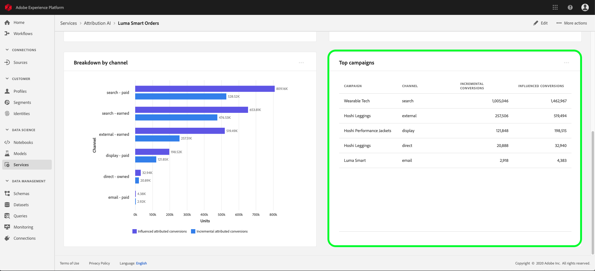

# Attribution AIのインサイト

Attribution AI サービスインスタンスは、マーケティングパフォーマンスと投資回収率に関するマーケティングの意思決定およびその評価に役立つインサイトを提供します。サービスインスタンスを選択すると、ビジュアル化された情報とフィルターが表示されます。これらは、カスタマージャーニーの各段階における、すべての顧客インタラクションの影響を理解するのに役立ちます。

このドキュメントは、アドビインテリジェントサービスのユーザーインターフェイスでサービスインスタンスのインサイトを操作する際のガイドとして提供されています。

## はじめに

Attribution AI のインサイトを利用するには、正常に実行されたステータスを持つサービスインスタンスが必要です。新しいサービスインスタンスを作成するには、[Attribution AI のユーザーインターフェイスに関するガイド](./user-guide.md)を参照してください。サービスインスタンスを作成したばかりで、まだトレーニングとスコア測定を行っている場合は、実行が終了するまで 24 時間お待ちください。

## サービスインスタンスのインサイトの概要

[!DNL Adobe Experience Platform] UI で、左側のナビゲーションで「**[!UICONTROL サービス]**」を選択します。 「**[!UICONTROL サービス]**」ブラウザーが表示され、利用可能なアドビインテリジェントサービスが示されます。Attribution AIのコンテナで、「**[!UICONTROL 開く]**」を選択します。

Attribution AI サービスページが表示されます。このページには、Attribution AI のサービスインスタンスが一覧表示され、インスタンスの名前、コンバージョンイベント、インスタンスの実行頻度、最後の更新のステータスなど、インスタンスに関する情報が表示されます。開始するサービスインスタンス名を選択します。

>[!NOTE]
>
>スコアリングの実行が正常に完了したサービスインスタンスのみを選択できます。

次に、そのサービスインスタンスのインサイトページが表示されます。このページには、ビジュアル化された情報と、データを操作するためのフィルターがいくつか表示されます。ビジュアル化された情報とフィルターについては、このガイドを通して詳しく説明します。

### サービスインスタンスの詳細

サービスインスタンスの追加の詳細を表示するには、右上の「**[!UICONTROL 詳細を表示]**」を選択します。

詳細なリストが表示されます。一覧表示されるプロパティについて詳しくは、「[Attribution AI user guide](./user-guide.md)」を参照してください。

### インスタンスの編集

インスタンスを編集するには、右上のナビゲーションで「**[!UICONTROL 編集]**」を選択します。

編集ダイアログボックスが表示され、インスタンスの名前、説明、スコア付けの頻度を編集できます。 インスタンスのステータスが無効の場合、スコアリングの頻度は編集できません。 変更を確認してダイアログを閉じるには、右下隅の「**[!UICONTROL 保存]**」を選択します。

### その他のアクション {#more-actions}

右上のナビゲーションの「**[!UICONTROL 編集]**」の横に「**[!UICONTROL その他のアクション]**」ボタンがあります。「**[!UICONTROL その他のアクション]**」を選択するとドロップダウンが開き、次の操作のいずれかを選択できます。

- **[!UICONTROL クローン]**:インスタンスのクローンを作成します。
- **[!UICONTROL 削除]**：インスタンスを削除します。
- **[!UICONTROL 概要データをダウンロード]**：概要データを含む CSV ファイルをダウンロードします。
- **[!UICONTROL アクセススコア]**:「アクセ **[!UICONTROL ススコア]** 」を選択すると、Attribution AI [チュートリアルのアクセススコアにリダイレクトされます](./download-scores.md)。
- **[!UICONTROL 実行履歴を表示]**：サービスインスタンスに関連付けられたすべてのスコアリング実行のリストを含むポップオーバーが表示されます。

## データのフィルタリング

Attribution AI のインサイトでは、データをフィルタリングしたり、選択したフィルターに基づいて UI のビジュアルを自動的に更新したりすることができます。

### コンバージョンイベント

Attribution AI で新しいインスタンスを作成する場合、必須フィールドの 1 つは「コンバージョンイベント」です。コンバージョンイベントとは、eコマース注文、店舗での購入、web サイトへの訪問といったマーケティングアクティビティの影響を識別するビジネス目標です。

インスタンス内の「**[!UICONTROL コンバージョンイベント]**」ドロップダウンで、インスタンスに定義されたイベントを選択して、データをフィルタリングできます。特定のイベントを選択すると、UI 表示が変更され、そのイベントに属するコンバージョンのみが入力されます。

### アトリビューションモデル

「**[!UICONTROL アトリビューションモデル]**」を選択すると、ドロップダウンが開き、使用可能なアトリビューションモデルがすべて表示されます。 複数のモデルを選択して、結果を比較できます。様々なアトリビューションモデルとその仕組みについて詳しくは、[Attribution AI](./overview.md) の概要を参照してください。このページの表に、各モデルに関する情報が示されています。

### 領域

>[!NOTE]
>
>このフィルターは、サービスインスタンスの作成時に「Attribution AI user guide」の追加手順（[地域ベースのモデリング](./user-guide.md#region-based-modeling-optional)）を実行した場合にのみ表示されます。

このフィルターを使用すると、インスタンス作成プロセスで設定した地域を選択できます。

### フィルターの追加

フィルターを追加するには、**フィルター** アイコンを選択して、「**[!UICONTROL フィルターを追加]**」ポップオーバーを開きます。 「**[!UICONTROL フィルターを追加]**」ポップオーバーでは、チャネル、地域、メディアタイプ、製品でフィルタリングできます。 ポップオーバーで設定されるのは、サービスインスタンスに適したフィルターのみです。 例えば、地理データやメディアタイプを指定しなかった場合、これらのフィルター属性は、お使いのインスタンスでは使用できません。

- **[!UICONTROL チャネル]:** チャネル属性を選択すると、使用可能なマーケティングチャネルをフィルタリングできます。複数のチャネルを選択して比較できます。
- **[!UICONTROL 地域]:** 地域属性を選択すると、地域ベースのモデルに基づいて国コードをフィルタリングできます。データによっては、このフィルターが存在する場合とそうでない場合があります。  国コードの長さは 2 文字です。[ こちら ](https://datahub.io/core/country-list) の国コード一覧を参照してください。
- **[!UICONTROL メディアタイプ]:** メディアタイプ属性を選択すると、定義した任意のメディアタイプをフィルタリングできます。
- **[!UICONTROL 製品]:** 製品属性を選択すると、インスタンスの作成時に最初に取り込まれた製品から除外できます。

### 日付範囲

カレンダーアイコンを選択して、日付範囲ポップオーバーを開きます。 コンバージョンイベントの開始日と終了日によって、UI に入力されるデータの量が変わります。日付範囲を調整することで、入力されるデータの量を変更することができます。

## データの概要

「**[!UICONTROL 概要]**」カードには、アトリビューションモデル別の合計コンバージョン数が表示されます。このドキュメントで前述したフィルターを使用して検索をどの程度絞り込んだかによって、コンバージョンの合計数は変わります。さらにモデルを選択すると、それぞれの凡例に対応する色の円が概要に追加されます。

## 週別トレンド

「**[!UICONTROL 週別トレンド]**」カードでは、フィルタリング処理中に設定した日付範囲の合計コンバージョン数が表示されます。

**週別トレンド** カードの右上にある省略記号を選択すると、ドロップダウンが表示され、日別、週別、月別のトレンドを選択できます。

特定のアトリビューションモデルのデータ線の上にカーソルを置くと、その日のコンバージョンの合計数を示すポップオーバーが作成されます。

## チャネル別コンバージョン数

「**[!UICONTROL チャネル別コンバージョン数]**」カードを使用して、各チャネルに関連するコンバージョンの合計数を確認できます。このカードは、各チャネルの効果と投資回収率に関する意思決定に役立ちます。

**[!UICONTROL チャネル別コンバージョン]** カードの右上にある省略記号を選択すると、ドロップダウンが開き、タッチポイントに基づいたデータを表示できます。

## 上位キャンペーン

「**[!UICONTROL 上位キャンペーン]**」カードには、キャンペーンの概要と、各チャネルにおけるキャンペーンの実績が表示されます。このカードは、特定のチャネルに対する特定のキャンペーンの効果をチームに知らせ、さらに投資する必要があるキャンペーンなどのインサイトを提供します。

## タッチポイントの位置での分類

「**[!UICONTROL パス分析]**」タブを選択すると、**[!UICONTROL タッチポイント位置で分類]** グラフと **[!UICONTROL 上位のコンバージョンパス]** グラフが読み込まれます。

**[!UICONTROL タッチポイントで分類]** グラフは、すべてのコンバージョンパスをまたいでタッチポイントの位置で比較した、アトリビュートに属するコンバージョンの分類です。 このグラフは、コンバージョンパスの様々な段階で、どのタッチポイントがより効果的かを把握するのに役立ちます。 ステージはスターター、プレイヤー、クローザーです。

- **スターター：** タッチポイントがコンバージョンパスのファーストタッチであったことを示します。
- **プレーヤー：** タッチポイントがコンバージョンにつながるファーストタッチでもラストタッチでもなかったことを示します。
- **クローザー：** コンバージョン前のラストタッチであったタッチポイントを示します。

>!![NOTE]
すべてのタッチポイントおよび位置でのアトリビューションモデルの貢献度の合計は 100 に等しい必要があります。

## 上位コンバージョンパス

**[!UICONTROL 上位コンバージョンパス]** グラフには、選択した地域の上位コンバージョンパスに対する影響スコアとアルゴリズムスコアが表示されます。 このグラフでは、コンバージョンに貢献するタッチポイントと、各タッチポイントのアトリビューションスコアを視覚化できます。 この情報を使用して、特定の地域で最も頻繁に使用されるパスを表示し、様々なタッチポイントのセット間でパターンが現れるかどうかを確認できます。

## タッチポイントの効果

「**[!UICONTROL タッチポイントの効果]**」タブを選択すると、「**[!UICONTROL タッチポイントの効果]**」カードが読み込まれます。 このカードは、Attribution AIのデータ配分を使用して、各タッチポイントの情報を表示します。 このテーブルのデータは、カードの右上の **[!UICONTROL 現在]** 日付で示される特定の期間にのみ生成されます。

**[!UICONTROL タッチポイントの効果]** カードの情報を使用して、タッチポイントがコンバージョンにどのように貢献しているかを把握できます。 また、次のパフォーマンス指標を使用すると、各タッチポイントの効果を確認できます。

**タッチされたパス**:この指標は、タッチポイントのコンバージョンを達成/達成しないパスの割合を表示します。コンバージョンを達成しないパスに対するコンバージョンを達成するパス（割合）の割合が高い場合、アトリビュートが高いコンバージョンが表示されます。

**効率の測定**:この指標では、星を 1～5 のスケールで表示します。スケールは、コンバージョンをおこなう際のタッチポイントの相対的な重要性を示します。

>[!NOTE]
タッチポイントのボリュームが高いと、効率の高い測定が保証されません。

**総ボリューム**:タッチポイントがユーザーによってタッチされた回数の集計です。これには、コンバージョンを達成するパスに表示されるタッチポイントと、コンバージョンにつながらないパスが含まれます。

## 次の手順

データのフィルタリングが完了し、適切な情報を表示できたら、スコアにアクセスすることができます。スコアへのアクセス方法について詳しくは、[Attribution AI でのスコアへのアクセス](./download-scores.md)に関するチュートリアルを参照してください。さらに、「[その他のアクション](#more-actions)」で示したように、概要データをダウンロードすることもできます。「概要データをダウンロード」を選択すると、日付別に集計された概要データがダウンロードされます。

## その他のリソース

次のビデオは、マーケティングチャネルとキャンペーンの ROI を理解するためにAttribution AIインサイトページを使用する方法を学ぶのに役立つように作られています。

>[!VIDEO](https://video.tv.adobe.com/v/32669?learn=on&quality=12)
