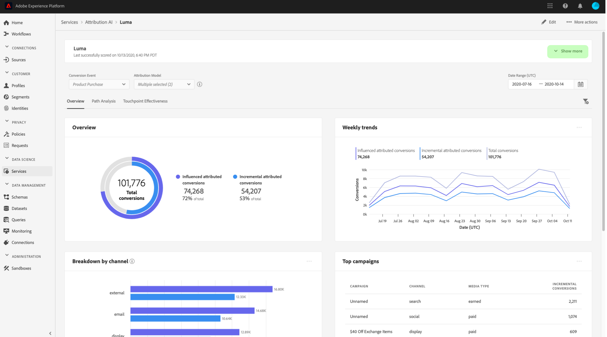
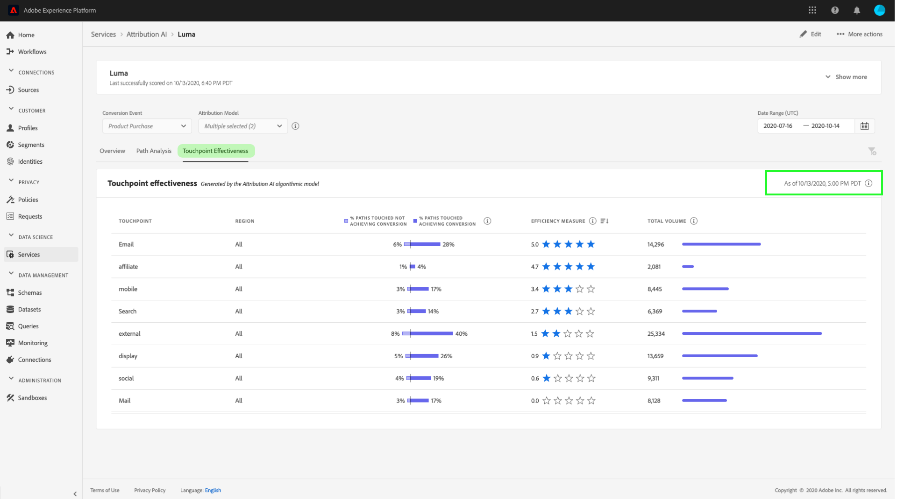

# Attribution AIのインサイトを見つける

Attribution AI サービスインスタンスは、マーケティングパフォーマンスと投資回収率に関するマーケティングの意思決定およびその評価に役立つインサイトを提供します。サービスインスタンスを選択すると、ビジュアル化された情報とフィルターが表示されます。これらは、カスタマージャーニーの各段階における、すべての顧客インタラクションの影響を理解するのに役立ちます。

このドキュメントは、アドビインテリジェントサービスのユーザーインターフェイスでサービスインスタンスのインサイトを操作する際のガイドとして提供されています。

## はじめに

Attribution AI のインサイトを利用するには、正常に実行されたステータスを持つサービスインスタンスが必要です。新しいサービスインスタンスを作成するには、[Attribution AI のユーザーインターフェイスに関するガイド](./user-guide.md)を参照してください。サービスインスタンスを作成したばかりで、まだトレーニングとスコア測定を行っている場合は、実行が終了するまで 24 時間お待ちください。

## サービスインスタンスのインサイトの概要

内 [!DNL Adobe Experience Platform] UI、「 」を選択します。 **[!UICONTROL サービス]** をクリックします。 「**[!UICONTROL サービス]**」ブラウザーが表示され、利用可能なアドビインテリジェントサービスが示されます。Attribution AIのコンテナで、 **[!UICONTROL 開く]**.

Attribution AI サービスページが表示されます。このページには、Attribution AI のサービスインスタンスが一覧表示され、インスタンスの名前、コンバージョンイベント、インスタンスの実行頻度、最後の更新のステータスなど、インスタンスに関する情報が表示されます。開始するサービスインスタンス名を選択します。

>[!NOTE]
>
>スコアリングの実行が正常に完了したサービスインスタンスのみを選択できます。

次に、そのサービスインスタンスのインサイトページが表示されます。このページには、ビジュアル化された情報と、データを操作するためのフィルターがいくつか表示されます。ビジュアル化された情報とフィルターについては、このガイドを通して詳しく説明します。

### サービスインスタンスの詳細

サービスインスタンスの追加の詳細を表示するには、 **[!UICONTROL 詳細を表示]** をクリックします。

詳細なリストが表示されます。一覧表示されるプロパティについて詳しくは、「[Attribution AI user guide](./user-guide.md)」を参照してください。

### インスタンスの編集

インスタンスを編集するには、「 」を選択します。 **[!UICONTROL 編集]** をクリックします。

編集ダイアログボックスが表示され、インスタンスの名前、説明、スコア付けの頻度を編集できます。 インスタンスのステータスが無効の場合、スコアリング頻度は編集できません。 変更を確認してダイアログを閉じるには、「 」を選択します。 **[!UICONTROL 保存]** をクリックします。

### その他のアクション {#more-actions}

右上のナビゲーションの「**[!UICONTROL 編集]**」の横に「**[!UICONTROL その他のアクション]**」ボタンがあります。選択 **[!UICONTROL その他のアクション]** ドロップダウンが開き、次の操作のいずれかを選択できます。

- **[!UICONTROL 複製]**:インスタンスのクローンを作成します。
- **[!UICONTROL 削除]**：インスタンスを削除します。
- **[!UICONTROL 概要データをダウンロード]**：概要データを含む CSV ファイルをダウンロードします。
- **[!UICONTROL スコアへのアクセス]**:選択 **[!UICONTROL スコアへのアクセス]** リダイレクト先： [スコアへのアクセス (Attribution AIチュートリアル )](./download-scores.md).
- **[!UICONTROL 実行履歴を表示]**：サービスインスタンスに関連付けられたすべてのスコアリング実行のリストを含むポップオーバーが表示されます。

## データのフィルタリング

Attribution AI のインサイトでは、データをフィルタリングしたり、選択したフィルターに基づいて UI のビジュアルを自動的に更新したりすることができます。

### コンバージョンイベント

Attribution AI で新しいインスタンスを作成する場合、必須フィールドの 1 つは「コンバージョンイベント」です。コンバージョンイベントとは、eコマース注文、店舗での購入、web サイトへの訪問といったマーケティングアクティビティの影響を識別するビジネス目標です。

インスタンス内の「**[!UICONTROL コンバージョンイベント]**」ドロップダウンで、インスタンスに定義されたイベントを選択して、データをフィルタリングできます。特定のイベントを選択すると、UI 表示が変更され、そのイベントに属するコンバージョンのみが入力されます。

### アトリビューションモデル

選択 **[!UICONTROL アトリビューションモデル]** ドロップダウンが開き、使用可能なすべての様々なアトリビューションモデルが表示されます。 複数のモデルを選択して、結果を比較できます。様々なアトリビューションモデルとその仕組みについて詳しくは、[Attribution AI](./overview.md) の概要を参照してください。このページの表に、各モデルに関する情報が示されています。

### 領域

>[!NOTE]
>
>このフィルターは、サービスインスタンスの作成時に「Attribution AI user guide」の追加手順（[地域ベースのモデリング](./user-guide.md#region-based-modeling-optional)）を実行した場合にのみ表示されます。

このフィルターを使用すると、インスタンス作成プロセスで設定した地域を選択できます。

### フィルターを追加

フィルターを追加するには、 **フィルター** アイコンをクリックして開きます。 **[!UICONTROL フィルターを追加]** ポップオーバー この **[!UICONTROL フィルターを追加]** ポップオーバーでは、チャネル、地域、メディアタイプ、製品でフィルタリングできます。 ポップオーバーには、サービスインスタンスに適用できるフィルターのみが入力されます。 例えば、地理データやメディアタイプを指定しなかった場合、これらのフィルター属性は、お使いのインスタンスでは使用できません。

- **[!UICONTROL チャネル]:** チャネル属性を選択すると、使用可能なマーケティングチャネルのいずれかをフィルタリングできます。 複数のチャネルを選択して比較できます。
- **[!UICONTROL 地域]:** 地域属性を選択すると、地域ベースのモデルに基づいて国コードをフィルタリングできます。 データによっては、このフィルターが存在する場合と存在しない場合があります。  国コードの長さは 2 文字です。国コードの一覧を見る [ここ](https://datahub.io/core/country-list).
- **[!UICONTROL メディアタイプ]:** メディアタイプ属性を選択すると、定義した任意のメディアタイプをフィルタリングできます。
- **[!UICONTROL 製品]:** 製品属性を選択すると、インスタンスの作成時に最初に取り込まれた製品からフィルタリングできます。

### 日付範囲

カレンダーアイコンを選択して、日付範囲ポップオーバーを開きます。 コンバージョンイベントの開始日と終了日によって、UI に入力されるデータの量が変わります。日付範囲を調整することで、入力されるデータの量を変更することができます。

## データの概要

「**[!UICONTROL 概要]**」カードには、アトリビューションモデル別の合計コンバージョン数が表示されます。このドキュメントで前述したフィルターを使用して検索をどの程度絞り込んだかによって、コンバージョンの合計数は変わります。さらにモデルを選択すると、それぞれの凡例に対応する色の円が概要に追加されます。

## 週別トレンド

「**[!UICONTROL 週別トレンド]**」カードでは、フィルタリング処理中に設定した日付範囲の合計コンバージョン数が表示されます。

「 」の右上にある省略記号の選択 **週別トレンド** カードにはドロップダウンが表示され、日別、週別、月別のトレンドを選択できます。

特定のアトリビューションモデルのデータ線の上にカーソルを置くと、その日のコンバージョンの合計数を示すポップオーバーが作成されます。

## チャネル別コンバージョン数

「**[!UICONTROL チャネル別コンバージョン数]**」カードを使用して、各チャネルに関連するコンバージョンの合計数を確認できます。このカードは、各チャネルの効果と投資回収率に関する意思決定に役立ちます。

「 」の右上にある省略記号の選択 **[!UICONTROL チャネル別の分類]** カードが開き、タッチポイントに基づいてデータを入力できるドロップダウンが表示されます。

## 上位キャンペーン

「**[!UICONTROL 上位キャンペーン]**」カードには、キャンペーンの概要と、各チャネルにおけるキャンペーンの実績が表示されます。このカードは、特定のチャネルに対する特定のキャンペーンの効果をチームに知らせ、さらに投資する必要のあるキャンペーンなどのインサイトを提供します。

## タッチポイントの位置で分類

の選択 **[!UICONTROL パス分析]** タブにが読み込まれます。 **[!UICONTROL タッチポイントの位置で分類]** および **[!UICONTROL 上位のコンバージョンパス]** グラフ。

この **[!UICONTROL タッチポイントの位置で分類]** グラフは、すべてのコンバージョンパスにわたって比較した、タッチポイントの位置による、アトリビュートされたコンバージョンの分類です。 このグラフは、コンバージョンパスの様々な段階で、どのタッチポイントがより効果的かを把握するのに役立ちます。 ステージはスターター、プレイヤー、クローザーです。

- **スターター：** タッチポイントがコンバージョンパスのファーストタッチであったことを示します。
- **プレーヤー：** タッチポイントがコンバージョンにつながるファーストタッチでもラストタッチでもなかったことを示します。
- **クローザー：** タッチポイントがコンバージョン前のラストタッチであったことを示します。

>!![NOTE]
すべてのタッチポイントおよび位置にわたるアトリビューションモデルの貢献度の合計は、100 に等しくなる必要があります。

## 上位のコンバージョンパス

この **[!UICONTROL 上位のコンバージョンパス]** グラフには、選択した地域の上位のコンバージョンパスに関する影響スコアとアルゴリズムスコアが表示されます。 このグラフでは、コンバージョンに貢献するタッチポイントと、各タッチポイントのアトリビューションスコアを視覚化できます。 この情報を使用して、特定の地域で最も頻繁に使用されるパスを表示し、様々なタッチポイントセット間でパターンが現れるかどうかを確認できます。

## タッチポイント有効性

の選択 **[!UICONTROL タッチポイント有効性]** タブにが読み込まれます。 **[!UICONTROL タッチポイント有効性]** カード。 このカードは、Attribution AIのデータ配分を使用して、各タッチポイントの情報を表示します。 このテーブルのデータは、 **[!UICONTROL 現在]** 日付を選択します。

以下を使用して、 **[!UICONTROL タッチポイント有効性]** タッチポイントがコンバージョンにどのように貢献しているかを理解するためのカード情報。 また、次のパフォーマンス指標に関する各タッチポイントの効果も確認できます。

**タッチされたパス**:この指標は、タッチポイントに対してコンバージョンを達成/達成しないパスの割合を表示します。 コンバージョンを達成しないパスに対するコンバージョンを達成するパス（割合）の割合が高い場合、アトリビュートコンバージョンが高くなります。

**効率測定**:この指標では、星を 1～5 のスケールで表示します。 スケールは、コンバージョンをおこなう際のタッチポイントの相対的な重要性を示します。

>[!NOTE]
タッチポイントボリュームが多いと、効率の高い測定が保証されるわけではありません。

**合計ボリューム**:タッチポイントがユーザーによってタッチされた回数の集計です。 これには、コンバージョンを達成するパスに表示されるタッチポイントと、コンバージョンにつながらないパスが含まれます。

## 次の手順

データのフィルタリングが完了し、適切な情報を表示できたら、スコアにアクセスすることができます。スコアへのアクセス方法について詳しくは、[Attribution AI でのスコアへのアクセス](./download-scores.md)に関するチュートリアルを参照してください。さらに、「[その他のアクション](#more-actions)」で示したように、概要データをダウンロードすることもできます。「概要データをダウンロード」を選択すると、日付別に集計された概要データがダウンロードされます。

## その他のリソース

次のビデオは、Attribution AIインサイトページを使用してマーケティングチャネルとキャンペーンの ROI を把握する方法を学ぶのに役立つように設計されています。

>[!VIDEO](https://video.tv.adobe.com/v/32669?learn=on&quality=12)
