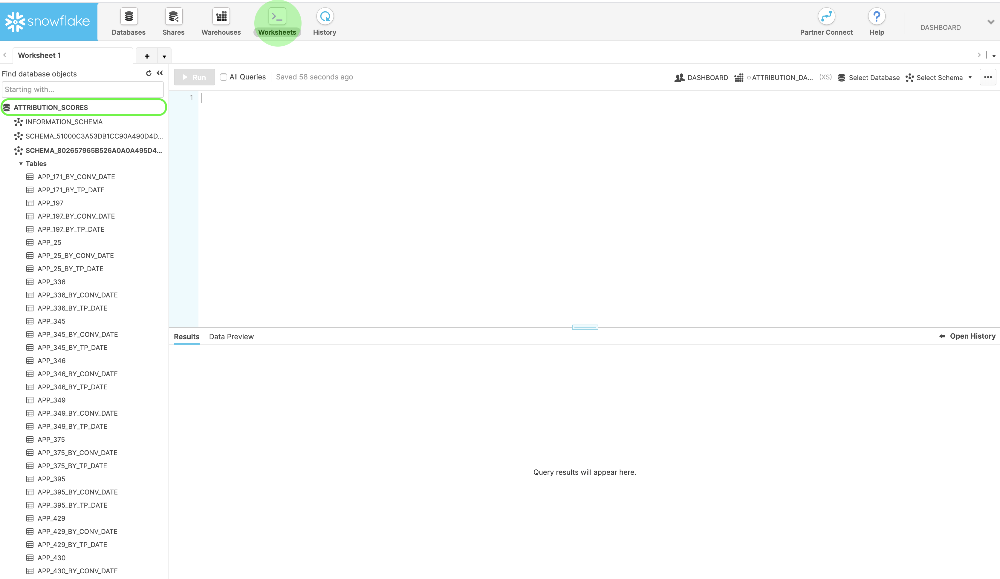

# スコアをAttribution AIでダウンロード

このドキュメントは、Attribution AIのスコアをダウンロードする際のガイドとして機能します。

## はじめに

Attribution AIを使用すると、Parquet ファイル形式でスコアをダウンロードできます。 このチュートリアルでは、 [はじめに](./getting-started.md) ガイド。

また、Attribution AIのスコアにアクセスするには、正常に実行されたステータスを持つサービスインスタンスが必要です。 新しいサービスインスタンスを作成するには、 [Attribution AIユーザーガイド](./user-guide.md). サービスインスタンスを作成したばかりで、まだトレーニングとスコア測定を行っている場合は、実行が終了するまで 24 時間お待ちください。

## データセット ID を見つける {#dataset-id}

サービスインスタンス内でAttribution AIインサイトを表示するには、 *その他のアクション* 右上のナビゲーションのドロップダウンから、 **[!UICONTROL スコアへのアクセス]**.


新しいダイアログが表示され、スコアのダウンロードに関するドキュメントへのリンクと、現在のインスタンスのデータセット ID が示されます。データセット ID をクリップボードにコピーして、次の手順に進みます。


## バッチ ID を取得する {#retrieve-your-batch-id}

前の手順で取得したデータセット ID を使用してバッチ ID を取得するには、Catalog API への呼び出しを実行する必要があります。追加のクエリパラメーターは、組織に属するバッチのリストではなく、最新の成功したバッチを返すために、この API 呼び出しに使用されます。 追加のバッチを返すには、 `limit` クエリパラメーターを使用して、必要な分だけ返されます。 使用可能なクエリパラメーターの種類について詳しくは、[クエリパラメーターを使用したカタログデータのフィルタリング](../../catalog/api/filter-data.md)に関するガイドを参照してください。

**API 形式**

```http
GET /batches?&dataSet={DATASET_ID}&createdClient=acp_foundation_push&status=success&orderBy=desc:created&limit=1
```

| パラメーター | 説明 |
| --------- | ----------- |
| `{DATASET_ID}` | アクセススコアダイアログで使用できるデータセット ID です。 |

**リクエスト**

```shell
curl -X GET 'https://platform.adobe.io/data/foundation/catalog/batches?&dataSet=5e8f81ce7a4ecb18a8d25b22&createdClient=acp_foundation_push&status=success&orderBy=desc:created&limit=1' \
  -H 'Authorization: Bearer {ACCESS_TOKEN}' \
  -H 'x-api-key: {API_KEY}' \
  -H 'x-gw-ims-org-id: {IMS_ORG}' \
  -H 'x-sandbox-name: {SANDBOX_NAME}'
```

**応答**

正常な応答は、バッチ ID オブジェクトを含むペイロードを返します。 この例では、返されるオブジェクトのキー値はバッチ ID です `01E5QSWCAASFQ054FNBKYV6TIQ`. バッチ ID をコピーして、次の API 呼び出しで使用します。

>[!NOTE]
>
> 次の応答は、 `tags` オブジェクトを読みやすくするために形式変更しました。

```json
{
    "01E5QSWCAASFQ054FNBKYV6TIQ": {
        "status": "success",
        "tags": {
            "Tags": [ ... ],
        },
        "relatedObjects": [
            {
                "type": "dataSet",
                "id": "5e8f81cf7a4ecb28a8d85b22"
            }
        ],
        "id": "01E5QSWCAASFQ054FNBKYV6TIQ",
        "externalId": "01E5QSWCAASFQ054FNBKYV6TIQ",
        "replay": {
            "predecessors": [
                "01E5N7EDQQP4JHJ93M7C3WM5SP"
            ],
            "reason": "Replacing for 2020-04-09",
            "predecessorListingType": "IMMEDIATE"
        },
        "inputFormat": {
            "format": "parquet"
        },
        "imsOrg": "412657965Y566A4A0A495D4A@AdobeOrg",
        "started": 1586715571808,
        "metrics": {
            "partitionCount": 1,
            "outputByteSize": 2380339,
            "inputFileCount": -1,
            "inputByteSize": 2381007,
            "outputRecordCount": 24340,
            "outputFileCount": 1,
            "inputRecordCount": 24340
        },
        "completed": 1586715582735,
        "created": 1586715571217,
        "createdClient": "acp_foundation_push",
        "createdUser": "sensei_exp_attributionai@AdobeID",
        "updatedUser": "acp_foundation_dataTracker@AdobeID",
        "updated": 1586715583582,
        "version": "1.0.5"
    }
}
```

## バッチ ID を使用して次の API 呼び出しを取得する {#retrieve-the-next-api-call-with-your-batch-id}

バッチ ID を取得したら、`/batches` に対して新しい GET リクエストを実行できます。リクエストを実行すると、次の API リクエストとして使用するリンクが返されます。

**API 形式**

```http
GET batches/{BATCH_ID}/files
```

| パラメーター | 説明 |
| --------- | ----------- |
| `{BATCH_ID}` | 前の手順（[バッチ ID の取得](#retrieve-your-batch-id)）で取得したバッチ ID です。 |

**リクエスト**

独自のバッチ ID を使用して、次のリクエストを実行します。

```shell
curl -X GET 'https://platform.adobe.io/data/foundation/export/batches/01E5QSWCAASFQ054FNBKYV6TIQ/files' \
  -H 'Authorization: Bearer {ACCESS_TOKEN}' \
  -H 'x-api-key: {API_KEY}' \
  -H 'x-gw-ims-org-id: {IMS_ORG}' \
  -H 'x-sandbox-name: {SANDBOX_NAME}'
```

**応答**

リクエストが成功した場合は、`_links` オブジェクトを含むペイロードが返されます。`_links` オブジェクト内には、新しい API 呼び出しが値として付加された `href` があります。この値をコピーして、次の手順に進みます。

```json
{
    "data": [
        {
            "dataSetFileId": "01E5QSWCAASFQ054FNBKYV6TIQ-1",
            "dataSetViewId": "5e8f81cf7a4ecb28a8d85b22",
            "version": "1.0.0",
            "created": "1586715582571",
            "updated": "1586715582571",
            "isValid": false,
            "_links": {
                "self": {
                    "href": "https://platform.adobe.io:443/data/foundation/export/files/01E5QSWCXXYFQ054FNBKYV2BAQ-1"
                }
            }
        }
    ],
    "_page": {
        "limit": 100,
        "count": 1
    }
}
```

## ファイルを取得する {#retrieving-your-files}

前の手順で取得した `href` 値を API 呼び出しとして使用して、新しい GET リクエストを実行し、ファイルディレクトリを取得します。

**API 形式**

```http
GET files/{DATASETFILE_ID}
```

| パラメーター | 説明 |
| --------- | ----------- |
| `{DATASETFILE_ID}` | dataSetFile ID は、[前の手順](#retrieve-the-next-api-call-with-your-batch-id)で取得した `href` 値にあります。また、オブジェクトタイプ `dataSetFileId` 下の `data` 配列からもアクセスできます。 |

**リクエスト**

```shell
curl -X GET 'https://platform.adobe.io/data/foundation/export/files/01E5QSWCAASFQ054FNBKYV6TIQ-1' \
  -H 'Authorization: Bearer {ACCESS_TOKEN}' \
  -H 'x-api-key: {API_KEY}' \
  -H 'x-gw-ims-org-id: {IMS_ORG}' \
  -H 'x-sandbox-name: {SANDBOX_NAME}'
```

**応答**

レスポンスには、データ配列（単一のエントリが存在する可能性があります）、またはそのディレクトリに属するファイルのリストが含まれます。次の例にはファイルのリストが含まれています。また、読みやすくするために簡略化されています。このシナリオの場合、ファイルにアクセスするには各ファイルの URL をたどる必要があります。

```json
{
    "data": [
        {
            "name": "part-00000-tid-5614147572541837832-908bd66a-d856-47fe-b7da-c8e7d22a4097-1370467-1.c000.snappy.parquet",
            "length": "2380211",
            "_links": {
                "self": {
                    "href": "https://platform.adobe.io:443/data/foundation/export/files/01E5QSWCXXYFQ054FNBKYV2BAQ-1?path=part-00000-trd-5714147572541837832-938bd66a-d556-41fe-b7da-c8e7d22a4097-1320467-1.c000.snappy.parquet"
                }
            }
        }
    ],
    "_page": {
        "limit": 100,
        "count": 1
    }
}
```

| パラメーター | 説明 |
| --------- | ----------- |
| `_links.self.href` | ディレクトリ内のファイルのダウンロードに使用する GET 要求の URL です。 |


`data` 配列内のファイルオブジェクトの `href` 値をコピーして、次の手順に進みます。

## ファイルデータをダウンロードする

ファイルデータをダウンロードするには、前の手順（[ファイルの取得](#retrieving-your-files)）でコピーした `"href"` 値に対して GET リクエストを実行します。

>[!NOTE]
>
>このリクエストをコマンドラインで直接おこなう場合、要求ヘッダーの後に出力を追加するように求められる場合があります。次のリクエストの例では `--output {FILENAME.FILETYPE}` を使用しています。

**API 形式**

```http
GET files/{DATASETFILE_ID}?path={FILE_NAME}
```

| パラメーター | 説明 |
| --------- | ----------- |
| `{DATASETFILE_ID}` | dataSetFile ID は、[前の手順](#retrieve-the-next-api-call-with-your-batch-id)で取得した `href` 値にあります。 |
| `{FILE_NAME}` | ファイルの名前です。 |

**リクエスト**

```shell
curl -X GET 'https://platform.adobe.io:443/data/foundation/export/files/01E5QSWCXXYFQ054FNBKYV2BAQ-1?path=part-00000-trd-5714147572541837832-938bd66a-d556-41fe-b7da-c8e7d22a4097-1320467-1.c000.snappy.parquet' \
  -H 'Authorization: Bearer {ACCESS_TOKEN}' \
  -H 'x-api-key: {API_KEY}' \
  -H 'x-gw-ims-org-id: {IMS_ORG}' \
  -H 'x-sandbox-name: {SANDBOX_NAME}' \
  -O 'file.parquet'
```

>[!TIP]
>
>GET リクエストを実行する前に、ファイルを保存するディレクトリまたはフォルダーが正しいことを確認してください。

**応答**

現在のディレクトリにある、要求したファイルがダウンロードされます。この例では、ファイル名は「file.parquet」です。


ダウンロードされたスコアは Parquet 形式で、次のいずれかが必要になります。 [!DNL Spark]-shell または Parquet リーダーを使用して、スコアを表示できます。 未加工のスコア表示の場合、 [Apache Parquet ツール](https://parquet.apache.org/docs/). Parquet ツールは、 [!DNL Spark].

## 次の手順

このドキュメントでは、Attribution AIスコアのダウンロードに必要な手順について説明しました。 スコア出力の詳細については、 [アトリビューション AI の入出力](./input-output.md) ドキュメント。

## Snowflakeを使用したスコアへのアクセス

>[!IMPORTANT]
>
>Snowflakeを使用したスコアへのアクセスについて詳しくは、attributionai-support@adobe.comにお問い合わせください。

Snowflakeを使用して、集計Attribution AIのスコアにアクセスできます。 現在、Snowflake のリーダーアカウントを設定して、その資格情報を受け取るには、アドビサポート（attributionai-support@adobe.com）に電子メールでお問い合わせいただく必要があります。

アドビサポートがリクエストを処理すると、Snowflake のリーダーアカウントの URL と、それに対応する資格情報が提供されます（以下を参照）。

- Snowflake URL
- ユーザー名
- パスワード

>[!NOTE]
>
>リーダーアカウントは、JDBC コネクタをサポートする SQL クライアント、ワークシート、BI ソリューションを使用してデータを照会するためのアカウントです。

資格情報と URL を取得したら、タッチポイントの日付またはコンバージョンの日付で集計したモデルテーブルをクエリできます。

### Snowflake でスキーマを探す

提供された資格情報を使用して、Snowflake にログインします。左上のメインナビゲーションの「**Worksheets**」タブをクリックし、左パネルのデータベースディレクトリに移動します。



次に、画面右上の「**Select Schema**」をクリックします。表示されるポップオーバーで、適切なデータベースが選択されていることを確認します。次に、「*スキーマ*」ドロップダウンをクリックし、リストからいずれかのスキーマを選択します。選択したスキーマの下に表示されるスコアテーブルから直接照会できます。


## PowerBI を Snowflake に接続する（オプション）

Snowflake の資格情報を使用して、PowerBI Desktop と Snowflake データベース間の接続を設定できます。

まず、「*サーバー*」ボックスに、Snowflake の URL を入力します。次に、「*Warehouse*」に「XSMALL」と入力します。ユーザー名とパスワードを入力します。


接続が確立されたら、Snowflake データベースを選択し、適切なスキーマを選択します。これで、すべてのテーブルを読み込むことができます。
