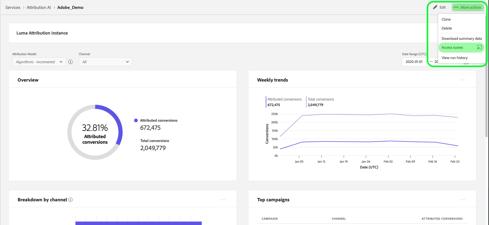

# アトリビューションAIでのスコアのダウンロード

このドキュメントは、アトリビューションAIのスコアをダウンロードする際のガイドとして機能します。

## はじめに

アトリビューションAIを使用すると、スコアをパーケファイル形式でダウンロードできます。 このチュートリアルでは、はじめに [](./getting-started.md) 「」のAttribution AIスコアのダウンロードの節を読み終えている必要があります。

さらに、アトリビューションAIのスコアにアクセスするには、実行が成功したステータスを持つサービスインスタンスが使用可能になっている必要があります。 新しいサービスインスタンスを作成するには、 [アトリビューションAIユーザーガイドを参照してください](./user-guide.md)。 最近サービスインスタンスを作成したが、まだトレーニングとスコアリングを受けている場合は、24時間待ってから実行を終了してください。

## Find your dataset ID {#dataset-id}

アトリビューションAIインサイトのサービスインスタンス内で、右上のナビゲーションにある *その他のアクション* (More Actions **[!UICONTROL Access scores]**)ドロップダウンをクリックし、を選択します。



新しいダイアログが表示され、ダウンロードスコアに関するドキュメントへのリンクと現在のインスタンスのデータセットIDが含まれます。 データセットIDをクリップボードにコピーし、次の手順に進みます。


## バッチIDの取得 {#retrieve-your-batch-id}

前の手順のデータセットIDを使用して、バッチIDを取得するには、Catalog APIを呼び出す必要があります。 組織に属するバッチのリストではなく、成功した最新のバッチを返すために、このAPI呼び出しに追加のクエリパラメーターが使用されます。 追加のバッチを返すには、 `limit` クエリパラメーターの数値を、返す金額に増やします。 使用可能なクエリパラメーターのタイプの詳細については、クエリパラメーターを使用したカタログデータの [フィルタリングに関するガイドを参照してください](../../catalog/api/filter-data.md)。

**API形式**

```http
GET /batches?&dataSet={DATASET_ID}&createdClient=acp_foundation_push&status=success&orderBy=desc:created&limit=1
```

| パラメーター | 説明 |
| --------- | ----------- |
| `{DATASET_ID}` | データセットIDは、「アクセススコア」ダイアログで使用できます。 |

**リクエスト**

```shell
curl -X GET 'https://platform.adobe.io/data/foundation/catalog/batches?&dataSet=5e8f81ce7a4ecb18a8d25b22&createdClient=acp_foundation_push&status=success&orderBy=desc:created&limit=1' \
  -H 'Authorization: Bearer {ACCESS_TOKEN}' \
  -H 'x-api-key: {API_KEY}' \
  -H 'x-gw-ims-org-id: {IMS_ORG}' \
  -H 'x-sandbox-name: {SANDBOX_NAME}'
```

**応答**

成功した応答は、バッチIDオブジェクトを含むペイロードを返します。 この例では、返されるオブジェクトのキー値はバッチIDで `01E5QSWCAASFQ054FNBKYV6TIQ`す。 バッチIDをコピーして、次のAPI呼び出しで使用します。

>[!NOTE]
> 次の応答では、読みやすさを考慮して `tags` オブジェクトの形式を変更しました。

```json
{
    "01E5QSWCAASFQ054FNBKYV6TIQ": {
        "status": "success",
        "tags": {
            "Tags": [ ... ],
        },
        "relatedObjects": [
            {
                "type": "dataSet",
                "id": "5e8f81cf7a4ecb28a8d85b22"
            }
        ],
        "id": "01E5QSWCAASFQ054FNBKYV6TIQ",
        "externalId": "01E5QSWCAASFQ054FNBKYV6TIQ",
        "replay": {
            "predecessors": [
                "01E5N7EDQQP4JHJ93M7C3WM5SP"
            ],
            "reason": "Replacing for 2020-04-09",
            "predecessorListingType": "IMMEDIATE"
        },
        "inputFormat": {
            "format": "parquet"
        },
        "imsOrg": "412657965Y566A4A0A495D4A@AdobeOrg",
        "started": 1586715571808,
        "metrics": {
            "partitionCount": 1,
            "outputByteSize": 2380339,
            "inputFileCount": -1,
            "inputByteSize": 2381007,
            "outputRecordCount": 24340,
            "outputFileCount": 1,
            "inputRecordCount": 24340
        },
        "completed": 1586715582735,
        "created": 1586715571217,
        "createdClient": "acp_foundation_push",
        "createdUser": "sensei_exp_attributionai@AdobeID",
        "updatedUser": "acp_foundation_dataTracker@AdobeID",
        "updated": 1586715583582,
        "version": "1.0.5"
    }
}
```

## バッチIDを使用した次のAPI呼び出しを取得する {#retrieve-the-next-api-call-with-your-batch-id}

バッチIDを取得すると、に新しいGETリクエストを作成でき `/batches`ます。 リクエストは、次のAPIリクエストとして使用されるリンクを返します。

**API形式**

```http
GET batches/{BATCH_ID}/files
```

| パラメーター | 説明 |
| --------- | ----------- |
| `{BATCH_ID}` | 前の手順で取得したバッチIDは、バッチID [を取得します](#retrieve-your-batch-id)。 |

**リクエスト**

独自のバッチIDを使用して、次のリクエストを行います。

```shell
curl -X GET 'https://platform.adobe.io/data/foundation/export/batches/01E5QSWCAASFQ054FNBKYV6TIQ/files' \
  -H 'Authorization: Bearer {ACCESS_TOKEN}' \
  -H 'x-api-key: {API_KEY}' \
  -H 'x-gw-ims-org-id: {IMS_ORG}' \
  -H 'x-sandbox-name: {SANDBOX_NAME}'
```

**応答**

成功した応答は、 `_links` オブジェクトを含むペイロードを返します。 オブジェクト内 `_links` には、新しいAPI呼び出し `href` を値として含むが、 この値をコピーして、次の手順に進みます。

```json
{
    "data": [
        {
            "dataSetFileId": "01E5QSWCAASFQ054FNBKYV6TIQ-1",
            "dataSetViewId": "5e8f81cf7a4ecb28a8d85b22",
            "version": "1.0.0",
            "created": "1586715582571",
            "updated": "1586715582571",
            "isValid": false,
            "_links": {
                "self": {
                    "href": "https://platform.adobe.io:443/data/foundation/export/files/01E5QSWCXXYFQ054FNBKYV2BAQ-1"
                }
            }
        }
    ],
    "_page": {
        "limit": 100,
        "count": 1
    }
}
```

## ファイルの取得 {#retrieving-your-files}

前の手順で取得した `href` 値をAPI呼び出しとして使用し、新しいGETリクエストを作成してファイルディレクトリを取得します。

**API形式**

```http
GET files/{DATASETFILE_ID}
```

| パラメーター | 説明 |
| --------- | ----------- |
| `{DATASETFILE_ID}` | dataSetFile IDは、 `href` 前の手順の [値で返されます](#retrieve-the-next-api-call-with-your-batch-id)。 また、オブジェクトタイプの `data` 配列でもアクセスでき `dataSetFileId`ます。 |

**リクエスト**

```shell
curl -X GET 'https://platform.adobe.io/data/foundation/export/files/01E5QSWCAASFQ054FNBKYV6TIQ-1' \
  -H 'Authorization: Bearer {ACCESS_TOKEN}' \
  -H 'x-api-key: {API_KEY}' \
  -H 'x-gw-ims-org-id: {IMS_ORG}' \
  -H 'x-sandbox-name: {SANDBOX_NAME}'
```

**応答**

応答には、1つのエントリを持つデータ配列、またはそのディレクトリに属するファイルのリストが含まれます。 次の例は、ファイルのリストを示しており、読みやすくまとめられています。 このシナリオでは、各ファイルにアクセスするには、各ファイルのURLに従う必要があります。

```json
{
    "data": [
        {
            "name": "part-00000-tid-5614147572541837832-908bd66a-d856-47fe-b7da-c8e7d22a4097-1370467-1.c000.snappy.parquet",
            "length": "2380211",
            "_links": {
                "self": {
                    "href": "https://platform.adobe.io:443/data/foundation/export/files/01E5QSWCXXYFQ054FNBKYV2BAQ-1?path=part-00000-trd-5714147572541837832-938bd66a-d556-41fe-b7da-c8e7d22a4097-1320467-1.c000.snappy.parquet"
                }
            }
        }
    ],
    "_page": {
        "limit": 100,
        "count": 1
    }
}
```

| パラメーター | 説明 |
| --------- | ----------- |
| `_links.self.href` | ディレクトリ内のファイルのダウンロードに使用するGET要求URLです。 |


アレイ内の任意のファイルオブジェクトの `href` 値をコピーし、 `data` 次の手順に進みます。

## ファイルデータのダウンロード

ファイルデータをダウンロードするには、前の手順でコピーした `"href"` 値にGETリクエストを行い、ファイル [を取得します](#retrieving-your-files)。

>[!NOTE] この要求をコマンドラインで直接行う場合、要求ヘッダーの後に出力を追加するよう求められる場合があります。 次のリクエストの例は、を使用してい `--output {FILENAME.FILETYPE}`ます。

**API形式**

```http
GET files/{DATASETFILE_ID}?path={FILE_NAME}
```

| パラメーター | 説明 |
| --------- | ----------- |
| `{DATASETFILE_ID}` | dataSetFile IDは、 `href` 前の手順の [値で返されます](#retrieve-the-next-api-call-with-your-batch-id)。 |
| `{FILE_NAME}` | ファイルの名前。 |

**リクエスト**

```shell
curl -X GET 'https://platform.adobe.io:443/data/foundation/export/files/01E5QSWCXXYFQ054FNBKYV2BAQ-1?path=part-00000-trd-5714147572541837832-938bd66a-d556-41fe-b7da-c8e7d22a4097-1320467-1.c000.snappy.parquet' \
  -H 'Authorization: Bearer {ACCESS_TOKEN}' \
  -H 'x-api-key: {API_KEY}' \
  -H 'x-gw-ims-org-id: {IMS_ORG}' \
  -H 'x-sandbox-name: {SANDBOX_NAME}' \
  -O 'file.parquet'
```

>[!TIP] GETリクエストを行う前に、ファイルを保存するディレクトリまたはフォルダーが正しいことを確認してください。

**応答**

応答によって、現在のディレクトリで要求したファイルがダウンロードされます。 この例では、ファイル名は「file.parket」です。


## 次の手順

このドキュメントでは、アトリビューションAIスコアのダウンロードに必要な手順を説明しています。 提供される他の [インテリジェントサービス](../home.md) 、ガイドを引き続き参照できるようになりました。

## スノーフレークを使用したスコアへのアクセス

>[!IMPORTANT] SnowFlakeを使用したスコアへのアクセスについて詳しくは、attributionai-support@adobe.comにお問い合わせください。

集計されたアトリビューションAIスコアには、Snowflakeを使用してアクセスできます。 現在、Snowflakeの読者アカウントに資格情報を設定して受け取るには、アドビサポート(attributionai-support@adobe.com)に電子メールでお問い合わせいただく必要があります。

アドビサポートがリクエストを処理すると、Snowflakeの読者アカウントのURLと、次の対応する資格情報が提供されます。

- 雪片URL
- ユーザー名
- パスワード

>[!NOTE] Readerアカウントは、JDBC ConnectorをサポートするSQLクライアント、WorksheetおよびBIソリューションを使用して、データに対するクエリーを行います。

資格情報とURLを取得したら、モデル表をクエリし、タッチポイント日またはコンバージョン日別に集計できます。

### Snowflakeでスキーマを見つける

提供された資格情報を使用してSnowflakeにログインします。 左上のメインナビゲーションで「 **ワークシート** 」タブをクリックし、左側のパネルでデータベースディレクトリに移動します。


次に、画面の右上隅にある **「スキーマを選択** 」をクリックします。 表示されるプローバーで、適切なデータベースが選択されていることを確認します。 次に、[ *スキーマ* ]ドロップダウンをクリックし、表示されたスキーマの1つを選択します。 選択したスキーマの下にリストされたスコアテーブルから直接クエリできます。


## PowerBIとSnowflakeの接続（オプション）

雪片資格情報は、PowerBIデスクトップと雪片データベースの間の接続を設定するために使用できます。

まず、「 *Server* 」ボックスの下で、雪片URLを入力します。 次に、「 *Warehouse*」で、「XSMALL」と入力します。 次に、ユーザ名とパスワードを入力します。


接続が確立されたら、雪片データベースを選択し、適切なスキーマを選択します。 これで、すべてのテーブルを読み込むことができます。
