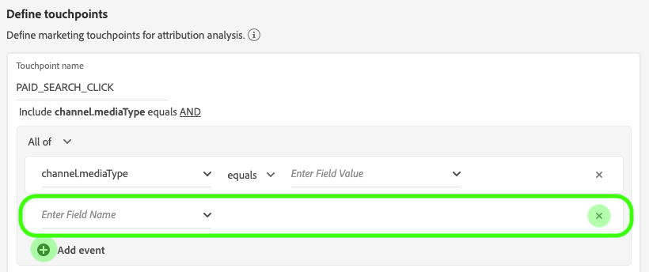
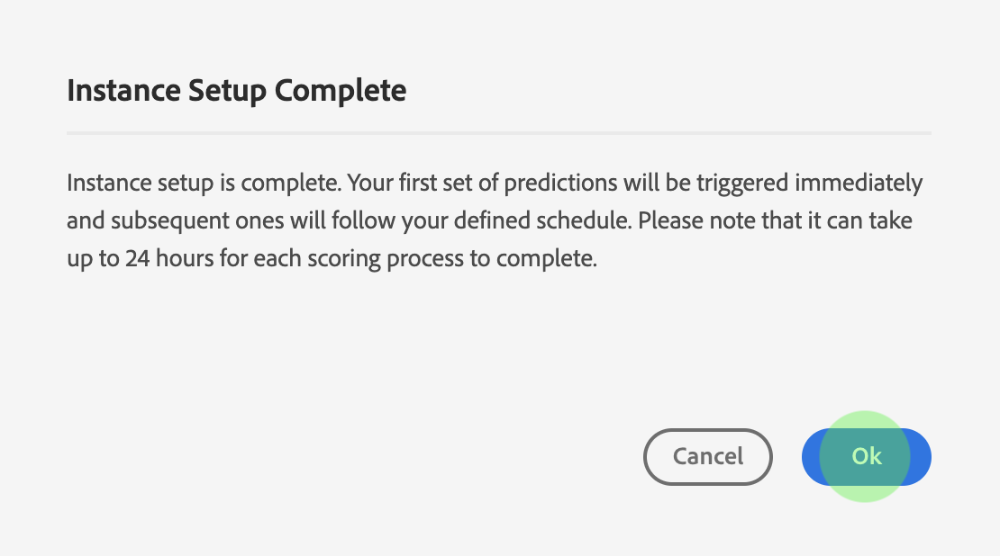

# Attribution AIUI ガイド

Attribution AI はインテリジェントサービスの一部で、顧客とのやり取りの影響と増分的な効果を指定した成果に照らして計算する、マルチチャネルのアルゴリズムアトリビューションサービスです。Attribution AI を使用すると、マーケターは、カスタマージャーニーの各段階における顧客との個々のやり取りの影響を把握することで、マーケティング費用や広告費用を測定し最適化できます。

このドキュメントは、インテリジェントサービスユーザーインターフェイスの Attribution AI を操作するためのガイドとなります。

## インスタンスの作成

[!DNL Adobe Experience Platform] UI で、左側のナビゲーションで **[!UICONTROL サービス]** をクリックします。 **[!UICONTROL Services]** ブラウザーが開き、利用可能なアドビのインテリジェントサービスが表示されます。Attribution AI のコンテナで、「**[!UICONTROL Open]**」をクリックします。

Attribution AI サービスページが表示されます。このページには、Attribution AI のサービスインスタンスが一覧表示され、インスタンスの名前、コンバージョンイベント、インスタンスの実行頻度、最後の更新のステータスなど、インスタンスに関する情報が表示されます。

**[!UICONTROL スコア付きの合計コンバージョンイベント数]** 指標は、**[!UICONTROL インスタンスの作成]** コンテナの右下にあります。 この指標では、現在の年のAttribution AIでスコアされたコンバージョンイベントの合計数を追跡します。これには、すべてのサンドボックス環境と削除されたサービスインスタンスが含まれます。

UI の右側にあるコントロールを使用して、サービスインスタンスの編集、複製、削除をおこなうことができます。 これらのコントロールを表示するには、既存の **[!UICONTROL サービスインスタンス]** からインスタンスを選択します。 コントロールには、次の情報が含まれます。

- **[!UICONTROL 編集]**:「編 **** 集」を選択すると、既存のサービスインスタンスを変更できます。インスタンスの名前、説明、ステータス、スコアリング頻度を編集できます。
- **[!UICONTROL クローン]**:[ クロー **** ン ] を選択すると、選択したサービス・インスタンスがコピーされます。その後、ワークフローを変更して小さな調整を行い、新しいインスタンスとして名前を変更できます。
- **[!UICONTROL 削除]**:過去の実行を含むサービスインスタンスを削除できます。
- **[!UICONTROL データソース]**:このインスタンスで使用されているデータセットへのリンク。
- **[!UICONTROL 前回の実行の詳細]**:これは、実行が失敗した場合にのみ表示されます。エラーコードなど、実行が失敗した理由に関する情報がここに表示されます。

- **[!UICONTROL コンバージョンイベント]**:このインスタンスに設定されたコンバージョンイベントの概要を簡単に説明します。
- **[!UICONTROL ルックバックウィンドウ]**:コンバージョンイベントの何日前からのタッチポイントが含まれるかを示す、定義した時間枠です。
- **[!UICONTROL タッチポイント]**:このインスタンスの作成時に定義したすべてのタッチポイントのリスト。

**[!UICONTROL インスタンスを作成]** を選択して開始します。

次に、Attribution AI の設定ページが表示されます。基本情報を入力し、インスタンスのデータセットを指定できます。

### インスタンス名の設定

「**[!UICONTROL Basic information]**」で、サービスインスタンスの名前と説明（説明は省略可）を入力します。

### データセットの選択

基本情報を入力したら、**Select Dataset** ドロップダウンをクリックしてデータセットを選択します。データセットは、モデルのトレーニングと、モデルが生成する後続のデータのスコアリングに使用されます。ドロップダウンセレクターからデータセットを選択する際、Attribution AI と互換性があり、XDM（Experience Data Model）スキーマに準拠するデータセットのみリスト表示されます。データセットを選択したら、右上隅の「**Next**」をクリックして、イベント定義ページに進みます。

>[!TIP]
>
>Adobe Analyticsデータセットは、Analytics Source Connector を介してサポートされます。

## イベントの定義

イベントの定義に使用される入力データには、次の 3 種類があります。

- **コンバージョンイベント**：eコマースでの注文、店頭での購入、Web サイトの訪問といったマーケティングアクティビティの影響を識別するビジネス目標です。
- **ルックバックウィンドウ**：コンバージョンイベントの何日前からのタッチポイントを考慮に入れるかを示す時間枠です。
- **タッチポイント**：コンバージョンの数値的影響つまり売上ベースの影響を評価するために使用する、受信者レベル、個人レベル、cookie レベルのマーケティングイベントです。

### コンバージョンイベントの定義 {#define-conversion-events}

コンバージョンイベントを定義するには、イベントに名前を付け、**フィールド名を入力** ドロップダウンメニューをクリックしてイベントタイプを選択する必要があります。

イベントを選択すると、新しいドロップダウンが右側に表示されます。2 番目のドロップダウンは、操作を通じてイベントの詳細なコンテキストを指定するために使用します。図中のコンバージョンイベントには、デフォルトの操作 *exists* が使用されています。

>[!NOTE]
>
> *コンバージョン名*&#x200B;の下の文字列は、イベントの定義に応じて更新されます。

コンバージョンをさらに詳しく定義するには、「**[!UICONTROL Add event]**」ボタンと「**[!UICONTROL Add Group]**」ボタンを使用します。定義するコンバージョンに応じて、場合によっては、「**[!UICONTROL Add event]**」ボタンと「**[!UICONTROL Add Group]**」ボタンを使用して詳細なコンテキストを指定する必要があります。

「**[!UICONTROL Add event]**」をクリックすると、追加のフィールドが作成され、前述と同じ方法で入力できます。これにより、コンバージョン名の下の文字列定義に AND ステートメントが追加されます。「**x**」をクリックすると、追加したイベントが削除されます。

「**[!UICONTROL Add Group]**」をクリックすると、元のフィールドとは別に追加のフィールドを作成するためのオプションが表示されます。グループを追加すると、青い「*And*」ボタンが表示されます。「**And**」をクリックすると、「Or」を含むようにパラメーターを変更するためのオプションが表示されます。「Or」は、成功するコンバージョンパスを複数定義するために使用します。「And」は、コンバージョンパスを拡張して追加の条件を含めるために使用します。

複数のコンバージョンが必要な場合は、「**Add conversion**」をクリックして、新しいコンバージョンカードを作成します。上記のプロセスを繰り返して、複数のコンバージョンを定義できます。

### ルックバックウィンドウの定義 {#lookback-window}

変換の定義が完了したら、ルックバックウィンドウを確定する必要があります。矢印キーを使用するかデフォルト値（56）をクリックして、コンバージョンイベントの何日前からのタッチポイントを考慮に入れるかを指定します。タッチポイントは次の手順で定義します。

### タッチポイントの定義

タッチポイントの定義は、[コンバージョンの定義](#define-conversion-events)と同様のワークフローに従います。最初に、タッチポイントに名前を付け、*フィールド名を入力*&#x200B;ドロップダウンメニューからタッチポイント値を選択します。選択したら、演算子のドロップダウンが表示され、「exists」がデフォルト値になっています。ドロップダウンをクリックして、演算子のリストを表示します。

図中のタッチポイントには、**equals** を選択します。

タッチポイントの演算子を選択したら、*フィールド名を入力*&#x200B;が使用可能になります。*フィールド名を入力*&#x200B;ドロップダウンに表示される値は、先ほど選択した演算子とタッチポイントの値によって異なります。値がドロップダウンに表示されない場合は、その値を手動で入力できます。ドロップダウンをクリックし、**CLICK** を選択します。

>[!NOTE]
>
> 演算子「exists」と「not exists」には、フィールド値が関連付けられていません。

タッチポイントをさらに詳しく定義するには、「*Add event*」ボタンと「*Add Group*」ボタンを使用します。タッチポイントを取り巻く状況は複雑なので、1 つのタッチポイントに対して複数のイベントとグループがあることは珍しくありません。

「**Add event**」をクリックすると、フィールドを追加できます。「**x**」をクリックすると、追加したイベントが削除されます。

「**Add Group**」をクリックすると、元のフィールドとは別に追加のフィールドを作成するためのオプションが表示されます。グループを追加すると、青い「*And*」ボタンが表示されます。パラメーターを変更するには、「**And**」をクリックします。新しいパラメーター「Or」を使用すると、複数の成功パスを定義できます。図中のタッチポイントには成功パスが 1 つしかないので、「Or」は不要です。

>[!NOTE]
>
> *タッチポイント名*&#x200B;の下の文字列を使用すると、タッチポイントの概要をすばやく確認できます。なお、この文字列はタッチポイントの名前と一致します。

タッチポイントを追加するには、「**Add touchpoint**」をクリックし、上記の手順を繰り返します。

必要なタッチポイントの定義がすべて完了したら、上にスクロールし、右上隅の「**Next**」をクリックして最後の手順に進みます。

## 高度なトレーニングとスコアリングの設定

Attribution AI の最後のページは、トレーニングとスコアリングの設定に使用する **[!UICONTROL Advanced]** ページです。

### トレーニングのスケジュール設定

「*Schedule*」を使用して、スコアリングをおこなう曜日と時刻を選択できます。

「*Scoring Frequency*」の下のドロップダウンをクリックして、日次、週次、月次の中からスコアリング頻度を選択します。次に、スコアリングをおこなう曜日を選択します。複数の曜日を選択できます。曜日をもう 1 回クリックすると、選択が解除されます。

スコアリングをおこなう時刻を変更するには、時計アイコンをクリックします。表示される新しいオーバーレイで、スコアリングをおこなう時刻を入力します。オーバーレイの外側をクリックすると、オーバーレイが閉じます。

>[!NOTE]
>
> 各スコアリングプロセスが完了するまで、最大 24 時間かかる可能性があります。

### 追加のスコアデータセット列（オプション）

デフォルトでは、標準スキーマの各サービスインスタンスに対してスコアデータセットが作成されます。 コンバージョンイベント設定とタッチポイント設定に基づいて、スコアデータセットの出力に列を追加することもできます。 まず、入力データセットから列を選択し、ドラッグ&amp;ドロップして、ハンバーガーアイコンの上にマウスの左ボタンを押しながら順序を変更します。

### 地域ベースのモデリング（オプション） {#region-based-modeling-optional}

顧客の行動は、国や地域によって大きく異なる場合があります。グローバルビジネスの場合、国ベースまたは地域ベースのモデルを使用すると、アトリビューションの精度が向上する可能性があります。追加された地域ごとに、その地域のデータを使用して新しいモデルを作成します。

新しい地域を定義するには、まず「**[!UICONTROL Add region]**」をクリックします。表示されるコンテナで、地域の名前を入力します。**[!UICONTROL フィールド名を入力]**&#x200B;ドロップダウンに表示される値は 1 つ（「placeContext.geo.countryCode」）だけです。この値を選択します。

次に、演算子を選択します。

最後に、**[!UICONTROL フィールド名を入力]**&#x200B;ドロップダウンで国コードを選択します。

>[!NOTE]
>
> 国コードの長さは 2 文字です。完全なリストについては、[ISO 3166-1 alpha-2](https://datahub.io/core/country-list) を参照してください。

### トレーニングウィンドウ {#training-window}

できるだけ正確なモデルを得るためには、ビジネスを表す履歴データを使用してモデルをトレーニングすることが重要です。デフォルトでは、コンバージョンイベントデータの 2 四半期（6 ヶ月）を使用して、モデルのトレーニングを実施します。 ドロップダウンを選択すると、デフォルトを変更できます。トレーニングに使用するデータの期間は、1 四半期（3 ヶ月）から 4 四半期（12 ヶ月）の間で選択できます。

>[!NOTE]
>
> トレーニング期間を短くすると、最近のトレンドに対する感度が高くなります。一方、トレーニング期間を長くすると、モデルの堅牢性が高まる反面、最近のトレンドに対する感度が下がります。

トレーニング期間を選択したら、右上隅の「**[!UICONTROL Finish]**」をクリックします。データの処理に多少時間がかかる場合があります。完了したら、インスタンスの設定が完了したことを確認するポップオーバーダイアログが表示されます。「**[!UICONTROL Ok]**」をクリックすると、**[!UICONTROL Service instances]** ページにリダイレクトされ、サービスインスタンスが表示されます。

## 次の手順

このチュートリアルに従って、Attribution AI にサービスインスタンスを正常に作成できました。インスタンスのスコアリングが完了したら（24 時間以内に完了）、[Attribution AI インサイトを見つける](./discover-insights.md)準備が整います。また、スコアリング結果をダウンロードする場合は、[ スコアのダウンロード ](./download-scores.md) のドキュメントを参照してください。

## その他のリソース

次のビデオでは、Attribution AI内に新しいインスタンスを作成するためのエンドツーエンドのワークフローの概要を説明します。

>[!VIDEO](https://video.tv.adobe.com/v/32668?learn=on&quality=12)
