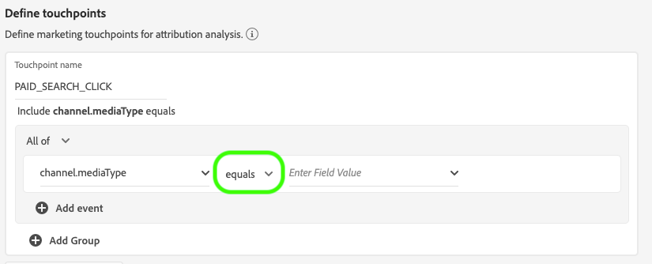
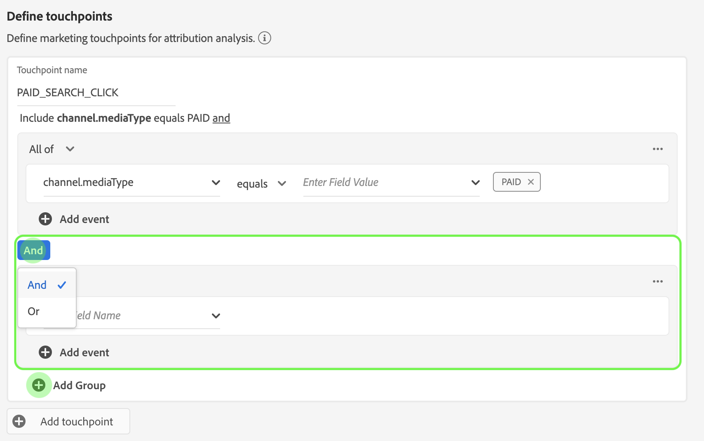

# アトリビューションAIユーザーガイド

アトリビューションAIは、インテリジェントサービスの一部として、複数チャネルのアルゴリズムアトリビューションサービスで、指定した結果に対する顧客のインタラクションの影響と増分的な影響を計算します。 アトリビューションAIを使用すると、マーケティング担当者は、顧客の遍歴の各段階での個々の顧客のインタラクションの影響を把握することで、マーケティング費用と広告費用を測定し、最適化できます。

このドキュメントは、インテリジェントサービスユーザーインターフェイスのアトリビューションAIを操作するためのガイドとして機能します。

## インスタンスの作成

In the Adobe Experience Platform UI, click **Services** in the left navigation. サービス *ブラウザーが表示され* 、利用可能なAdobe Intelligent Servicesが表示されます。 In the container for Attribution AI, click **Open**.

アトリビューションAIサービスページが表示されます。 このページには、Attribution AIのサービスインスタンスがリストされ、インスタンスの名前、コンバージョンイベント、インスタンスが実行される頻度、最後の更新のステータスなど、それらに関する情報が表示されます。 開始するに **は、「インスタンスを作成** 」をクリックします。

次に、アトリビューションAIの設定ページが表示され、基本情報を提供し、インスタンスのデータセットを指定できます。

### インスタンスに名前を付ける

「基本情 *報」で*、サービスインスタンスの名前と説明（オプション）を入力します。

### データセットの選択

基本情報を入力したら、「データセットの選択」というラベルの付いたドロッ **プダウンをクリックし** 、データセットを選択します。 データセットは、モデルのトレーニングと、モデルが生成する後続のデータのスコアリングに使用されます。 ドロップダウンセレクターからデータセットを選択すると、Attribution AIと互換性があり、Experience Data Model(XDM)スキーマに適合するもののみが表示されます。 データセットを選択したら、 **右上隅の** 「次へ」をクリックして「イベントの定義」ページに進みます。

## 定義イベント

データの定義に使用される入力データには、次の3種類のイベントがあります。

- **コンバージョンイベント:** eコマース注文、店頭購入、Webサイト訪問などのマーケティングアクティビティの影響を識別するビジネス目標。
- **ルックバックウィンドウ：** コンバージョンイベントのタッチポイントを含める日数を示す時間枠です。
- **タッチポイント：** 受信者、個人、cookieレベルのマーケティングイベントで、コンバージョンの数値または売上高に基づく影響を評価するために使用します。

### コンバージョンイベント

コンバージョンイベントを定義するには、イベントに名前を付け、[フィールド名の入力]ドロップダウンメニューをクリックして **イベントタイプを選択する** 必要があります。

イベントを選択すると、新しいドロップダウンが右側に表示されます。 2つ目のドロップダウンは、操作を通じてイベントに対する詳細なコンテキストを提供するために使用します。 この変換イベントでは、デフォルトの操作が *使用さ* れます。

>[!NOTE] コンバージョン名の下の *文字列は* 、ユーザーが定義したとおりに更新されます。イベント

「 *追加イベント」ボ* 追加タンと「グループ ** 」ボタンを使用して、コンバージョンをさらに定義します。 定義する変換に応じて、詳細なコンテキストを提供するために *追加、「* 追加イベント *」ボタンと「グループ* 」ボタンを使用する必要があります。

「 **追加イベント** 」をクリックすると、追加のフィールドが作成され、前述と同じ方法で入力できます。 これにより、 *AND* 文が変換名の下の文字列定義に追加 *されます*。 追加した **イベントを削除するには、「x** 」をクリックします。

「グルー **追加プ** 」をクリックすると、元のフィールドとは別に追加のフィールドを作成するオプションが表示されます。 グループを追加すると、青い「 *And* 」ボタンが表示されます。 「AND」をク **リック** すると、「OR」を含むパラメーターを変更するオプションが表示されます。 「OR」は、複数の成功したコンバージョンパスを定義するために使用します。 「And」は、コンバージョンパスを拡張して、追加の条件を含めます。

複数のコンバージョンが必要な場合は、「コンバージョン」をク **追加リックして** 、新しいコンバージョンカードを作成します。 上記のプロセスを繰り返して、複数のコンバージョンを定義できます。

### ルックバックウィンドウの定義

変換の定義が完了したら、ルックバックウィンドウを確認する必要があります。 矢印キーを使用するか、デフォルト値(56)をクリックして、タッチポイントを含めるコンバージョンイベントの前の日数を指定します。 タッチポイントは次の手順で定義します。

### タッチポイントの定義

タッチポイントの定義は、コンバージョンの定義と同様のワークフ [ローに従いま](#define-conversion-events)す。 最初に、タッチポイントに名前を付け、「フィールド名を入力」ドロップダウンメニューからタッ *チポイントの値を* 「選択」します。 選択すると、演算子のドロップダウンがデフォルト値「exists」と共に表示されます。 ドロップダウンをクリックして、演算子のリストを表示します。

このタッチポイントの目的で、「次に等しい」を選 **択します**。

タッチポイントの演算子を選択すると、「 *Enter Field Value* 」が使用可能になります。 「フィールド値を入力」 *のドロップダウン値は* 、前に選択した演算子とタッチポイントの値に基づいて入力されます。 値がドロップダウンに入力されない場合は、手動でその値を入力できます。 ドロップダウンをクリックし、[ **CLICK**]を選択します。

>[!NOTE] 演算子「exists」と「not exists」には、関連するフィールド値がありません。

タッチポイ *ントをさらに定義するには* 、 *「イベント* 」ボタンと「グループ」ボタンが使用されます。 タッチポイントを囲む複雑な特性により、単一のタッチポイントに対して複数のイベントとグループを持つことは珍しくありません。

クリックすると、 **追加イベント** で追加のフィールドを追加できます。 追加した **イベントを削除するには、「x** 」をクリックします。

グルー **追加プをクリックすると** 、元のフィールドとは別に追加のフィールドを作成するオプションが表示されます。 グループを追加すると、青い「 *And* 」ボタンが表示されます。 「 **And** 」をクリックしてパラメーターを変更すると、新しいパラメーター「Or」を使用して複数の成功したパスが定義されます。 この特定のタッチポイントには成功したパスが1つだけあるので、「Or」は不要です。

>[!NOTE] タッチポイント名の下の *文字列を使用し* 、タッチポイントの概要をすばやく確認できます。 この文字列はタッチポイントの名前と一致します。

タッチポイントを追加するには、タッチポイントをク **追加リックし** 、上記の手順を繰り返します。

必要なタッチポイントの定義がすべて完了したら、上にスクロールし **て** 、右上隅の「次へ」をクリックし、最後の手順に進みます。

## 高度なトレーニングとスコアリングの設定

アトリビューションAIの最後のページは、トレーニ *ング* とスコアの設定に使用するアドバンスページです。

### トレーニングのスケジュール

スケジュール *を使用*、スコアリングを行う曜日と時間を選択できます。

「スコアリング頻度」の下のド *ロップダウンをクリックし* 、日別、週別、月別のスコアを選択します。 次に、スコアを適用する曜日を選択します。 複数の日を選択できます。 選択を解除するには、1日をもう1回クリックします。

スコアを適用する時刻を変更するには、時計アイコンをクリックします。 表示される新しいオーバーレイで、スコアを適用する時刻を入力します。 オーバーレイの外側をクリックして閉じます。

>[!NOTE] 各スコアリングプロセスが完了するまで、最大24時間かかります。

### 領域ベースのモデリング（オプション）

顧客の行動は、国や地域によって大きく異なる場合があります。 グローバルビジネスの場合、国ベースまたは地域ベースのモデルを使用すると、アトリビューションの正確性が向上します。 追加された各領域は、その領域のデータを持つ新しいモデルを作成します。

新しい領域を定義するには、開始をクリック **追加します**。 表示されるコンテナで、地域の名前を指定します。 「フィールド名を入力」ドロップダウンから入力される値は1 *つだけです* 。 この値を選択します。

次に、演算子を選択します。

最後に、[フィールド値の入力]ドロップダウンに国 *コードを入力します* 。

>[!NOTE] 国コードの長さは2文字です。 完全なリストは、 [ISO 3166-1 alpha-2を参照してください](https://datahub.io/core/country-list)。

### トレーニングウィンドウ

可能な限り正確なモデルを得るためには、ビジネスを表す履歴データを使用してモデルをトレーニングすることが重要です。 デフォルトでは、モデルは2四半期（6か月）のデータを使用してトレーニングを受けます。 ドロップダウンを選択して、デフォルトを変更します。 4分の1（3 ～ 12ヶ月）のデータを使用してトレーニングを実施できます。

>[!NOTE] トレーニング期間を短くすると、最近のトレンドに対する敏感さが増します。一方、トレーニング期間を長くすると、より堅牢なモデルが作成され、最近のトレンドに対する敏感さが低下します。

トレーニングウィンドウを選択したら、 **右上隅の** 「完了」をクリックします。 データの処理に時間をかけます。 完了すると、インスタンスの設定が完了したことを確認するプローバーダイアログが表示されます。 「 **OK** 」をクリックして、サービスインスタ ** ンスページにリダイレクトし、サービスインスタンスを表示できます。

## 次の手順

このチュートリアルに従うと、Attribution AIにサービスインスタンスが正常に作成されます。 インスタンスのスコアリングが完了したら（24時間まで）、アトリビューションAIインサイトを見つ [ける準備が整います](./discover-insights.md)。 また、スコア結果をダウンロードする場合は、生のスコアのドキュメントのダ [ウンロードを参照し](./download-scores.md) 、