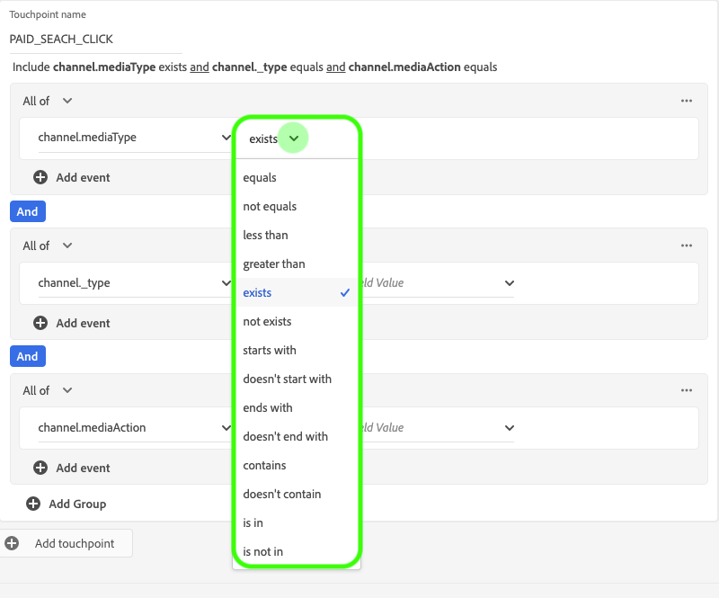
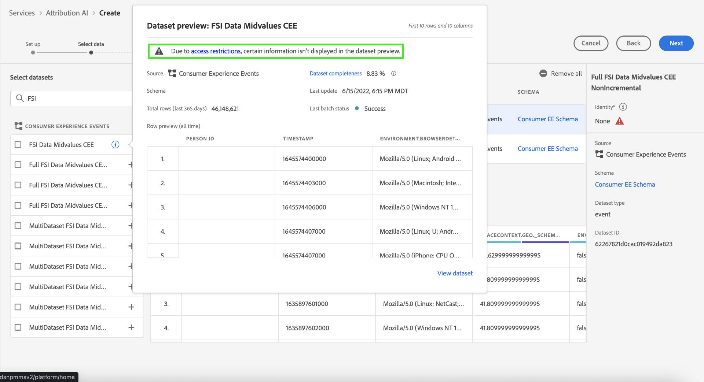

# Attribution AIUI ガイド

Attribution AI はインテリジェントサービスの一部で、顧客とのやり取りの影響と増分的な効果を指定した成果に照らして計算する、マルチチャネルのアルゴリズムアトリビューションサービスです。Attribution AI を使用すると、マーケターは、カスタマージャーニーの各段階における顧客との個々のやり取りの影響を把握することで、マーケティング費用や広告費用を測定し最適化できます。

このドキュメントは、インテリジェントサービスユーザーインターフェイスの Attribution AI を操作するためのガイドとなります。

## インスタンスの作成

内 [!DNL Adobe Experience Platform] UI、「 」を選択します。 **[!UICONTROL サービス]** をクリックします。 **[!UICONTROL Services]** ブラウザーが開き、利用可能なアドビのインテリジェントサービスが表示されます。Attribution AIのコンテナで、 **[!UICONTROL 開く]**.

Attribution AI サービスページが表示されます。このページには、Attribution AI のサービスインスタンスが一覧表示され、インスタンスの名前、コンバージョンイベント、インスタンスの実行頻度、最後の更新のステータスなど、インスタンスに関する情報が表示されます。

次の **[!UICONTROL スコアリングされた合計コンバージョンイベント数]** 指標は、 **[!UICONTROL インスタンスを作成]** コンテナ。 この指標は、すべてのサンドボックス環境と削除されたサービスインスタンスを含む、現在の暦年のAttribution AIでスコアリングされたコンバージョンイベントの合計数を追跡します。

UI の右側にあるコントロールを使用して、サービスインスタンスの編集、複製、削除をおこなうことができます。 これらのコントロールを表示するには、既存の **[!UICONTROL サービスインスタンス]**. コントロールには、次の情報が含まれます。

- **[!UICONTROL 編集]**:選択 **[!UICONTROL 編集]** 既存のサービスインスタンスを変更できます。 インスタンスの名前、説明、ステータス、スコア付け頻度を編集できます。
- **[!UICONTROL 複製]**:選択 **[!UICONTROL 複製]** 選択したサービスインスタンスをコピーします。 その後、ワークフローを変更して小さな調整を行い、新しいインスタンスとして名前を変更できます。
- **[!UICONTROL 削除]**:過去の実行も含めて、サービスインスタンスを削除できます。
- **[!UICONTROL データソース]**:使用するデータセットへのリンク。 Attribution AIで複数のデータセットが使用されている場合は、「複数」に続いてデータセット数が表示されます。 ハイパーリンクを選択すると、データセットのプレビューポップオーバーが表示されます。
- **[!UICONTROL 前回の実行の詳細]**:これは、実行が失敗した場合にのみ表示されます。 実行が失敗した理由に関する情報（エラーコードなど）がここに表示されます。

- **[!UICONTROL コンバージョンイベント]**:このインスタンスに設定されたコンバージョンイベントの概要です。
- **[!UICONTROL ルックバックウィンドウ]**:コンバージョンイベントの何日前からのタッチポイントが含まれるかを示す、定義した時間枠。
- **[!UICONTROL タッチポイント]**:このインスタンスの作成時に定義したすべてのタッチポイントのリスト。

選択 **[!UICONTROL インスタンスを作成]** をクリックして開始します。

次に、Attribution AIの設定ページが表示され、サービスインスタンスの名前と説明（オプション）を指定できます。

## データの選択 {#select-data}

<!-- https://www.adobe.com/go/aai-select-data -->

デザインにより、Attribution AIは、Adobe Analytics、エクスペリエンスイベントおよび消費者エクスペリエンスイベントのデータを使用して、アトリビューションスコアを計算できます。 データセットを選択すると、データと互換性のあるAttribution AIのみが表示されます。 データセットを選択するには、**+**) 記号をクリックするか、チェックボックスを選択して複数のデータセットを一度に追加します。 また、検索オプションを使用して、目的のデータセットをすばやく見つけることもできます。

使用するデータセットを選択した後、 **[!UICONTROL 追加]** ボタンを使用して、データセットのプレビューペインにデータセットを追加します。

情報アイコンの選択  データセットの横にある「データセットのプレビュー」ポップオーバーが開きます。

データセットのプレビューには、最終更新時間、ソーススキーマ、最初の 10 列のプレビューなどのデータが含まれます。

### データセットの完全性 {#dataset-completeness}

<!-- https://www.adobe.com/go/aai-dataset-completeness -->

データセットのプレビューは、データセットの完全性の割合の値です。 この値を使用すると、データセット内の空または null の列数のスナップショットをすばやく取得できます。 データセットに多数の欠落した値が含まれ、その値が他の場所で取り込まれる場合は、欠落した値を含むデータセットを含めることを強くお勧めします。

>[!NOTE]
>
>Attribution AIセットの完全性は、データの最大トレーニング期間（1 年）を使用して計算されます。 つまり、データセットの完全性の値を表示する際に、1 年以上前のデータは考慮されません。

### ID を選択 {#identity}

ID マップ（フィールド）に基づいて、複数のデータセットを相互に結合できるようになりました。 ID タイプ（「ID 名前空間」とも呼ばれます）と、その名前空間内の ID 値を選択する必要があります。 同じ名前空間の下で、スキーマ内の ID として複数のフィールドを割り当てた場合、割り当てた ID 値はすべて、名前空間の前に追加された ID ドロップダウンに表示されます（例： ）。 `EMAIL (personalEmail.address)` または `EMAIL (workEmail.address)`.

>[!IMPORTANT]
>
>選択したすべてのデータセットに同じ ID タイプ（名前空間）を使用する必要があります。 ID 列内の ID タイプの横に、互換性のあるデータセットを示す緑のチェックマークが表示されます。 例えば、Phone 名前空間を使用し、 `mobilePhone.number` 識別子として、残りのデータセットのすべての識別子には Phone 名前空間を含め、使用する必要があります。

ID を選択するには、ID 列にある下線付きの値を選択します。 「 ID の選択」ポップオーバーが表示されます。

1 つの名前空間内で複数の ID を使用できる場合は、使用例に合った正しい ID フィールドを選択するようにしてください。 例えば、電子メール名前空間内では、仕事用と個人用の 2 つの電子メール ID を使用できます。 ユースケースによっては、個人の電子メールが入力される可能性が高く、個々の予測でより役に立つようになります。 これは、「 `EMAIL (personalEmail.address)` ID として。

>[!NOTE]
>
> データセットに有効な ID タイプ（名前空間）が存在しない場合は、プライマリ ID を設定し、を使用して ID 名前空間に割り当てる必要があります。 [スキーマエディター](../../xdm/schema/composition.md#identity). 名前空間と ID について詳しくは、 [ID サービスの名前空間](../../identity-service/namespaces.md) ドキュメント。

## メディアチャネルとキャンペーンフィールドのマッピング {#aai-mapping}

<!-- https://www.adobe.com/go/aai-mapping -->

データセットの選択と追加が完了したら、 **マップ** 設定手順が表示されます。 Attribution AIは、前の手順で選択した各データセットのメディアチャネルフィールドをマッピングする必要があります。 これは、Attribution AIセット間でメディアチャネルマッピングがおこなわれないと、データから得られたインサイトが適切に表示されず、インサイトページが解釈しにくくなる可能性があるからです。 メディアチャネルのみが必要ですが、「メディアアクション」、「キャンペーン名」、「キャンペーングループ」、「キャンペーンタグ」など、オプションのフィールドの一部をマッピングすることを強くお勧めします。 これにより、Attribution AIはより明確なインサイトと最適な結果を提供できます。

## イベントの定義 {#define-events}

<!-- https://www.adobe.com/go/aai-define-events -->

イベントの定義に使用される入力データには、次の 3 種類があります。

- **コンバージョンイベント**：eコマースでの注文、店頭での購入、Web サイトの訪問といったマーケティングアクティビティの影響を識別するビジネス目標です。
- **ルックバックウィンドウ**：コンバージョンイベントの何日前からのタッチポイントを考慮に入れるかを示す時間枠です。
- **タッチポイント**：コンバージョンの数値的影響つまり売上ベースの影響を評価するために使用する、受信者レベル、個人レベル、cookie レベルのマーケティングイベントです。

### コンバージョンイベントの定義 {#define-conversion-events}

コンバージョンイベントを定義するには、イベントに名前を付け、 **データセットとフィールドを選択** ドロップダウンメニュー。

イベントを選択すると、新しいドロップダウンが右側に表示されます。2 番目のドロップダウンは、操作を通じてイベントの詳細なコンテキストを指定するために使用します。図中のコンバージョンイベントには、デフォルトの操作 *exists* が使用されています。

>[!NOTE]
>
> *コンバージョン名*&#x200B;の下の文字列は、イベントの定義に応じて更新されます。

次に、前の手順で入力データセットをすべて組み合わせて生成する組み合わせデータセットを選択できます。 または、 **データセットとフィールドを選択** ドロップダウンメニュー。

コンバージョンをさらに詳しく定義するには、「**[!UICONTROL Add event]**」ボタンと「**[!UICONTROL Add Group]**」ボタンを使用します。定義するコンバージョンに応じて、場合によっては、「**[!UICONTROL Add event]**」ボタンと「**[!UICONTROL Add Group]**」ボタンを使用して詳細なコンテキストを指定する必要があります。

選択 **[!UICONTROL イベントを追加]** は、上記と同じ方法で入力できる追加のフィールドを作成します。 これにより、コンバージョン名の下の文字列定義に AND ステートメントが追加されます。を選択します。 **x** をクリックして、追加されたイベントを削除します。

選択 **[!UICONTROL グループを追加]** には、元のフィールドとは別に追加のフィールドを作成するオプションが用意されています。 グループを追加すると、青い「*And*」ボタンが表示されます。選択 **および** には、「Or」を含むようにパラメーターを変更するオプションが与えられます。 「Or」は、成功するコンバージョンパスを複数定義するために使用します。「And」は、コンバージョンパスを拡張して追加の条件を含めるために使用します。

複数のコンバージョンが必要な場合は、「 **コンバージョンを追加** 新しいコンバージョンカードを作成します。 上記のプロセスを繰り返して、複数のコンバージョンを定義できます。

### ルックバックウィンドウの定義 {#lookback-window}

変換の定義が完了したら、ルックバックウィンドウを確定する必要があります。矢印キーを使用するか、デフォルト値 (56) を選択して、コンバージョンイベントの何日前からのタッチポイントを含めるかを指定します。 タッチポイントは次の手順で定義します。

### タッチポイントの定義

タッチポイントの定義は、[コンバージョンの定義](#define-conversion-events)と同様のワークフローに従います。最初に、タッチポイントに名前を付け、*フィールド名を入力*&#x200B;ドロップダウンメニューからタッチポイント値を選択します。選択したら、演算子のドロップダウンが表示され、「exists」がデフォルト値になっています。ドロップダウンを選択して、演算子のリストを表示します。

図中のタッチポイントには、**equals** を選択します。

タッチポイントの演算子を選択したら、*フィールド名を入力*&#x200B;が使用可能になります。*フィールド名を入力*&#x200B;ドロップダウンに表示される値は、先ほど選択した演算子とタッチポイントの値によって異なります。値がドロップダウンに表示されない場合は、その値を手動で入力できます。ドロップダウンを選択し、「 」を選択します。 **クリック**.

>[!NOTE]
>
> 演算子「exists」と「not exists」には、フィールド値が関連付けられていません。

タッチポイントをさらに詳しく定義するには、「**Add event**」ボタンと「**Add Group**」ボタンを使用します。タッチポイントを取り巻く状況は複雑なので、1 つのタッチポイントに対して複数のイベントとグループがあることは珍しくありません。

選択すると、 **イベントを追加** 「 」を使用すると、追加のフィールドを追加できます。 を選択します。 **x** をクリックして、追加されたイベントを削除します。

選択 **グループを追加** には、元のフィールドとは別に追加のフィールドを作成するオプションが用意されています。 グループを追加すると、青い「*And*」ボタンが表示されます。選択 **および** パラメーターを変更するには、新しいパラメーター「Or」を使用して、複数の成功パスを定義します。 図中のタッチポイントには成功パスが 1 つしかないので、「Or」は不要です。

>[!NOTE]
>
> *タッチポイント名*&#x200B;の下の文字列を使用すると、タッチポイントの概要をすばやく確認できます。なお、この文字列はタッチポイントの名前と一致します。

タッチポイントを追加するには、「 **タッチポイントを追加** 上記の処理を繰り返します。

必要なタッチポイントの定義がすべて完了したら、上にスクロールして「 」を選択します。 **次へ** をクリックして、最後の手順に進みます。

## 高度なトレーニングとスコアリングの設定

Attribution AI の最後のページは、トレーニングとスコアリングの設定に使用する **[!UICONTROL Advanced]** ページです。

### トレーニングのスケジュール設定

「*Schedule*」を使用して、スコアリングをおこなう曜日と時刻を選択できます。

の下のドロップダウンを選択します。 *スコアリング頻度* を使用して、日別、週別、月別のスコアを選択します。 次に、スコアリングをおこなう曜日を選択します。複数の曜日を選択できます。同じ日を再度選択すると、その日の選択が解除されます。

スコアリングを実行する時刻を変更するには、時計アイコンを選択します。 表示される新しいオーバーレイで、スコアリングをおこなう時刻を入力します。オーバーレイの外側を選択して閉じます。

>[!NOTE]
>
> 各スコアリングプロセスが完了するまで、最大 24 時間かかる可能性があります。

### 追加のスコアデータセット列（オプション）

デフォルトでは、標準スキーマ内の各サービスインスタンスに対してスコアデータセットが作成されます。 コンバージョンイベントとタッチポイントの設定に基づいて、スコアリングデータセットの出力に列を追加することもできます。 まず、入力データセットから列を選択し、ドラッグ&amp;ドロップして、ハンバーガーアイコンの上にマウスの左ボタンを押しながら順序を変更します。

### 地域ベースのモデリング（オプション） {#region-based-modeling-optional}

顧客の行動は、国や地域によって大きく異なる場合があります。グローバルビジネスの場合、国ベースまたは地域ベースのモデルを使用すると、アトリビューションの精度が向上する可能性があります。追加された地域ごとに、その地域のデータを使用して新しいモデルを作成します。

新しい地域を定義するには、まず「 」を選択します。 **[!UICONTROL 地域の追加]**. 表示されるコンテナで、地域の名前を入力します。**[!UICONTROL フィールド名を入力]**&#x200B;ドロップダウンに表示される値は 1 つ（「placeContext.geo.countryCode」）だけです。この値を選択します。

次に、演算子を選択します。

最後に、**[!UICONTROL フィールド名を入力]**&#x200B;ドロップダウンで国コードを選択します。

>[!NOTE]
>
> 国コードの長さは 2 文字です。完全なリストについては、[ISO 3166-1 alpha-2](https://datahub.io/core/country-list) を参照してください。

### トレーニングウィンドウ {#training-window}

できるだけ正確なモデルを得るためには、ビジネスを表す履歴データを使用してモデルをトレーニングすることが重要です。デフォルトでは、モデルは、2 四半期（6 ヶ月）分のコンバージョンイベントデータを使用してトレーニングされます。 ドロップダウンを選択すると、デフォルトを変更できます。トレーニングに使用するデータの期間は、1 四半期（3 ヶ月）から 4 四半期（12 ヶ月）の間で選択できます。

>[!NOTE]
>
> トレーニング期間を短くすると、最近のトレンドに対する感度が高くなります。一方、トレーニング期間を長くすると、モデルの堅牢性が高まる反面、最近のトレンドに対する感度が下がります。

トレーニング期間を選択したら、「 」を選択します。 **[!UICONTROL 完了]** をクリックします。 データの処理に多少時間がかかる場合があります。完了したら、インスタンスの設定が完了したことを確認するポップオーバーダイアログが表示されます。選択 **[!UICONTROL Ok]** リダイレクト先 **[!UICONTROL サービスインスタンス]** サービスインスタンスを表示できるページ

## 属性ベースのアクセス制御

>[!IMPORTANT]
>
>属性ベースのアクセス制御は、現在、限られたリリースでのみ使用できます。

[属性ベースのアクセス制御は、管理者が属性に基づいて特定のオブジェクトや機能へのアクセスを制御できるようにする Adobe Experience Platform の機能です。](../../../help/access-control/abac/overview.md)属性は、スキーマフィールドやセグメントに追加されるラベルなど、オブジェクトに追加されるメタデータであることがあります。 管理者は、ユーザーアクセス権限を管理する属性を含めた、アクセスポリシーを定義します。

この機能を使用すると、エクスペリエンスデータモデル (XDM) スキーマフィールドに、組織またはデータの使用範囲を定義するラベルを付けることができます。 同時に、管理者は、ユーザーと役割の管理インターフェイスを使用して、XDM スキーマフィールドに関するアクセスポリシーを定義し、ユーザーまたはユーザーのグループ（内部、外部、またはサードパーティのユーザー）に与えるアクセスをより管理できます。 また、属性ベースのアクセス制御により、管理者は特定のセグメントへのアクセスを管理できます。

管理者は、属性ベースのアクセス制御を通じて、すべての Platform ワークフローとリソースにわたって、機密性の高い個人データ (SPD) と個人情報 (PII) の両方に対するユーザーのアクセスを制御できます。 管理者は、特定のフィールドおよびそれらのフィールドに対応するデータにのみアクセスできるユーザーの役割を定義できます。

属性ベースのアクセス制御により、一部のフィールドおよび機能は、アクセスが制限され、特定のAttribution AIサービスインスタンスで使用できない場合があります。 例として、「ID」、「スコア定義」、「クローン」があります。

Attribution AIワークスペースの上部 **インサイトページ**&#x200B;の場合、サイドバーに表示される詳細はアクセスが制限されています。

で制限されたスキーマのデータセットを選択した場合 **[!UICONTROL インスタンスワークフローを作成]** ページの場合、データセット名の横に次のメッセージの警告記号が表示されます。 [!UICONTROL 制限された情報は除外されます].

制限されたスキーマを持つデータセットをでプレビューする場合 **[!UICONTROL インスタンスワークフローを作成]** ページに表示される場合、次のことを知らせる警告が表示されます。 [!UICONTROL アクセス制限により、一部の情報はデータセットのプレビューに表示されません。]

制限された情報を含むインスタンスを作成し、 **[!UICONTROL 目標を定義]** 手順の場合、上部に警告が表示されます。 [!UICONTROL アクセス制限により、特定の情報は設定に表示されません。]

## 次の手順

このチュートリアルに従って、Attribution AI にサービスインスタンスを正常に作成できました。インスタンスのスコアリングが完了したら（24 時間以内に完了）、[Attribution AI インサイトを見つける](./discover-insights.md)準備が整います。また、スコアリング結果をダウンロードする場合は、 [スコアのダウンロード](./download-scores.md) ドキュメント。

## その他のリソース

次のビデオでは、Attribution AI内に新しいインスタンスを作成するためのエンドツーエンドのワークフローの概要を説明します。

>[!VIDEO](https://video.tv.adobe.com/v/32668?learn=on&quality=12)
