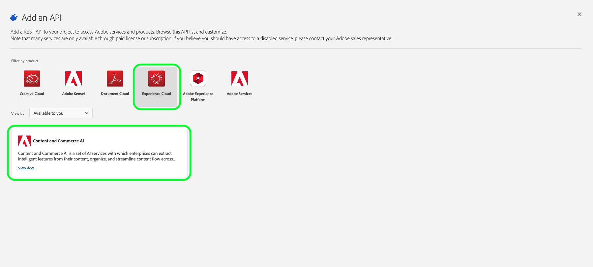
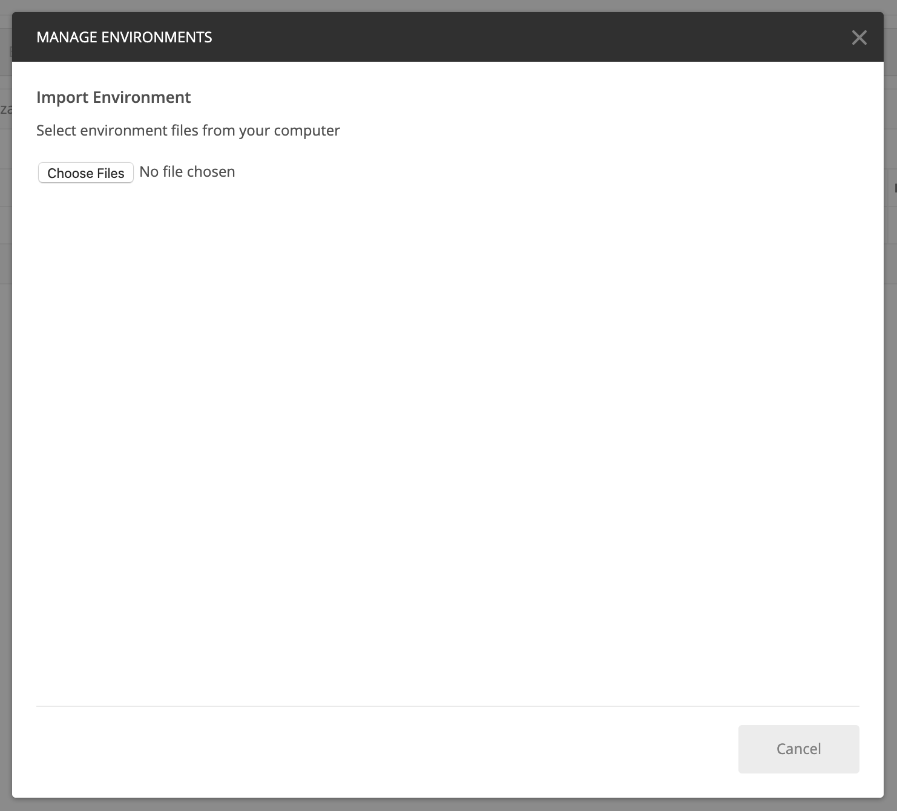

# コンテンツおよびコマース AI の概要

>[!NOTE]
>
>コンテンツおよびコマース AI はベータ版です。 このドキュメントは変更される場合があります。

[!DNL Content and Commerce AI] では、Adobe I/OAPI を利用します。Adobe I/OAPI と I/O コンソール統合を呼び出すには、まず [ 認証に関するチュートリアル ](https://experienceleague.adobe.com/docs/experience-platform/landing/platform-apis/api-authentication.html?lang=ja#platform-apis) を完了する必要があります。

ただし、**API** を追加の手順に進むと、次のスクリーンショットに示すように、API はAdobe Experience PlatformではなくExperience Cloudの下に配置されます。

認証に関するチュートリアルを完了すると、次のように、すべてのAdobe I/OAPI 呼び出しで必要な各ヘッダーの値が提供されます。

- `Authorization: Bearer {ACCESS_TOKEN}`
- `x-api-key: {API_KEY}`
- `x-gw-ims-org-id: {IMS_ORG}`

## Postman 環境の作成（オプション）

Adobe開発者コンソール内でプロジェクトと API を設定したら、Postman 用の環境ファイルをダウンロードできます。 プロジェクトの左側のレールの **[!UICONTROL API]** で、「**[!UICONTROL コンテンツとコマースの AI]**」を選択します。 新しいタブが開き、「[!DNL Try it out]」というラベルのカードが表示されます。 「**Postman** のダウンロード」を選択して、Postman 環境の設定に使用する JSON ファイルをダウンロードします。

ファイルをダウンロードしたら、Postman を開き、右上の **ギアアイコン** を選択して、**環境を管理** ダイアログを開きます。

次に、**環境の管理** ダイアログで「**読み込み**」を選択します。

リダイレクトされ、コンピューターから環境ファイルを選択するように求められます。 前にダウンロードした JSON ファイルを選択し、「**開く**」を選択して環境を読み込みます。

新しい環境名が入力された「*環境を管理*」タブに戻ります。 環境名を選択して、Postman で使用可能な変数を表示および編集します。 引き続き、`JWT_TOKEN` と `ACCESS_TOKEN` に手動で値を設定する必要があります。 これらの値は、[ 認証に関するチュートリアル ](https://www.adobe.com/go/platform-api-authentication-en) の完了時に取得された値です。

完了したら、変数は次のスクリーンショットのようになります。 **「** を更新」を選択して、環境の設定を終了します。

右上隅のドロップダウンメニューから環境を選択し、保存した値を自動入力できるようになりました。 値をいつでも再編集して、すべての API 呼び出しを更新できます。

Postman を使用したAdobe I/OAPI の操作について詳しくは、[Adobe I/Oでの JWT 認証に Postman を使用した Medium の投稿 ](https://medium.com/adobetech/using-postman-for-jwt-authentication-on-adobe-i-o-7573428ffe7f) を参照してください。

## API 呼び出し例の読み取り

ここでは、リクエストの形式を説明するために API 呼び出しの例を示します。これには、パス、必須ヘッダー、適切な形式のリクエストペイロードが含まれます。また、API レスポンスで返されるサンプル JSON も示されています。API 呼び出し例のドキュメントで使用される表記について詳しくは、『Experience Platform トラブルシューティングガイド』の [API 呼び出し例の読み方](../../landing/troubleshooting.md)に関する節を参照してください。

## 次の手順 {#next-steps}

すべての資格情報を取得したら、[!DNL Content and Commerce AI] のカスタムワーカーを設定する準備が整います。 次のドキュメントは、拡張機能フレームワークと環境の設定に関する理解に役立ちます。

拡張フレームワークの詳細については、まず「[ 拡張機能の概要 ](https://experienceleague.adobe.com/docs/asset-compute/using/extend/understand-extensibility.html?lang=ja)」ドキュメントを読んでください。 このドキュメントでは、前提条件とプロビジョニング要件について説明します。

[!DNL Content and Commerce AI] 用の環境の設定について詳しくは、まず [ 開発環境の設定 ](https://experienceleague.adobe.com/docs/asset-compute/using/extend/setup-environment.html) のガイドを参照してください。 このドキュメントでは、Service Service の開発に使用する設定手順をAsset computeします。
