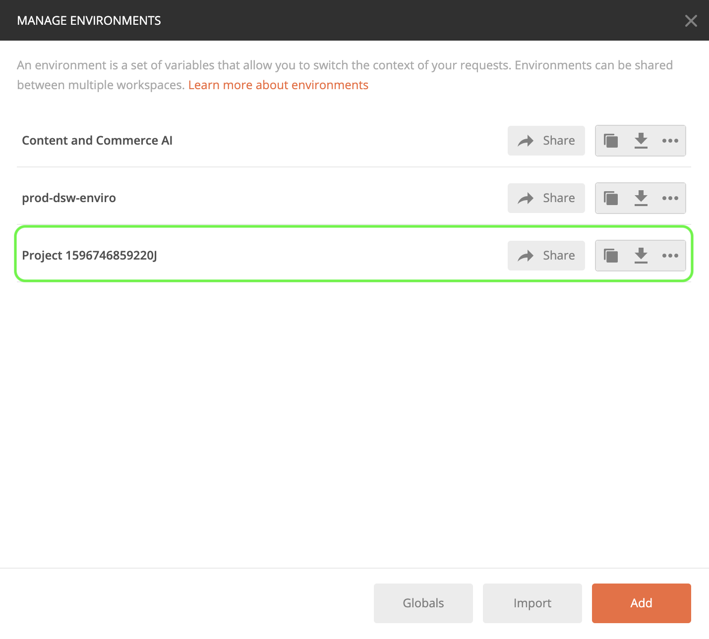

# Content and Commerce AI の概要

>[!NOTE]
>
>Content and Commerce AI はベータ版です。 このドキュメントは変更される場合があります。

[!DNL Content and Commerce AI] はAdobe I/OAPI を利用します。 Adobe I/OAPI と I/O コンソール統合を呼び出すには、まず [認証チュートリアル](https://experienceleague.adobe.com/docs/experience-platform/landing/platform-apis/api-authentication.html?lang=ja).

ただし、 **API を追加** 手順を実行すると、API は、次のスクリーンショットに示すように、Adobe Experience PlatformではなくExperience Cloudの下に配置されます。

認証に関するチュートリアルを完了すると、すべての認証 API 呼び出しで必要な各Adobe I/Oの値が次のようになります。

- `Authorization: Bearer {ACCESS_TOKEN}`
- `x-api-key: {API_KEY}`
- `x-gw-ims-org-id: {ORG_ID}`

## Postman環境の作成（オプション）

Adobe開発者コンソール内でプロジェクトと API を設定したら、Postman用の環境ファイルをダウンロードするオプションがあります。 の下 **[!UICONTROL API]** プロジェクトの左側のパネルで、「 **[!UICONTROL Content and Commerce AI]**. 新しいタブが開き、「[!DNL Try it out]&quot;. 選択 **Postman 用にダウンロード** をクリックして、postman 環境の設定に使用する JSON ファイルをダウンロードします。

ファイルをダウンロードしたら、Postmanを開き、 **歯車アイコン** を右上に開いて **環境の管理** ダイアログ。

次に、 **インポート** 内から **環境の管理** ダイアログ。

リダイレクトされ、コンピューターから環境ファイルを選択するように求められます。 前にダウンロードした JSON ファイルを選択し、「 」を選択します。 **開く** 環境を読み込みます。

次のページにリダイレクトされます： *環境の管理* タブに新しい環境名が入力されます。 環境名を選択して、Postmanで使用可能な変数を表示および編集します。 引き続き、 `JWT_TOKEN` および `ACCESS_TOKEN`. これらの値は、 [認証チュートリアル](https://www.adobe.com/go/platform-api-authentication-en).

完了した変数は、次のスクリーンショットのようになります。 選択 **更新** をクリックして、環境の設定を完了します。

右上隅のドロップダウンメニューから環境を選択し、保存した値を自動入力できるようになりました。 いつでも値を再編集して、すべての API 呼び出しを更新できます。

Postmanを使用したAdobe I/OAPI の操作について詳しくは、 [Adobe I/Oでの JWT 認証にPostmanを使用](https://medium.com/adobetech/using-postman-for-jwt-authentication-on-adobe-i-o-7573428ffe7f).

## API 呼び出し例の読み取り

ここでは、リクエストの形式を説明するために API 呼び出しの例を示します。これには、パス、必須ヘッダー、適切な形式のリクエストペイロードが含まれます。また、API レスポンスで返されるサンプル JSON も示されています。API 呼び出し例のドキュメントで使用される表記について詳しくは、『Experience Platform トラブルシューティングガイド』の [API 呼び出し例の読み方](../../landing/troubleshooting.md)に関する節を参照してください。

## 次の手順 {#next-steps}

すべての資格情報を取得したら、次の用にカスタムワーカーを設定する準備が整います。 [!DNL Content and Commerce AI]. 次のドキュメントは、拡張フレームワークと環境の設定の理解に役立ちます。

拡張フレームワークの詳細については、まず [拡張機能の概要](https://experienceleague.adobe.com/docs/asset-compute/using/extend/understand-extensibility.html?lang=ja) 文書。 このドキュメントでは、前提条件とプロビジョニング要件の概要を説明します。

の環境の設定について詳しくは、以下を参照してください。 [!DNL Content and Commerce AI]を参照し、まず [開発環境の設定](https://experienceleague.adobe.com/docs/asset-compute/using/extend/setup-environment.html). このドキュメントでは、Service Service の開発に使用する設定手順をAsset computeします。
