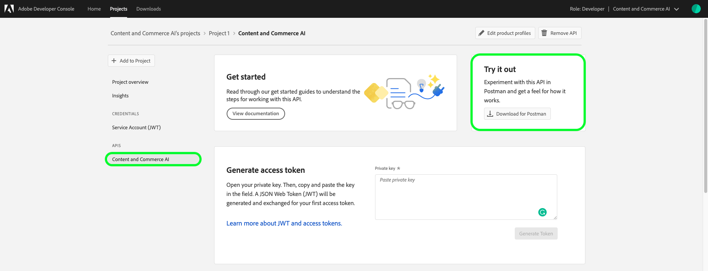

# コンテンツとコマースのAI使用の手引き

>[!NOTE]
>
>コンテンツとコマースAIはベータ版です。 このドキュメントは変更されることがあります。

[!DNL Content and Commerce AI] adobeI/O APIを使用 AdobeI/O APIとI/Oコンソール統合を呼び出すには、まず [認証のチュートリアルを完了する必要があります](../../tutorials/authentication.md)。

ただし、 **API** 手順に到達したら、次のスクリーンショットに示すように、APIはAdobe Experience PlatformではなくExperience Cloudの下に配置されます。

次に示すように、AdobeI/O API呼び出しの中で必要な各ヘッダーの値を認証チュートリアルの設定を完了する。

- `Authorization: Bearer {ACCESS_TOKEN}`
- `x-api-key: {API_KEY}`
- `x-gw-ims-org-id: {IMS_ORG}`

## ポストマン環境の作成（オプション）

Adobeデベロッパーコンソール内でプロジェクトとAPIを設定したら、Postman用の環境ファイルをダウンロードできます。 プロジェクトの左側のレールの **[!UICONTROL API]** (API)で、「 **[!UICONTROL コンテンツとコマースAI]**」を選択します。 新しいタブが開き、「[!DNL Try it out]」というラベルの付いたカードが表示されます。 「Postman用に **ダウンロード** 」を選択して、postman環境の設定に使用するJSONファイルをダウンロードします。

ファイルをダウンロードしたら、Postmanを開き、右上の **歯車アイコンを選択して、** 環境の **管理** ダイアログを開きます。

次に、[ **環境の** 管理 **]ダイアログボックスで[読み込み** ]を選択します。

リダイレクトされ、コンピューターから環境ファイルを選択するように求められます。 前にダウンロードしたJSONファイルを選択し、「 **開く** 」を選択して環境を読み込みます。

新しい環境名が入力された状態で、「 *環境の管理* 」タブに戻ります。 表示する環境名を選択し、Postmanで使用可能な変数を編集します。 引き続き、 `JWT_TOKEN` およびを手動で設定する必要があり `ACCESS_TOKEN`ます。 これらの値は、 [認証のチュートリアルの完了時に取得する必要があります](../../tutorials/authentication.md)。

完了すると、変数は下のスクリーンショットのようになります。 「 **更新** 」を選択して、環境の設定を終了します。

右上隅のドロップダウンメニューから環境を選択して、保存した値を自動入力できるようになりました。 値をいつでも再編集して、すべてのAPI呼び出しを更新するだけです。

Postmanを使用したAdobeI/O APIの操作について詳しくは、AdobeI/OでのJWT認証にPostmanを [使用した場合の記事（中）を参照してください](https://medium.com/adobetech/using-postman-for-jwt-authentication-on-adobe-i-o-7573428ffe7f)。

## API 呼び出し例の読み取り

ここでは、リクエストの形式を説明するために API 呼び出しの例を示します。これには、パス、必須ヘッダー、適切に書式設定されたリクエストペイロードが含まれます。また、API レスポンスで返されるサンプル JSON も示されています。ドキュメントで使用される API 呼び出し例の表記について詳しくは、Experience Platform トラブルシューテングガイドの[API 呼び出し例の読み方](../../landing/troubleshooting.md)に関する節を参照してください。

## 次の手順 {#next-steps}

資格情報をすべて取得したら、カスタムワーカーを設定する準備が整い [!DNL Content and Commerce AI]ます。 次のドキュメントは、拡張機能のフレームワークと環境の設定を理解するのに役立ちます。

拡張機能のフレームワークについて詳しくは、拡張機能の [ドキュメントの](https://docs.adobe.com/content/help/en/asset-compute/using/extend/understand-extensibility.html) 概要を読んで開始してください。 このドキュメントでは、前提条件とプロビジョニング要件について概説します。

開発者用環境の設定に関する詳細は、 [!DNL Content and Commerce AI]開始用環境の設定ガイドを参照して [ください](https://docs.adobe.com/content/help/en/asset-compute/using/extend/setup-environment.html)。 このドキュメントでは、Asset computeサービスの開発を可能にする設定手順を説明します。