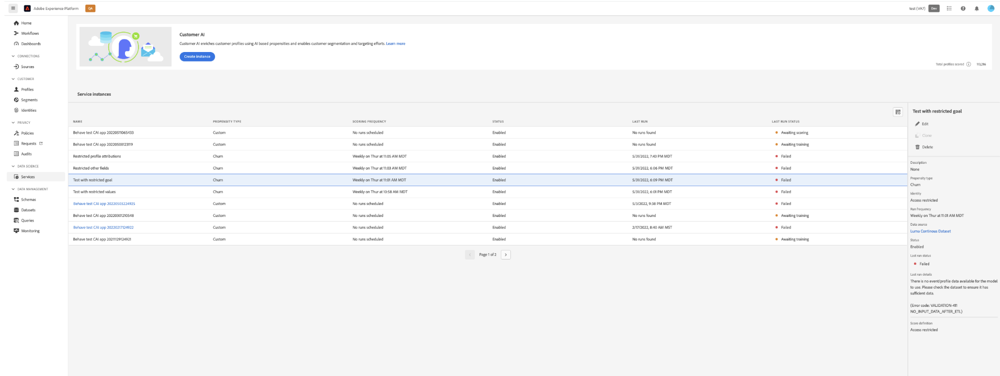

# 属性ベースのアクセス制御

>[!IMPORTANT]
>
>属性ベースのアクセス制御は、現在、限られたリリースでのみ使用できます。

[属性ベースのアクセス制御は、管理者が属性に基づいて特定のオブジェクトや機能へのアクセスを制御できるようにする Adobe Experience Platform の機能です。](../../../access-control/abac/overview.md)属性は、スキーマフィールドやセグメントに追加されるラベルなど、オブジェクトに追加されるメタデータであることがあります。 管理者は、ユーザーアクセス権限を管理する属性を含めた、アクセスポリシーを定義します。

この機能を使用すると、エクスペリエンスデータモデル（XDM）スキーマフィールドに、組織またはデータの使用範囲を定義するラベルを付けることができます。同時に、管理者は、ユーザーと役割の管理インターフェイスを使用して、XDM スキーマフィールドに関するアクセスポリシーを定義し、ユーザーまたはユーザーのグループ（内部、外部、またはサードパーティのユーザー）に与えるアクセスをうまく管理できます。また、属性ベースのアクセス制御により、管理者は特定のセグメントへのアクセスを管理できます。

属性ベースのアクセス制御を通じて、組織の管理者は、すべての Platform ワークフローとリソースにわたって、機密性の高い個人データ (SPD) と個人情報 (PII) の両方に対するユーザーのアクセスを制御できます。 管理者は、特定のフィールドと、それらのフィールドに対応するデータにのみアクセスできるユーザーの役割を定義できます。

属性ベースのアクセス制御により、一部のフィールドおよび機能は、アクセスが制限され、特定の顧客 AI サービスモデルで使用できなくなります。 例として、「ID」、「スコア定義」、「クローン」があります。

顧客 AI ワークスペースの上部 **インサイトページ**&#x200B;サイドバー、スコア定義、ID およびプロファイル属性の詳細には、すべて「アクセス制限」と表示されます。

制限されたスキーマを持つデータセットをでプレビューする場合 **[!UICONTROL モデルワークフローを作成]** ページに表示される場合、次のことを知らせる警告が表示されます。 [!UICONTROL アクセス制限により、一部の情報はデータセットのプレビューに表示されません。]

制限された情報を持つモデルを作成し、 **[!UICONTROL 目標を定義]** 手順の場合、上部に警告が表示されます。 [!UICONTROL アクセス制限により、特定の情報は設定に表示されません。]

アクセス制御を使用する場合、 **顧客 AI を表示** および **顧客 AI を管理** 権限は顧客 AI の様々な機能へのアクセスを許可します。 この **顧客 AI を管理** 権限を使用して **作成**,**更新**, **削除**, **有効**&#x200B;または **無効** モデル **顧客 AI を表示** を使用して、リストを読み取ったり、表示したりできます。 この **作成**, **更新** および **削除** アクションは監査ログで記録されます。

詳しくは、ドキュメントを参照してください [アクセス制御の権限の割り当て](../../../help/access-control/home.md) または方法 [監査ログを使用して、アクセスとアクティビティを監視する](../../../help/landing/governance-privacy-security/audit-logs/overview.md).

## 次の手順

このガイドを読むことで、[!DNL Experience Platform] のアクセス制御の主な原則を学びました。[!DNL Admin Console] を使用して製品プロファイルを作成して [!DNL Platform] の権限を割り当てる方法に関する詳細な手順について、引き続き『[アクセス制御ユーザーガイド](./ui/overview.md)』をご覧ください。