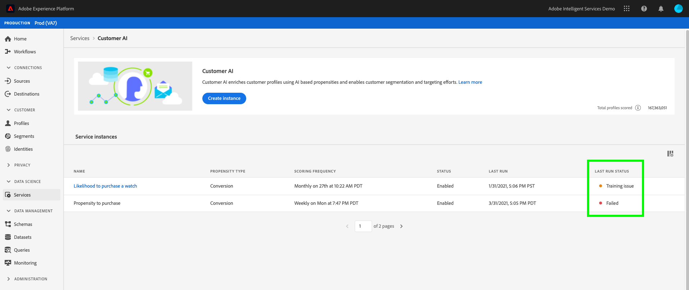
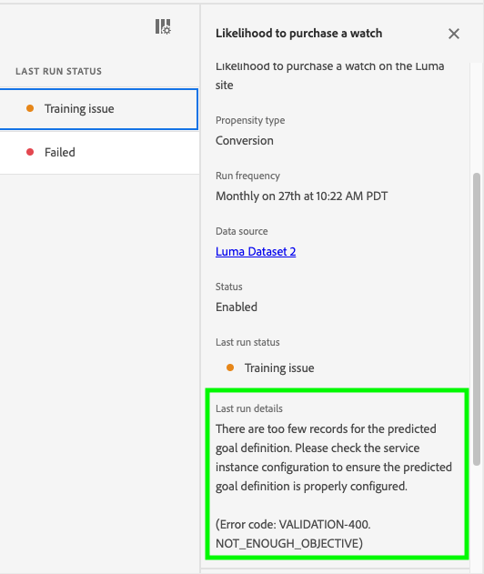
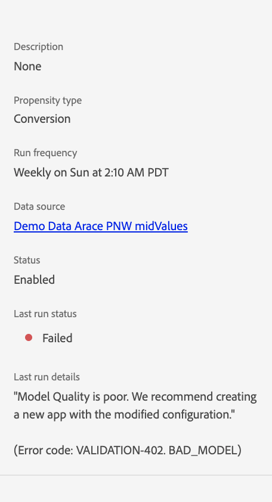

# 顧客 AI エラーのトラブルシューティング

モデルのトレーニング、スコアリングおよび設定が失敗すると、顧客 AI はエラーを表示します。**[!UICONTROL Service instances]** セクションの&#x200B;**[!UICONTROL LAST RUN STATUS]**&#x200B;の列には、次のいずれかのメッセージが表示されます：**[!UICONTROL Success]**、**[!UICONTROL Training issue]**、および&#x200B;**[!UICONTROL Failed]**。

**[!UICONTROL Failed]**&#x200B;または&#x200B;**[!UICONTROL Training issue]**&#x200B;が表示された場合は、実行ステータスを選択してサイドパネルを開くことができます。 サイドパネルには、**[!UICONTROL Last run status]**&#x200B;と&#x200B;**[!UICONTROL Last run details]**&#x200B;が含まれています。 **[!UICONTROL Last run details]**&#x200B;には、実行が失敗した理由に関する情報が含まれています。 エラーの詳細情報が顧客 AI から提供されない場合は、提供されたエラーコードをサポートに連絡してください。

{width=300}

## Chrome の匿名モードで顧客 AI にアクセスできない

Google Chrome の匿名モードセキュリティ設定が更新されたので、Google Chrome の匿名モードでの読み込みエラーが発生します。アドビでは、experience.adobe.com を信頼できるドメインにするために、Chrome でこの問題に鋭意取り組んでいるところです。

{width=500}

### 推奨される修正

この問題を回避するには、experience.adobe.com を、常に Cookie を使用できるサイトとして追加する必要があります。まず、**chrome://settings/cookies** に移動します。次に、「**カスタマイズされた動作**」セクションまでスクロールしたあと、「常に Cookie を使用できるサイト」の隣にある「**追加**」ボタンを選択します。表示されたポップオーバーで `[*.]experience.adobe.com` をコピー＆ペーストし、「**このサイトでサードパーティの Cookie を許可する**」のチェックボックスをオンにします。完了したら、「**追加**」を選択し、顧客 AI を匿名モードでリロードします。

## モデルの品質が低い

エラー「[!UICONTROL Model Quality is poor. We recommend creating a new app with the modified configuration]」が表示された場合。 以下の推奨手順に従って、トラブルシューティングを行ってください。

{width=300}

### 推奨される修正

「モデルの品質が低い」とは、モデルの精度が許容範囲内にないことを意味します。信頼できるモデルを顧客 AI が作成できず、トレーニング後の AUC（ROC 曲線下の面積）が 0.65 を下回りました。このエラーを修正するには、設定パラメーターの 1 つを変更し、トレーニングを再実行することをお勧めします。

まず、データの精度を確認します。 予測結果に必要なフィールドがデータに含まれていることが重要です。

- データセットに最新の日付があるかどうかを確認します。顧客 AI は常に、モデルがトリガーされたときにデータが最新であると仮定します。
- 定義した予測および実施要件ウィンドウ内で、データの欠落がないかを確認します。 ギャップのない完全なデータである必要があります。また、データセットが[顧客 AI の履歴データの要件](./data-requirements.md#data-requirements)を満たしていることも確認します。
- スキーマフィールドのプロパティ内のコマース、アプリケーション、web および検索で、欠落しているデータがないかを確認します。

データが問題がないようであれば、実施要件母集団条件を変更して、モデルを特定のプロファイルに制限してみてください（例： `_experience.analytics.customDimensions.eVars.eVar142` が過去 56 日間に存在している）。これにより、トレーニングウィンドウで使用するデータの母集団とサイズが制限されます。

実施要件母集団の制限が機能しなかった場合や制限が不可能な場合は、予測ウィンドウを変更します。

- 予測ウィンドウを 7 日に変更してみて、エラーが引き続き発生するかどうかを確認します。エラーが発生しなくなった場合は、定義した予測ウィンドウに十分なデータがない可能性があることを示しています。

### エラー

| エラーコード | タイトル | メッセージテンプレート | メッセージの例 |
| ---------- | ----- | ---------------- | --------------- |
| 400 | 目標が不十分 | `{{actual_num_samples}}`から`{{outcome_window_start}}`までの予測目標の定義に一致するユーザーが少なすぎます（`{{outcome_window_end}}`）。 モデルを構築するには、少なくとも`{{min_num_samples}}`人の適格なイベントを持つユーザーが必要です。   推奨される解決策：  1。 データの可用性 2を確認します。 予測目標期間 3を短縮します。 予測目標定義をより多くのユーザーを含めるように変更します（エラーコード：VALIDATION-400 NOT_ENOUGH_OBJECTIVE） | 2020-04-01から2021-04-01までの予測目標の定義を満たすユーザーが少なすぎます（合計200人）。 モデルを構築するには、少なくとも500人の適格なイベントを持つユーザーが必要です。   推奨される解決策： 1。 データの可用性 2を確認します。 予測目標期間 3を短縮します。 予測目標の定義をより多くのユーザーを含めるように変更します。 （エラーコード：VALIDATION-400 NOT_ENOUGH_OBJECTIVE） |
| 401 | 十分な母集団がありません | `{{actual_num_samples}}`から`{{eligibility_window_start}}`までの対象ユーザー（`{{eligibility_window_end}}`合計）が少なすぎます。 モデルを作成するには、少なくとも`{{min_num_samples}}`人の適格なユーザーが必要です。   推奨される解決策： 1。 データの可用性 2を確認します。 実施要件のある母集団定義が指定されている場合は、実施要件フィルターの期間を短縮します3. 対象となる母集団定義が指定されていない場合は、1つ追加してみてください（エラーコード：VALIDATION-401 NOT_ENOUGH_POPULATION） | 2020-04-01から2021-04-01までの対象ユーザーが少なすぎます（合計200人）。 モデルを構築するには、少なくとも500人の適格なユーザーが必要です。  推奨される解決策： 1。 データの可用性を確認 2. 対象となる母集団の定義が指定されている場合は、対象フィルターの期間を短縮します。 3. 対象となる母集団定義が指定されていない場合は、母集団定義を追加してみてください。 （エラーコード：VALIDATION-401 NOT_ENOUGH_POPULATION） |
| 402 | 不正なモデル | 現在の入力データセットと設定で品質モデルを作成することはできません。   一部の推奨事項： 1。 設定を変更して、適格な母集団の定義を追加します。  2. 追加のデータソースを使用して、モデル品質を向上させます 3。 カスタムイベントを追加して、モデルにさらにデータを含めます（エラーコード：VALIDATION-402 BAD_MODEL） | 現在の入力データセットと設定で品質モデルを作成することはできません。   一部の推奨事項： 1。 対象となる母集団定義を追加するには、設定を変更することを検討してください。  2. モデル品質を向上させるために、追加のデータソースの使用を検討してください。 （エラーコード：VALIDATION-402 BAD_MODEL） |
| 403 | 不適格スコア | スコアの分布が予想と大きく異なります。   一部の推奨事項： 1。 モデルが最新のデータでトレーニングされていることを確認してください。そうでない場合は、モデルを再トレーニングすることを検討してください。  2. スコアリングタスクにデータの問題（データの欠落やデータの遅延など）がないことを確認してください。 （エラーコード：VALIDATION-403 INELIGIBLE_SCORES） | スコアの分布が予想と大きく異なります。   一部の推奨事項： 1。 モデルが最新のデータでトレーニングされていることを確認してください。そうでない場合は、モデルを再トレーニングすることを検討してください。  2. スコアリングタスクにデータの問題（データの欠落やデータの遅延など）がないことを確認してください。 （エラーコード：VALIDATION-403 INELIGIBLE_SCORES） |
| 405 | スコアリングデータなし | `{{eligibility_window_start}}`から`{{eligibility_window_end}}`までのスコアリングに利用できるユーザー行動またはプロファイルデータがありません。データを確認して、定期的に更新されていることを確認してください。 （エラーコード：VALIDATION-405 NO_SCORING_DATA） | 2020-04-01から2021-04-01まで、スコアリングに利用できるユーザー行動データまたはプロファイルデータはありません。 データを確認して、定期的に更新されていることを確認してください。 （エラーコード：VALIDATION-405 NO_SCORING_DATA） |
| 407 | 十分な履歴イベントデータがありません | モデルを構築するのに十分なデータがない。 2020-04-01から2021-04-01まで、データの期間はわずか90日です。   120日間の最新データが必要です。 詳しくは、データ要件ドキュメントを参照してください。   推奨される解決策： 1。 データの可用性 2を確認します。 予測目標期間 3を短縮します。 対象となる母集団の定義が指定されている場合は、対象フィルターの期間 4を短縮します。 対象となる母集団定義が指定されていない場合は、母集団定義を1つ追加してみてください（エラーコード：VALIDATION-407 NOT_ENOUGH_HISTORICAL_EVENT_DATA） | モデルを構築するのに十分なデータがない。 2020-04-01から2021-04-01まで、データの期間はわずか90日です。  120日間の最新データが必要です。 詳しくは、データ要件ドキュメントを参照してください。  推奨される解決策： 1。 データの可用性のチェック： 2. 予測目標期間を短縮します。 3. 対象となる母集団の定義が指定されている場合は、対象フィルターの期間を短縮します。 4. 対象となる母集団定義が指定されていない場合は、母集団定義を追加してみてください。 （エラーコード：VALIDATION-407 NOT_ENOUGH_HISTORICAL_EVENT_DATA） |
| 408 | 対象となる最近のデータがありません | `{{data_days}}`日前の`{{etl_window_end}}`日間に、対象ユーザーのユーザー行動データがありません。 データセットを定期的に更新していることを確認してください。 （エラーコード：VALIDATION-408 NO_RECENT_DATA_FOR_ELIGIBLE_POPULATION） | 2021-04-01以前の60日間には、対象ユーザーのユーザー行動データはありません。 データセットを定期的に更新していることを確認してください。 （エラーコード：VALIDATION-408 NO_RECENT_DATA_FOR_ELIGIBLE_POPULATION） |
| 409 | 目標なし | `{{outcome_window_start}}`から`{{outcome_window_end}}`までの予測目標の定義を満たすユーザーはいません。 モデルを構築するには、少なくとも`{{min_num_samples}}`人の適格なイベントを持つユーザーが必要です。   推奨される解決策： 1。 データの可用性 2を確認します。 予測目標定義を変更します（エラーコード：VALIDATION-409 NO_OBJECTIVE） | 2020-04-01から2021-04-01までの予測目標の定義を満たすユーザーはいません。 モデルを構築するには、少なくとも500人の適格なイベントを持つユーザーが必要です。   推奨される解決策： 1。 データの可用性のチェック： 2. 予測目標の定義を変更します。 （エラーコード：VALIDATION-409 NO_OBJECTIVE） |
| 410 | 母集団なし | `{{eligibility_window_start}}`から`{{eligibility_window_end}}`までの対象ユーザーはありません。 モデルを作成するには、少なくとも`{{min_num_samples}}`人の適格なユーザーが必要です。   推奨される解決策： 1。 データの可用性 2を確認します。 対象となる母集団定義が指定されている場合は、条件を変更するか、対象フィルターの期間を増やします（エラーコード：VALIDATION-410 NO_POPULATION） | 2020-04-01から2021-04-01までの対象ユーザーはありません。 モデルを構築するには、少なくとも500人の適格なユーザーが必要です。   推奨される解決策： 1。 データの可用性のチェック：   2. 実施要件のある母集団定義が指定されている場合は、条件を変更するか、実施要件フィルターの期間を増やします。 （エラーコード：VALIDATION-410 NO_POPULATION） |
| 411 | ETL後に入力データがありません | モデルで使用できるユーザー行動またはプロファイルデータが`{{etl_start_date}}`から`{{etl_end_date}}`の間にありません。 データセットに十分なデータがあることを確認してください。 （エラーコード：VALIDATION-411 NO_INPUT_DATA_AFTER_ETL） | 2020-04-01から2021-04-01の間に、モデルで使用できるユーザー行動データまたはプロファイルデータはありません。 データセットに十分なデータがあることを確認してください。 （エラーコード：VALIDATION-411 NO_INPUT_DATA_AFTER_ETL） |
| 412 | ETL後のイベントはありません | モデルで`{{etl_start_date}}`から`{{etl_end_date}}`の間で使用できるユーザー行動データがありません。 データセットに十分なデータがあることを確認してください。 | 2020-04-01から2021-04-01の間に、モデルで使用できるユーザー行動データはありません。 データセットに十分なデータがあることを確認してください。 （エラーコード：VALIDATION-412 NO_EVENT_DATA_AFTER_ETL） |
| 413 | 目標の単一の値 | CustomerAIでは、予測目標の定義に対して、データセットに適格イベントと非適格イベントの両方が含まれている必要があります。 入力データセットには、`{{etl_window_start}}` ～ `{{etl_window_end}}`の間の条件を満たすイベントのみが含まれます。   推奨される解決策： 1。 予測目標定義 2を変更します。 データの完全性を確認するか、予測目標に対する非適格イベントの例を含む別のイベントを使用します（エラーコード：VALIDATION-413 SINGLE_VALUE_IN_OBJECTIVE） | CustomerAIでは、予測目標の定義に対して、データセットに適格イベントと非適格イベントの両方が含まれている必要があります。 入力データセットには、2020-04-01から2021-04-01の間の修飾イベントのみが含まれます。  推奨される解決策： 1。 予測目標の定義を変更します。 2. データの完全性を確認するか、予測目標の非適格イベントの例を含む別のオブジェクトを使用します。 （エラーコード：VALIDATION-413 SINGLE_VALUE_IN_OBJECTIVE） |
| 414 | 影響を与える要因はない | 影響因子モデルが予期しない出力を生成しました。 変更された設定で新しいアプリを作成することをお勧めします。 （エラーコード：VALIDATION-414 NO_INFLUENTIAL_FACTORS） | 影響因子モデルが予期しない出力を生成しました。 変更された設定で新しいアプリを作成することをお勧めします。 （エラーコード：VALIDATION-414 NO_INFLUENTIAL_FACTORS） |