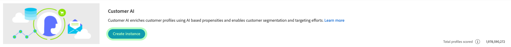

# 顧客AIインスタンスの設定

顧客 AI は、インテリジェントサービスの一部として、機械学習を気にすることなく、カスタムの傾向スコアを生成できます。

インテリジェントサービスは、様々な用途に設定できる、使いやすい Adobe Sensei サービスとして顧客 AI を提供します。次の節では、顧客 AI のインスタンスを設定する手順を説明します。

## インスタンスの設定 {#set-up-your-instance}

プラットフォーム UI で、左側のナビゲーションの「**[!UICONTROL サービス]**」をクリックします。「**[!UICONTROL サービス]**」ブラウザーが表示され、使用可能なすべてのサービスが表示されます。顧客 AI のコンテナで、「**[!UICONTROL 開く]**」をクリックします。

*顧客 AI* 画面には、既存のすべての顧客 AI インスタンスが表示されます。「**[!UICONTROL インスタンス作成]**」をクリックします。

「*設定*」から始まり、インスタンス作成ワークフローが表示されます。

インスタンスに指定する必要がある値に関する重要な情報を次に示します。

* インスタンスの名前は、顧客 AI スコアが表示されるすべての場所で使用されます。したがって、「雑誌購読をキャンセルする可能性」など、予測スコアが何を表すかを、名前で示す必要があります。

* 傾向タイプによって、スコアと指標の極性の意図が決まります。「**[!UICONTROL チャーン]**」または「**[!UICONTROL コンバージョン]**」を選択できます。傾向タイプがインスタンスに与える影響の詳細については、「インサイトの検出」ドキュメントの[スコアリングの概要](./discover-insights.md#scoring-summary)のを参照してください。

* データソースは、データが存在する場所です。データセットは、スコアの予測に使用される入力データセットです。設計上、顧客 AI はコンシューマーエクスペリエンスイベントデータを使用して傾向スコアを計算します。ドロップダウンセレクターからデータセットを選択すると、顧客 AI と互換性のあるもののみが表示されます。

* デフォルトでは、適格な母集団が指定されていない限り、すべてのプロファイルに対して傾向スコアが生成されます。イベントに基づいてプロファイルを含めたり除外したりする条件を定義することで、適格な母集団を指定できます。

必要な値を入力し、「**[!UICONTROL 次へ]**」をクリックします。

### 目標の定義 {#define-a-goal}

*目標の定義*&#x200B;手順が表示され、目標を視覚的に定義できるインタラクティブな環境が提供されます。目標は 1 つ以上のイベントで構成され、各イベントの発生は保持する条件に基づきます。顧客 AI インスタンスの目的は、特定の期間内に目標を達成する可能性を判断することです。

「**[!UICONTROL フィールド名の入力]**」をクリックし、ドロップダウンリストからフィールドを選択します。2 つ目の入力をクリックし、イベントの条件句を選択し、イベントを完了するターゲット値を指定します。追加のイベントは、「**[!UICONTROL イベント追加]**」をクリックして設定できます。最後に、予測期間を日数で適用して目標を完了し、「**[!UICONTROL 次へ]**」をクリックします。

### スケジュールの設定&#x200B;*（オプション）* {#configure-a-schedule}

*詳細*&#x200B;手順が表示されます。このオプションの手順では、予測の実行を自動化するスケジュールを設定したり、予測から特定のイベントを除外するフィルターを定義したりできます。必要がない場合は「**[!UICONTROL 完了]**」をクリックします。

「*スコアリング頻度*」を設定して、スコアリングスケジュールを設定します。予測の自動実行は、週単位または月単位でスケジュールできます。

スケジュール設定では、特定の条件を満たすイベントがスコアの生成時に評価されるのを防ぐために、予測の除外を定義できます。この機能を使用して、無関係なデータ入力を除外できます。

特定のイベントを除外するには、「**[!UICONTROL 除外の追加]**」をクリックし、目標の定義方法と同じ方法でイベントを定義します。除外を削除するには、イベントコンテナの右上にある省略記号（**[!UICONTROL ...]**）をクリックし、「**[!UICONTROL コンテナを削除]**」をクリックします。

必要に応じてイベントを除外し、「**[!UICONTROL 完了]**」をクリックして、インスタンスを作成します。

インスタンスが正常に作成されると、予測実行が直ちにトリガーされ、定義したスケジュールに従って後続の予測実行が実行されます。

>[!NOTE]
>
>入力データのサイズによっては、予測の実行が完了するまでに最大 24 時間かかる場合があります。

この節では、顧客 AI のインスタンスを設定し、予測実行が実行されました。実行が正常に完了すると、スコアリングされた洞察が、予測されたスコアと共にプロファイルを自動入力します。このチュートリアルの次の節に進む前に、最大 24 時間お待ちください。

## 次の手順 {#next-steps}

このチュートリアルに従うと、顧客AIのインスタンスの設定と傾向スコアの生成に成功します。 セグメントビルダーを使用して、予測スコアを含む顧客セグメントを [作成したり、Customer AIでインサイトを](./create-segment.md) 発見したりできるようになりました 。

## その他のリソース

次のビデオは、お客様向けAIの設定ワークフローを理解していただくためのものです。 さらに、ベストプラクティスと使用例が示されています。

>[!VIDEO](https://video.tv.adobe.com/v/32665?learn=on&quality=12)

