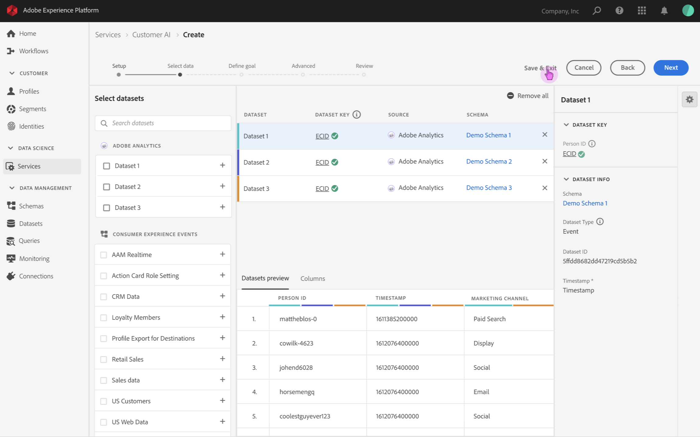
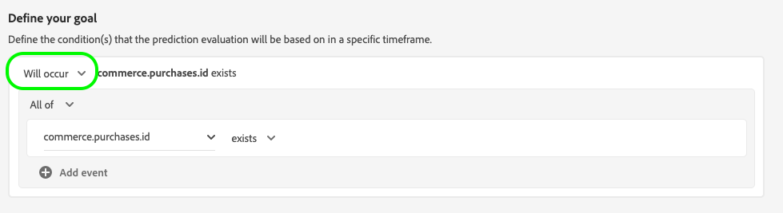

# 顧客 AI インスタンスの設定

顧客 AI は、AI/ML サービスの一部として、機械学習を気にすることなく、カスタム傾向スコアを生成できます。

AI/ML サービスは、様々な使用例に対して設定できる、使いやすいAdobe Senseiサービスとして顧客 AI を提供します。 次の節では、顧客 AI のインスタンスを設定する手順を説明します。

## インスタンスの作成 {#set-up-your-instance}

Platform UI で、「 **[!UICONTROL サービス]** をクリックします。 「**[!UICONTROL サービス]**」ブラウザーが表示され、使用可能なすべてのサービスが表示されます。顧客 AI のコンテナで、 **[!UICONTROL 開く]**.

この **顧客 AI** UI が表示され、すべてのサービスインスタンスが表示されます。

- 次の **[!UICONTROL スコアリングされた合計プロファイル数]** 指標は、 **[!UICONTROL インスタンスを作成]** コンテナ。 この指標は、すべてのサンドボックス環境と削除されたサービスインスタンスを含む、現在の年の顧客 AI がスコアリングするプロファイルの合計数を追跡します。

UI の右側にあるコントロールを使用して、サービスインスタンスの編集、複製、削除をおこなうことができます。 これらのコントロールを表示するには、既存の **[!UICONTROL サービスインスタンス]**. コントロールには、次のものが含まれます。

- **[!UICONTROL 編集]**:選択 **[!UICONTROL 編集]** 既存のサービスインスタンスを変更できます。 インスタンスの名前、説明およびスコアリング頻度を編集できます。
- **[!UICONTROL 複製]**:選択 **[!UICONTROL 複製]** 現在選択されているサービスインスタンスの設定をコピーします。 その後、ワークフローを変更して小さな調整を行い、新しいインスタンスとして名前を変更できます。
- **[!UICONTROL 削除]**:過去の実行も含めて、サービスインスタンスを削除できます。 対応する出力データセットが Platform から削除されます。 ただし、リアルタイム顧客プロファイルに同期されたスコアは削除されません。
- **[!UICONTROL データソース]**:このインスタンスで使用されるデータセットへのリンク。 複数のデータセットを使用している場合は、ハイパーリンクのテキストを選択すると、データセットのプレビューポップオーバーが開きます。
- **[!UICONTROL 前回の実行の詳細]**:これは、実行が失敗した場合にのみ表示されます。 実行が失敗した理由に関する情報（エラーコードなど）がここに表示されます。
- **[!UICONTROL スコア定義]**:このインスタンスに設定した目標の概要です。

新しいインスタンスを作成するには、「 」を選択します。 **[!UICONTROL インスタンスを作成]**.

## 設定

インスタンス作成ワークフローが表示され、「 **[!UICONTROL 設定]** 手順

インスタンスに指定する必要がある値に関する重要な情報を次に示します。

- **[!UICONTROL 名前]:** インスタンスの名前は、顧客 AI スコアが表示されるすべての場所で使用されます。 したがって、名前は予測スコアが何を表すかを示す必要があります。例えば、「雑誌購読をキャンセルする可能性」などです。

- **[!UICONTROL 説明]:** 何を予測しようとしているかを示す説明。

- **[!UICONTROL 傾向タイプ]:** 傾向タイプによって、スコアの意図と指標の極性が決まります。 「**[!UICONTROL チャーン]**」または「**[!UICONTROL コンバージョン]**」を選択できます。傾向タイプがインスタンスに与える影響の詳細については、「インサイトの検出」ドキュメントの[スコアリングの概要](./discover-insights.md#scoring-summary)のを参照してください。

必要な値を入力し、「 」を選択します。 **[!UICONTROL 次へ]** をクリックして続行します。

## データの選択 {#select-data}

設計により、顧客 AI は、Adobe Analytics、Adobe Audience Manager、一般的なエクスペリエンスイベントおよび消費者エクスペリエンスイベントのデータを使用して、傾向スコアを計算します。 データセットを選択すると、顧客 AI と互換性のあるデータセットのみが表示されます。 データセットを選択するには、**+**) 記号をクリックするか、チェックボックスを選択して複数のデータセットを一度に追加します。 検索オプションを使用して、目的のデータセットをすばやく見つけます。

使用するデータセットを選択した後、 **[!UICONTROL 追加]** ボタンを使用して、データセットのプレビューペインにデータセットを追加します。

情報アイコンの選択  データセットの横にある「データセットのプレビュー」ポップオーバーが開きます。

データセットのプレビューには、最終更新時間、ソーススキーマ、最初の 10 列のプレビューなどのデータが含まれます。

選択 **[!UICONTROL 保存]** をクリックして、ワークフローに沿って移動するときに下書きを保存します。 また、ドラフトモデル設定を保存して、ワークフローの次のステップに移動することもできます。 用途 **[!UICONTROL 保存して続行]** をクリックして、モデル設定時にドラフトを作成し、保存します。 この機能を使用すると、モデル設定のドラフトを作成および保存でき、設定ワークフローで多数のフィールドを定義する必要がある場合に特に便利です。

### データセットの完全性 {#dataset-completeness}

データセットのプレビューには、データセットの完全性の割合の値があります。 この値を使用すると、データセット内の空または null の列数のスナップショットをすばやく取得できます。 データセットに多数の欠落した値が含まれ、その値が他の場所で取り込まれる場合は、欠落した値を含むデータセットを含めることを強くお勧めします。 この例では、ユーザー ID は空ですが、ユーザー ID は、別のデータセットに取り込まれ、含めることができます。

>[!NOTE]
>
>データセットの完全性は、顧客 AI の最大トレーニング期間（1 年）を使用して計算されます。 つまり、データセットの完全性の値を表示する際に、1 年以上前のデータは考慮されません。

### ID を選択 {#identity}

ID マップ（フィールド）に基づいて、複数のデータセットを相互に結合できるようになりました。 ID タイプ（「ID 名前空間」とも呼ばれます）と、その名前空間内の ID 値を選択する必要があります。 同じ名前空間の下で、スキーマ内の ID として複数のフィールドを割り当てた場合、割り当てた ID 値はすべて、名前空間の前に追加された ID ドロップダウンに表示されます（例： ）。 `EMAIL (personalEmail.address)` または `EMAIL (workEmail.address)`.

[同じ名前空間を選択](../images/user-guide/cai-identity-map.png)

>[!IMPORTANT]
>
>選択したすべてのデータセットに同じ ID タイプ（名前空間）を使用する必要があります。 ID 列内の ID タイプの横に、互換性のあるデータセットを示す緑のチェックマークが表示されます。 例えば、Phone 名前空間を使用し、 `mobilePhone.number` 識別子として、残りのデータセットのすべての識別子には Phone 名前空間を含め、使用する必要があります。

ID を選択するには、ID 列にある下線付きの値を選択します。 「 ID の選択」ポップオーバーが表示されます。

<!--  -->
[同じ名前空間を選択](../images/user-guide/cai-identity-namespace.png)

1 つの名前空間内で複数の ID を使用できる場合は、使用例に合った正しい ID フィールドを選択するようにしてください。 例えば、電子メール名前空間内では、仕事用と個人用の 2 つの電子メール ID を使用できます。 ユースケースによっては、個人の電子メールが入力される可能性が高く、個々の予測でより役に立つようになります。 つまり、 `EMAIL (personalEmail.address)` が id として選択されます。

>[!NOTE]
>
> データセットに有効な ID タイプ（名前空間）が存在しない場合は、プライマリ ID を設定し、を使用して ID 名前空間に割り当てる必要があります。 [スキーマエディター](../../../xdm/schema/composition.md#identity). 名前空間と ID について詳しくは、 [ID サービスの名前空間](../../../identity-service/namespaces.md) ドキュメント。

## 目標を定義 {#define-a-goal}

<!-- https://www.adobe.com/go/cai-define-a-goal -->

この **[!UICONTROL 目標を定義]** ステップが表示され、予測目標を視覚的に定義できるインタラクティブな環境が提供されます。 目標は 1 つ以上のイベントで構成され、各イベントの発生は保持する条件に基づきます。顧客 AI インスタンスの目的は、特定の期間内に目標を達成する可能性を判断することです。

目標を作成するには、 **[!UICONTROL フィールド名を入力]** とドロップダウンリストのフィールドが続きます。 2 つ目の入力であるイベントの条件句を選択し、必要に応じてイベントを完了するためのターゲット値を指定します。 追加のイベントは、「 **[!UICONTROL イベントを追加]**. 最後に、予測期間を日数で適用して目標を完了し、「 」を選択します。 **[!UICONTROL 次へ]**.

<!--  -->

### 発生し、発生しない

目標を定義する際に、次の項目を選択できます。 **[!UICONTROL 発生]** または **[!UICONTROL 発生しない]**. 選択 **[!UICONTROL 発生]** とは、顧客のイベントデータをインサイト UI に含めるために、定義したイベント条件を満たす必要があることを意味します。

例えば、顧客が購入するかどうかを予測するアプリを設定する場合、 **[!UICONTROL 発生]** 続いて **[!UICONTROL すべて]** 次に、 **commerce.purchases.id** （または類似のフィールド）および **[!UICONTROL 存在する]** を演算子として使用します。

<!--  -->

ただし、特定の期間に何らかのイベントが発生しないかを予測したい場合があります。 このオプションを使用して目標を設定するには、「 **[!UICONTROL 発生しない]** を選択します。

例えば、関与率の低い顧客を予測したい場合には、来月にアカウントのログインページにアクセスしないでください。 選択 **[!UICONTROL 発生しない]** 続いて **[!UICONTROL すべて]** 次に、 **web.webInteraction.URL** （または類似のフィールド）および **[!UICONTROL 次と等しい]** を演算子として **account-login** を値として使用します。

### 「 」と「 」のすべて

イベントの組み合わせが発生するかどうかを予測したい場合もあれば、事前に定義されたセットから任意のイベントの発生を予測したい場合もあります。 顧客がイベントの組み合わせを持つかどうかを予測するには、 **[!UICONTROL すべて]** オプションを選択します。 **[!UICONTROL 目標を定義]** ページ。

例えば、顧客が特定の製品を購入したかどうかを予測したい場合があります。 この予測目標は、次の 2 つの条件で定義されます。a `commerce.order.purchaseID` **存在する** そして `productListItems.SKU` **次と等しい** 特定の値。

顧客が特定のセットのイベントを持つかどうかを予測するには、 **[!UICONTROL 次のいずれか]** オプション。

例えば、顧客が特定の URL を訪問したか、特定の名前を持つ Web ページを訪問したかを予測したい場合があります。 この予測目標は、次の 2 つの条件で定義されます。 `web.webPageDetails.URL` **次で始まる** 特定の値と `web.webPageDetails.name` **次で始まる** 特定の値。

### 適格な母集団 *（オプション）*

デフォルトでは、適格な母集団が指定されていない限り、すべてのプロファイルに対して傾向スコアが生成されます。イベントに基づいてプロファイルを含めたり除外したりする条件を定義することで、適格な母集団を指定できます。

### カスタムイベント (*オプション*) {#custom-events}

追加情報が [標準イベントフィールド](../input-output.md#standard-events) 顧客 AI で傾向スコアの生成に使用される、カスタムイベントオプションが用意されています。 このオプションを使用すると、影響力があると見なすイベントを追加して、モデルの品質を向上させ、より正確な結果を得るのに役立ちます。 選択したデータセットに、スキーマで定義されたカスタムイベントが含まれている場合は、それらをインスタンスに追加できます。

>[!NOTE]
>
> カスタムイベントが顧客 AI のスコアリング結果に与える影響について詳しくは、 [カスタムイベントの例](#custom-event) 」セクションに入力します。

カスタムイベントを追加するには、 **[!UICONTROL カスタムイベントを追加]**. 次に、カスタムイベント名を入力し、スキーマのイベントフィールドにマッピングします。 影響力のある要因やその他のインサイトを調べると、フィールド値の代わりにカスタムイベント名が表示されます。 つまり、カスタムイベント名がイベントの ID/値の代わりに使用されます。 カスタムイベントの表示方法について詳しくは、 [カスタムイベントの例セクション](#custom-event). これらの追加のカスタムイベントは、モデルの品質を向上させ、より正確な結果を提供するために顧客 AI で使用されます。

次に、使用可能な演算子のドロップダウンから、使用する演算子を選択します。 イベントと互換性のある演算子のみが表示されます。

最後に、選択した演算子に必要な場合は、フィールド値を入力します。 この例では、ホテルまたはレストランの予約が存在するかどうかを確認するだけで済みます。 ただし、より正確にする場合は、等号演算子を使用して、値プロンプトに正確な値を入力できます。

完了したら、「 」を選択します。 **[!UICONTROL 次へ]** をクリックして続行します。

### カスタムプロファイル属性 (*オプション*)

データには、 [標準イベントフィールド](../input-output.md#standard-events) 傾向スコアの生成に顧客 AI で使用されます。 このオプションを使用すると、影響力があると見なすプロファイル属性を追加して、モデルの品質を向上させ、より正確な結果を提供できます。 さらに、カスタムプロファイル属性を追加すると、顧客 AI は、特定のプロファイルが傾向バケットにどのように結び付いたかをより適切に確認できます。

>[!NOTE]
>
>カスタムプロファイル属性の追加は、カスタムイベントの追加と同じワークフローに従います。 カスタムイベントと同様に、カスタムプロファイル属性もモデルスコアリングに同じように影響します。 詳細については、 [カスタムイベントの例](#custom-event) 」セクションに入力します。

#### プロファイルスナップショットの書き出しからプロファイル属性を選択

また、毎日のプロファイルスナップショット書き出しからプロファイル属性を含めることもできます。 これらの属性は、プロファイルスナップショットの書き出しに同期され、最近使用可能な値が表示されます。

>[!WARNING]
>
> 予測目標の結果として更新されるプロファイル属性や、予測目標との相関が高いプロファイル属性は選択しないように注意してください。 これにより、データの漏洩やモデルの過剰な適合が発生します。 このような属性の例を次に示します。 `total_purchases_in_the_last_3_months` は購入コンバージョンを予測します。

>[!NOTE]
>
>UPS スナップショット書き出しからのプロファイル属性の使用は、UI でリクエストに応じてサポートされます。

### カスタムイベントの例の追加 {#custom-event}

次の例では、カスタムイベントとプロファイル属性が顧客 AI インスタンスに追加されています。 顧客 AI インスタンスの目標は、顧客が次の 60 日間に別の Luma 製品を購入する可能性を予測することです。 通常、製品データは製品 SKU にリンクされます。 この場合、SKU は `prd1013`. 顧客 AI モデルがトレーニング/スコアリングされたら、この SKU をイベントにリンクし、傾向バケットの影響要因として表示できます。

顧客 AI は、次のようなカスタムイベントに対して、「次の日数」や「次の日数」などの機能の生成を自動的に適用します。 **購入を見る**. このイベントが、顧客の傾向が高い、中程度の、または低い理由に関する影響要因と見なされた場合、顧客 AI はそのイベントを `Days since prd1013 purchase` または `Count of prd1013 purchase`. これをカスタムイベントとして作成することで、イベントに新しい名前を付け、結果を読みやすくすることができます。 たとえば、`Days since Watch purchase` のように設定します。また、顧客 AI は、イベントが標準のイベントでない場合でも、トレーニングとスコアリングでこのイベントを使用します。 つまり、複数のイベントを追加して影響を与える可能性があり、予約、訪問者ログ、その他のイベントなどのデータを含めることで、モデルをさらにカスタマイズできます。 これらのデータポイントを追加すると、顧客 AI モデルの精度と精度がさらに向上します。

## オプションを設定

「オプションを設定」の手順では、予測の実行を自動化するスケジュールを設定し、予測の除外を定義して特定のイベントをフィルターし、切り替えることができます **[!UICONTROL プロファイル]** オン/オフ。

### スケジュールの設定&#x200B;*（オプション）* {#configure-a-schedule}

スコアリングスケジュールを設定するには、まず **[!UICONTROL スコアリング頻度]**. 予測の自動実行は、週単位または月単位でスケジュールできます。

### 予測の除外 *（オプション）*

データセットにテストデータとして追加された列が含まれている場合は、「 」を選択して、その列またはイベントを除外リストに追加できます **[!UICONTROL 除外を追加]** その後、除外するフィールドを入力します。 これにより、特定の条件を満たすイベントがスコアの生成時に評価されなくなります。 この機能を使用して、無関係なデータ入力やプロモーションを除外できます。

イベントを除外するには、 **[!UICONTROL 除外を追加]** イベントを定義します。 除外を削除するには、省略記号 (**[!UICONTROL ...]**) をクリックし、イベントコンテナの右上に移動して、「 **[!UICONTROL コンテナを削除]**.

### プロファイル切り替え

「プロファイル」切り替えを使用すると、顧客 AI はスコアリング結果をリアルタイム顧客プロファイルに書き出すことができます。 この切り替えを無効にすると、モデルのスコア付け結果がプロファイルに追加されなくなります。 顧客 AI スコアリング結果は、この機能を無効にしても引き続き利用できます。

顧客 AI を初めて使用する場合は、モデルの出力結果に満足できる状態になるまで、この機能をオフに切り替えることができます。 これにより、モデルを微調整しながら、複数のスコアリングデータセットを顧客プロファイルにアップロードできなくなります。 モデルのキャリブレーションが完了したら、 [クローンオプション](#set-up-your-instance) から **サービスインスタンス** ページ。 これにより、モデルのコピーを作成し、プロファイルをオンに切り替えることができます。

スコアリングスケジュールを設定し、予測の除外を含め、プロファイル切り替えを使用して、「 」を選択します。 **[!UICONTROL 完了]** をクリックして、顧客 AI インスタンスを作成します。

インスタンスが正常に作成されると、予測実行が直ちにトリガーされ、定義したスケジュールに従って後続の予測実行が実行されます。

>[!NOTE]
>
>入力データのサイズによっては、予測の実行が完了するまでに最大 24 時間かかる場合があります。

この節では、顧客 AI のインスタンスを設定し、予測実行を実行しました。 実行が正常に完了すると、プロファイルの切り替えが有効になっている場合、スコアリングされたインサイトが予測されたスコアと共にプロファイルに自動入力されます。 このチュートリアルの次の節に進む前に、最大 24 時間お待ちください。

## 次の手順 {#next-steps}

このチュートリアルに従うことで、顧客 AI のインスタンスを設定し、傾向スコアを生成しました。 セグメントビルダーを使用して、 [予測スコアを使用した顧客セグメントの作成](./create-segment.md) または [顧客 AI でインサイトを見つける](./discover-insights.md).

## その他のリソース

次のビデオは、顧客 AI の設定ワークフローに関する理解を深めるためのものです。 さらに、ベストプラクティスと使用例も示されています。

>[!IMPORTANT]
>
> 次のビデオは古くなっています。 最新の情報については、ドキュメントを参照してください。

>[!VIDEO](https://video.tv.adobe.com/v/32665?learn=on&quality=12)
