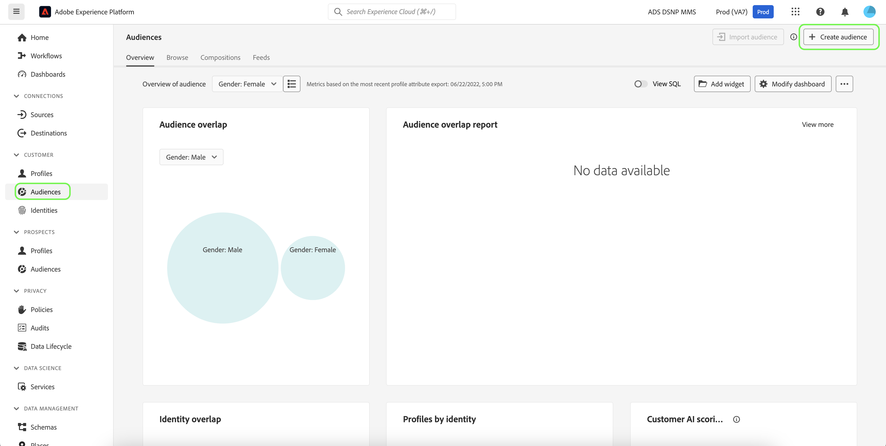

# 予測スコアを使用した顧客セグメントの作成

予測の実行が完了すると、予測された傾向スコアはプロファイルによって自動的に使用されます。顧客 AI スコアによるプロファイルの強化により、傾向スコアに基づくオーディエンスを発見するための顧客セグメントを作成できます。ここでは、セグメントビルダーを使用してセグメントを作成する手順を説明します。セグメントの作成に関するより詳細なチュートリアルについては、『[セグメントビルダーユーザーガイド](../../../segmentation/ui/segment-builder.md)』を参照してください。

>[!IMPORTANT]
>
>この方法を利用するには、データセットに対してリアルタイム顧客プロファイルを有効にする必要があります。

プラットフォーム UI で、左側のナビゲーションの「**[!UICONTROL セグメント]**」をクリックし、「**[!UICONTROL セグメント作成]**」をクリックします。

「**セグメントビルダー**」が表示されます。左側の「**[!UICONTROL フィールド]**」列の「**[!UICONTROL 属性]**」タブで、「**[!UICONTROL XDM Individual Profile]**」という名前のフォルダーをクリックし、組織の名前空間を持つフォルダーをクリックします。「**[!UICONTROL Customer AI]**」という名前のフォルダーには、予測実行の結果が格納され、スコアが属するインスタンスに基づいて名前が付けられます。インスタンスフォルダーをクリックして、目的のインスタンスの結果にアクセスします。

セグメントビルダーの中央にある「**[!UICONTROL スコア]**」属性を&#x200B;*ルールビルダーキャンバス*&#x200B;にドラッグ&amp;ドロップし、ルールを定義します。

右側の&#x200B;*セグメントのプロパティ*&#x200B;列で、セグメントの名前を指定します。

左側の上 *フィールド* 列で、 **ギア** アイコンをクリックし、 *結合ポリシー* 」をクリックします。 「**[!UICONTROL 保存]**」をクリックしてセグメントを作成します。

## 次の手順

このチュートリアルでは、セグメントビルダーを使用して、傾向スコアに基づくオーディエンスを見つけることができました。 これで、オーディエンスを宛先にアクティブ化することでターゲットに設定できます。詳しくは、「[宛先の概要](../../../destinations/home.md)」を参照してください。
