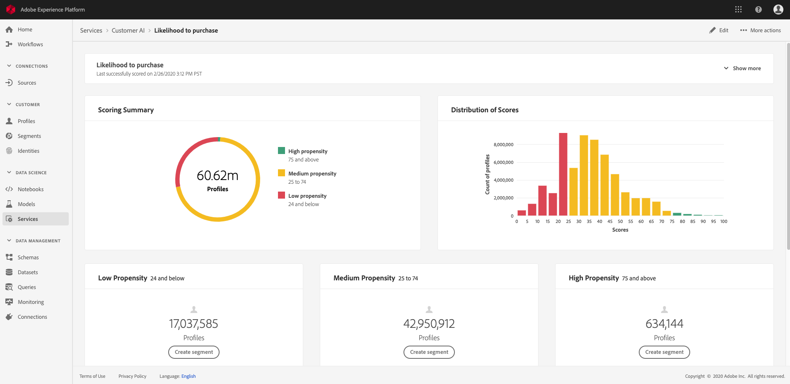

# 顧客AIによるインサイトの発見

顧客AIは、インテリジェントサービスの一部として、マーケターにAdobe Senseiを活用して、顧客の次の行動を予測する力を提供します。 顧客 AI は、個々のプロファイルのカスタム傾向スコア（チャーンやコンバージョンなど）を大規模に生成するために使用されます。ビジネスニーズから機械学習の問題への変換、アルゴリズムの選択、トレーニング、デプロイメントは必要ありません。

このドキュメントは、インテリジェントサービス顧客AIユーザーインターフェイスのサービスインスタンスインサイトを操作するためのガイドとして機能します。

## はじめに

顧客AIのインサイトを利用するには、正常な実行ステータスを持つサービスインスタンスを使用できる必要があります。 新しいサービスインスタンスを作成するには、「顧客AI [インスタンスの設定」を参照してくださ](./configure.md)い。 サービスインスタンスを最近作成し、まだトレーニングとスコアリングを行っている場合は、実行が終了するまで24時間お待ちください。

## サービスインスタンスの概要

Adobe Experience Platform UIの左側のナビゲーション **[!UICONTROL Services]** をクリックします。 サービス *・ブラウザが表示され* 、使用可能なインテリジェント・サービスが表示されます。 In the container for Customer AI, click **[!UICONTROL Open]**.

顧客AIサービスページが表示されます。 このページリストでは、顧客AIのサービスインスタンスを表示し、インスタンスの名前、傾向タイプ、インスタンスが実行される頻度、最後の更新のステータスなど、それらに関する情報を表示します。

>[!NOTE] 成功したスコアリングの実行を完了したサービスインスタンスのみがインサイトを持ちます。

開始するサービスインスタンス名をクリックします。

次に、そのサービスインスタンスのインサイトページが表示され、データのビジュアライゼーションが提供されます。 ビジュアライゼーションと、データを使用して実行できる操作について、本ガイド全体で詳しく説明します。

### サービスインスタンスの詳細

サービスインスタンスの詳細を表示する方法は2つあります。1つ目はダッシュボードから、もう1つはサービスインスタンス内からです。

表示内から詳細をダッシュボードするには、サービスインスタンスコンテナをクリックし、名前に添付されたハイパーリンクを避けます。 説明、スコアリング頻度、予測目標、適格な母集団などの追加の詳細を示す右側のレールが開きます。 また、またはをクリックして、インスタンスの編集と削除を選択で **[!UICONTROL Edit]** きま **[!UICONTROL Delete]**&#x200B;す。

>[!NOTE] スコアリングイベントが失敗した場合、エラーメッセージが表示されます。 エラーメッセージは、右側のレール *の「最後の実行の詳細* 」の下に表示され、失敗した実行に対してのみ表示されます。

サービスインスタンスの追加の詳細表示を行う2つ目の方法は、インサイトページ内にあります。 右上のをクリ **[!UICONTROL Show more]** ックして、ドロップダウンを設定できます。 スコアの定義、作成日時、傾向タイプなどの詳細が表示されます。 一覧に表示されたプロパティの詳細については、「顧客AIインスタ [ンスの設定」を参照してください](./configure.md)。

### インスタンスの編集

インスタンスを編集するには、右上のナ **[!UICONTROL Edit]** ビゲーションのをクリックします。

編集ダイアログボックスが表示され、インスタンスの説明 *とスコ* アリングの頻度 *(Description And Scoring Frequency* )を編集できます。 変更を確認してダイアログを閉じるには、 **[!UICONTROL Edit]** 右下隅のをクリックします。

### その他のアクション

ボタ **[!UICONTROL More actions]** ンは、の横の右上のナビゲーションにあります **[!UICONTROL Edit]**。 をクリ **[!UICONTROL More actions]** ックすると、次の操作のいずれかを選択できるドロップダウンが開きます。

- **[!UICONTROL Delete]**:インスタンスを削除します。
- **[!UICONTROL Access scores]**:「 *Accessスコア* 」をクリックすると、ダイアログが開き、顧客AIチュートリ  アルのダウンロードスコアへのリンクが表示されます。このダイアログには、API呼び出しの作成に必要なデータセットIDも表示されます。
- **[!UICONTROL View run history]**:サービスインスタンスに関連付けられたすべてのスコアリング実行のリストを含むダイアログが表示されます。

## スコアリングの概要 {#scoring-summary}

スコアリングの概要には、スコアされたプロファイルの合計数が表示され、高、中、低の傾向を含むグループに分類されます。 傾向バケットは、スコア範囲に基づいて決定され、低い値は24未満、中間値は25 ～ 74、高い値は74を超えます。 各グループは、凡例に対応する色を持ちます。

>[!NOTE] コンバージョン傾向スコアの場合、高スコアは緑色で、低スコアは赤色で表示されます。 チャーンな傾向を予測する場合は、これが反転すると、高いスコアは赤で、低いスコアは緑で表示されます。 選択した傾向タイプに関係なく、メディアバケットは黄色のままです。

## スコアの配分

「スコ *アの配分* 」カードには、スコアに基づく訪問者の概要が視覚的に表示されます。 スコアの配分カードに表示される *色は* 、生成された傾向スコアのタイプを表します。

## 影響を与える要因

各スコアグループに対して、そのグループの影響を与えた要因の上位10件を示すカードが生成されます。 影響を与える要因によって、顧客が様々なスコアグループに属する理由の詳細が得られます。

### セグメントの作成

「低」、「中」 **[!UICONTROL Create Segment]** および「高」傾向の任意のグループ内のボタンをクリックすると、セグメントビルダーにリダイレクトされます。

>[!NOTE]
>このボタ **[!UICONTROL Create Segment]** ンは、データセットに対してリアルタイム顧客プロファイルが有効な場合にのみ使用できます。 リアルタイム顧客プロファイルを有効にする方法の詳細については、「リアルタイム顧客 [プロファイルの概要」を参照してください](../../../rtcdp/overview.md)。

セグメントビルダーを使用して、セグメントを定義します。 顧客AIは、インサ **[!UICONTROL Create Segment]** イトページから選択すると、選択したバケット情報をセグメントに自動的に追加します。 セグメントの作成を完了するには、セグメントビルダーのユ *ーザーインターフェイスの右側のレールにある* 「名前」コンテナと「説明 ** 」パラメーターを入力します。 セグメントに名前と説明を付けたら、右上の **[!UICONTROL Save]** をクリックします。

>!![NOTE] 傾向スコアは個々のプロファイルに書き込まれるので、他のプロファイル属性と同様に、セグメントビルダーで使用できます。 セグメントビルダーに移動して新しいセグメントを作成すると、名前空間顧客AIの下に様々な傾向スコアが表示されます。

新しいセグメントを表示UIに表示するには、左側のナビゲ **[!UICONTROL Segments]** ーションのをクリックします。 参照ペー *ジが表示さ* れ、使用可能なセグメントがすべて表示されます。

## 次の手順

このドキュメントでは、顧客AIサービスインスタンスが提供するインサイトの概要を説明しました。 カスタマーAIでのスコアのダウンロードに関するチ [ュートリアルを続けるか](./download-scores.md) 、提供される他の [Adobe Intelligent Services](../../home.md) Guideを参照できるようになりました。