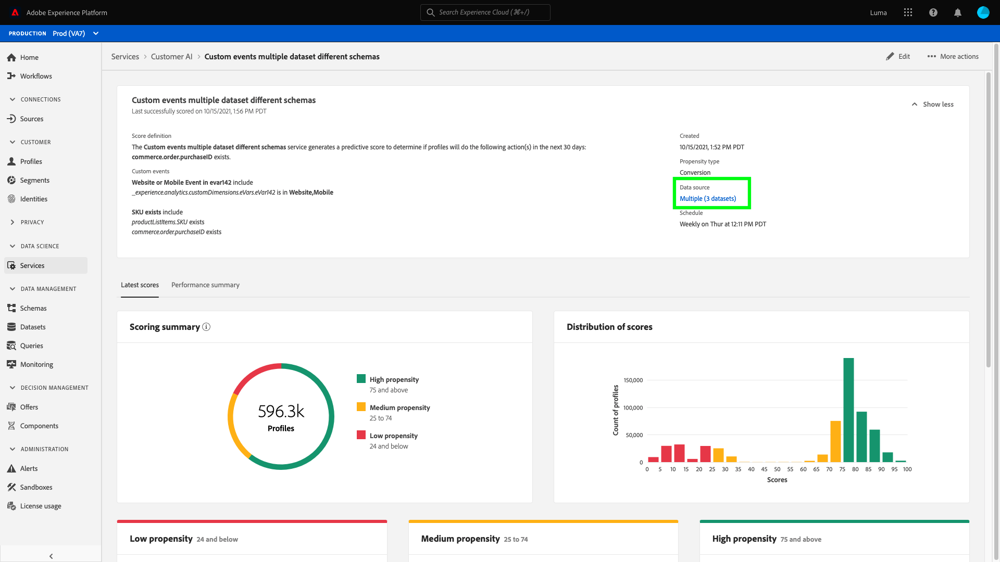
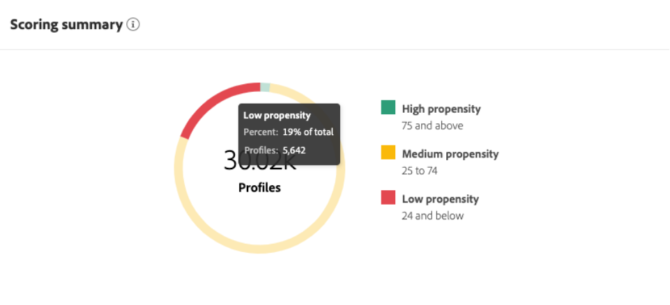

# 顧客 AI でインサイトを見つける

顧客 AI は、Intelligent Services の一部として Adobe Sensei を活用し、顧客の次の行動を予測する力をマーケターに提供します。顧客 AI は、個々のプロファイルのカスタム傾向スコア（チャーンやコンバージョンなど）を大規模に生成するために使用されます。ビジネスニーズから機械学習の問題への変換、アルゴリズムの選択、トレーニング、デプロイメントは必要ありません。

このドキュメントは、Intelligent Services 顧客 AI ユーザーインターフェイスのサービスインスタンスインサイトを操作するためのガイドとして機能します。

## はじめに

顧客 AI のインサイトを利用するには、正常な実行ステータスを持つサービスインスタンスを使用できる必要があります。新しいサービスインスタンスを作成するには、以下にアクセスします。 [顧客 AI インスタンスの設定](./configure.md). サービスインスタンスを最近作成し、まだトレーニングとスコア付けをおこなっている場合は、実行が終了するまで 24 時間お待ちください。

## サービスインスタンスの概要

内 [!DNL Adobe Experience Platform] UI、「 」を選択します。 **[!UICONTROL サービス]** をクリックします。 *サービス*&#x200B;ブラウザーが開き、使用可能なインテリジェントサービスが表示されます。顧客 AI のコンテナで、 **[!UICONTROL 開く]**.

顧客 AI サービスページが表示されます。このページは、顧客 AI のサービスインスタンスをリスト表示し、それらに関する情報（インスタンスの名前、傾向タイプ、インスタンスの実行頻度、前回の更新のステータスなど）を表示します。

>[!NOTE]
>
> 成功したスコア付け実行を完了したサービスインスタンスのみからインサイトが得られます。

開始するサービスインスタンス名を選択します。

次に、そのサービスインスタンスのインサイトページが表示され、「 」オプションで「 」を選択します **[!UICONTROL 最新のスコア]** または **[!UICONTROL パフォーマンスの概要]**. デフォルトのタブ **[!UICONTROL 最新のスコア]** は、データのビジュアライゼーションを提供します。 ビジュアライゼーションと、データを使用して実行できる操作について、本ガイド全体で詳しく説明します。

この **[!UICONTROL パフォーマンスの概要]** 「 」タブには、各傾向バケットの実際のチャーンまたはコンバージョン率が表示されます。 詳しくは、 [パフォーマンスの概要指標](#performance-metrics).

## サービスインスタンスの詳細

サービスインスタンスの詳細を表示する方法は 2 つあります。ダッシュボードまたはサービスインスタンス内から。

### サービスインスタンスダッシュボード

ダッシュボード内のサービスインスタンスの詳細の概要を表示するには、サービスインスタンスコンテナを選択し、名前に接続されるハイパーリンクを回避します。 右側のパネルが開き、詳細が表示されます。 コントロールには、次のものが含まれます。

- **[!UICONTROL 編集]**:選択 **[!UICONTROL 編集]** 既存のサービスインスタンスを変更できます。 インスタンスの名前、説明およびスコアリング頻度を編集できます。
- **[!UICONTROL 複製]**:選択 **[!UICONTROL 複製]** 現在選択されているサービスインスタンスの設定をコピーします。 その後、ワークフローを変更して小さな調整を行い、新しいインスタンスとして名前を変更できます。
- **[!UICONTROL 削除]**:過去の実行も含め、サービスインスタンスを削除できます。
- **[!UICONTROL データソース]**:このインスタンスで使用されるデータセットへのリンク。
- **[!UICONTROL 実行頻度]**:スコアリングの実行が実行される頻度とタイミング。
- **[!UICONTROL スコア定義]**:このインスタンスに設定した目標の概要です。

>[!NOTE]
>
>スコア付け実行が失敗したイベントには、エラーメッセージが表示されます。エラーメッセージは、右側パネル の「**最後の実行の詳細**」の下に表示され、失敗した実行に対してのみ表示されます。

### その他のインサイトドロップダウンを表示

サービスインスタンスの追加の詳細を表示する 2 つ目の方法は、インサイトページ内にあります。選択 **[!UICONTROL 詳細を表示]** をクリックして、ドロップダウンを表示します。 スコアの定義、作成日時、傾向タイプ、使用するデータセットなどの詳細が表示されます。 一覧に表示されたプロパティの詳細については、 [顧客 AI インスタンスの設定](./configure.md).

### 顧客 AI データセットプレビューポップオーバー

顧客 AI で複数のデータセットを使用する場合は、 **[!UICONTROL 複数]** 後に角括弧で囲まれたデータセットの数が続く `()` が指定されている。

複数のデータセットリンクを選択すると、顧客 AI データセットのプレビューポップオーバーが開きます。 プレビュー内の各色は、データセット列の左側にある Color キーで示すように、データセットを表します。 この例では、 **データセット 1** に `PROP1` 列。

### インスタンスの編集

インスタンスを編集するには、「 」を選択します。 **[!UICONTROL 編集]** をクリックします。

編集ダイアログボックスが表示され、インスタンスの名前、説明、ステータス、スコア付け頻度を編集できます。 変更を確認してダイアログを閉じるには、「 」を選択します。 **[!UICONTROL 保存]** をクリックします。

### その他のアクション

右上のナビゲーションの「**[!UICONTROL 編集]**」の横に「**[!UICONTROL その他のアクション]**」ボタンがあります。選択 **[!UICONTROL その他のアクション]** ドロップダウンが開き、次の操作のいずれかを選択できます。

- **[!UICONTROL 複製]**:選択 **[!UICONTROL 複製]** 設定されたサービスインスタンスをコピーします。 その後、ワークフローを変更して小さな調整を行い、新しいインスタンスとして名前を変更できます。
- **[!UICONTROL 削除]**：インスタンスを削除します。
- **[!UICONTROL スコアへのアクセス]**:選択 **[!UICONTROL スコアへのアクセス]** ダイアログが開き、 [顧客 AI のスコアのダウンロード](./download-scores.md) チュートリアルでは、API 呼び出しの実行に必要なデータセット id も提供します。
- **[!UICONTROL 実行履歴の表示]**：ダイアログが開き、サービスインスタンスに関連付けられたすべてのスコア付け実行のリストが表示されます。

## スコア付けの概要 {#scoring-summary}

スコア付けの概要には、スコア付けされたプロファイルの合計数が表示され、傾向が高、中、低のグループに分類されます。 傾向バケットは、スコア範囲に基づいて決定され、「低」は 24 未満、「中」は 25 ～ 74、「高」は 74 を超える値になります。各バケットには、凡例に対応する色があります。

>[!NOTE]
>
> コンバージョン傾向スコアの場合、高スコアは緑色、低スコアは赤色で表示されます。チャーンの傾向を予測する場合は、これが逆となり、高いスコアは赤、低いスコアは緑で表示されます。選択した傾向タイプに関係なく、メディアバケットは黄色のままです。

リング上の任意の色の上にマウスポインターを置くと、バケットに属するプロファイルの割合や合計数など、追加の情報を表示できます。

## スコアの配分

「**[!UICONTROL スコアの配分]**」カードには、スコアに基づいた訪問者の概要が視覚的に表示されます。「[!UICONTROL スコアの配分]」カードに表示される色は、生成された傾向スコアのタイプを表します。任意のスコアリング配分の上にマウスポインターを置くと、その配分に属する正確なカウントが表示されます。

## 影響を与える要因

各スコアグループに対して、そのグループに影響を与えた要因の上位 10 件を示すカードが生成されます。影響要因を確認すると、顧客が様々なスコアバケットに属する理由の詳細がわかります。

### 影響要因のドリルダウン

影響を与える要因の上位にカーソルを合わせると、データがさらに分類されます。 特定のプロファイルが傾向バケットに属する理由に関する概要が提供されます。 要因に応じて、数値、分類、ブール値を指定できます。 次の例は、地域別の分類値を示しています。

さらに、ドリルダウンを使用すると、2 つ以上の傾向バケットに存在する場合の配分率を比較し、これらの値を使用してより具体的なセグメントを作成できます。 次の例は、最初の使用例を示しています。

コンバージョン傾向が低いプロファイルは、adobe.com の Web ページを最近訪問した可能性が低いことがわかります。 傾向が中程度のプロファイルの場合、「前回の Web 訪問からの日数」要因の対象は 8%のみで、26%に過ぎません。 これらの数値を使用して、各バケット内の配分を要因と比較できます。 この情報を使用して、傾向が中程度のバケットの場合とは異なり、Web 訪問の最新性は傾向が低いバケットでは影響力が低いとは考えることができません。

### セグメントの作成

の選択 **[!UICONTROL セグメントを作成]** 」ボタンをクリックすると、傾向が「低」、「中」、「高」の任意のバケットにリダイレクトされ、セグメントビルダーに移動します。

>[!NOTE]
>
>この **[!UICONTROL セグメントを作成]** ボタンは、データセットに対してリアルタイム顧客プロファイルが有効になっている場合にのみ使用できます。 リアルタイム顧客プロファイルを有効にする方法について詳しくは、 [リアルタイム顧客プロファイルの概要](../../../rtcdp/overview.md).

セグメントビルダーは、セグメントを定義するために使用します。 選択時 **[!UICONTROL セグメントを作成]** 顧客 AI は、インサイトページから、選択したバケット情報をセグメントに自動的に追加します。 セグメントの作成を完了するには、セグメントビルダーのユーザーインターフェイスの右側パネルにある「**名前**」コンテナと「**説明**」パラメーターを入力します。セグメントに名前と説明を付けたら、「 」を選択します。 **[!UICONTROL 保存]** をクリックします。

>[!NOTE]
>
> 傾向スコアは個々のプロファイルに書き込まれるので、他のプロファイル属性と同様に、セグメントビルダーで使用できます。セグメントビルダーに移動して新しいセグメントを作成すると、名前空間顧客 AI の下に様々な傾向スコアが表示されます。

新しいセグメントを Platform UI に表示するには、「 **[!UICONTROL セグメント]** をクリックします。 **[!UICONTROL 参照]**&#x200B;ページが表示され、使用可能なセグメントがすべて表示されます。

## パフォーマンスの概要指標 {#performance-metrics}

この **[!UICONTROL パフォーマンスの概要]** 「 」タブには、実際のチャーンまたはコンバージョン率が、顧客 AI がスコアリングする傾向バケットのそれぞれに分けて表示されます。

最初は、予想された率（点線）のみが表示されます。 予期される率は、スコアリングの実行が発生せず、データがまだ使用できない場合に表示されます。 ただし、結果ウィンドウを過ぎると、予測レートは実際のレート（実線）に置き換えられます。

行の上にマウスポインターを置くと、その日の実際/予測レートがそのバケットに表示されます。

表示されている予測率と実際の率に関する期間をフィルタリングできます。 を選択します。 **カレンダーアイコン** 次に、新しい日付範囲を選択します。 各グループの結果は、新しい日付範囲内に表示されるように更新されます。

### 個々のスコアリング実行率

の下半分 **[!UICONTROL パフォーマンスの概要]** 「 」タブには、個々のスコアリング実行の結果が表示されます。 右上のドロップダウンの日付を選択し、異なるスコアリング実行の結果を表示します。

チャーンまたはコンバージョンを予測するかどうかに応じて、 [!UICONTROL スコアの配分] グラフには、各増分でのチャーン/コンバートされたプロファイルの配分（チャーン/コンバートされなかったプロファイルの配分）が表示されます。

## 次の手順

このドキュメントでは、顧客 AI サービスインスタンスが提供するインサイトの概要を説明しました。これで、[顧客 AI でのスコアのダウンロード](./download-scores.md)に関するチュートリアルを続けるか、提供される他の [Adobe Intelligent Services](../../home.md) ガイドを参照できるようになりました。

## その他のリソース

次のビデオでは、顧客 AI を使用してモデルの出力と影響力のある要因を確認する方法の概要を説明します。

>[!VIDEO](https://video.tv.adobe.com/v/32666?learn=on&quality=12)
