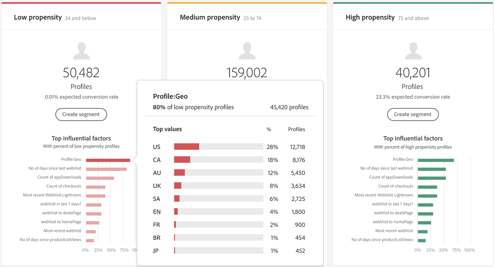

# 顧客AIを使用したインサイトの発見

顧客 AI は、Intelligent Services の一部として Adobe Sensei を活用し、顧客の次の行動を予測する力をマーケターに提供します。顧客 AI は、個々のプロファイルのカスタム傾向スコア（チャーンやコンバージョンなど）を大規模に生成するために使用されます。ビジネスニーズから機械学習の問題への変換、アルゴリズムの選択、トレーニング、デプロイメントは必要ありません。

このドキュメントは、Intelligent Services 顧客 AI ユーザーインターフェイスのサービスインスタンスインサイトを操作するためのガイドとして機能します。

## はじめに

顧客 AI のインサイトを利用するには、正常な実行ステータスを持つサービスインスタンスを使用できる必要があります。新しいサービスインスタンスを作成するには、[顧客AIインスタンスの設定](./configure.md)を参照してください。 サービスインスタンスを最近作成し、まだトレーニングとスコア付けをおこなっている場合は、実行が終了するまで 24 時間お待ちください。

## サービスインスタンスの概要

[!DNL Adobe Experience Platform] UIの左側のナビゲーションで&#x200B;**[!UICONTROL サービス]**&#x200B;をクリックします。 *サービス*&#x200B;ブラウザーが開き、使用可能なインテリジェントサービスが表示されます。顧客 AI のコンテナで、「**[!UICONTROL 開く]**」をクリックします。

顧客 AI サービスページが表示されます。このページは、顧客 AI のサービスインスタンスをリスト表示し、それらに関する情報（インスタンスの名前、傾向タイプ、インスタンスの実行頻度、前回の更新のステータスなど）を表示します。

>[!NOTE]
>
> 成功したスコア付け実行を完了したサービスインスタンスのみからインサイトが得られます。

開始するサービスインスタンス名を選択します。

次に、そのサービスインスタンスのインサイトページが表示され、「**[!UICONTROL 最新のスコア]**」または「**[!UICONTROL パフォーマンスの概要]**」を選択するオプションが表示されます。 デフォルトのタブ&#x200B;**[!UICONTROL 最新のスコア]**&#x200B;は、データのビジュアライゼーションを提供します。 ビジュアライゼーションと、データを使用して実行できる操作について、本ガイド全体で詳しく説明します。

「**[!UICONTROL パフォーマンスの概要]**」タブには、各傾向バケットの実際の傾向（複数可）が表示されます。 詳しくは、[パフォーマンスの概要指標](#performance-metrics)の節を参照してください。

### サービスインスタンスの詳細

サービスインスタンスの詳細を表示するには、2つの方法があります。をダッシュボードから、またはサービスインスタンス内から呼び出します。

ダッシュボード内のサービスインスタンスの詳細の概要を表示するには、サービスインスタンスのコンテナを選択し、名前に付けられるハイパーリンクを避けます。 右側のパネルが開き、詳細情報が表示されます。 コントロールには、次の項目が含まれます。

- **[!UICONTROL 編集]**:「 **** 編集」を選択すると、既存のサービスインスタンスを変更できます。インスタンスの名前、説明およびスコアリング頻度を編集できます。
- **[!UICONTROL クローン]**:[ **** Clonecopys]を選択すると、現在選択されているサービス・インスタンスが設定されます。その後、ワークフローを変更してマイナーツイークを作成し、新しいインスタンスとして名前を変更できます。
- **[!UICONTROL 削除]**:過去の実行を含むサービスインスタンスを削除できます。
- **[!UICONTROL データソース]**:このインスタンスで使用されるデータセットへのリンク。
- **[!UICONTROL 実行頻度]**:スコアリングの実行頻度と実行日時。
- **[!UICONTROL スコアの定義]**:このインスタンスに対して設定した目標の概要を簡単に示します。

>[!NOTE]
>
>スコア付け実行が失敗したイベントには、エラーメッセージが表示されます。エラーメッセージは、右側パネル の「**最後の実行の詳細**」の下に表示され、失敗した実行に対してのみ表示されます。

サービスインスタンスの追加の詳細を表示する 2 つ目の方法は、インサイトページ内にあります。右上の「**[!UICONTROL 詳細を表示]**」をクリックして、ドロップダウンを表示できます。スコアの定義、作成日時、傾向タイプなどの詳細が表示されます。一覧に示したプロパティの詳細については、[顧客AIインスタンスの設定](./configure.md)を参照してください。

### インスタンスの編集

インスタンスを編集するには、右上のナビゲーションの「**[!UICONTROL 編集]**」をクリックします。

編集ダイアログボックスが表示され、インスタンスの名前、説明、ステータス、スコアリング頻度を編集できます。 変更を確認してダイアログを閉じるには、右下の「**[!UICONTROL 保存]**」を選択します。

### その他のアクション

右上のナビゲーションの「**[!UICONTROL 編集]**」の横に「**[!UICONTROL その他のアクション]**」ボタンがあります。「**[!UICONTROL その他のアクション]**」をクリックするとドロップダウンが開き、次の操作のいずれかを選択できます。

- **[!UICONTROL クローン]**:「 **** Clonecopys」を選択すると、設定したサービス・インスタンスがコピーされます。その後、ワークフローを変更してマイナーツイークを作成し、新しいインスタンスとして名前を変更できます。
- **[!UICONTROL 削除]**：インスタンスを削除します。
- **[!UICONTROL アクセススコア]**:「 **[!UICONTROL アクセス]** スコア」を選択すると、ダイアログが開き、顧客AIチュートリアルの  ダウンロードスコアへのリンクが提供されます。このダイアログには、API呼び出しの作成に必要なデータセットIDも表示されます。
- **[!UICONTROL 実行履歴の表示]**：ダイアログが開き、サービスインスタンスに関連付けられたすべてのスコア付け実行のリストが表示されます。

## スコアリングの概要{#scoring-summary}

スコアリングの概要には、スコア対象プロファイルの合計数が表示され、高、中、低の傾向を含むグループに分類されます。 傾向バケットは、スコア範囲に基づいて決定され、「低」は 24 未満、「中」は 25 ～ 74、「高」は 74 を超える値になります。各バケットには、凡例に対応する色があります。

>[!NOTE]
>
> コンバージョン傾向スコアの場合、高スコアは緑色、低スコアは赤色で表示されます。チャーンの傾向を予測する場合は、これが逆となり、高いスコアは赤、低いスコアは緑で表示されます。選択した傾向タイプに関係なく、メディアバケットは黄色のままです。

リング上の色の上にマウスポインターを置くと、表示の追加情報(割合や、グループに属するプロファイルの合計数など)を表示できます。

## スコアの配分

「**[!UICONTROL スコアの配分]**」カードには、スコアに基づいた訪問者の概要が視覚的に表示されます。「[!UICONTROL スコアの配分]」カードに表示される色は、生成された傾向スコアのタイプを表します。スコアリング分布の上にカーソルを置くと、その分布に属する正確な数が示されます。

## 影響を与える要因

各スコアグループに対して、そのグループに影響を与えた要因の上位 10 件を示すカードが生成されます。影響要因を確認すると、顧客が様々なスコアバケットに属する理由の詳細がわかります。

### 影響力のある要因の詳細表示

影響力の高い任意の要因の上にマウスポインターを置くと、データがさらに分類されます。 特定のプロファイルが傾向バケットに属する理由の概要が表示されます。 係数に応じて、number、categoryまたはboolean値を指定できます。 以下の例では、地域別の分類値が表示されています。

さらに、ドリルダウンを使用すると、2つ以上の傾向グループに発生した場合に配分要因を比較し、これらの値を使用してより具体的なセグメントを作成できます。 次の例は、最初の使用例を示しています。

コンバージョンの傾向が低いプロファイルは、adobe.comのWebページを最近訪問した可能性が低いことがわかります。 「前回のweb訪問からの日数」要因の対象範囲は、中程度の傾向プロファイルの26%に対してわずか8%です。 この数値を使用して、各バケット内の分布をファクタと比較できます。 この情報を使用して、Web訪問の最新性は、中型の傾向バケットと同様に、低型の傾向バケットではあまり影響力がないと推測できます。

### セグメントの作成

低、中、高の傾向の任意のグループで「**[!UICONTROL セグメントを作成]**」ボタンを選択すると、セグメントビルダーにリダイレクトされます。

>[!NOTE]
>
>「**[!UICONTROL セグメントを作成]**」ボタンは、データセットに対してリアルタイム顧客プロファイルが有効になっている場合にのみ使用できます。 リアルタイム顧客プロファイルを有効にする方法の詳細については、[リアルタイム顧客プロファイルの概要](../../../rtcdp/overview.md)を参照してください。

セグメントビルダーを使用して、セグメントを定義します。 「インサイト」ページから「**[!UICONTROL セグメント]**&#x200B;を作成」を選択すると、顧客AIは、選択したグループ情報を自動的にセグメントに追加します。 セグメントの作成を完了するには、セグメントビルダーのユーザーインターフェイスの右側パネルにある「*名前*」コンテナと「*説明*」パラメーターを入力します。セグメントに名前と説明を付けたら、右上の「**[!UICONTROL 保存]**」をクリックします。

>[!NOTE]
>
> 傾向スコアは個々のプロファイルに書き込まれるので、他のプロファイル属性と同様に、セグメントビルダーで使用できます。セグメントビルダーに移動して新しいセグメントを作成すると、名前空間顧客 AI の下に様々な傾向スコアが表示されます。

新しいセグメントを Platform UI に表示するには、左のナビゲーションで「**[!UICONTROL セグメント]**」をクリックします。**[!UICONTROL 参照]**&#x200B;ページが表示され、使用可能なセグメントがすべて表示されます。

## パフォーマンスの概要指標{#performance-metrics}

**[!UICONTROL パフォーマンスの概要]**&#x200B;タブは、実際の傾向またはコンバージョン率を示し、顧客AIがスコアする各傾向グループに分けます。

最初は予想されたレート（点線）のみが表示されます。 予想レートは、スコアリングの実行が行われておらず、データがまだ使用できない場合に表示されます。 ただし、結果ウィンドウが過ぎると、予測レートは実際のレート（実線）に置き換えられます。

行の上にカーソルを置くと、その日の日付と、その日の実績/予測レートがそのバケットに表示されます。

表示される予想レートと実際のレートに対して、時間枠をフィルターできます。 **カレンダーアイコン** を選択し、新しい日付範囲を選択します。 各グループの結果が更新され、新しい日付範囲内に表示されます。

### 個々のスコアリング実行率

「**[!UICONTROL パフォーマンスの概要]**」タブの下半分には、各スコアリング実行の結果が表示されます。 右上のドロップダウン日を選択して、異なるスコアリング実行の結果を表示します。

チャーンとコンバージョンの予測方法に応じて、[!UICONTROL スコアの分布]グラフには、各増分でチャーン/コンバートされたプロファイルの分布と、チャーン/コンバートされていない訪問者の分布が表示されます。

## 次の手順

このドキュメントでは、顧客 AI サービスインスタンスが提供するインサイトの概要を説明しました。これで、[顧客 AI でのスコアのダウンロード](./download-scores.md)に関するチュートリアルを続けるか、提供される他の [Adobe Intelligent Services](../../home.md) ガイドを参照できるようになりました。

## その他のリソース

次のビデオでは、Customer AIを使用して、モデルの出力と影響を及ぼす要因を確認する方法について概説します。

>[!VIDEO](https://video.tv.adobe.com/v/32666?learn=on&quality=12)
