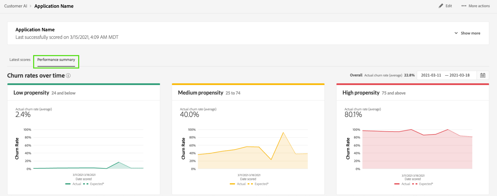

# 顧客 AI でインサイトを見つける

顧客 AI は、インテリジェントサービスの一部として Adobe Sensei を活用し、顧客の次の行動を予測する力をマーケターに提供します。顧客 AI は、個々のプロファイルのカスタム傾向スコア（チャーンやコンバージョンなど）を大規模に生成するために使用されます。ビジネスニーズから機械学習の問題への変換、アルゴリズムの選択、トレーニング、デプロイメントは必要ありません。

このドキュメントは、Intelligent Services 顧客 AI ユーザーインターフェイスのサービスインスタンスインサイトを操作するためのガイドとして機能します。

## はじめに

顧客 AI のインサイトを利用するには、正常な実行ステータスを持つサービスインスタンスを使用できる必要があります。新しいサービスインスタンスを作成するには、[ 顧客 AI インスタンスの設定 ](./configure.md) を参照してください。 サービスインスタンスを最近作成し、まだトレーニングとスコア付けをおこなっている場合は、実行が終了するまで 24 時間お待ちください。

## サービスインスタンスの概要

[!DNL Adobe Experience Platform] UI で、左側のナビゲーションの **[!UICONTROL サービス]** を選択します。 *サービス*&#x200B;ブラウザーが開き、使用可能なインテリジェントサービスが表示されます。顧客 AI のコンテナで、「**[!UICONTROL 開く]**」を選択します。

顧客 AI サービスページが表示されます。このページは、顧客 AI のサービスインスタンスをリスト表示し、それらに関する情報（インスタンスの名前、傾向タイプ、インスタンスの実行頻度、前回の更新のステータスなど）を表示します。

>[!NOTE]
>
>スコアリング実行が正常に完了したサービスインスタンスにのみ、インサイトがあります。

開始するサービスインスタンス名を選択します。

次に、そのサービスインスタンスのインサイトページに、「**[!UICONTROL 最新のスコア]**」または「**[!UICONTROL パフォーマンスの概要]** を選択するオプションが表示されます。 デフォルトのタブ **[!UICONTROL 最新のスコア]** には、データのビジュアライゼーションが表示されます。 ビジュアライゼーションと、データを使用して実行できる操作について、本ガイド全体で詳しく説明します。

**[!UICONTROL パフォーマンスの概要]** タブには、各傾向バケットの実際のチャーンまたはコンバージョンレートが表示されます。 詳しくは、[ パフォーマンスの概要指標 ](#performance-metrics) の節を参照してください。

## サービスインスタンスの詳細

サービスインスタンスの詳細を表示するには、ダッシュボードから表示する方法と、サービスインスタンス内で表示する方法の 2 つがあります。

### サービスインスタンスダッシュボード

ダッシュボード内のサービスインスタンスの詳細の概要を表示するには、名前に添付されているハイパーリンクを避けてサービスインスタンスコンテナを選択します。 これにより、追加の詳細を提供する右側のパネルが開きます。 コントロールには、次の項目が含まれます。

- **[!UICONTROL 編集]**:「**[!UICONTROL 編集]**」を選択すると、既存のサービスインスタンスを変更できます。 インスタンスの名前、説明およびスコアリング頻度を編集できます。
- **[!UICONTROL 複製]**: **[!UICONTROL 複製]** を選択すると、現在選択されているサービスインスタンスの設定がコピーされます。 その後、ワークフローを変更して微調整を行い、新しいインスタンスとして名前を変更できます。
- **[!UICONTROL 削除]**：実行履歴を含めて、サービスインスタンスを削除できます。
- **[!UICONTROL データソース]**：このインスタンスで使用されるデータセットへのリンク。
- **[!UICONTROL 実行頻度]**：スコアリング実行の頻度とタイミング。
- **[!UICONTROL スコア定義]**：このインスタンスに設定した目標の概要。

>[!NOTE]
>
>スコアリング実行が失敗した場合は、エラーメッセージが表示されます。 エラーメッセージは、右側パネル の「**最後の実行の詳細**」の下に表示され、失敗した実行に対してのみ表示されます。

### さらにインサイトを表示ドロップダウン

サービスインスタンスの追加の詳細を表示する 2 つ目の方法は、インサイトページ内にあります。右上の **[!UICONTROL 詳細を表示]** を選択して、ドロップダウンに入力します。 スコアの定義、作成時、傾向タイプ、使用したデータセットなど、詳細が一覧表示されます。 リストに表示されたプロパティについて詳しくは、[ 顧客 AI インスタンスの設定 ](./configure.md) を参照してください。

### 顧客 AI データセットプレビューポップオーバー

顧客 AI で複数のデータセットを使用する場合は、「**[!UICONTROL 複数]**」というラベルの付いたハイパーリンクに続いて、角括弧内にデータセット数が表示さ `()` ます。

複数のデータセット リンクを選択すると、顧客 AI データセットのプレビューポップオーバーが開きます。 プレビューの各色は、データセット列の左側のカラーキーで示すように、データセットを表します。 この例では、`PROP1` の列を含んでいるのは **データセット 1** のみであることがわかります。

### インスタンスの編集

インスタンスを編集するには、右上のナビゲーションで「**[!UICONTROL 編集]** を選択します。

編集ダイアログボックスが表示され、インスタンスの名前、説明、ステータスおよびスコアリング頻度を編集できます。 変更を確定してダイアログを閉じるには、右下隅にある「**[!UICONTROL 保存]**」を選択します。

### その他のアクション

右上のナビゲーションの「**[!UICONTROL 編集]**」の横に「**[!UICONTROL その他のアクション]**」ボタンがあります。**[!UICONTROL その他のアクション]** を選択すると、ドロップダウンが開き、次のいずれかの操作を選択できます。

- **[!UICONTROL クローン]**:「**[!UICONTROL クローン]**」を選択すると、サービスインスタンスの設定がコピーされます。 その後、ワークフローを変更して微調整を行い、新しいインスタンスとして名前を変更できます。
- **[!UICONTROL 削除]**：インスタンスを削除します。
- **[!UICONTROL スコアにアクセス]**:「スコアにアクセス **[!UICONTROL を選択すると]** チュートリアル [ 顧客 AI のスコアのダウンロード ](./download-scores.md) へのリンクを提供するダイアログが開きます。このダイアログには、API 呼び出しの実行に必要なデータセット ID も表示されます。
- **[!UICONTROL 実行履歴の表示]**：ダイアログが開き、サービスインスタンスに関連付けられたすべてのスコア付け実行のリストが表示されます。

## スコア付けの概要 {#scoring-summary}

スコアリングの概要には、スコアリングされたプロファイルの合計数が表示され、傾向が高、中、低に分類されます。 傾向バケットは、スコア範囲に基づいて決定され、「低」は 24 未満、「中」は 25 ～ 74、「高」は 74 を超える値になります。各バケットには、凡例に対応する色があります。

>[!NOTE]
>
>コンバージョンの傾向スコアの場合、高スコアは緑、低スコアは赤で表示されます。 チャーンの傾向を予測する場合は、これが逆となり、高いスコアは赤、低いスコアは緑で表示されます。選択した傾向タイプに関係なく、メディアバケットは黄色のままです。

リングの任意の色の上にマウスポインターを置くと、バケットに属するプロファイルの割合や合計数などの追加情報が表示されます。

## スコアの配分

「**[!UICONTROL スコアの配分]**」カードには、スコアに基づいた訪問者の概要が視覚的に表示されます。[!UICONTROL  スコアの分布 ] カードに表示される色は、生成された傾向スコアのタイプを表します。 任意のスコアリング配分の上にマウスポインターを置くと、その配分に属する正確なカウントが表示されます。

## 影響を与える要因

各スコアグループに対して、そのグループに影響を与えた要因の上位 10 件を示すカードが生成されます。影響要因を確認すると、顧客が様々なスコアバケットに属する理由の詳細がわかります。

### 影響要因のドリルダウン

上位の影響要因の上にマウスポインターを置くと、データがさらに分類されます。 特定のプロファイルが傾向バケットに属する理由の概要が示されます。 要因に応じて、数値、カテゴリ値、ブール値が指定されます。 次の例は、地域別のカテゴリ値を示しています。

さらに、ドリルダウンを使用すると、2 つ以上の傾向バケットで発生した場合の配分係数を比較し、これらの値を使用してより具体的なセグメントを作成できます。 以下の例は、最初のユースケースを示しています。

コンバージョンする傾向が低いプロファイルは、adobe.com web ページを最近訪問した可能性が低くなることがわかります。 傾向が中程度のプロファイルの「前回の webVisit からの日数」係数は 26% に対して、8% しかカバーしていません。 これらの数値を使用すると、各バケット内の配分を係数と比較できます。 この情報を使用すると、webvisit の最新性は傾向が中程度のバケットにあるので、傾向が低いバケットにはそれほど影響を与えないことを推測できます。

### セグメントの作成

傾向が低、中、高のバケットで「**[!UICONTROL セグメントを作成]**」ボタンを選択すると、セグメントビルダーにリダイレクトされます。

>[!NOTE]
>
>「**[!UICONTROL セグメントを作成]**」ボタンは、データセットでリアルタイム顧客プロファイルが有効になっている場合にのみ使用できます。 リアルタイム顧客プロファイルを有効にする方法について詳しくは、[ リアルタイム顧客プロファイルの概要 ](../../../rtcdp/overview.md) を参照してください。

セグメントビルダーは、セグメントの定義に使用します。 インサイトページから **[!UICONTROL セグメントを作成]** を選択すると、顧客 AI は、選択したバケット情報をセグメントに自動的に追加します。 セグメントの作成を完了するには、セグメントビルダーのユーザーインターフェイスの右側パネルにある「**名前**」コンテナと「**説明**」パラメーターを入力します。セグメントに名前と説明を指定したら、右上の「**[!UICONTROL 保存]**」を選択します。

>[!NOTE]
>
>傾向スコアは個々のプロファイルに書き込まれるので、他のプロファイル属性と同様にセグメントビルダーで使用できます。 セグメントビルダーに移動して新しいセグメントを作成すると、名前空間顧客 AI の下に様々な傾向スコアが表示されます。

Platform UI に新しいセグメントを表示するには、左側のナビゲーションで **[!UICONTROL セグメント]** を選択します。 **[!UICONTROL 参照]**&#x200B;ページが表示され、使用可能なセグメントがすべて表示されます。

## パフォーマンス履歴 {#historical-performance}

**[!UICONTROL パフォーマンスの概要]** タブには、実際のチャーンまたはコンバージョン率が、顧客 AI がスコアリングした各傾向バケットに分けられて表示されます。

最初は、想定されるレート（点線）のみが表示されます。 スコアリング実行が発生しておらず、データがまだ使用できない場合は、予測レートが表示されます。 ただし、結果ウィンドウを通過すると、期待されるレートは実際のレート（実線）に置き換えられます。

ラインの上にマウスポインターを置くと、そのバケット内のその日の日付および実際/予定レートが表示されます。

表示される予定レートおよび実際のレートについて期間をフィルタリングできます。 **カレンダーアイコン**  を選択してから、新しい日付範囲を選択します。 各バケットの結果が更新され、新しい日付範囲内に表示されます。

### 個人スコアリング実行レート

**[!UICONTROL パフォーマンスの概要]** タブの下半分には、個々のスコアリング実行の結果が表示されます。 右上のドロップダウン日付を選択して、別のスコアリング実行の結果を表示します。

チャーンまたはコンバージョンを予測しているかどうかに応じて、[!UICONTROL  スコアの分布 ] グラフには、チャーン済み/コンバート済み、およびチャーン済み/コンバージョン済みでないプロファイルの分布が増分ごとに表示されます。

## モデル評価 {#model-evaluation}

「パフォーマンスの履歴」タブで予測結果と実際の結果を経時的に追跡できるだけでなく、マーケターは「モデル評価」タブでモデル品質よりもさらに透明性を高めることができます。 リフトグラフとゲイングラフを使用すると、予測モデルとランダムターゲティングの使用の違いを判断できます。 さらに、各スコアのカットオフで取得される肯定的な結果の数を判断できます。 これは、セグメント化や、投資回収率をマーケティングアクションと調整する場合に役立ちます。

### リフトグラフ

リフトグラフは、ランダムターゲティングの代わりに予測モデルを使用して、の改善を測定します。

高品質モデルの指標には、次のものがあります。

- 最初の数デシルでの高いリフト値。 つまり、このモデルは、興味のあるアクションを実行する傾向が最も高いユーザーを特定するのに適しています。
- 下降するリフト値。 つまり、スコアが高い顧客は、スコアが低い顧客よりも興味のある行動をとる可能性が高くなります。

### ゲイングラフ

累積ゲインチャートは、特定のしきい値を超えたターゲティングスコアによって取得されたポジティブな結果の割合を測定します。 傾向スコアで顧客を高から低に並べ替えた後、母集団はデシル（同じサイズの 10 個のグループ）に分割されます。 完全なモデルは、スコアが最も高いデシルで肯定的な結果をすべて取り込みます。 ベースラインランダムターゲティング方法では、グループのサイズに比例して正の結果を取得します。ユーザーの 30% をターゲットにすると、結果の 30% が取得されます。

高品質モデルの指標には、次のものがあります。

- 累積ゲインは、すぐに 100% に近づきます。
- モデルの累積ゲイン曲線は、グラフの左上隅に近づいています。
- 累積ゲインチャートは、セグメント化およびターゲティングのスコアカットオフを決定するために使用できます。 例えば、モデルが最初の 2 スコアデシルでポジティブな結果の 70% を取得する場合、PercentileScore が 80 を超えるユーザーをターゲットにすると、ポジティブな結果の約 70% を取得することが期待されます。

### AUC （カーブの下の領域）

AUC は、スコアによるランキングと予測された目標の発生との間の関係の強さを反映します。 **AUC** が 0.5 の場合、モデルはランダムな推測と変わりません。 **AUC** が 1 の場合、モデルは誰が関連するアクションを実行するかを完全に予測できます。

## 次の手順

このドキュメントでは、顧客 AI サービスインスタンスが提供するインサイトの概要を説明しました。これで、[顧客 AI でのスコアのダウンロード](./download-scores.md)に関するチュートリアルを続けるか、提供される他の [Adobe Intelligent Services](../../home.md) ガイドを参照できるようになりました。

## その他のリソース

次のビデオでは、顧客 AI を使用してモデルの出力と影響要因を確認する方法の概要を説明します。

>[!VIDEO](https://video.tv.adobe.com/v/32666?learn=on&quality=12)
