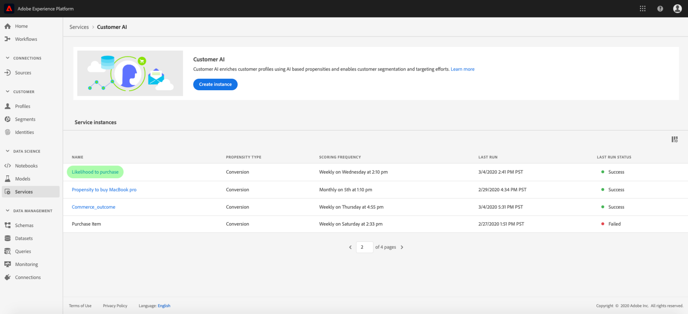
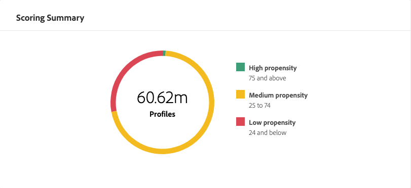

# 顧客 AI によるインサイトの獲得

顧客 AI は、Intelligent Services の一部として Adobe Sensei を活用し、顧客の次の行動を予測する力をマーケターに提供します。顧客 AI は、個々のプロファイルのカスタム傾向スコア（チャーンやコンバージョンなど）を大規模に生成するために使用されます。ビジネスニーズから機械学習の問題への変換、アルゴリズムの選択、トレーニング、デプロイメントは必要ありません。

このドキュメントは、Intelligent Services 顧客 AI ユーザーインターフェイスのサービスインスタンスインサイトを操作するためのガイドとして機能します。

## はじめに

顧客 AI のインサイトを利用するには、正常な実行ステータスを持つサービスインスタンスを使用できる必要があります。新しいサービスインスタンスを作成するには、「顧客AIインスタンスの [設定](./configure.md)」を参照してください。 サービスインスタンスを最近作成し、まだトレーニングとスコア付けをおこなっている場合は、実行が終了するまで 24 時間お待ちください。

## サービスインスタンスの概要

In the [!DNL Adobe Experience Platform] UI, click **[!UICONTROL Services]** in the left navigation. *サービス*&#x200B;ブラウザーが開き、使用可能な Intelligent Services が表示されます。顧客 AI のコンテナで、「**[!UICONTROL 開く]**」をクリックします。

顧客 AI サービスページが表示されます。このページは、顧客 AI のサービスインスタンスをリスト表示し、それらに関する情報（インスタンスの名前、傾向タイプ、インスタンスの実行頻度、前回の更新のステータスなど）を表示します。

>[!NOTE]
>
> 成功したスコア付け実行を完了したサービスインスタンスのみからインサイトが得られます。

開始するサービスインスタンス名をクリックします。

次に、そのサービスインスタンスのインサイトページが表示され、データのビジュアライゼーションが提供されます。ビジュアライゼーションと、データを使用して実行できる操作について、本ガイド全体で詳しく説明します。

### サービスインスタンスの詳細

サービスインスタンスの詳細を表示する方法は 2 つあります。1 つ目はダッシュボードから、もう 1 つはサービスインスタンス内からです。

ダッシュボード内から詳細を表示するには、名前に接続されているハイパーリンクを回避し、サービスインスタンスコンテナをクリックします。右側のパネルが開き、説明、スコア付け頻度、予測目標、対象母集団などの追加の詳細が表示されます。さらに、「**[!UICONTROL 編集]**」または「**[!UICONTROL 削除]**」をクリックして、インスタンスの編集と削除を選択できます。

>[!NOTE]
>
>スコア付け実行が失敗したイベントには、エラーメッセージが表示されます。エラーメッセージは、右側パネル の「*最後の実行の詳細*」の下に表示され、失敗した実行に対してのみ表示されます。

サービスインスタンスの追加の詳細を表示する 2 つ目の方法は、インサイトページ内にあります。右上の「**[!UICONTROL 詳細を表示]**」をクリックして、ドロップダウンを表示できます。スコアの定義、作成日時、傾向タイプなどの詳細が表示されます。For more information on any of the properties listed, please visit [Configuring a Customer AI instance](./configure.md).

### インスタンスの編集

インスタンスを編集するには、右上のナビゲーションの「**[!UICONTROL 編集]**」をクリックします。

編集ダイアログボックスが表示され、インスタンスの&#x200B;*説明*&#x200B;と&#x200B;*スコア付けの頻度*&#x200B;を編集できます。変更を確認してダイアログを閉じるには、右下隅の「**[!UICONTROL 編集]**」をクリックします。

### その他のアクション

右上のナビゲーションの「**[!UICONTROL 編集]**」の横に「**[!UICONTROL その他のアクション]**」ボタンがあります。「**[!UICONTROL その他のアクション]**」をクリックするとドロップダウンが開き、次の操作のいずれかを選択できます。

- **[!UICONTROL 削除]**：インスタンスを削除します。
- **[!UICONTROL アクセススコア]**:「*アクセススコア*」をクリックすると、ダイアログが開き、[顧客 AI のスコアのダウンロード](./download-scores.md)チュートリアルへのリンクが表示されます。このダイアログには、API 呼び出しの作成に必要なデータセット ID も表示されます。
- **[!UICONTROL 実行履歴の表示]**：ダイアログが開き、サービスインスタンスに関連付けられたすべてのスコア付け実行のリストが表示されます。

## スコア付けの概要 {#scoring-summary}

スコア付けの概要には、スコア付けされたプロファイルの合計数が表示され、傾向（高、中、低）を含むグループに分類されます。傾向バケットは、スコア範囲に基づいて決定され、「低」は 24 未満、「中」は 25 ～ 74、「高」は 74 を超える値になります。各バケットには、凡例に対応する色があります。

>[!NOTE]
>
> コンバージョン傾向スコアの場合、高スコアは緑色、低スコアは赤色で表示されます。チャーンの傾向を予測する場合は、これが逆となり、高いスコアは赤、低いスコアは緑で表示されます。選択した傾向タイプに関係なく、メディアバケットは黄色のままです。

## スコアの配分

「*スコアの配分*」カードには、スコアに基づいた訪問者の概要が視覚的に表示されます。「*スコアの配分*」カードに表示される色は、生成された傾向スコアのタイプを表します。

## 影響を与える要因

各スコアグループに対して、そのグループに影響を与えた要因の上位 10 件を示すカードが生成されます。影響要因を確認すると、顧客が様々なスコアバケットに属する理由の詳細がわかります。

### セグメントの作成

傾向が「低」、「中」、「高」の任意のバケットで「**[!UICONTROL セグメントを作成]**」ボタンをクリックすると、セグメントビルダーにリダイレクトされます。

>[!NOTE]
>
>「 **[!UICONTROL セグメントを]** 作成」ボタンは、データセットに対してリアルタイム顧客プロファイルが有効になっている場合にのみ使用できます。 リアルタイム顧客プロファイルを有効にする方法の詳細については、 [リアルタイム顧客プロファイルの概要](../../../rtcdp/overview.md)を参照してください。

セグメントビルダーを使用して、セグメントを定義します。 インサイトページから「セグメント **[!UICONTROL を作成]** 」を選択すると、顧客AIは、選択したグループ情報を自動的にセグメントに追加します。 セグメントの作成を完了するには、セグメントビルダーのユーザーインターフェイスの右側パネルにある「*名前*」コンテナと「*説明*」パラメーターを入力します。セグメントに名前と説明を付けたら、右上の「**[!UICONTROL 保存]**」をクリックします。

>!![NOTE] 傾向スコアは個々のプロファイルに書き込まれるので、他のプロファイル属性と同様に、セグメントビルダーで使用できます。セグメントビルダーに移動して新しいセグメントを作成すると、名前空間顧客 AI の下に様々な傾向スコアが表示されます。

新しいセグメントを Platform UI に表示するには、左のナビゲーションで「**[!UICONTROL セグメント]**」をクリックします。*参照*&#x200B;ページが表示され、使用可能なセグメントがすべて表示されます。

## 次の手順

このドキュメントでは、顧客 AI サービスインスタンスが提供するインサイトの概要を説明しました。これで、[顧客 AI でのスコアのダウンロード](./download-scores.md)に関するチュートリアルを続けるか、提供される他の [Adobe Intelligent Services](../../home.md) ガイドを参照できるようになりました。

## その他のリソース

次のビデオでは、Customer AIを使用して、モデルの出力と影響を及ぼす要因を確認する方法について概説します。

>[!VIDEO](https://video.tv.adobe.com/v/32666?learn=on&quality=12)